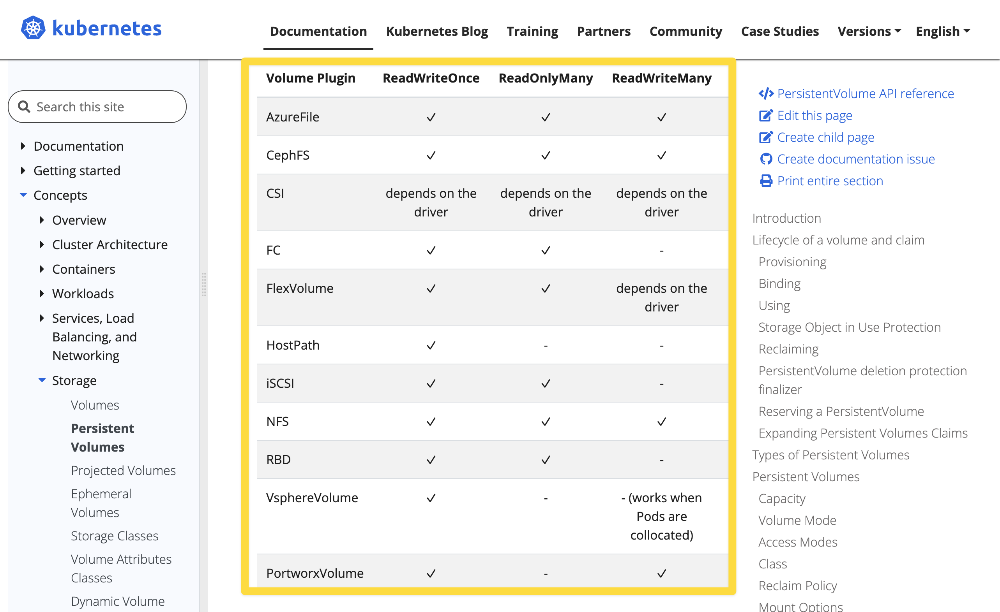
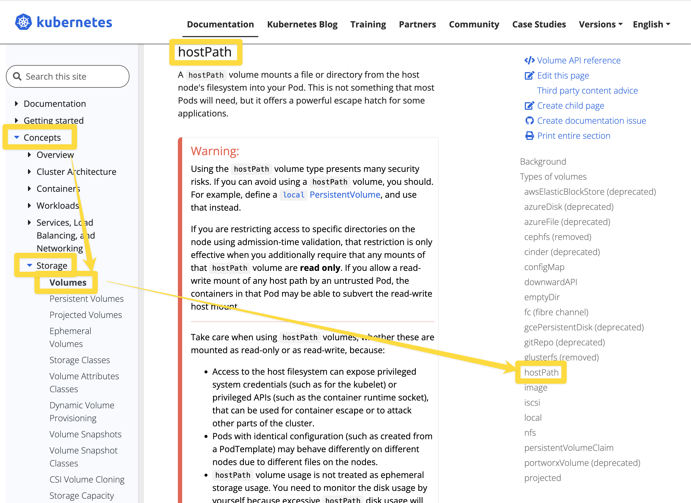

# 쿠버네티스의 Storage
주요 개념 
- Volume mount
- Storage Class

<br/>

# Volume Mount
pod 내에 spec 에 지정해서 마운트를 하는 개념이다.<br/>
볼륨 마운트 시 'Read Only, (RO)' 로 명시하지 않으면 기본 설정은 'Read/Write' 이다.<br/>
Volume Mount 를 통해 마운트 할 수 있는 볼륨은 emptyDir, hostPath 가 있다.<br/>
- emptyDir
	- 파드 내의 볼륨
	- 파드가 삭제되면 함께 삭제되는 볼륨
- hostPath 
	- 노드(=호스트OS 또는 호스트 VM 내부)의 특정 물리적인 디렉터리를 볼륨으로 선언하는 볼륨
	- 노드 내에서만 공유 가능하다.

## emptyDir
- 파드 내에서의 볼륨
- 파드 내에 컨테이너가 여러개일 때 이 컨테이너들이 파드 내에서만 볼륨을 공유하려 할 경우 emptyDir 을 사용
- 즉, 동일한 파드 안에서 실행되는 컨테이너 간 파일을 공유할때 간단하게 사용하기에 좋은 방식
- 파드가 삭제되면 파드 내에 정의한 볼륨은 삭제된다.
- 일반적으로 멀티 컨테이너 파드 또는 사이드 카 구조로 작성된 파드 내에서 emptyDir 을 사용하게 되는 경우가 많다.

### e.g. emptyDir.yaml

```yaml
apiVersion: v1
kind: Pod
metadata:
  name: cowsay-and-nginx
spec:
  containers:
  - image: smlinux/cowsay-web
    name: web-generator
    volumeMounts:
    - name: html
      mountPath: /webdata
  - image: nginx:1.14
    name: web-nginx
    volumeMounts:
    - name: html
      mountPath: /usr/share/nginx/html
      readOnly: true
    ports:
    - containerPort: 80
  volumes:
  - name: html
    emptyDir: {}
```

<br/>

## hostPath
- hostPath 만 만들어보라는 문제는 없다. 다만 PV, PVC 선언시 hostPath 를 이용해서 만들어보라는 문제가 자주 출제
- 로컬호스트에 있는 디렉터리를 파드 들이 연결해주는 볼륨
- 호스트OS 내에서 특정 Path를 공유하는 것을 의미
- 즉, 노드(=호스트OS가 설치된 vm 또는 머신)의 특정 물리적인 디렉터리를 볼륨으로 선언
- 노드 내에서만 공유가 가능하다.
- `type` 셀렉터 : DirectoryOrCreate, Directory, FileOrCreate, File
	- 참고) `type` 필드는 필수 옵션은 아니다.
	- DireactoryOrCreate : 주어진 경로에 아무것도 없을때 빈 디렉터리를 생성 
		- (kubelet 의 소유권,권한을 0755로)
	- Directory : 주어진 경로에 디렉터리가 있어야 한다.
	- FileOrCreate : 주어진 경로에 아무것도 없으면 설정한 file 을 생성
		- (kubelet 의 소유권,권한을 0755로)
	- File : 주어진 경로에 파일이 있어야 한다.
  - 일반적으로 로그 수집 에이전트 들이 대부분 hostPath 를 사용한다. (각각의 노드 내에 특정 파일에 로그를 쌓아두고 주기적으로 로그 저장소에 저장하는 원리)

<br/>

# Storage Class
여러 종류의 스토리지들의 종류들을 StorageClass 라는 이름으로 규격화해서 종류(class)를 정해둔것

# Volume
emptyDir, hostPath 는 pod 의 spec 에 지정하지만 PV는 kubernetes 의 API 로 제공해주는 개념이다. Volume 에는 PV, PVC 가 있다.<br/>

## PV : Persistent Volume
- iscsi, nfs, configMap, cinder, awsElasticBlockStore 등과 같은 여러가지 디스크 리소스에 대해 PV 로 등록해두면 쿠버네티스는 '미리 준비가 완료된 적절한 볼륨'이라는 개념을 가진 리소스로 인식한다.
- 이렇게 등록한 볼륨 중 하나를 선택해서 PVC 선언해서 볼륨 요청을 클러스터에 보내면, Kubenretes 클러스터는 PV 중 용량, 세부 스펙이 일치하는 PV 를 선택해서 할당해준다.
- 만약 클라우드 처럼 무한대로 구할수 있는 것이 아닌 온프레미스 환경에서의 kubernetes 라면 관리자가 미리 디스크를 주문하고 발주해서 미리 준비해두고 PV로 등록해둔 후 PVC 로 할당한다.
- 퍼블릭 클라우드에서는 디스크를 미리 준비해두고 PV로 등록하지 않아도 요청을 해서 클라우드에서 할당을 받기 때문에 관리자가 디스크를 주문하고 발주해오는 등의 작업이 필요없다.
- PV 의 Reclaim 정책은 아래와 같은 것들이 있다.
	- Retain : 할당됐던 PVC가 제거될 때 해당 Volume을 '보존(Retain)하겠다' 는 정책
	- Delete : 할당됐던 PVC가 제거될 때 PV 도 함께 제거하겠다.
	- Recycle : 할당됐던 PVC가 제거될 때 해당 Volume을 '재활용(Recycle)'하겠다는 정책. 모두 지워두고 언제든지 PVC로 요청시 새로 할당받게끔 하겠다는 정책

<br/>

### PV 의 형식
```yaml
apiVersion: v1
kind: PersistentVolume
metadata:
  name: pvname
spec:
  capacity:
    storage: <storage_size>
  accessModes:
  - ReadWriteOnce
  - ReadOnlyMany
  persistentVolumeReclaimPolicy: Retain
nfs:
  server: <NFS Server>
  path: <Share Storage>
```

<br/>

### PV 의 Reclaim 정책 : persistentVolumeReclaimPolicy
참고 : [Volumes - PersistentVolumes/Reclaiming](https://kubernetes.io/docs/concepts/storage/persistent-volumes/#reclaiming)<br/>

PV 의 Reclaim 정책은 아래와 같은 것들이 있다.
- Retain : 할당됐던 PVC가 제거될 때 해당 Volume을 '보존(Retain)하겠다' 는 정책
- Delete : 할당됐던 PVC가 제거될 때 PV 도 함께 제거하겠다.
- Recycle : 할당됐던 PVC가 제거될 때 해당 Volume을 '재활용(Recycle)'하겠다는 정책. 모두 지워두고 언제든지 PVC로 요청시 새로 할당받게끔 하겠다는 정책

<br/>

### 참고 : awsElasticBlockStore (deprecated)

- 문서 링크 : [Volumes - awsElasticBlockStore](https://kubernetes.io/docs/concepts/storage/volumes/#awselasticblockstore)

awsElasticBlockStore 는 deprecated 되었고, 이 기능은 [CSI](https://kubernetes.io/docs/concepts/storage/volumes/#csi) driver 방식으로 지원되는 `ebs.csi.aws.com` 기능으로 대체되었다. `ebs.csi.aws.com` 은  [AWS EBS](https://github.com/kubernetes-sigs/aws-ebs-csi-driver) 라는 써드 파티 라이브러리를 통해 사용가능하며 Kubernetes 에서 권고하는 라이브러리다.<br/>

> In Kubernetes 1.31, all operations for the in-tree `awsElasticBlockStore` type are redirected to the `ebs.csi.aws.com` [CSI](https://kubernetes.io/docs/concepts/storage/volumes/#csi) driver.<br/>
>
> The AWSElasticBlockStore in-tree storage driver was deprecated in the Kubernetes v1.19 release and then removed entirely in the v1.27 release.<br/>
>
> The Kubernetes project suggests that you use the [AWS EBS](https://github.com/kubernetes-sigs/aws-ebs-csi-driver) third party storage driver instead.<br/>

<br/>


공식문서 말고 참고했던 참고자료

- [PVC 를 마음대로 떼었다 붙이는 AWS EBS](https://kingofbackend.tistory.com/247)

<br/>

## PVC : Persistent Volume Claim
- 클러스터에 PV 를 요청(Claim)하는 주문서 같은 개념
- 요청한 PV가 승인되면 PV를 파드와 마운트 해준다.
- [Volumes - PersistemtVolumes/Access Mode](https://kubernetes.io/docs/concepts/storage/persistent-volumes/#access-modes) 
	- ReadWriteOnce (RWO) : 한 번에 하나의 노드만 볼륨을 Read/Write 가능하도록 마운트
	- ReadOnlyMany (ROX) : 여러 개의 노드가 Read 전용으로 사용하도록 마운트
	- ReadWriteMany (RWX) : 여러 개의 노드가 Read/Write 가능하도록 마운트

<br/>

### PVC 의 형식 
```yaml
apiVersion: v1
kind: PersistentVolumeClaim
metadata:
  name: mongodb-pvc
spec:
  resources:
    requests:
      storage: 100G
  accessModes:
  - ReadWriteOnce
  storageClassName: iscsi
```

<br/>

### PV와 PVC 의 형식 비교
PV, PVC 를 모아두고 비교해봐야 더 직접적인 비교가 되고 각각의 속성들을 어느 정도는 직접 작성해보면서 이쪽 경로에 이게 있고 등과 관련된 yaml 속성의 상하관계를 감을 잡는 것이 필요해서 따로 PV, PVC 형식을 비교하는 섹션을 두어서 정리했다.<br/>

PV.yaml
```yaml
apiVersion: v1
kind: PersistentVolume
metadata:
  name: pvname
spec:
  capacity:
    storage: <storage_size>
  accessModes:
  - ReadWriteOnce
  - ReadOnlyMany
  persistentVolumeReclaimPolicy: Retain
nfs:
  server: <NFS Server>
  path: <Share Storage>
```
<br/>

주요 속성
- spec.capacity.storage
- spec.accessModes\['ReadWriteOnce'\]
- spec.accessModes\['ReadOnlyMany'\]
- spec.persistentVolumeReclaimPolicy
	- Retain, Delete, Recycle 중 하나로 정의
	- Retain : 할당됐던 PVC가 제거될 때 해당 Volume을 '보존(Retain)하겠다' 는 정책
	- Delete : 할당됐던 PVC가 제거될 때 PV 도 함께 제거하겠다.
	- Recycle : 할당됐던 PVC가 제거될 때 해당 Volume을 '재활용(Recycle)'하겠다는 정책. 모두 지워두고 언제든지 PVC로 요청시 새로 할당받게끔 하겠다는 정책


PVC.yaml
```yaml
apiVersion: v1
kind: PersistentVolumeClaim
metadata:
  name: mongodb-pvc
spec:
  resources:
    requests:
      storage: 100G
  accessModes:
  - ReadWriteOnce
  storageClassName: iscsi
```
<br/>

주요 속성
- spec.resources.requests\['storage'\] 
- spec.accessModes\['ReadWriteOnce'\] : 한번에 하나의 노드만 읽고 쓸수 있다.
- spec.storageClassName

<br/>

# 공식문서
## EmptyDir, SideCar, PV, PVC
Volumes
- [kubernetes.io/docs - Concepts / Storage / Volumes](https://kubernetes.io/docs/concepts/storage/volumes/)

북마크 : Volumes / Volumes - emptyDir
- [kubernetes.io/docs - Concepts / Storage / Volumes # emptyDir](https://kubernetes.io/docs/concepts/storage/volumes/#emptydir)

북마크 : Pods / Pod - sidecar container with logging agent
- [kubernetes.io/docs - Concepts / Storage / Cluster Administration # Using a sidecar container with the logging agent](https://kubernetes.io/docs/concepts/cluster-administration/logging/#sidecar-container-with-logging-agent)

PV, PVC
- [Kubernetes Persistent Volume 생성하기 - PV, PVC](https://waspro.tistory.com/580)
<br/>

## Volumes, PV, Lifecycle of Volume and Claim, Reclaming, Access Mode
- [Volumes](https://kubernetes.io/docs/concepts/storage/volumes/)
- [Volumes - Persistent Volumes](https://kubernetes.io/docs/concepts/storage/persistent-volumes/)
  - PV 의 공식 문서는 Storage/PersistentVolumes 에서 다루고 있다.
  - [Volumes - Lifecycle of a volume and claim](https://kubernetes.io/docs/concepts/storage/persistent-volumes/)
  - [Volumes - PersistentVolumes/Reclaiming](https://kubernetes.io/docs/concepts/storage/persistent-volumes/#reclaiming)
  - [Volumes - PersistemtVolumes/Access Mode](https://kubernetes.io/docs/concepts/storage/persistent-volumes/#access-modes)
  - [Volumes - awsElasticBlockStore](https://kubernetes.io/docs/concepts/storage/volumes/#awselasticblockstore)

## Volumes - PV/PVC
- [Volumes - PersistentVolumes/Persistent Volume Claim](https://kubernetes.io/docs/concepts/storage/persistent-volumes/#persistentvolumeclaims)
  - PVC 의 공식문서는 Storage/PersistentVolumes 내에서 다루고 있다.

<br/>

##  참고 : RWO, ROX, RWX

참고 : [Volumes - PersistemtVolumes/Access Mode](https://kubernetes.io/docs/concepts/storage/persistent-volumes/#access-modes)<br/>

- ReadWriteOnce (RWO) : 한 번에 하나의 노드만 볼륨을 Read/Write 가능하도록 마운트
- ReadOnlyMany (ROX) : 여러 개의 노드가 Read 전용으로 사용하도록 마운트
- ReadWriteMany (RWX) : 여러 개의 노드가 Read/Write 가능하도록 마운트

<br/>

k8s 에서 지원하는 볼륨의 종류에 따라 지원되는 엑세스 모드들이 있는데 이것에 대해서는 위 참고 문서의 링크에 방문해서 스크롤을 조금 내려보면 확인 가능하다. 만약 실무에서 필요할 때는 위의 링크를 꼭 참고하자.



<br/>

## hostPath volume types
참고 : [Storage/Volumes - volumes/hostPath volume types](https://kubernetes.io/docs/concepts/storage/volumes/#hostpath-volume-types)

- 기본 값은 "" 이다.

| alue                | Behavior                                                                                                                                                               |
| :------------------ | :--------------------------------------------------------------------------------------------------------------------------------------------------------------------- |
| `‌""`               | Empty string (default) is for backward compatibility, which means that no checks will be performed before mounting the `hostPath` volume.                              |
| `DirectoryOrCreate` | If nothing exists at the given path, an empty directory will be created there as needed with permission set to 0755, having the same group and ownership with Kubelet. |
| `Directory`         | A directory must exist at the given path                                                                                                                               |
| `FileOrCreate`      | If nothing exists at the given path, an empty file will be created there as needed with permission set to 0644, having the same group and ownership with Kubelet.      |
| `File`              | A file must exist at the given path                                                                                                                                    |
| `Socket`            | A UNIX socket must exist at the given path                                                                                                                             |
| `CharDevice`        | *(Linux nodes only)* A character device must exist at the given path                                                                                                   |
| `BlockDevice`       | *(Linux nodes only)* A block device must exist at the given path                                                                                                       |

<br/>


## volumes/volumes - hostPath
[Volumes/Volumes - hostPath](https://kubernetes.io/docs/concepts/storage/volumes/#hostpath)<br/>



<br/>

# volume mounts yaml 주요 속성

## `.spec.volumes` , `.spec.containers[*].volumeMounts`

[kubernetes.io/docs - Concepts / Storage / Volumes](https://kubernetes.io/docs/concepts/storage/volumes/) 에서는 다음과 같이 설명을 하고 있다.<br/>

> To use a volume, specify the volumes to provide for the Pod in `.spec.volumes` and declare where to mount those volumes into containers in `.spec.containers[*].volumeMounts`. 

볼륨을 사용하려면 `.spec.volumes` 를 정의하고 이 볼륨들을 컨테이너 안에서 어디에 마운트할 지는 `.spec.containers[*].volumeMounts` 에 정의하세요.<br/>
<br/>

## `.spec.capacity.storage`
>참고 : [Kubernetes Persistent Volume 생성하기 - PV, PVC](https://waspro.tistory.com/580)

`.spec.capacity.storage` 에는 스토리지의 용량을 정의한다.<br/>
<br/>

## `.spec.accessModes` 
> 참고 : [Kubernetes Persistent Volume 생성하기 - PV, PVC](https://waspro.tistory.com/580)

`.spec.accessModes` 에는 Volume 에 대한 Read/Write 권한을 제공하는 옵션을 정의한다.<br/>
<br/>


# e.g. 1 
hostPath 를 만들라는 문제를 많이 나오는 편은 아니고 hostPath 를 알고 있어야만 풀리는 연관문제들이 많다.<br/>

## 문제
문제 내용은 이미 정의되어 있는 /data/cka/fluentd/fluentd.yaml 파일을 수정해서 Worker Node 특정 HostPath 에 연결시켜보는 문제다. fluentd 를 처음부터 정의하는 예제는 아니고 HostPath 를 얼마나 유연하게 수정할 수 있는지를 보는 문제다.<br/>


> 작업 클러스터 : k8s

/data/cka/fluentd.yaml 파일에 다음 조건에 맞게 볼륨 마운트를 설정하세요.
- Worker Node 의 도커 컨테이너 디렉터리를 동일 디렉터리로 Pod 에 마운트하세요.
- Worker Node 의 /var/log 디렉터리를 fluentd Pod 에 동일 이름의 디렉터리 마운트 하세요.

<br/>

첫 번째 내용
- Worker Node 의 도커 컨테이너 디렉터리 (/var/lib/docker/containers)를 fluentd Pod 내의 /var/lib/docker/containers 에 마운트 하라는 의미다.
두 번째 내용
- Worker Node 내에 /var/log 디렉터리를 fluentd Pod 내에 /var/log 디렉터리로 마운트 하라는 의미다.

## 풀이

### k8s-worker1 노드 접속 및 container 정보 확인
fluentd 는 잘 알려져 있는 오픈소스 로그 수집 소프트웨어다. 컨테이너 로그를 수집하기도 하고 애플리케이션 로그 들을 수집하기도 한다. 

k8s-worker1 접속 
```bash
$ ssh k8s-worker1
```

<br/>

도커 컨테이너 디렉터리로 이동
- `/var/lib/docker` 디렉터리로 이동한다. `/var/lib` 까지는 일반사용자로 접근이 가능하지만, `/var/lib/docker` 디렉터리 내부로 진입하려면 sudo -i 를 통해 관리자로 접속해야만 가능하다.

```bash
$ cd /var/lib

### /var/lib 에는 docker 디렉터리가 있다. 
$ ls
...
docker ...


### 관리자 권한이 필요하기에 sudo -i 로 접근
$ sudo -i


### /var/lib/docker 디렉터리로 이동
# cd /var/lib/docker


### /var/lib/docker/내에는 디렉터리가 어떤 것들이 있는지 확인한다.
# ls 
... containers


### /var/lib/docker/containers 디렉터리로 이동
# cd /var/lib/docker/containers


### /var/lib/docker/containers 내에는 디렉터리가 어떤 것들이 있는지 확인한다.
### containers 디렉터리 내에는 uuid 기반으로 이름지어진 각각의 컨테이너에 대한 디렉터리들이 있다.
# ls 
##### 여러 종류의 container 디렉터리들이 존재
... ...

## 또는 다음과 같이 지정
# ls /var/lib/docker/containers
...


# fluentd 는 이렇게 /var/lib/docker/containers 디렉터리에 존재하는 각각의 컨테이너들에 대한 정보를 수집하는 역할을 한다.
```

fluentd 는 위에서 살펴본 `/var/lib/docker/containers` 내에 UUID 로 정의된 각각의 컨테이너에 대한 디렉터리들에 대한 정보들을 가지고 있는다. 이 정보를 fluentd 가 수집해서 /var/lib/log 디렉터리에 기록을 하게 된다.<br/>


### 공식문서
북마크 : 
- 공식문서 : [Concepts / Storage / Volumes # Host Path Configuration Example](https://kubernetes.io/docs/concepts/storage/volumes/#hostpath-configuration-example) 
- 공식문서에서 `spec.containers[i].volumeMounts ... ` 에서부터 `spec.volumes.*` 의 내용까지를 복사해서 다음과 같이 spec.containers.\[i\] 의 volumeMounts 에 붙여넣은 후 수정 작업을 한다.


<br/>

### /data/cka/fluentd yaml 이 있는지 확인
문제에서 언급한 /data/cka/fluentd.yaml 파일이 실제로 존재하는지 확인
```bash
### k8s 컨텍스트로 전환
$ kubectl config use-context k8s


### 노드 현황 파악
$ kubectl get nodes


### kubectl 환경에 fluentd 가 있는지 확인 (존재한다.)
### /data/cka/fluentd.yaml 의 내용을 메모장에 복사해두고 수정작업을 시작한다.
### volume mount 가 되어있지 않은 상태인 것을 확인한다.
$ cat /data/cka/fluentd.yaml
...
spec:
  selecter:
  ...
  template:
    metadata:
      labels: fluentd
    spec:
      containers:
      - name: fluentd
        image: fluentd
    # ... 
```
<br/>

### /data/cka/fluentd.yaml 내용 수정
메모장 등의 편집기 내에서 hostPath 관련된 내용이 추가된 버전으로 수정한다.
- [Concepts / Storage / Volumes # Host Path Configuration Example](https://kubernetes.io/docs/concepts/storage/volumes/#hostpath-configuration-example) 

위 자료에 에 정의된 yaml 정의 내부 내용 중 `spec.containers[i].volumeMounts ... ` 에서부터 `spec.volumes.*` 의 내용까지를 복사해서 spec.containers.\[i\] 의 volumeMounts 에 붙여넣어준다.<br/>

(hostPath.yaml 과 같은 단일 파일에 적용하던 것을 Pod 정의 내부에 정의하는 것 이기에 들여쓰기를 꼭 해줘야 한다. `spec.volumes`, `spec.containers` 에 적용하면서 꼭 들여쓰기를 잘 적용해줘야 한다.)<br/>

**/data/cka/fluentd.yaml**<br/>
worker node 내에 /data/cka/fluentd.yaml 파일을 열어서 수정을 한다.
```yaml
apiVersion: apps/v1
kind: DaemonSet
metadata: 
  name: fluentd
spec:
  selector:
    matchLabels:
      name: fluentd
  template:
    metadata:
      labels:
        name: fluentd
    spec:
      containers:
      - name: fluentd
        image: fluentd
        ## (1) spec.template.spec.containers[i].volumeMounts ~ spec.template.volumes 의 내용을 복사해서 붙여넣었다.
        ## (2-1) : /var/lib/docker/containers (fluentd 의 디렉터리)
        volumeMounts: ## 복사해준 부분  
        - mountPath: /var/lib/docker/containers
          name: dockercontainerdir
        ## (3-1) : 문제에서 원한 두 번째 요구사항 (/var/log 를 fluentd pod 에 연결해달라)
        - mountPath: /var/log
          name: varlogdir
      volumes:
      ## (2-2) : /var/lib/docker/containers (fluentd 의 디렉터리) 로 수정
      - name: dockercontainerdir
        hostPath:
          path: /var/lib/docker/containers
      ## (3-2) : 문제에서 원한 두 번째 요구사항 (/var/log 를 fluentd pod 에 연결해달라)
      - name: varlogdir
        hostPath:
          path: /var/log
```
<br/>

(1) `spec.template.spec.containers[i].volumeMounts` \~ `spec.template.volumes.*` 의 내용을 복사해서 붙여넣었다.
(2) 문제의 첫번째 요구사항을 만족시키기 위한 컨테이너 내의 볼륨마운트, 볼륨 정의를 하는 부분이다.
- (2-1) Container 내의 볼륨 마운트 경로 수정  
	- 붙여넣은 내용 중 `spec.template.spec.containers[i].volumeMounts` 내의 mountPath, name 을 문제에서 요구하는 대로 수정해줬다.
	- mountPath : /var/lib/docker/containers 
	- name : dockercontainerdir
- (2-2) Volume 정의 수정
	- 붙여넣은 내용 중 `spec.template.spec.volumes[i]` 내에 볼륨 객체를 정의하는데 속성을 다음과 같이 수정해줬다.
	- name : dockercontainerdir
	- hostPath.path : /var/lib/docker/containers
(3) 문제의 두번째 요구사항을 만족시키기 위한 컨테이너 내의 볼륨마운트, 볼륨 정의를 하는 부분이다.
- (3-1) Container 내의 볼륨 마운트 경로 수정
	- 붙여넣은 내용 중 `spec.template.spec.containers[i].volumeMounts` 내의 mountPath, name 을 문제에서 요구하는 대로 수정해줬다.
	- mountPath : /var/log
	- name : varlogdir
- (3-2) Volume 정의 수정
	- 붙여넣은 내용 중 `spec.template.spec.volumes[i]` 내에 볼륨 객체를 정의하는데 속성을 다음과 같이 수정해줬다.
	- name : varlogdir
	- hostPath.path : /var/log
<br/>

조금 더 알아보기 쉽도록 `spec.template.spec.volumes` 의 의치를 `spec.template.spec.*` 내부에서 제일 처음으로 옮겨줬다.<br/>
```yaml
apiVersion: apps/v1
kind: DaemonSet
metadata: 
  name: fluentd
spec:
  selector:
    matchLabels:
      name: fluentd
  template:
    metadata:
      labels:
        name: fluentd
    spec:
      volumes:
      ## (2-2) : /var/lib/docker/containers (fluentd 의 디렉터리) 로 수정
      - name: dockercontainerdir
        hostPath:
          path: /var/lib/docker/containers
      ## (3-2) : 문제에서 원한 두 번째 요구사항 (/var/log 를 fluentd pod 에 연결해달라)
      - name: varlogdir
        hostPath:
          path: /var/log
      containers:
      - name: fluentd
        image: fluentd
        ## (1) spec.template.spec.containers[i].volumeMounts ~ spec.template.volumes 의 내용을 복사해서 붙여넣었다.
        ## (2-1) : /var/lib/docker/containers (fluentd 의 디렉터리)
        volumeMounts: ## 복사해준 부분  
        - mountPath: /var/lib/docker/containers
          name: dockercontainerdir
        ## (3-1) : 문제에서 원한 두 번째 요구사항 (/var/log 를 fluentd pod 에 연결해달라)
        - mountPath: /var/log
          name: varlogdir
```

<br/>

### fluentd 를 cluster 에 배포 및 확인
worker1 로 접속 및 적용
```bash
$  kueclt apply -f /data/cka/fluentd.yaml
...


$ kubectl get pod
...


$ kubect describe pod fluentd-xxx


$ kubectl get pods

```


