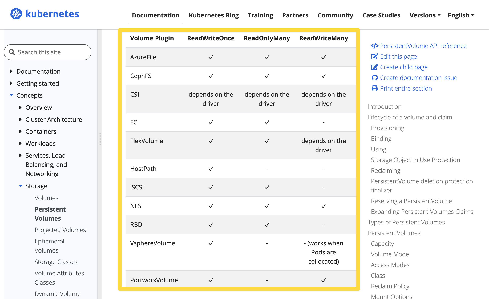

<br/>

따로 정리 필요한 내용
- 예제 2번의 PVC 적용문제
	- PVC 정의 yaml 을 어느 공식문서에서 가져왔는지 찾아볼 것
	- 앞으로 시험이 몇일 안남았는데 머릿속에 가급적이면 k8s 생각으로 가득 채우자.

<br/>

# PV(PersistentVolume),PVC(PersistentVolumeClaim)


# 쿠버네티스의 Storage
주요 개념 
- Volume mount
- Storage Class

<br/>

# Volume Mount
pod 내에 spec 에 지정해서 마운트를 하는 개념이다.<br/>
볼륨 마운트 시 'Read Only, (RO)' 로 명시하지 않으면 기본 설정은 'Read/Write' 이다.<br/>
Volume Mount 를 통해 마운트 할 수 있는 볼륨은 emptyDir, hostPath 가 있다.<br/>
- emptyDir
	- 파드 내의 볼륨
	- 파드가 삭제되면 함께 삭제되는 볼륨
- hostPath 
	- 노드(=호스트OS 또는 호스트 VM 내부)의 특정 물리적인 디렉터리를 볼륨으로 선언하는 볼륨
	- 노드 내에서만 공유 가능하다.

## emptyDir
- 파드 내에서의 볼륨
- 파드 내에 컨테이너가 여러개일 때 이 컨테이너들이 파드 내에서만 볼륨을 공유하려 할 경우 emptyDir 을 사용
- 즉, 동일한 파드 안에서 실행되는 컨테이너 간 파일을 공유할때 간단하게 사용하기에 좋은 방식
- 파드가 삭제되면 파드 내에 정의한 볼륨은 삭제된다.
- 일반적으로 멀티 컨테이너 파드 또는 사이드 카 구조로 작성된 파드 내에서 emptyDir 을 사용하게 되는 경우가 많다.

### e.g. emptyDir.yaml

```yaml
apiVersion: v1
kind: Pod
metadata:
  name: cowsay-and-nginx
spec:
  containers:
  - image: smlinux/cowsay-web
    name: web-generator
    volumeMounts:
    - name: html
      mountPath: /webdata
  - image: nginx:1.14
    name: web-nginx
    volumeMounts:
    - name: html
      mountPath: /usr/share/nginx/html
      readOnly: true
    ports:
    - containerPort: 80
  volumes:
  - name: html
    emptyDir: {}
```

<br/>

## hostPath
- hostPath 만 만들어보라는 문제는 없다. 다만 PV, PVC 선언시 hostPath 를 이용해서 만들어보라는 문제가 자주 출제
- 로컬호스트에 있는 디렉터리를 파드 들이 연결해주는 볼륨
- 호스트OS 내에서 특정 Path를 공유하는 것을 의미
- 즉, 노드(=호스트OS가 설치된 vm 또는 머신)의 특정 물리적인 디렉터리를 볼륨으로 선언
- 노드 내에서만 공유가 가능하다.
- `type` 셀렉터 : DirectoryOrCreate, Directory, FileOrCreate, File
	- 참고) `type` 필드는 필수 옵션은 아니다.
	- DireactoryOrCreate : 주어진 경로에 아무것도 없을때 빈 디렉터리를 생성 
		- (kubelet 의 소유권,권한을 0755로)
	- Directory : 주어진 경로에 디렉터리가 있어야 한다.
	- FileOrCreate : 주어진 경로에 아무것도 없으면 설정한 file 을 생성
		- (kubelet 의 소유권,권한을 0755로)
	- File : 주어진 경로에 파일이 있어야 한다.
  - 일반적으로 로그 수집 에이전트 들이 대부분 hostPath 를 사용한다. (각각의 노드 내에 특정 파일에 로그를 쌓아두고 주기적으로 로그 저장소에 저장하는 원리)

<br/>

# Storage Class
여러 종류의 스토리지들의 종류들을 StorageClass 라는 이름으로 규격화해서 종류(class)를 정해둔것

# Volume
emptyDir, hostPath 는 pod 의 spec 에 지정하지만 PV는 kubernetes 의 API 로 제공해주는 개념이다. Volume 에는 PV, PVC 가 있다.<br/>

## PV : Persistent Volume
- iscsi, nfs, configMap, cinder, awsElasticBlockStore 등과 같은 여러가지 디스크 리소스에 대해 PV 로 등록해두면 쿠버네티스는 '미리 준비가 완료된 적절한 볼륨'이라는 개념을 가진 리소스로 인식한다.
- 이렇게 등록한 볼륨 중 하나를 선택해서 PVC 선언해서 볼륨 요청을 클러스터에 보내면, Kubenretes 클러스터는 PV 중 용량, 세부 스펙이 일치하는 PV 를 선택해서 할당해준다.
- 만약 클라우드 처럼 무한대로 구할수 있는 것이 아닌 온프레미스 환경에서의 kubernetes 라면 관리자가 미리 디스크를 주문하고 발주해서 미리 준비해두고 PV로 등록해둔 후 PVC 로 할당한다.
- 퍼블릭 클라우드에서는 디스크를 미리 준비해두고 PV로 등록하지 않아도 요청을 해서 클라우드에서 할당을 받기 때문에 관리자가 디스크를 주문하고 발주해오는 등의 작업이 필요없다.
- PV 의 Reclaim 정책은 아래와 같은 것들이 있다.
	- Retain : 할당됐던 PVC가 제거될 때 해당 Volume을 '보존(Retain)하겠다' 는 정책
	- Delete : 할당됐던 PVC가 제거될 때 PV 도 함께 제거하겠다.
	- Recycle : 할당됐던 PVC가 제거될 때 해당 Volume을 '재활용(Recycle)'하겠다는 정책. 모두 지워두고 언제든지 PVC로 요청시 새로 할당받게끔 하겠다는 정책

<br/>

### PV 의 형식
```yaml
apiVersion: v1
kind: PersistentVolume
metadata:
  name: pvname
spec:
  capacity:
    storage: <storage_size>
  accessModes:
  - ReadWriteOnce
  - ReadOnlyMany
  persistentVolumeReclaimPolicy: Retain
nfs:
  server: <NFS Server>
  path: <Share Storage>
```

<br/>

### PV 의 Reclaim 정책 : persistentVolumeReclaimPolicy
참고 : [Volumes - PersistentVolumes/Reclaiming](https://kubernetes.io/docs/concepts/storage/persistent-volumes/#reclaiming)<br/>

PV 의 Reclaim 정책은 아래와 같은 것들이 있다.
- Retain : 할당됐던 PVC가 제거될 때 해당 Volume을 '보존(Retain)하겠다' 는 정책
- Delete : 할당됐던 PVC가 제거될 때 PV 도 함께 제거하겠다.
- Recycle : 할당됐던 PVC가 제거될 때 해당 Volume을 '재활용(Recycle)'하겠다는 정책. 모두 지워두고 언제든지 PVC로 요청시 새로 할당받게끔 하겠다는 정책

<br/>

### 참고 : awsElasticBlockStore (deprecated)

- 문서 링크 : [Volumes - awsElasticBlockStore](https://kubernetes.io/docs/concepts/storage/volumes/#awselasticblockstore)

awsElasticBlockStore 는 deprecated 되었고, 이 기능은 [CSI](https://kubernetes.io/docs/concepts/storage/volumes/#csi) driver 방식으로 지원되는 `ebs.csi.aws.com` 기능으로 대체되었다. `ebs.csi.aws.com` 은  [AWS EBS](https://github.com/kubernetes-sigs/aws-ebs-csi-driver) 라는 써드 파티 라이브러리를 통해 사용가능하며 Kubernetes 에서 권고하는 라이브러리다.<br/>

> In Kubernetes 1.31, all operations for the in-tree `awsElasticBlockStore` type are redirected to the `ebs.csi.aws.com` [CSI](https://kubernetes.io/docs/concepts/storage/volumes/#csi) driver.<br/>
>
> The AWSElasticBlockStore in-tree storage driver was deprecated in the Kubernetes v1.19 release and then removed entirely in the v1.27 release.<br/>
>
> The Kubernetes project suggests that you use the [AWS EBS](https://github.com/kubernetes-sigs/aws-ebs-csi-driver) third party storage driver instead.<br/>

<br/>


공식문서 말고 참고했던 참고자료

- [PVC 를 마음대로 떼었다 붙이는 AWS EBS](https://kingofbackend.tistory.com/247)

<br/>

## PVC : Persistent Volume Claim
- 클러스터에 PV 를 요청(Claim)하는 주문서 같은 개념
- 요청한 PV가 승인되면 PV를 파드와 마운트 해준다.
- [Volumes - PersistemtVolumes/Access Mode](https://kubernetes.io/docs/concepts/storage/persistent-volumes/#access-modes) 
	- ReadWriteOnce (RWO) : 한 번에 하나의 노드만 볼륨을 Read/Write 가능하도록 마운트
	- ReadOnlyMany (ROX) : 여러 개의 노드가 Read 전용으로 사용하도록 마운트
	- ReadWriteMany (RWX) : 여러 개의 노드가 Read/Write 가능하도록 마운트

<br/>

### PVC 의 형식 
```yaml
apiVersion: v1
kind: PersistentVolumeClaim
metadata:
  name: mongodb-pvc
spec:
  resources:
    requests:
      storage: 100G
  accessModes:
  - ReadWriteOnce
  storageClassName: iscsi
```

<br/>

### PV와 PVC 의 형식 비교
PV, PVC 를 모아두고 비교해봐야 더 직접적인 비교가 되고 각각의 속성들을 어느 정도는 직접 작성해보면서 이쪽 경로에 이게 있고 등과 관련된 yaml 속성의 상하관계를 감을 잡는 것이 필요해서 따로 PV, PVC 형식을 비교하는 섹션을 두어서 정리했다.<br/>

PV.yaml
```yaml
apiVersion: v1
kind: PersistentVolume
metadata:
  name: pvname
spec:
  capacity:
    storage: <storage_size>
  accessModes:
  - ReadWriteOnce
  - ReadOnlyMany
  persistentVolumeReclaimPolicy: Retain
nfs:
  server: <NFS Server>
  path: <Share Storage>
```
<br/>

주요 속성
- spec.capacity.storage
- spec.accessModes\['ReadWriteOnce'\]
- spec.accessModes\['ReadOnlyMany'\]
- spec.persistentVolumeReclaimPolicy
	- Retain, Delete, Recycle 중 하나로 정의
	- Retain : 할당됐던 PVC가 제거될 때 해당 Volume을 '보존(Retain)하겠다' 는 정책
	- Delete : 할당됐던 PVC가 제거될 때 PV 도 함께 제거하겠다.
	- Recycle : 할당됐던 PVC가 제거될 때 해당 Volume을 '재활용(Recycle)'하겠다는 정책. 모두 지워두고 언제든지 PVC로 요청시 새로 할당받게끔 하겠다는 정책


PVC.yaml
```yaml
apiVersion: v1
kind: PersistentVolumeClaim
metadata:
  name: mongodb-pvc
spec:
  resources:
    requests:
      storage: 100G
  accessModes:
  - ReadWriteOnce
  storageClassName: iscsi
```
<br/>

주요 속성
- spec.resources.requests\['storage'\] 
- spec.accessModes\['ReadWriteOnce'\] : 한번에 하나의 노드만 읽고 쓸수 있다.
- spec.storageClassName

<br/>

# 공식문서
EmptyDir, SideCar, PV, PVC
- [kubernetes.io/docs - Concepts / Storage / Volumes](https://kubernetes.io/docs/concepts/storage/volumes/)
- [kubernetes.io/docs - Concepts / Storage / Volumes # emptyDir](https://kubernetes.io/docs/concepts/storage/volumes/#emptydir)
	- 북마크 : Volumes / Volumes - emptyDir
- [kubernetes.io/docs - Concepts / Storage / Cluster Administration # Using a sidecar container with the logging agent](https://kubernetes.io/docs/concepts/cluster-administration/logging/#sidecar-container-with-logging-agent)
	- 북마크 : Pods / Pod - sidecar container with logging agent
- [Kubernetes Persistent Volume 생성하기 - PV, PVC](https://waspro.tistory.com/580)
<br/>

Volumes, PV, Lifecycle of Volume and Claim, Reclaming, Access Mode
- [Volumes](https://kubernetes.io/docs/concepts/storage/volumes/)
- [Volumes - Persistent Volumes](https://kubernetes.io/docs/concepts/storage/persistent-volumes/)
  - PV 의 공식 문서는 Storage/PersistentVolumes 에서 다루고 있다.
  - [Volumes - Lifecycle of a volume and claim](https://kubernetes.io/docs/concepts/storage/persistent-volumes/)
  - [Volumes - PersistentVolumes/Reclaiming](https://kubernetes.io/docs/concepts/storage/persistent-volumes/#reclaiming)
  - [Volumes - PersistemtVolumes/Access Mode](https://kubernetes.io/docs/concepts/storage/persistent-volumes/#access-modes)
  - [Volumes - awsElasticBlockStore](https://kubernetes.io/docs/concepts/storage/volumes/#awselasticblockstore)

Volumes - PV/PVC
- [Volumes - PersistentVolumes/Persistent Volume Claim](https://kubernetes.io/docs/concepts/storage/persistent-volumes/#persistentvolumeclaims)
  - PVC 의 공식문서는 Storage/PersistentVolumes 내에서 다루고 있다.

<br/>

# 참고 : RWO, ROX, RWX

참고 : [Volumes - PersistemtVolumes/Access Mode](https://kubernetes.io/docs/concepts/storage/persistent-volumes/#access-modes)<br/>

- ReadWriteOnce (RWO) : 한 번에 하나의 노드만 볼륨을 Read/Write 가능하도록 마운트
- ReadOnlyMany (ROX) : 여러 개의 노드가 Read 전용으로 사용하도록 마운트
- ReadWriteMany (RWX) : 여러 개의 노드가 Read/Write 가능하도록 마운트

<br/>

k8s 에서 지원하는 볼륨의 종류에 따라 지원되는 엑세스 모드들이 있는데 이것에 대해서는 위 참고 문서의 링크에 방문해서 스크롤을 조금 내려보면 확인 가능하다. 만약 실무에서 필요할 때는 위의 링크를 꼭 참고하자.



<br/>

# volume mounts yaml 주요 속성

## `.spec.volumes` , `.spec.containers[*].volumeMounts`

[kubernetes.io/docs - Concepts / Storage / Volumes](https://kubernetes.io/docs/concepts/storage/volumes/) 에서는 다음과 같이 설명을 하고 있다. 
> To use a volume, specify the volumes to provide for the Pod in `.spec.volumes` and declare where to mount those volumes into containers in `.spec.containers[*].volumeMounts`. 

볼륨을 사용하려면 `.spec.volumes` 를 정의하고 이 볼륨들을 컨테이너 안에서 어디에 마운트할 지는 `.spec.containers[*].volumeMounts` 에 정의하세요.<br/>
<br/>

## `.spec.capacity.storage`
>참고 : [Kubernetes Persistent Volume 생성하기 - PV, PVC](https://waspro.tistory.com/580)

`.spec.capacity.storage` 에는 스토리지의 용량을 정의한다.<br/>
<br/>

## `.spec.accessModes` 
> 참고 : [Kubernetes Persistent Volume 생성하기 - PV, PVC](https://waspro.tistory.com/580)

`.spec.accessModes` 에는 Volume 에 대한 Read/Write 권한을 제공하는 옵션을 정의한다.<br/>
<br/>


# e.g. 1 - pv
## 공식문서
Pod 를 생성하는 첫번째 예제에서는 아래의 공식문서 링크를 참고했다.
(1)
- 북마크 : [Volumes - hostpath](https://kubernetes.io/docs/concepts/storage/volumes/#hostpath)
- [kubernetes.io / documentations / Concepts / Storage / Volumes # hostPath](https://kubernetes.io/docs/concepts/storage/volumes/#hostpath)
- 스크롤을 내리다보면 [hostPath configuration example](https://kubernetes.io/docs/concepts/storage/volumes/#hostpath-configuration-example) 이라는 예제 섹션이 나오는데, 여기 예제에서 volumes 아래의 모든 필드를을 복사해서 메모장에 복사해준다. (다른 속성은 필요 없고 volumes 정의하는 속성만 복사하면 된다.)

(2)
- 북마크 : [Volumes - Volumes - PV and NFS exam](https://kubernetes.io/docs/concepts/storage/persistent-volumes/#persistent-volumes)
- [kuberntes.io / documentations / Concepts / Storage / Persistent Volumes # PersistentVolumes](https://kubernetes.io/docs/concepts/storage/persistent-volumes/#persistent-volumes)
- 위 문서에서 PersistentVolumes 챕터의 예제를 베이스로 (1) 의 자료와 섞어찌개 만들어서 답안을 작성하면 된다. 


- [Storage / Persistent Volumes - PersistentVolumeClaims](https://kubernetes.io/docs/concepts/storage/persistent-volumes/#persistentvolumeclaims)
  - Persistent Volume 문서에서 스크롤을 조금 내려보다 보면 나온다.
  - 우측 사이드바에서도 네비게이션으로 존재한다.


Pod 를 생성하는 두번째 예제에서는 아래의 공식문서 링크를 참고했다.

- [Storage / Persistent Volumes - Claims As Volumes](https://kubernetes.io/docs/concepts/storage/persistent-volumes/#claims-as-volumes)
  - Persistent Volume 문서에서 스크롤을 조금 내려보다 보면 나온다
  - 우측 사이드 바에서도 네비게이션으로 존재한다.

<br/>

## 문제
간단하게 `hostPath` 타입의 PV 를 정의하는 문제다. PVC 를 만들어서 연동한다거나 그런 문제는 아니기에 어떤 공식문서를 볼지, 어떤 리소스의 정의는 이렇게 정의하는지를 미리 꿰고 있으면 문제풀이를 하기에 수월하다.
<br/>

> 작업 클러스터 : hk8s

- `pv001` 이라는 이름으로 size 1Gi, access mode ReadWriteMany 를 사용해 persistent volume 을 생성하세요.
- volume type 은 hostPah 이며, `/tmp/app-config` 입니다.

<br/>

## 풀이
### context 전환
```bash
# hk8s 로 전환
$ kubectl config use-context hk8s
```
<br/>

### yaml 작성
#### (1) Persistent Volume 예제 기반으로 기본 코드 작성

PersistentVolumes 기본 코드 예제
- 예제의 코드는 https://kubernetes.io/docs/concepts/storage/persistent-volumes/#persistent-volumes 에서 가져왔다.<br/>
- [kubernetes.io → Documentation / Concepts / Storage / Persistent Volumes](https://kubernetes.io/docs/concepts/storage/persistent-volumes/#persistent-volumes)

HostPath 타입 정의 기본 코드 예제
- 예제의 코드는 https://kubernetes.io/docs/concepts/storage/volumes/#hostpath 에서 가져왔다. <br/>
- [kubernetes.io → Documentation / Concepts / Storage / Volumes](https://kubernetes.io/docs/concepts/storage/volumes/#hostpath)

```bash
## 메모장에 다음과 같은 내용들을 작성
## 위의 첫번째, 두번째 참고자료를 섞어서 만든다.
apiVersion: v1
kind: PersistentVolume
metadata:
  name: pv001
spec:
  capacity:
    storage: 1Gi ## (1) storage 를 1Gi 로 수정
  ## (2) 
  # volumeMode: Filesystem
  accessModes:
    - ReadWriteMany ## (3)
  ## (4)
  # persistentVolumeReclaimPolicy: Recycle 
  ## (5)
  # storageClassName: slow
  ## (6)
  # mountOptions:
  #  - hard
  #  - nfsvers=4.1
  ## (7)
  # nfs:
    # path: /tmp
    # server: 172.17.0.2
  # (8)
  hostPath:
    ## spec.hostPath.path 속성을 문제에서 원하는 경로인 /tmp/app-config 로 변경해줬다.
    path: /tmp/app-config

```

메모장과 같은 텍스트 편집기에서 [PersistentVolumes 기본 코드 예제](https://kubernetes.io/docs/concepts/storage/persistent-volumes/#persistent-volumes) 의 내용을 기반으로 PV 를 정의하고 [HostPath 타입 정의 기본 코드 예제](https://kubernetes.io/docs/concepts/storage/volumes/#hostpath) 의 내용을 기반으로 `hostPath` 에 관련된 부분을 복사해서 붙여넣은 후 문제에 맞게끔 수정해줬다.<br/>
<br/>

(1)
- spec.capacity.storage 를 1Gi 로 수정
(2)
- spec.volumeMode : Filesystem  으로 정의되어 있던 원래 예제 코드 내의 코드를 삭제한다.
(3)
- 문제에서는 ReadWriteMany 를 원하고 있다. 따라서 ReadWriteMany 로 적용해준다.
(4) 삭제
- 원래 예제 코드에서 spec.persistentVolumeReclaimPolicy : Recycle 로 정의되어 있던 코드를 삭제해준다.
(5) 삭제
- 원래 예제 코드에서 spec.storageClassName : slow 로 정의되어 있던 코드를 삭제해준다.
(6) 삭제
- 원래 예제 코드에서 mountOptions 에 대해 `[hard, nfsservers=4.1` 가 지정되어있던 코드를 삭제해준다.
(7) 삭제
- 원래 예제 코드에서 nfs.path, nfs.server 속성이 있던 부분을 삭제해줬다.
(8) 
- 위에서 언급한 [HostPath 타입 정의 기본 코드 예제](https://kubernetes.io/docs/concepts/storage/volumes/#hostpath) 출처에서 필요한 부분만 가져와서 필요한 부분만 수정해줬다.

<br/>

#### (2) yaml 파일 작성

이렇게해서 필요없는 것을 삭제한 최종 코드는 다음과 같다. 위의 내용을 복사한 후 리눅스 콘솔에서 `pv001.yaml` 이라는 파일을 생성해서 붙여넣은후 저장한다. 
```yaml
## pv001.yaml 파일 생성 + pv 정의 내용 추가
$ vi pv001.yaml
apiVersion: v1
kind: PersistentVolume
metadata:
  name: pv001
spec:
  capacity:
    storage: 1Gi
  accessModes:
    - ReadWriteMany
  hostPath:
    path: /tmp/app-config

## 확인
$ ls -l pv001.yaml
-rw-rw-r--.....

```

이때 vi 로 열지 않고 cat 명령로 파일명을 지정해서 저장할 수도 있다. 다만, 실수할 가능성이 있기에 추천되지는 않는 방식이다.
```bash
$ cat > pv001.yaml
apiVersion: v1
kind: PersistentVolume
metadata:
  name: pv001
spec:
  capacity:
    storage: 1Gi
  accessModes:
    - ReadWriteMany
  hostPath:
    path: /tmp/app-config
```

<br/>

#### (3) 클러스터에 PV 배포
```bash
## (1) 작업 클러스터 전환
### 문제에서 원하는 클러스터로 컨텍스트를 전환한다.
$ kubectl config use-context hk8s

## (2) 방금 작성한 pv001.yaml 을 클러스터에 적용한다.
### 적용 전 이미 적용된 PV 있는지 확인 (before,after 비교를 위해)
$ kubectl get pv

### 클러스터에 적용
$ kubectl apply -f pv001.yaml
persistentvolume/pv001 created

## (3) 상태 확인
### Status 가 Available 인데, PVC로 연결하면 Bound 라고 표시된다.
$ kubectl get pv
NAME		CAPACITY		ACCESS MODES			RECLAIM POLICY		STATUS		...
pv001		1Gi					RWX								Retain						Available ...


### describe 를 해서 PV 에 할당된 Storage 를 자세히 본다.
$ kubectl describe pv pv001
Name							pv001
...
Status						Available
...
Reclaim Policy: 	Retain
Access Modes: 		RWX
VolumeMode:				Filesystem
Capacity					1Gi
...

Source:
		Type:					HostPath (bare host directory volume)
		Path:					/tmp/app-config
		HostPathType:

...
```
<br/>


### 상태 설명
```bash
$ kubectl get pvc, pv
NAME                                 SATATUS  ...    STORAGECLASS
persistentvolumeclaim/pv-volume      Bound ...       app-hostpath-sc

NAME                             STATUS     STORAGECLASS ... 
## e.g.1 문제에서 만들어두었던 PV
persistentvolume/pv001    ...
## 아래부터는 모두 문제를 위해 생성한 가상머신에 만들어둔 pv들 (강사님이 강의 시작 전 임의로 미리 만들어둔 pv (수업에서는 미리 만들었다는 이야기 안함))
persistentvolume/pv1             Bound      app-hostpath-sc ... 
persistentvolume/pv2             Available  app-data-sc ...

```


# e.g. 2 - pvc (단골문제)
빠지지 않고 나오는 문제\~\~\~\~\~\~\~\~ 라고 한다.<br/>

## 공식문서
Pod 를 생성하는 첫번째 예제에서는 아래의 공식문서 링크를 참고했다.

북마크 : [Volumes / Volumes - PVC](https://kubernetes.io/docs/concepts/storage/_print/#persistentvolumeclaims) (프린트 버전이라 왼쪽 탐색바가 없어서 불편)
- 공식문서 : https://kubernetes.io/docs/concepts/storage/persistent-volumes/#persistentvolumeclaims
- [kubernetes.io → Documentation / Concepts / Storage / Persistent Volumes # PersistentVolumeClaims](https://kubernetes.io/docs/concepts/storage/persistent-volumes/#persistentvolumeclaims)
	- 우측 사이드바에서 PersistentVolumeClaims 섹션

북마크 : [Volumes / Volumes - pod add pvc](https://kubernetes.io/docs/concepts/storage/_print/#claims-as-volumes) (프린트 버전이라 왼쪽 탐색바가 없어서 불편)
- 공식문서 : https://kubernetes.io/docs/concepts/storage/persistent-volumes/#claims-as-volumes
- [kubernetes.io → Documentation / Concepts / Storage / Persistent Volumes # Claims As Volumes](https://kubernetes.io/docs/concepts/storage/persistent-volumes/#claims-as-volumes)
	- 우측 사이드바에서 Claims As Volumes 섹션

Pod 를 생성하는 두번째 예제에서는 아래의 공식문서 링크를 참고했다.

- [Storage / Persistent Volumes - Claims As Volumes](https://kubernetes.io/docs/concepts/storage/persistent-volumes/#claims-as-volumes)
  - Persistent Volume 문서에서 스크롤을 조금 내려보다 보면 나온다
  - 우측 사이드 바에서도 네비게이션으로 존재한다.

<br/>

## 문제

> 작업 클러스터 : k8s

다음의 조건에 맞는 새로운 PVC(PersistentVolumeClaim) 을 생성하세요

- name : pv-volume
- class : app-hostpath-sc
- capacity: 10Mi

이렇게 생성한 pv-volume 이라는 이름의 PVC 를 mount 하는 Pod 를 생성하세요

- name: web-server-pod
- image: nginx
- mount path : /user/share/nginx/html

Volume 의 액세스 모드는 ReadyWriteMany 를 가지도록 구성하세요<br/>


## 풀이
- k8s 컨텍스트 전환
- PVC 정의
	- pvc.yaml 작성
	- 클러스터에 배포 및 pv, pvc 리소스 상태 확인
- PVC 를 사용하는 Pod 정의
	- 

### k8s 컨텍스트 전환
```bash
$ kubectl config use-context k8s
```

### PVC 정의
#### (1) Persistent Volume Claim 예제 기반으로 기본 코드 작성
PersistentVolumeClaims 기본 코드 예제
- 북마크 : [Volumes / Volumes - PVC](https://kubernetes.io/docs/concepts/storage/_print/#persistentvolumeclaims)
- 공식문서 : https://kubernetes.io/docs/concepts/storage/persistent-volumes/#persistentvolumeclaims
- [kubernetes.io → Documentation / Concepts / Storage / Persistent Volumes # PersistentVolumeClaims](https://kubernetes.io/docs/concepts/storage/persistent-volumes/#persistentvolumeclaims)
	- 우측 사이드바에서 PersistentVolumeClaims 섹션


```yaml
## 메모장에 다음과 같은 내용들을 작성
## 위의 참고자료를 복사해온 후 수정작업을 한다.

## (1) PersistentVolumeClaims 기본 예제에서 spec.selector 를 제외한 나머지 내용들을 모두 복사해온다.
apiVersion: v1
kind: PersistentVolumeClaim
metadata:
  ## (2) 문제에서 원하는 대로 pv-volume 이라는 이름으로 수정
  name: pv-volume
spec:
  ## (3) spec.accessModes 는 문제에서 원하는 대로 ReadWriteMany 로 설정했다.
  accessModes:
    - ReadWriteOnce
  volumeMode: Filesystem
  resources:
    requests:
      ## (4) 문제에서 원하는대로 10Mi 로 수정해줬다.
      storage: 10Mi
  ## (5) 문제에서는 class 명으로 app-hostpath-sc 을 원한다.
  storageClassName: app-hostpath-sc
  ## selector 이하는 복사하지 않았다.
```

(1)
- PersistentVolumeClaims 기본 예제에서 `spec.selector` 이하를 제외한 나머지 내용들을 모두 복사해왔다.
(2)
- 문제에서 원하는 대로 `metadata.name` 을 pv-volume 으로 수정해줬다.
(3)
- `spec.accessModes` 에는 문제에서 원하는 대로 `ReadWriteMany`를 지정해줬다.
(4)
- `spec.resources.requests.storage` 를 문제에서 원하는 대로 10Mi 로 설정해줬다.
(5) 
- 문제에서는 PVC 의 class 명으로 app-hostpath-sc 를 원하기에 `spec.storageClassName` 을 app-hostpath-sc 로 정의해줬다.

<br/>

#### (2) yaml 파일 작성
위에서 메모장에 작성해둔 내용들을 pvc.yaml 이라는 파일에 작성한 후 저장한다.
```bash
$ vi pvc.yaml
apiVersion: v1
kind: PersistentVolumeClaim
metadata:
  name: pv-volume
spec:
  accessModes:
    - ReadWriteOnce
  volumeMode: Filesystem
  resources:
    requests:
      storage: 10Mi
  storageClassName: app-hostpath-sc
```


cat 명령어와 표준 출력을 통해 다음과 같이 저장하는 것 역시 가능하다. 하지만 `시험` 시에는 얼마든지 실수할 여지가 있기에 아래의 명령어는 그다지 권장하지 않는다.
```bash
$ cat > pvc.yaml
apiVersion: v1
kind: PersistentVolumeClaim
metadata:
  name: pv-volume
spec:
  accessModes:
    - ReadWriteOnce
  volumeMode: Filesystem
  resources:
    requests:
      storage: 10Mi
  storageClassName: app-hostpath-sc
```

<br/>

#### (3) 클러스터에 PVC 배포

```bash
## (1) 클러스터에 PVC 를 배포한다.
$ kubectl apply -f pvc.yaml

## (2) pvc 상태 확인
$ kubectl get pvc
NAME				STATUS			VOLUME		CAPACITY		ACCESS MODES
pv-volume		Bound				1Gi				ROX,RWX			app-hostpath-sc		...

## (3)
# pv, pvc 를 함께 확인 (출력결과는 생략)
$ kubectl get pv, pvc
...

```
<br/>


### PVC 를 사용하는 Pod 정의
생성한 PVC를 사용하는 Pod 를 생성하는 문제다.

#### (1) PersistentVolumeClaim 을 mount 하는 Pod 정의
PersistentVolumeClaims 기본 코드 예제
- https://kubernetes.io/docs/concepts/storage/persistent-volumes/#claims-as-volumes 
- [kubernetes.io / documentation / Concepts / Storagte / Persistent Volumes # Claim As Volumes](https://kubernetes.io/docs/concepts/storage/persistent-volumes/#claims-as-volumes)
- 공식문서 Persistent Volumes 에서 스크롤을 조금만 내리면 나오는 예제를 활용했다.

Pod 에 PVC 를 연동하는 예제의 제목이 "Claims As Volumes" 이고 예제코드는 Persistent Volumes 문서 안에 있다는 점을 주목해서 기억하자.<br/>

스크롤이 길어서 문제의 내용 중 Pod 에 관련된 내용만 추려서 다시 적어보면 다음과 같다.
- name: web-server-pod
- image: nginx
- mount path : /user/share/nginx/html

<br/>
Volume 의 액세스 모드는 ReadyWriteMany 를 가지도록 구성하세요<br/>
<br/>

yaml 정의
```bash
## 메모장에 다음과 같은 내용들을 작성
## 위의 참고자료를 복사해온 후 수정작업을 한다.

## (1) PersistentVolumeClaims 기본 코드 예제의 내용들을 모두 복사해온 후 다음과 같이 수정한다.

apiVersion: v1
kind: Pod
metadata:
  ## (2) 문제에서 원하는대로 metadata.name 을 수정해줬다.
  name: web-server-pod
spec:
  containers:
    ## (3) 문제에서 container name 을 수정하라고 하지는 않았기에 그대로 둔다.
    - name: myfrontend
      image: nginx
      ## (4-1)
      volumeMounts:
      - mountPath: "/user/share/nginx/html"
        name: mypd
  volumes:
    - name: mypd
      ## (4-2)
      persistentVolumeClaim:
        claimName: pv-volume

```
<br/>

(1)
- PersistentVolumeClaims 기본 코드 예제의 내용들을 모두 복사해온 후 수정작업을 했다.
(2)
- 문제에서 원하는 대로 `metadata.name` 을 web-server-pod 로 수정해줬다.
(3)
- 문제에서 container name 을 수정해달라고 하지는 않았으므로 `spec.containers.name` 을 그대로 두었다.
(4)
- (4-1) : `spec.containers[i].volumeMounts.mountPath` 를 문제에서 원하는 경로인 /user/share/nginx/html 으로 수정해줬다.
- (4-2) : `spec.volumes[i].persistentVolumeClaim.claimName` 을 방금전 만들어둔 pvc 의 이름인 pv-volume 으로 지정해줬다. 

<br/>

#### (2) yaml 파일 정의
위에서 메모장 등과 같은 편집기에서 작성한 내용을 vi 편집기에서 작성한다. 최종 작성 완료된 Pod 정의의 내용이다.<br/>
**pod.yaml**
```bash
$ vi pod.yaml

apiVersion: v1
kind: Pod
metadata:
  name: web-server-pod
spec:
  containers:
    - name: myfrontend
      image: nginx
      volumeMounts:
      - mountPath: "/user/share/nginx/html"
        name: mypd
  volumes:
    - name: mypd
      persistentVolumeClaim:
        claimName: pv-volume
```
<br/>

시험장에서는 권장되지는 않는 방법이지만 cat 명령어로도 pod.yaml 파일을 적용할수 있기는 하다.
```bash
$ cat > pod.yaml
apiVersion: v1
kind: Pod
metadata:
  name: web-server-pod
spec:
  containers:
    - name: myfrontend
      image: nginx
      volumeMounts:
      - mountPath: "/user/share/nginx/html"
        name: mypd
  volumes:
    - name: mypd
      persistentVolumeClaim:
        claimName: pv-volume
```
<br/>

#### (3) 클러스터에 Pod 배포

pod 를 클러스터에 배포 및 리소스 상태 확인
```bash
## 클러스터에 배포
$ kubectl apply -f pod.yaml
pod/web-server-pod created


## 확인 
$ kubectl get pod web-server-pod
NAME							READY			STATUS			RESTARTS			AGE
web-server-pod		1/1				Running			0							...

## 생성한 pod 의 명세를 확인
$ kubectl describe pod web-server-pod
...
    Mounts:
      /usr/share/nginx/html from mypd (rw)
...
Volumes:
  mypd:
    Type: PersistentVolumeClaim (a reference to PersistentVolumeClaim in the same namespace)

...

```


