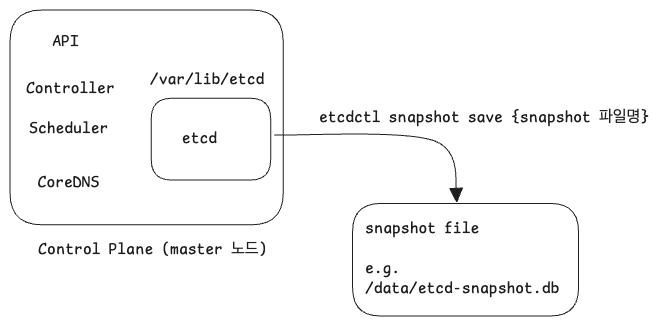
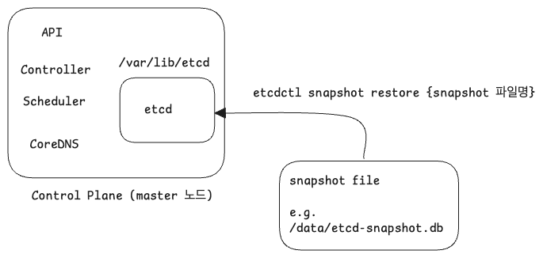

# Etcd Backup & Restore

etcd 는 마스터 노드로 ssh 접속 후 /etc/kubernetes/manifests 에서 static Pod 정의서를 확인 가능하며, etcd 의 스토리지 파일들은 /var/lib/etcd 에서 확인 가능하다. etcd 의 버전은 `etcd --version` 명령으로 확인 가능하다.<br/>

etcdctl 은 마스터 노드로 ssh 접속 후 `etcdctl version` 명령으로 확인 가능하다.<br/>

restore 부분은 강의를 듣긴 했지만, 가급적이면 mumshad 의 강의도 듣고 나서 조금 더 최신 사항으로 맞춰야 할 것 같다. 최신 버전하고 안맞는 부분이 조금 있기도 하고 resetore 부분은 아무래도 여러가지 자료를 더 봐야 할 것 같다. 강의에서는 restore 시에 명령어가 너무 간단해서 시험때 통과가 안될수도 있다는 불안감이 들었다.<br/>

<br/>


# backup 절차 요약

다음 스터디때 정리 예정 


# restore 절차 요약

backup 을 떠둔 data file 이 존재한다고 가정하고 정리해보면 다음과 같다.

- sudo ETCDCTL\_API=3 etcdctl \-\-data\-dir=/var/lib/etcd-new snapshot retore
- etcd Pod 는 static Pod 인데, /etc/kubernetes/manifests/etcd.yaml 파일 내의 아래 항목을 수정해주고 Pod 를 재시작한다.
  - hostPath.path : var/lib/etcd-new
  - staticPod 는 yaml 파일이 수정되면 운영자 또는 사용자가 재기동을 시키지 않아도 자동으로 재시작된다.
- docker 명령으로 etcd 가 재시작 됐는지 확인 : `sudo docker ps -a | grep etcd` 
- 복원되었는지 확인 : `kubectl get pods` 

<br/>


# 공식문서

- [Backing up an etcd cluster](https://kubernetes.io/docs/tasks/administer-cluster/configure-upgrade-etcd/#backing-up-an-etcd-cluster)
  - [Tasks > Administer a Cluster > Operating etcd clusters for Kubernetes - Backing up an etcd cluster](https://kubernetes.io/docs/tasks/administer-cluster/configure-upgrade-etcd/#backing-up-an-etcd-cluster)


<br/>


# kubelet, cAdvisor

다음 스터디 때 정리 예정

<br/>


# etcd 설치 디렉터리 확인

etcdctl 이 설치되어있는 디렉터리를 확인해보면 다음과 같다.

```bash
## k8s-master 노드에 ssh 접속
$ ssh k8s-master

## (1)
## root 사용자로 전환
$ sudo -i

## (2)
## etcd 디렉터리로 이동
# cd /var/lib/etcd
# ls


## (3) tree 명령으로 디렉터리 구조 확인
# tree
ㄴ member
    ㄴ snap
    		ㄴ ....... .snap
    		ㄴ ....... .snap
    		...
    ㄴ wal
    		ㄴ ....... .wal
    		ㄴ ....... .wal
    		...

```

<br/>


(1)

- etcd 가 설치된 디렉터리 내부를 ls 하려면 root 사용자로 로그인해야 한다.

(2)

- etcd 의 데이터를 저장하는 디렉터리 중 하나는 `/var/lib/etcd` 에 있다.

(3) 

- `/var/lib/etcd` 디렉터리 내부는 실제로 snap, wal 디렉터리로 되어 있으며 `*.snap`, `*.wal` 들을 각각의 디렉터리에 모아두고 있음을 확인할 수 있다.

<br/>


# 파드 형태로 동작 중인 etcd 파드 확인

etcd 역시 파드이며, kubernetes 내에서는 `kube-system` 이라는 이름의 네임스페이스에서 동작한다.

```bash
## kube-system 네임스페이스 내의 pod 확인
# kubectl get pod -n kube-system
NAME								READY					STATUS			RESTARTS			...
...
etcd-k8s-master			1/1						Running			15
... 
```

<br/>


etcd 는 static pod 로 동작한다.

```bash
## (1)
$ ssh k8s-master
$ sudo -i

## (2)
# cd /etc/kubernetes/manifests
# ls
etcd.yaml kube-apiserver.yaml kube-controller-manager.yaml kube-scheduler.yaml


# cat etcd.yaml
...
spec:
  containers:
    ...
    image: k8s.gcr.io/etcd:3.5.0-0

  volumes:
  ...
  - hostPath
    path: /var/lib/etcd
    type: DirectoryOrCreate
    name: etcd-data
```

(1), (2)

- k8s-master 노드에 접속해서 루트 사용자로 로그인 한 후 /etc/kubernetes/manifests 를 살펴보면 kube-system 에서 동작 중인 yaml 파일들을 확인할 수 있다.<br/>

(3)

- etcd.yaml 파일을 열어보면 실제로 `/var/lib/etcd` 디렉터리를 마운트하고 있으며 image 는 etcd 이미지를 사용하고 있음을 확인 가능하다.

<br/>


# etcd backup 의 개념



etcd에 저장되어 있는 각종 리소스, 프로세스들의 상태 정보를 다른 파일에 저장하는 작업을 snapshot 이라고 부른다. 일반적으로 snapshot 이라는 용어로만 부른다.<br/>

명령어 형식은 다음과 같다.<br/>


**디렉터리를 지정할 경우**<br/>

```bash
etcdutl --data-dir <data-dir-location> snapshot save snapshot.db
```

공식문서 내에서는 `--data-dir` 옵션에 대해서는 설명해주고 있지 않다는 점에 유의하자.<br/>


**로컬호스트 endpoint 를 지정해서 백업할 경우**<br/>

```bash
ETCDCTL_API=3 etcdctl --endpoints=https://127.0.0.1:2379 \
  --cacert=<trusted-ca-file> --cert=<cert-file> --key=<key-file> \
  snapshot save <backup-file-location>
```

<br/>


# etcd restore 의 개념




snapshot 파일에 저장되어 있는 각종 리소스, 프로세스들의 상태 정보를 etcd에서 읽어들여서 그 당시의 상태로 복원하는 작업을 restore 라고 부른다. 일반적으로 restore 라는 용어로 부른다.<br/>

restore 는 etcdctl 이 아니라 etcdutl 을 써야 한다. 공식문서에서는 현재 etcdctl 로 retore 하는 방식은 deprecated 된 방식이라고 설명하고 있다. <br/>

> 참고 : [Tasks > Administer a Cluster > Operating etcd clusters for Kubernetes > Restoring an etcd cluster](https://kubernetes.io/docs/tasks/administer-cluster/configure-upgrade-etcd/#restoring-an-etcd-cluster)<br/>

<br/>


명령어 형식은 다음과 같다.<br/>

```bash
etcdutl --data-dir <data-dir-location> snapshot restore snapshot.db
```

**"data-dir-location 은 restore 작업 동안 생성되는 디렉터리"** 라고 공식문서에서 설명하고 있다.<br/>

<br/>


# backup, restore 시 유의점

기존 디렉터리가 아닌 새로운 디렉터리에 백업을 하고 restore 시에 새로운 디렉터리에서 restore 되도록 지정해줘야 한다.<br/>

백업 시 snapshot 파일 위치 지정

- etcd 원본 데이터베이스 상태 (경로 : /var/lib/etcd) ➝ snapshot 생성 ➝ snapshot 파일 생성 (/tmp/etcd-backup)

restore 시 사용할 snapshot 파일 위치

- 이미 동작중인 데이터파일 위치인 `/var/lib/etcd` 또는 이전에 복원했던 데이터파일 위치 (e.g. `/tmp/etcd-backup-20241009-01` ) 같은 곳을 바라보게해서 restore 를 하면 안된다.
- 기존 시스템에 영향이 안가도록 새로운 디렉터리를 지정해서 snapshot 을 해줘야 한다. (e.g. `/tmp/etcd-backup-20241009-02` , `/var/lib/etcd-new`)

<br/>


# e.g. 1

etcd 를 호스팅하고 있는 마스터 노드로 ssh 접속한 후에 etcdctl 로 그 당시 상태를 백업한다. 그리고 백업을 한 이후에 특정 deployment 를 삭제한다. 이후 etcdctl 로 백업을 진행했던 시점의 snapshot을 이용해서 그 시점으로 restore 를 한다. restore 했을 때 삭제했던 deployment 가 살아있는지 확인한다.<br/>

이때 snapshot 파일은 다음과 같이 복사한다.

- etcd 원본 데이터베이스 상태 (경로 : /var/lib/etcd) ➝ snapshot 생성 ➝ snapshot 파일 생성 (/tmp/etcd-backup)

공식문서

- [Tasks > Administer a Cluster > Operating etcd clusters for Kubernetes - Backing up an etcd cluster](https://kubernetes.io/docs/tasks/administer-cluster/configure-upgrade-etcd/#backing-up-an-etcd-cluster)

<br/>


공식문서에서 제공하는 예제 명령어 형식을 자세히 보면 `--cacert`, `--cert` , `--key` 에 대해 파일 들을 지정해줘야한다.

```bash
ETCDCTL_API=3 etcdctl --endpoints=https://127.0.0.1:2379 \
  --cacert=<trusted-ca-file> --cert=<cert-file> --key=<key-file> \
  snapshot save <backup-file-location>
```

<br/>


위의 명령어 내에서 실제로 값에 대해  `<trusted-ca-file>` , `<cert-file>` , `<key-file>` 로 표시된 부분들이 모두 `kube` 이름이 붙은 프로세스 내에서 사용 중인 파일 명이다. `<trusted-ca-file>` , `<cert-file>` , `<key-file>` 을 실제 프로세스에서 어떤 값으로 지정하고 있는지를 확인해서  `--cacert`, `--cert` , `--key`  에 대한 값들은 다음과 같이 가져올 수 있다.<br/>

다음은 실제 `<trusted-ca-file>` , `<cert-file>` , `<key-file>` 옵션 값 들을 찾는 과정이다.

```bash
## k8s-master 에 ssh 접속
$ ssh k8s-master
...


## 프로세스 중 'kube' 로 시작하는 프로세스들을 추려낸다.
## --cacert, --cert, --key 에 해당하는 항목이 있는지 살펴본다.
$ ps -ef | grep kube
...


## (1) : --cacert
## 프로세스 중 'kube'로 시작하는 프로세스들 중에서 'trusted-ca-file'을 가지고 있는 프로세스를 찾아서 추출
$ ps -ef | grep kube | grep trusted-ca-file
root		2260 			kube-apiserver		...
...
--peer-trusted-ca-file=... ## 이런거 말고 아래와 같이 정확하게 --trusted-ca-file 에 해당하는 항목에 대한 값을 복사해둔다.
--trusted-ca-file=/etc/kubernetes/pki/etcd/ca.cert
...


## (2) : --cert
## 프로세스 중 'kube'로 시작하는 프로세스들 중에서 'cert-file'을 가지고 있는 프로세스를 찾아서 추출
$ ps -ef | grep kube | grep cert-file
...
## --peer-cert-file, --cluster-signing-cert-file 같은 옵션들이 있는데 이런 것들은 모두 필요없다.
--cert-file=/etc/kubernetes/pki/etcd/server.crt
...

## (3) : --key
## 프로세스 중 'kube'로 시작하는 프로세스들 중에서 'key-file'을 가지고 있는 프로세스를 찾아서 추출
$ ps -ef | grep kube | grep key-file
...
## 이것 역시 --key-file 옵션이 아닌 다른 비슷해보이는 옵션들은 필요 없다.
--key-file=/etc/kubernetes/pki/etcd/server.key
...


```

<br/>


이제 backup 과 restore 를 진행한다.

```bash
## 현재 context 확인
$ kubectl config current-context
k8s

## k8s-master 로 ssh 접속
$ ssh k8s-master

## etcdctl 의 버전 확인
$ etcdctl version
etcdctl version: 3.5.2
API Version: 3.5


## 백업 진행
## /tmp 디렉터리가 존재하는지 확인한다. 없다면 새로 만들어야 한다.
$ ls /tmp

## 인증서, 키 파일 등의 위치를 기입해둔 etcdctl 명령어를 메모장에서 복사해서 붙여넣기 한다.
$ sudo ETCDCTL_API=3 etcdctl \
	--endpoints=https://127.0.0.1:2379 \ 
	--cacert=/etc/kubernetes/pki/etcd/ca.cert \
	--cert=/etc/kubernetes/pki/etcd/server.cert \
	--keys=/etc/kubernetes/pki/etcd/server.key \
	snapshot save /tmp/etcd-backup
...

Snapshot saved at /tmp/etcd-backup


## 확인
$ ls -l /tmp
-rw------- . ...(중략)... etcd-backup


## 지울만한 deploymnent, pod 는 어떤 것들이 있을지 살펴본다.
$ kubectl get pods
...
nginx-xxxxx-aaa1 ...
nginx-xxxxx-aaa2 ...
...

$ kubectl get deployments.apps
...
nginx
...

## deployment 중 nginx 를 지워본다.
$ kubectl delete deployment.apps nginx
deployment.apps "nginx" deleted

$ kubectl get pods | grep nginx


## restore

## (1)
## /tmp/etcd-backup 이라는 snapshot 파일을 기반으로 /var/lib/etcd-new 를 새로운 저장소로 하도록 restore 를 진행한다.
$ sudo etcdutl --data-dir /var/lib/etcd-new snapshot restore /tmp/etcd-backup

## (2) etcd 재기동 (static Pod 이기 때문에 yaml 을 바꿔주면 재기동 된다.)
$ sudo -i
# cd /etc/kubernetes/manifests
# ls
etcd.yaml

# vi etcd.yaml
...
G 를 눌러서 맨 하단으로 이동
  volumes:
  - hostPath:
    path: /var/lib/etcd-new # /var/lib/etcd 로 지정되어 있던 것을 /var/lib/etcd-new 로 지정해줬다.
    type: DirectoryOrCreate
    ...
   
ESC
:wq


## (3) 시간이 조금 지난 후에 backup 후에 삭제했던 deployment 인 nginx 가 다시 기동되고 있는지 확인한다.
# kubectl get pods
NAME							READY				STATUS				RESTARTS			AGE
nginx-aaaa-bb1		1/1					Running				...
nginx-aaaa-bb2		1/1					Running				...
...


```

<br/>


# e.g. 2

> 작업 클러스터 : k8s

https://127.0.0.1:2379 에서 실행중인 etcd 의 snapshot 을 생성하고 snapshot 을 /data/etcd-snapshot.db 에 저장합니다. 그리고 /data/etcd-snapshot-previous.db 에 있는 기존의 이전 스냅샷을 복원하세요. etcdctl 을 사용해서 서버에 연결하기 위해서는 다음의 TLS 인증서/키가 제공됩니다.

- CA cirtificate : /etc/kubernetes/pki/etcd/ca.crt
- Client cirtificate : /etc/kubernetes/pki/etcd/server.crt
- Client key : /etc/kubernetes/pki/etcd/server.key

<br/>


```bash
## (1) 백업
## k8s-master 노드에 ssh 접속합니다.
$ ssh k8s-master

## root 사용자로 접속
$ sudo -i
## 만약 root 사용자로 접속하지 않고 일반사용자로 하려면 명령어마다 sudo 를 붙이면 된다. 취향에 따라 선택하면 되며 일반사용자로 할 경우에는 [sudo 명령어] 형식을 사용할 것

## 백업 수행
## 인증서, 키 파일 등의 위치를 기입해둔 etcdctl 명령어를 메모장에서 복사해서 붙여넣기 한다.
# sudo ETCDCTL_API=3 etcdctl \
	--endpoints=https://127.0.0.1:2379 \ 
	--cacert=/etc/kubernetes/pki/etcd/ca.cert \
	--cert=/etc/kubernetes/pki/etcd/server.cert \
	--keys=/etc/kubernetes/pki/etcd/server.key \
	snapshot save /data/etcd-snapshot.db

## 확인
# ls -l /data/etcd-snapshot.db
...

## 여기까지 해서 1번 문제 완성


## (2) restore
## 명령어는 https://kubernetes.io/docs/tasks/administer-cluster/configure-upgrade-etcd/#restoring-an-etcd-cluster 의 내용을 참고하자

## 복원
# etcdutl --data-dir /var/lib/etcd-previous snapshot restore /data/etcd-snapshot-previous.db

## 재기동 : staticPod 인 etcd 의 yaml 내의 hostPath.path 를 수정
# vi /etc/kubernetes/manifests/etcd.yaml
...
  - hostPath:
    path: /var/lib/etcd-previous
    type: DirectoryOrCreate
...

ESC
:wq

## 확인
# sudo docker ps -a | grep etcd
...


```


