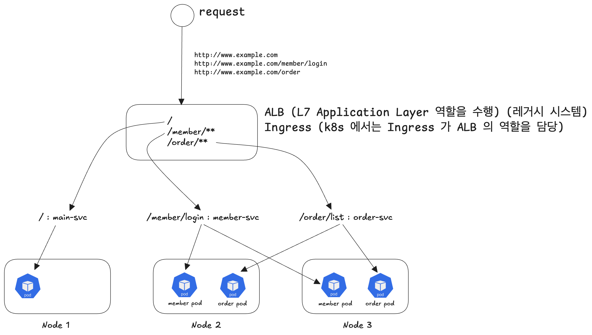
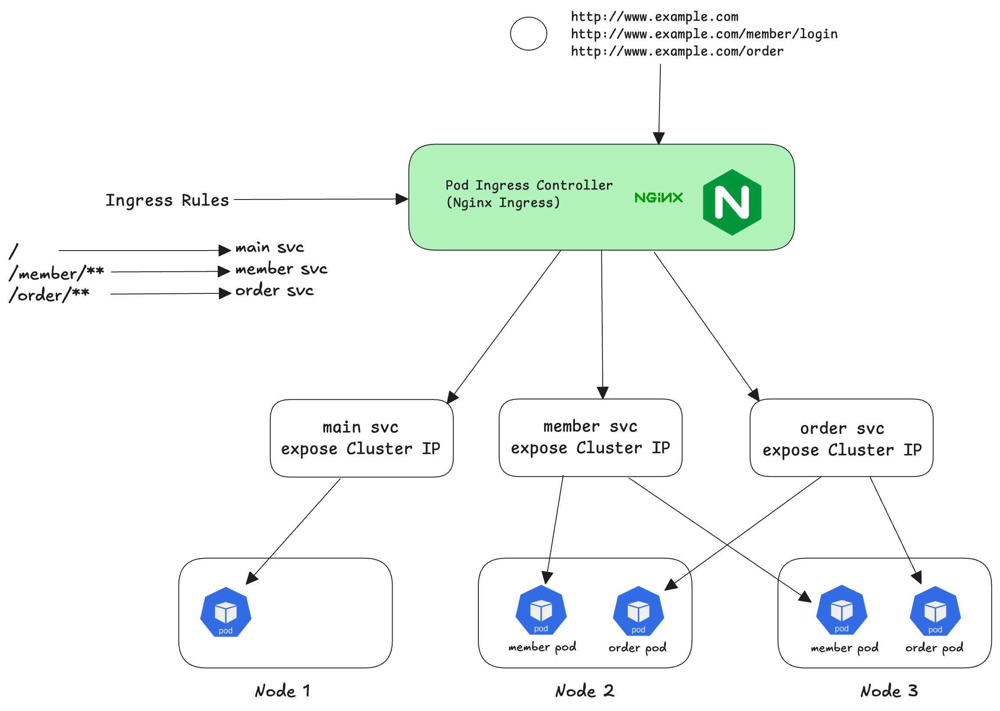
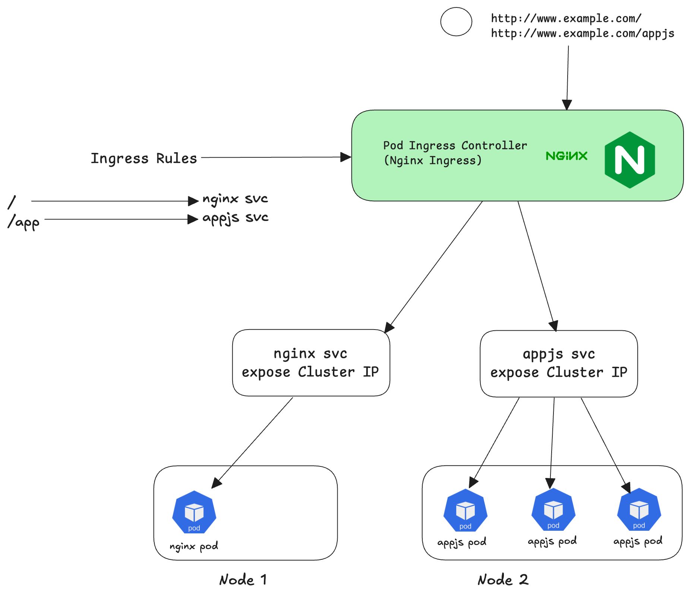

# Networking - Ingress

Ingress 는 다음과 같은 역할을 합니다.

- 논리 레벨의 L7 스위치 (ALB)  역할을 수행 (물리적인 L7 스위치의 역할이 아닌 논리적인 역할)
- 클러스터로 접근하는 URL 을 인식해서 필요한 서비스로 트래픽을 전달
- Service 에 접근할 수 있는 외부 URL 을 제공
- 트래픽의 로드 밸런싱
- SSL 인증서 처리 : 인증서 설정을 통해 클라이언트와 서버간의 통신 시 암호화를 보장가능
- Virtual Hosting 지정 : Virtual Hosting 기능을 지원하기에 한가지 도메인만 사용하는 것이 아니라 여러가지 도메인을 사용 가능하다.

<br/>


# ALB 역할을 수행하는 Ingress




전통적인 ALB 의 역할을 Ingress 가 수행할 수 있다. <br/>


# Nginx Ingress (Ingress Controller)

Ingress 리소스를 제어하는 IngressController 와 Ingress 에 필요한 Rule 들을 정의한 Ingress Rules 의 상호 작용은 다음과 같습니다.<br/>



Ingress Controller 

- Nginx Ingress 기반으로 동작하는 Ingress Controller 다.
- Ingress Controller 는 Node에 Port 를 열어놓고 요청을 받아서 Ingress Rules 에 해당되는 적절한 Service 로 요청을 연결해준다.

Ingress Rules

- kind: Ingress 로 정의된 리소스 내의 Ingress Rules 를 Ingress Controller 가 참조해서 처리를 수행한다.

<br/>


# 기출문제 1) 

> 작업 클러스터 : k8s

- ingress-nginx namespace 에 nginx 이미지를 app=nginx 레이블을 가지고 실행하는 nginx pod 를 구성하세요.
- 현재 appjs-service와 nginx 서비스는 이미 동작중입니다. 별도 구성은 필요 없습니다.
- app-ingress.yaml 파일을 생성하고 다음 조건의 ingress 를 구성하세요.
  - name : app-ingress
  - NODE\_PORT:30080/ : 접속 시 nginx 서비스로 연결
  - NODE\_PORT:30080/app : 접속시 appjs-service 서비스로 연결
  - Ingress 구성에 다음 annotations 를 포함시키세요

```yaml
annotations:
  kubernetes.io/ingress.class: nginx
```

<br/>


## 풀이

```bash
$ kubectl get namespaces ingress-nginx
NAME							STATUS		AGE
ingress-nginx			Active		62d


# nginx 라는 이름의 Pod 생성을 --dry-run=client 으로 생성해봄
$ kubectl run nginx --image=nginx --labels=app=nginx -n ingress-nginx --dry-run=client -o yaml
apiVersion: v1
kind: Pod
metadata:
  creationTimestamp: null
  labesl:
    app: nginx
  name: ngnix
  namespace: ingress-nginx
spec:
  containers:
  - image: nginx
    name: nginx
    resources: {}
  dnsPolicy: ClusterFirst
  restartPolicy: Always
status: {}


# 테스트 결과 문제 없으므로 Pod 생성
$ kubectl run nginx --image=nginx --labels=app=nginx -n ingress-nginx
pod/nginx created


# ingress-nginx 네임스페이스 내의 pod 중 'app' 레이블이 붙은 Pod 목록 확인
$ kubectl get pod -n ingress-nginx -L app
...
appjs, ingress-nginx, nginx 가 동작 중인 것을 확인 가능


# 서비스 'ingress-nginx' 확인
$ kubectl get svc -n ingress-nginx
문제에서 이미 동작중이라고 하는 서비스 'appjs-service', 'nginx' 서비스가 동작 중 인지 학인한다.
확인해보면 TYPE=ClusterIP 로 동작 중이라는 것이 확인된다.


# ingress 생성
# name : app-ingress
# NODE_PORT:30080/ 으로 접속시 nginx 서비스로 연결
# NODE_PORT:30080/app 으로 접속시 appjs-service 서비스로 연결

# 그리고 Ingress 구성에 아래의 annotation 을 포함시킨다.
# annotations:
#   kubernetes.io/ingress.class: nginx

# ingress 를 구성하기 전에 공식 도큐먼트를 먼저 확인한다. (다 외어서 하기엔 스트레스가... 기본 소스가 있어야 함)
# 북마크 : Service/Service - Ingress 를 확인
# https://kubernetes.io/ko/docs/concepts/services-networking/ingress/

# 1)
# 공식문서에서 첫 단원에서 '전제조건' 이라는 챕터에서 인그레스 컨트롤러가 동작 중 이어야 한다는 이야기를 한다. 그런데 문제에서는 이미 인그레스 컨트롤러가 동작 중이라고 전제조건을 제시하고 있기에 첫 단원에서 이야기하는 인그레스 컨트롤러 설치는 건너뛴다.

# 2)
# 그 다음 챕터에서는 인그레스 리소스 라는 단원이 나온다. 
# https://kubernetes.io/ko/docs/concepts/services-networking/ingress/#%EC%9D%B8%EA%B7%B8%EB%A0%88%EC%8A%A4-%EB%A6%AC%EC%86%8C%EC%8A%A4
# 메모장 같은 곳에 미리 복사해서 붙여넣은 후 아래와 같이 수정해준다.
apiVersion: networking.k8s.io/v1
kind: Ingress
metadata:
  namespace: ingress-nginx
  name: app-ingress
  annotations:
    # 아래 내용 삭제 
    # nginx.ingress.kubernetes.io/rewrite-target: /
    kubernetes.io/ingress.class: nginx
spec:
  # ingressClassName 은 삭제해줬다. 필요 없다. 
  rules:
  - http:
      paths:
      - path: /
        pathType: Prefix
        backend:
          service:
            name: nginx
            port:
              number: 80
      - path: /app
        pathType: Prefix
        backend:
          service:
            name: appjs-service
            port:
              number: 80
              

# vi 로 yaml 파일을 만들어서 메모장에서 작성한 내용을 붙여넣어 준다.
$ vi app-ingress.yaml


# kubectl apply -f 로 클러스터에 배포한다.
$ kubectl apply -f app-ingress.yaml
ingress.networking.k8s.io/app-ingress created


# 제대로 설치되었는지 확인
$ kubectl get ingress -n ingress-nginx
NAME					CLASS			HOSTS			ADDRESS			PORTS			AGE
app-ingress		<none>		*											80


# 'app-ingress' 의 내용을 자세히 확인한다.
$ kubectl describe ingress -n ingress-nginx app-ingress
Name: 			app-ingress
Labels: 		<none>
Namespace:	ingress-nginx
...

Rules:
	Host			Path		Backends
	---				----		--------
	*
						/				nginx:80 		(10.244.1.35:80)
						/app		appjs-service:80 (10.244.2.52:8080,10.244.2.54:8080,10.244.2.59:8080)
```

위에서 kubectl descrie 를 통해 확인한 'app-ingress' 는 아래와 같이 매핑되어 있다. 그림 그리느라 많이 힘들었다.



<br/>


이제 확인을 해봐야 한다. 확인할 내용은 다음과 같다.

- NODE\_PORT:30080/ 으로 접속 시에는 nginx 서비스로 연결되는지
- NODE\_PORT:30080/app 으로 접속 시에 appjs-service 서비스로 연결되는지

<br/>


```bash
$ curl k8s-worker:30080/
...

<h1>Welcome to nginx</h1>
...


$ curl k8s-worker1:30080/app
Container Hostname : appjs-rc-zlaac

```

<br/>


## 참고) 실제 시험 유형

위의 기출 문제는 문제 설명을 굉장히 자세히 해줬다. 실제 시험장에서는 훨씬 문제 설명이 간단할 수 있다.

e.g.

app-ingress.yaml 파일을 생성하고, 다음 조건의 ingress 를 구성하세요.

- name: app-ingress
- domain.name/ 접속했을 때 nginx 서비스로 연결
- domain.name/app 접속했을 때 appjs-service 서비스로 연결


아래의 내용이 포함되지 않는 경우도 있기 때문에 annotation 은 꼭 같이 정의해줘야 하는 요소는 아니다.<br/>

ingress 구성에 다음의 annotation 을 포함시키세요<br/>

```yaml
annotations:
  kubernetes.io/ingress.class: nginx
```

<br/>