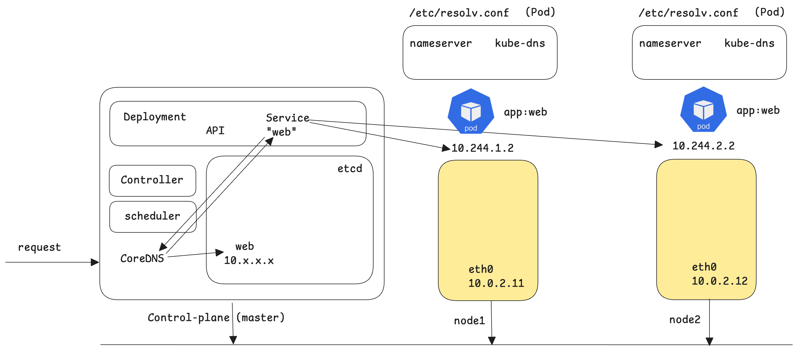
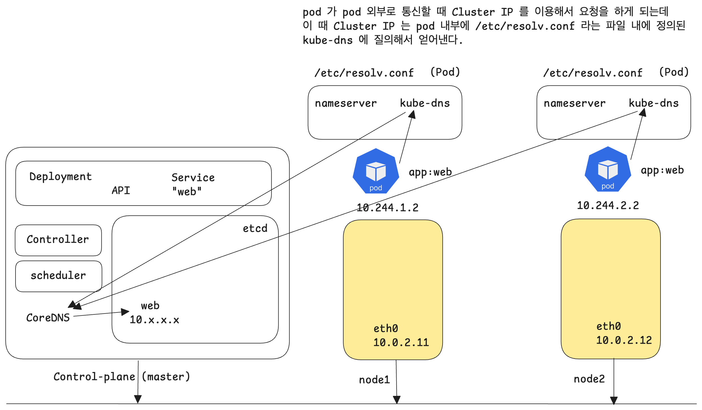
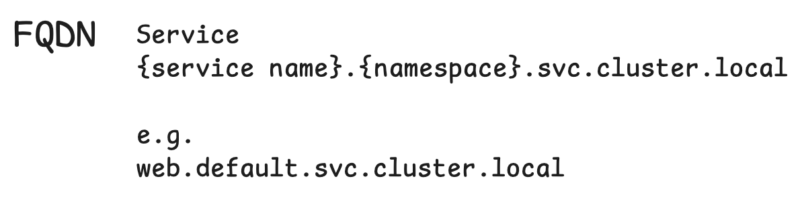
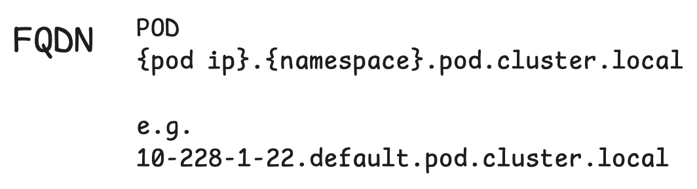

# Networking - kube-dns

나중에 복습할 때 멘붕이 올까봐 한가지 적어두면 이렇다.<br/>

강의에서는 kube-dns 라는 용어를 CoreDNS와 같은 용어로 취급해서 설명하고 있다. 아마도 CoreDNS 라는 것은 kube-dns 라는 것의 구현체 개념이 아닌가 하고 생각된다. 엄청 이론적으로 빠삭하게 알고 있을 생각이 아니라면 두 개념이 거의 같은 것으로  간주되거나 비슷하게 인식되어 혼용되는 용어라고 생각하면 된다.<br/>

전반적으로 CKA 강의 대비에는 좋지만 뭔가 용어를 혼용해서 설명해주시는 경우가 있기도 하고 이론적인 부분은 따로 직접 다른 강의를 들어보고 싶은 마음도 있어서 강의 완강 후에는 **이론+개발**에 대한 자료를 찾아볼때만 인프런 또는 패캠 강의를 들어볼 예정이다. **시험대비** 는 별도로 실습 연습하는 sheet , hands on  들을 만들어서 계속 반복해볼 생각이다.<br/>

<br/>


# kube-dns 

- 쿠버네티스 클러스터에서 사용하는 DNS

- 서비스 : 클러스터 내의 모든 Service 에는 DNS 네임이 할당된다.

- 파드 : 클러스터 내의 모든 Pod 내의 /etc/resolv.conf 에는 kube-dns 가 namespace 로 정의되어 있다.

  - cat /etc/resolv.conf

  - nameserver 10.32.0.10

    search \{namespace\}.svc.cluster.local svc.cluster.local cluster.local

- 특정 Pod 에서 service name, pod name 으로 Access 가능

  - svc-name.namespace.svc.cluster.local
    pod-ip.namespace.pod.cluster.local

<br/>


# CoreDNS

만약 쿠버네티스에서 서비스를 하나 만들면 Cluster IP 와 서비스의 이름이 있는데 

- Cluster IP 와 이것에 대한 서비스 매핑 정보 

를 CoreDNS 가 etcd 를 이용해서 관리한다.<br/>


만약 쿠버네티스에서 파드를 하나 만들면 파드 IP와 파드 이름이 있는데 

- 파드의 ClusterIP 와 파드 매핑 정보

를 CoreDNS 가 etcd 를 이용해서 관리한다.<br/>


쿠버네티스에서 동작하는 모든 Pod 는 기본 네임서버가 CoreDNS 로 등록되어 있다.<br/>

따라서 클러스터 내부에서는 파드의 서비스, Cluster IP 의 서비스 에 대해서 dns 조회를 할 수 있다.<br/>

<br/>


## Pod 의 /etc/resolv.conf 


- Pod 내 에는 /etc/resolv.conf 라는 파일 내에 kube-dns 가 namespace 로 정의되어 있다.
- kube-dns 의 k8s 클러스터 내에서의 주소는 10.32.0.10 이다.


## CoreDNS 개념

CoreDNS 는 쿠버네티스 마스터 노드 내의 DNS 서버다.<br/>

- Service 역시 한번 만들면 Service 에도 ClusterIP 가 부여되는데, CoreDNS 는 Service 의 이름과 Service 의 Cluster IP 를 매핑하는 매핑정보를 관리하는 도메인 네임 서버 역할을 한다.
- Pod 들도 한번 만들면 ClusterIP 가 부여되는데, CoreDNS 는 Pod 의 이름과 Pod 의 Cluster IP 를 매핑하는 매핑정보를 관리하는 도메인 네임 서버 역할을 한다.



위 그림의 동작을 정리해보면 이렇다.

- request 가 발생해서 클러스터로 진입
- "web" 이라는 Kubernetes API 는 Service 를 찾아야하는데 CoreDNS 를 통해 "web" 이라는 서비스가 10.x.x.x 주소라는 것을 확인 (CoreDNS 는 etcd 에 저장된 정보를 통해 확인)
- "web" 이라는 서비스는 "app=web" 이라는 label 이 붙은 파드들(10.244.1.2, 10.244.2.2) 중 하나를 연결 

<br/>




위 그림의 동작은 다음과 같다.

- "app=web" 이라는 label 이 붙은 파드들(10.244.1.2, 10.244.2.2) 중 하나에서 curl 등을 통해서 클러스터 내 특정 서비스를 조회하려고 한다.
- 이때 pod 내에 설정되어 있는 /etc/resolv.conf 파일 내에 `nameserver    kube-dns` 라는 내용을 통해 nameserver 로 kube-dns 를 바라본다. 즉, kube-dns 에 클러스터 내의 ip 를 통해 조회를 하게 된다.
- Pod 내 에는 /etc/resolv.conf 라는 파일 내에 kube-dns 가 namespace 로 정의되어 있다.
- kube-dns 의 k8s 클러스터 내에서의 주소는 10.32.0.10 이다.

<br/>


# FQDN (Fully Qualified Domain Name)

Service 의 경우 FQDN 은 다음과 같은 형식으로 구성된다.




<br/>

Pod 의 경우 FQDN 은 다음과 같은 형식으로 구성된다.




# e.g. 1

- 간단한 web deployment 구성하고 service 를 구성하세요
- 그리고 다른 Pod 에서 name 으로 조회가 가능한지 TEST 하세요

<br/>


## 풀이

```bash
# k8s 로 스위칭
$ kubectl use-context k8s


# deployment 생성
$ kubectl create deployment web --image=nginx --port 80 --replicas=2
deployment.apps/web created


# service 생성
$ kubectl expose deployment web --port 80
service/web exposed


# kubectl get 으로 deployment, svc 조회
$ kubectl get deployments.apps,svc
NAME													READY			...			AVAILABLE			...
deployment.apps/front-end			2/2										2
deployment.apps/nginx					2/2										2
deployment.apps/web						2/2										2

NAME									TYPE					CLUSTER-IP						PORT(S) 
service/kubernetes		ClusterIP			10.96.0.1				...		443/TCP
service/web						ClusterIP			10.110.19.180		...		80/TCP


# busybox 하나를 샘플로 띄워서 그 pod 에 실제로 /etc/resolv.conf 가 존재하는지 확인한다. 
# 그리고 busybox 파드 내에서 위에서 살펴봤던 service/web 의 CLUSTER-IP 인 10.110.19.180 으로 curl 요청을 보내서 통신이 가능한지 체크하는 것으로 실제 kubernentes 안의 DNS가 잘 동작하는지를 테스트해본다.

# busybox 이미지를 dns-test 라는 이름으로 구동시켜서 컨테이너 내부에 /bin/sh 로 접속
$ kubectl run dns-test --image=busybox -it --rm -- /bin/sh
If you don't see a command prompt, try pressing enter

# /etc/resolv.conf 파일을 열어보면 위에서 살펴본 리소스들 중 service/kubernetes 의 ip 주소인 10.96.0.1 을 ip 주소로 지정하는 nameserver 가 지정되어 있음을 확인할 수 있다.
/# cat /etc/recolv.conf
nameserver 10.96.0.10
search default.svc.cluster.local svc.cluster.local cluster.local
options ndots:5

# 위에서 살펴본 service/web 의 Cluster 내의 IP(CLUSTER-IP)인 10.110.19.180 를 제대로 찾는지 확인한다.
# 확인해보면 10.110.19.180 이라는 ip 는 web.default.svc.cluster.local 이라는 dns 로 매핑되었음을 확인가능하다.
/# nslookup 10.110.19.180
Server:				10.96.0.10
Address:			10.96.0.10:53

180.19.110.10.in-addr.arpa			name = web.default.svc.cluster.local


# 이번에는 터미널을 하나 더 열어서 아래의 내용들을 체크해본다
# 10.96.0.10 이라는 ip 주소를 확인해본다.
$ kubectl get svc -n kube-system
NAME			TYPE				CLUSTER-IP			... 		PORT(S)			...
kube-dns	ClusterIP		10.96.0.10							53/UDP,53/TCP,9153/TCP	...

kube-system 네임스페이스 안에 kube-dns 라는 ClusterIP 라는 리소스의 CLUSTER내의 IP(CLUSTER-IP)가 10.96.0.10 이라는 것을 알 수 있다.


```

<br/>


## 답

```bash
$ kubectl config use-context k8s

$ kubectl create deployment web --image=nginx --port 80 --replicas=2
$ kubectl expose deployment web --port 80
$ kubectl get svc,pod | grep web

$ kubectl run dns-test --image=busybox -it --rm -- /bin/sh
/# cat /etc/resolv.conf
/# nslookup CLUSTER_IP
/# exit

$ kubectl delete deployments.apps web
```

<br/>


# e.g. 2

> 작업 클러스터 : k8s

- nginx image 를 사용하는 `resolver` pod 를 생성하고 `resolver-service` 라는 service 를 구성합니다.
- 클러스터 내에서 service, pod 이름을 조회할 수 있는지 테스트 합니다.
  - dns 조회에 사용하는 pod 이미지는 busybox 이고, service,pod 이름 조회는 nslookup 을 사용합니다.
  - service 조회 결과는 `/var/CKA2022/nginx.svc` 에 pod name 조회 결과는 `var/CKA2022/nginx.pod` 파일에 기록합니다.

시험 문제는 딱 이런 타입으로 출제. 이 유형에서 벗어나지 않고 파일명,서비스 명만 조금 달라짐<br/>


## 풀이

```bash
## resolver pod 구동
# nginx 이미지를 resolver 라는 이름의 pod 로 구동시킨다.
$ kubectl run resolver --image=nginx
pod/resolver created

## resolver-service 구동
# resolver 라는 pod 를 80 포트에 열려있는 service 인 resolver-service 라는 서비스로 구동시킨다.
$ kubectl expose pod resolver --port 80 --name=resolver-service
service/resolver-service exposed

# resolver 파드 조회
$ kubectl get pod resolver
NAME					READY			STATUS		...
resolver			1/1				Running		...


# resolver 파드 상세 조회 (ip 주소를 파악하기 위해...)
# ip 주소를 복사해둔다. (resolver: 10.244.1.46)
$ kubectl get pod resolver -o wide
NAME					READY			STATUS			RESTARTS		IP						NODE 					...
resolver			1/1				Running			0						10.244.1.46		k8s-worker1		...

# resolver-service 라는 이름의 서비스 조회 (resolver-service: 10.106.20.222)
$ kubectl get svc resolver-service
NAME								TYPE				CLUSTER-IP			... 		PORT(S)
resolver-service		ClusterIP		10.106.20.222						80/TCP


# 답안제출을 위해 nameserver 파악을 위한 busybox 구동
$ kubectl run test --image=busybox -it --rm -- /bin/sh
If you don't see a command prompt, try pressing enter

# 북마크 중 Service/Service - Pod DNS 를 연다.
# https://kubernetes.io/ko/docs/concepts/services-networking/dns-pod-service/
# https://kubernetes.io/ko/docs/concepts/services-networking/dns-pod-service/#a-aaaa-%EB%A0%88%EC%BD%94%EB%93%9C-1

위의 문서에서는 다음과 같으 설명하고 있다.
예를 들어, default 네임스페이스의 파드에 IP 주소 172.17.0.3이 있고, 클러스터의 도메인 이름이 cluster.local 이면, 파드는 다음과 같은 DNS 주소를 갖는다.

172-17-0-3.default.pod.cluster.local.

서비스에 의해 노출된 모든 파드는 다음과 같은 DNS 주소를 갖는다.

pod-ip-address.service-name.my-namespace.svc.cluster-domain.example.


# 시험장에서는 원격 클라이언트 PC 환경이 주어지는데 그 PC 안에서 /var/CKA2022/nginx.pod, /var/CKA2022/nginx.svc 라는 곳에 각각의 {pod명}: ip주소, {service명}: ip주소 를 기록해서 저장한다. 가급적이면 아래와 같이 메모장에 미리 명령어 형식을 적어두고 하면 내가 어디까지 하려고 했는지 까먹지 않을 수 있을 것 같다.

이 중 172-17-0-3.default.pod.cluster.local 을 복사해서 아래와 같이 메모해둔다.
resolver: 10.244.1.46 > /var/CKA2022/nginx.pod
nslookup	10-244-1-46.default.pod.cluster.local

그리고 resolver-service 는 다음과 같이 메모해둔다.
nslookup	10.106.20.222

# 자, 이제 busybox 에서 다음과 같은 명령을 수행한다.
# pod 의 ip 를 nslookup 하는 명령이다.
/# nslookup 10-244-1-46.default.pod.cluster.local
Server:			10.96.0.10
Address 1:	10.96.0.10	kube-dns.kube-system.svc.cluster.local

Name:				10-244-1-46.default.pod.cluster.local
Address 1:	10.244.1.46	10-244-1-46.resolver-service.default.svc.cluster.local


# 이번에는 서비스를 nslookup 해본다.
/# nslookup 10.106.20.222
Server:			10.96.0.10
Address 1:	10.96.0.10 kube-dns.kube-system.svc.cluster.local

Name:				10.106.20.222
Address 1: 	10.106.20.222 resolver-service.default.svc.cluster.local

# 사실 아래와 같이 해도 되긴 하다.
/# nslookup resolver-service
Server:			10.96.0.10
Address 1: 	10.96.0.10 kube-dns.kube-system.svc.cluster.local

Name:				resolver-service
Address 1:	10.106.20.222	resolver-service.default.svc.cluster.local


/# exit


$ cat > /var/CKA2022/nginx.pod
Server:			10.96.0.10
Address 1:	10.96.0.10	kube-dns.kube-system.svc.cluster.local

Name:				10-244-1-46.default.pod.cluster.local
Address 1:	10.244.1.46	10-244-1-46.resolver-service.default.svc.cluster.local


$ cat > /var/CKA2022/nginx.svc
Server:			10.96.0.10
Address 1:	10.96.0.10 kube-dns.kube-system.svc.cluster.local

Name:				10.106.20.222
Address 1: 	10.106.20.222 resolver-service.default.svc.cluster.local


```


## 답


