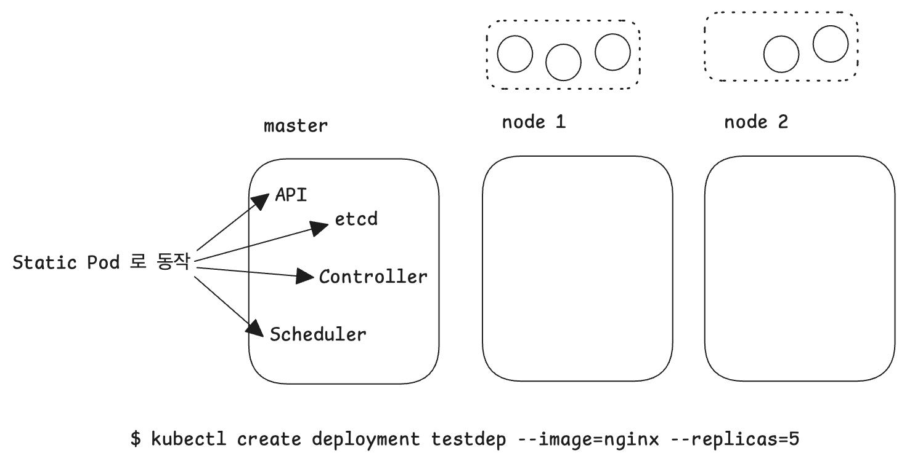
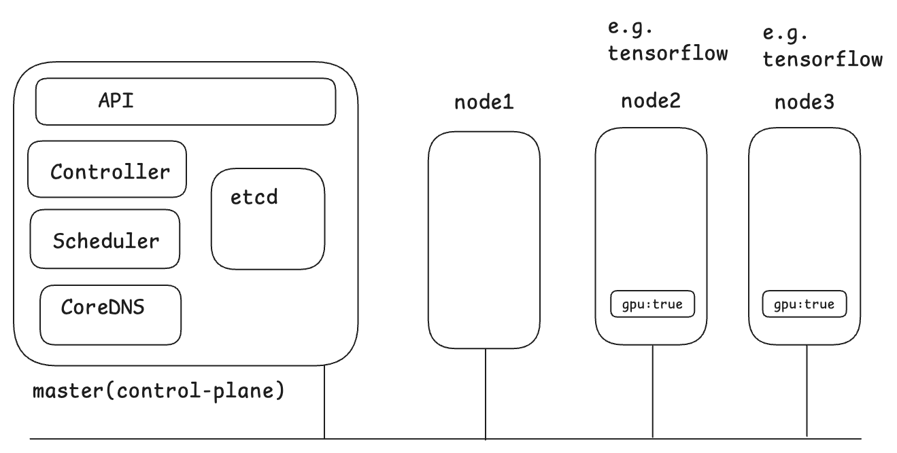
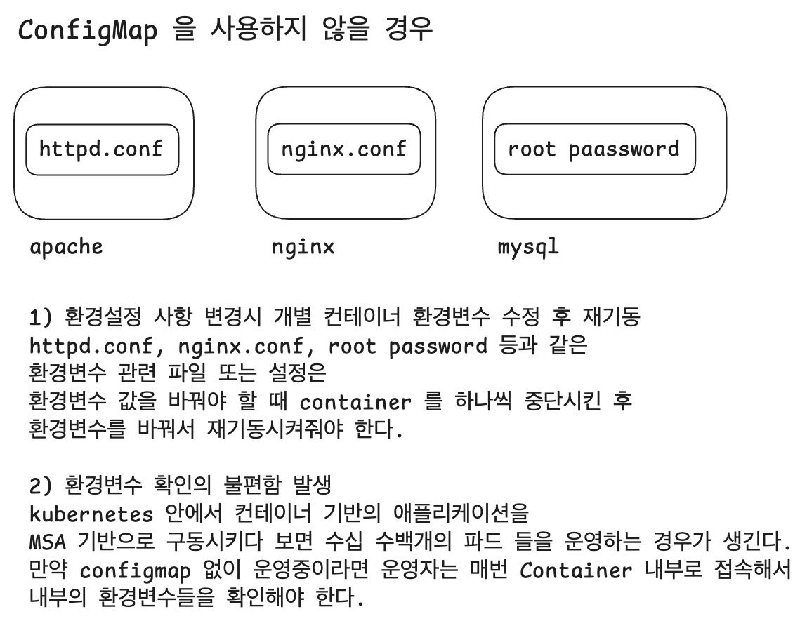
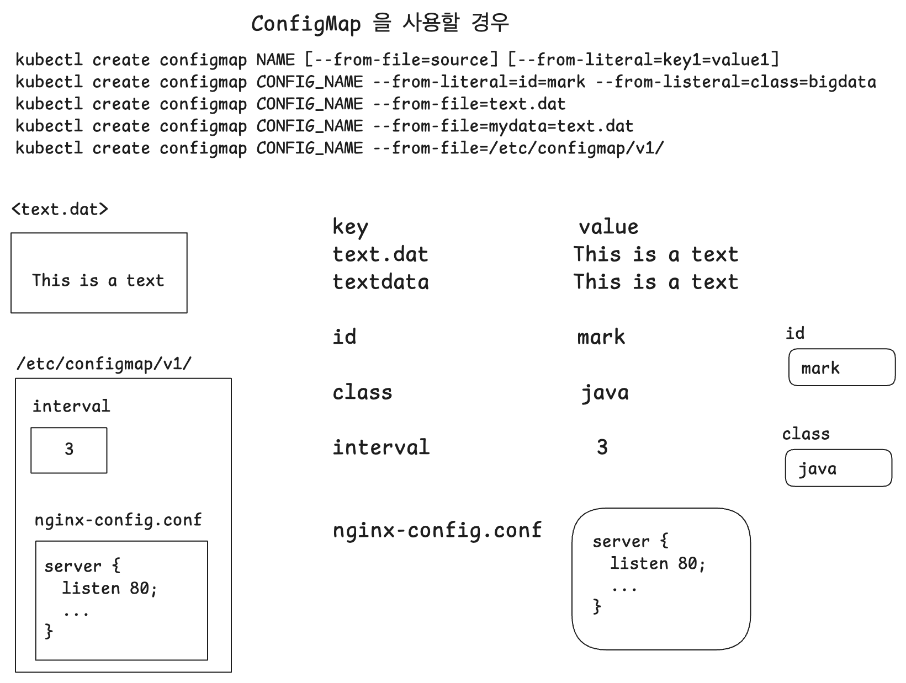
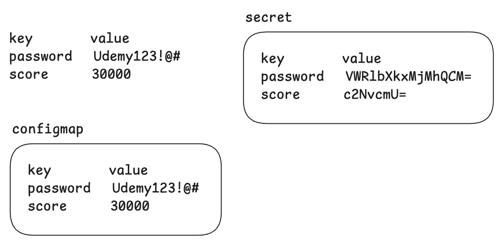
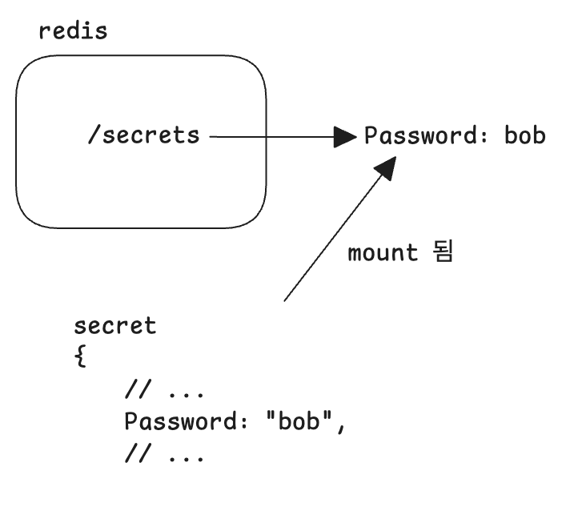

# Pod,Deplyment,Node,Configmap,Secret

시험 보기 전에 겁나 떨려서 뭐라도 반복적으로 봐야겠다 싶을때 보면 좋을것 같은 명령어들<br/>

<br/>

# use-context

접속할 클러스터를 선택할 때 사용하는 명령어

```bash
$ kubectl config use-context hk8s
```

<br/>


# Watch

쿠버네티스 명령어는 아니지만 꽤 자주 쓰는 명령어다. 걍 아무 때나 문서 보면서 반복적으로 보고 싶어서 명령어를 추가해서 정리했다.

```bash
$ watch kubectl get pods -o wide
```

<br/>


# Pod

## kubectl run

yaml 파일로 선언한 것을 구동시키는 것이 아니라 명령행에서 run 명령으로 실행하게 된다.

```bash
$ kubectl run web --image=nginx:1.14 --port=80
$ kubectl get pod -n devops
NAME READY STATUS RESTARTS AGE
web 1/1 Running 0 18s
$ kubectl delete pod web
```

<br/>


## kubectl run `--dry-run`

`--dry-run` 옵션을 주면 실제로 리소스를 생성하는 것은 아니고, 이 yaml 선언이 정상인지를 체크해볼 수 있도록 검증하는 방식으로 구동시키게 된다. 즉, 테스트 용으로 문법체크 등이 맞는지, 리소스 선언이 제대로 되었는지 등을 검사하는 작업을 수행하는 것이다.<br/>

`--dry-run` 의 결과를 yaml 파일로 저장

```bash
$ kubectl run web --image=nginx:1.14 --port=80 --dry-run -o yaml > web.yaml
$ vi web.yaml
$ kubectl apply -f web.yaml
$ kubectl get pod -n devops
$ kubectl delete pod -n devops web
```

<br/>


## kubectl describe

```bash
$ kubectl describe pod deploy-nginx-aaabbbccc
```


<br/>


# Deployment

## 롤링업데이트

서비스 중단 없이 새로운 버전으로 업데이트<br/>

아래 명령은 롤링업데이트를 수행하는데 그 과정을 기록하는 명령어<br/>

```bash
$ kubectl set image deployment deploy-nginx nginx-container=nginx:1.15 --record
```

<br/>


## Deployment 생성, 배포

```bash
kubectl create deployment webserver --image=nginx:1.14 --replicas=2 --dry-run=client -o yaml > webserver.yaml
```

<br/>


### 참고 : record 옵션

record 는 현재 deprecated 되었는데, 여기에 대해서는 아래 자료에서 자세히 설명해주고 있다.

- [--record 옵션을 대체하는 옵션이 있나요?](https://www.inflearn.com/community/questions/523283/record-%EC%98%B5%EC%85%98%EC%9D%84-%EB%8C%80%EC%B2%B4%ED%95%98%EB%8A%94-%EC%98%B5%EC%85%98%EC%9D%B4-%EC%9E%88%EB%82%98%EC%9A%94?srsltid=AfmBOoqc_I9Bzc5FPA3Rd_j9D18b5_V3N3nivTIG-kmb03ay00JGSC2k)

<br/>


## 롤백

서비스 중단없이 이전 버전으로 되돌리기<br/>

```bash
# 히스토리 확인 명령
kubectl rollout history deployment <deployment_name>

# undo
## 바로 이전 버전으로 rollback
kubectl rollout undo deployment <deployment_name>
## 과거의 특정 버전으로 rollback
kubectl rollout undo deployment <deployment_name> --to-revision=NUMBER
```

<br/>


# Node

## kubectl get nodes

node 들의 상태를 확인한다.kubectl get pods 와 가끔 혼동할때가 있다. 조심!!

```bash
$ kubectl get nodes
```

<br/>


`--show-labels`

```bash
$ kubectl get nodes --show-labels
```

node 들에 부여된 label 까지 보려고 할 경우에는 `--show-labels` 를 붙여줘야 한다.<br/>

<br/>


## cordon

```bash
$ kubectl cordon {노드이름}
```

<br/>


## uncordon

```bash
$ kubectl uncordon {노드이름}
```

<br/>


## node drain

특정 node 에서 실행중인 pod 을 비우거나(drain) 제거(delete)

```bash
$ kubectl drain {노드명} --ignore-daemonsets --force
```

특정 노드의 인프라 환경을 교체하거나 네트워크 구성을 변경하거나 정비작업을 해야 하는 경우 그 노드를 사용하는 노드들을 비워줘야 하는데 이 경우 node drain 명령으로 그 노드에서 동작하는 파드 들을 비워줄 수 있다.<br/>

- `--ignore-daemonsets` : 그 노드 내에 동작중인 kube-proxy, kubelet 등과 같은 쿠버네티스 시스템에서 돌아가는 pod 들은 daemon 으로 동작하고 있고 이 것을 daemonset 이라고 부른다. 이러한 daemonset 에 해당하는 요소들을 정지시키지 않겠다는 의미다. 참고로 kube-proxy, kubelet 같은 프로세스가 종료되면 API Controller 가 해당 노드를 제어를 못하게 될 수 있다.
- `--force` : Controller (ReplicaSet, Job, DaemonSet 등)의 제어를 받지 않는 Pod 들도 삭제를 하겠다는 옵션이다. Static Pod 같은 파드 들 처럼 독립적으로 돌아가고 있는 파드 들도 정지시킬 수 있다.

<br/>


## 예제

- k8s-worker2 노드를 스케쥴링 불가능하게 설정하고 해당 노드에서 실행 중인 모든 Pod 들을 다른 Node 로 리스케쥴링하세요
- 답: k8s-worker2 를 node drain 해준다. 노드 드레인 시에 cordon 도 함께 수행된다.

<br/>


## 노드 정지 후 재개 절차

- cordon 으로 저지선을 세워서 새로운 pod 들이 유입되지 않도록 한다. cordon den 은 영어 단어로 '저지선'이라는 의미다.

- node drain \{노드명} \-\-ignore-daemonsets \-\-force 를 통해 해당 노드 내의 pod 들을 종료시키고 다른 노드로 재분배되게끔 하는 절차를 거친다.
- 노드 내에 새로운 작업을 마쳤거나 새로운 노드를 마련했다면, uncordon 을 통해서 새로운 pod 들이 유입될수 있도록 해준다.

<br/>


## Master, Worker 노드

```bash
$ kubectl create deployment testdep --image=nginx --replicas=5
```

위와 같은 명령을 수행하면 일반적으로는 아래와 같이 master 노드가 아닌 worker1, worker2 처럼 워커노드 들로 Pod 들이 분배된다.



마스터 노드에서 실행 중인 etcd, scheduler, api controller 등은 일반적으로 Static Pod 라고 분류되는 Pod 들이다.<br/>


## Node Affinity

참고 : [테인트(Taints)와 톨러레이션(Tolerations)](https://kubernetes.io/ko/docs/concepts/scheduling-eviction/taint-and-toleration/)<br/>

노드 셋을 (기본설정 또는 어려운 요구사항으로) 끌어들이는 파드의 속성<br/>


## Taint, Toleration

참고 : [테인트(Taints)와 톨러레이션(Tolerations)](https://kubernetes.io/ko/docs/concepts/scheduling-eviction/taint-and-toleration/)<br/>

Taint 와 매치되는 Toleration 이 없는 Pod 는 `node-role.kubernetes.io/master:NoSchedule` 이 없는 곳에 배치될 수 없다.

- 테인트(Taint) : 노드에 적용되는 속성이다. 테인트를 통해 노드가 파드 셋을 제외하는 것이 가능하다. 
  - 마스터 노드가 위치한 곳을 테인트로 불린다.(아직은 정확하게 잘 모른다 윽...)
- 톨러레이션(Tolerations) : 파드에 적용되는 속성이다. 주로 워커노드에 톨러레이션이 적용된다. 

<br/>


[테인트(Taints)와 톨러레이션(Tolerations)](https://kubernetes.io/ko/docs/concepts/scheduling-eviction/taint-and-toleration/) 에서는 아래와 같이 이야기하고 있다.<br/>

> 파드를 테인트가 있는 노드인 마스터 노드에 스케쥴되게 할 수도 있지만 필수는 아니다. <br/>

<br/>

일반적으로 파드를 deploy 를 통해 배포하면 워커노드에만 적용되는데, 파드를 마스터 노드에도 배포될 수 있게끔 하려면 파드에 톨러레이션을 적용하면 된다. 이렇게 하면 마스터 노드에 스케쥴 될 수 있게 된다. 다만, 마스터 노드에 필수적으로 스케쥴링 되지는 않는다.

<br/>


### master 노드 내의 Taint 속성 조회해보기

```bash
$ kubectl describe node hk8s-m | grep -i taint
Taints: 		node-role.kubernetes.io/master:NoSchedule
```

<br/>

위에서 봤던 `Taints: node-role.kubernetes.io/master:NoSchedule` 의 의미는 [테인트(Taints)와 톨러레이션(Tolerations)](https://kubernetes.io/ko/docs/concepts/scheduling-eviction/taint-and-toleration/) 에서 아래와 같이 설명하고 있다.

- taint  형식은  {키:값 또는 이펙트}의 형태다.
- 키(key) : node-role.kubernetes.io/master
- 값(value) 또는 이펙트 : NoSchedule 은 '이펙트'를 의미한다.

**'NoSchedule'** 이라는 의미는 **"이 요소에 대해서는 Scheduling 을 하지마"** 라는 의미를 가지고 있다.<br/>


### 실습

아래에서 3\) 에 추가해준 내용은 [테인트(Taints)와 톨러레이션(Tolerations)](https://kubernetes.io/ko/docs/concepts/scheduling-eviction/taint-and-toleration/)  에 [개요](https://kubernetes.io/ko/docs/concepts/scheduling-eviction/taint-and-toleration/#%EA%B0%9C%EC%9A%94) 섹션에서 명령어를 설명해주는 내용이다. 자세한 내용은 [개요](https://kubernetes.io/ko/docs/concepts/scheduling-eviction/taint-and-toleration/#%EA%B0%9C%EC%9A%94) 문서를 참고하자.

```bash
## 1) nginx deployment 생성
$ kubectl create deployment testdep --image=nginx --replicas=5 --dry-run=client -o yaml > testdep.yaml

## 2) testdep.yaml 파일 편집
$ vi testdep.yaml

## 3) 필요없는 부분들은 제거한 후 아래 내용에서 주석으로 표시한 부분들을 추가해준다
apiVersion: apps/v1
kind: Deployment
metadata:
  name: testdep
spec:
  replicas: 5
  selector:
    matchLabels:
      app: testdep
  template:
    metadata:
      labels:
        app: testdep
    spec:
      tolerations:
      - key: "node-role.kubernetes.io/master" # 추가
        operator: "Equal" # 추가
        effect: "NoSchedule" # 추가
      containers:
      - image: nginx
        name: nginx
        

## 4) testdep.yaml 파일 적용
$ kubectl apply -f testdep.yaml
deployment.apps/testdep created


## 5) 확인
$ kubectl get pods -o wide | grep testdep

## 6) 테인트 조회
$ kubectl describe node hk8s-m | grep -i taint
Taints: 		node-role.kubernetes.io/master:NoSchedule
$ kubectl describe node hk8s-w1 | grep -i taint
Taints:			<none>
```

위와 같이 tolerations 를 정의해주었기에 마스터 노드에 스케쥴 될 수 있게 된다. 다만, 마스터 노드에 필수적으로 스케쥴링 되지는 않는다.<br/>

<br/>

### 예제

Ready 상태 (NoSchedule로 Taint 된 node는 제외)인 node 를 찾아 그 수를 /var/CKA2022/notaint\_ready\_node) 에 기록하세요.

- 작업 클러스터 : hk8s


```bash
$ kubectl config use-context hk8s

$ kubectl get nodes
NAME 			STATUS 	ROLES									AGE		VERSION
hk8s-m		Ready		control-plain,master	68d		v1.22.4
hk8s-w1		Ready		<none>								68d		v1.22.4
hk8s-w2		Ready		<none>								60d		v1.22.4

# hk8s-m, hk8s-w1, hk8s-w2 를 차례로 조회한다.
## grep 옵션 i 는 대소문자 무시 (ignore)
## grep 옵션 e 는 여러 옵션을 추가할 때 사용
$ kubectl describe node hk8s-m | grep -i -e taint -e noschedule
Taints:		node-role.kubernetes.io/master:NoSchedule
$ kubectl describe node hk8s-w1 | grep -i -e taint -e noschedule
Taints:		<None>
$ kubectl describe node hk8s-w2 | grep -i -e taint -e noschedule
Taints:		<None>


# 확인해보니 전체 노드 3개 중 NoSchedule 로 Taint 된 노드는 마스터 노드인 hk8s-m 노드 1기 뿐이다. 즉, Ready 상태이면서 NoSchedule 로 Taint 되지 않은 Node 는 2기 이므로 정답은 2기 인데 이 것을 /var/CKA2022/notaint_ready_node 라는 파일에 기록해줘야 한다.
## 정답 저장
$ echo "2" > /var/CKA2022/notaint_ready_node
## 제대로 쓰여졌는지 확인
$ cat /var/CKA2022/notaint_ready_node
2

```


# Pod 스케쥴링

Pod 스케쥴링은 쿠버네티스가 지원하는 node 레이블과 nodeSelector 레이블을 통해서 지원된다.<br/>

## NodeSelector

```yaml
apiVersion: v1
kind: Pod
metadata:
  name: tensorflow
spec:
  containers:
  - name: tensorflow
    image: tensorflow/tensorflow:nightly-jupyter
    ports:
    - containerPort: 8888
      protocol: TCP
    nodeSelector: # 1)
      gpu: "true"
```


1\) 

- nodeSelector 항목에 대해 `gpu: "true"` 라는 키/값 기반의 label 을 붙여주었다. 이렇게 하면 위의 tesnorflow 파드는 `gpu: "true"` 라는 키/값 label 이 붙어있는 Node 에만 스케쥴링(배포)된다.


e.g. 



tensorflow 처럼 gpu 를 필요로 하는 프로세스의 경우 `gpu:true` 라는 레이블이 붙은 Node로만 Pod 가 배포/스케쥴링 되게끔 할 수 있는데 `spec.containers[i].nodeSelector` 항목에 대해 `gpu:true` 로 레이블을 지정해주면 `gpu:true` 레이블이 적용된 Node 로만 Pod가 배포된다.<br/>


## kubectl label node \{노드명} \{키,값 label\} \{option\}

원하는 리소스에 label 을 지정하려고 할 경우에 사용하는 명령어<br/>

node, pod, deployment 등 다양한 리소스들에 label 을 지정하는 것이 가능하다.<br/>

- kubectl label node \{노드명} \{키,값 label\}
- kubectl label node \{노드명} \{키,값 label\} --overwrite

```bash
$ kubectl label node k8s-worker1 gpu=true
$ kubectl label node k8s-worker2 gpu=true

# 확인
$ kubectl get nodes --show-labels

# 또는 아래와 같이 확인 가능(위의 명령어는 다소 결과 출력이 복잡해보인다. 아래의 명령어를 실행해보자. 결과가 단순해진다.)
$ kubectl get nodes -L gpu

# true 로 지정되어 있는 gpu=true 를 gpu=false 로 변경
# 이미 지정되어 있는 label 을 변경해야 할 경우에는 --overwrite 옵션을 사용한다.
$ kubectl label node k8s-worker1 gpu=false --ovewrite

# 제대로 변경되었는지 확인
$ kubectl get nodes -L gpu
```

<br/>


label 제거는 다음과 같이 `-` 기호를 이용해서 제거 한다.

```bash
# k8s-worker1 에서 gpu 라는 이름의 label 을 제거 
$ kubectl label node k8s-worker1 gpu-

# gpu label 이 붙은 노드들 확인 (k8s-worker1 에서 label 이 제거된 것을 확인 가능)
$ kubectl get nodes -L gpu
NAME				STATUS	ROLES	...							VERSION		GPU
k8s-master	Ready		control-plane,master	... 			 
k8s-worker1	Ready		<none>								...				
k8s-worker2	Ready		<none>								...				true
```

<br/>


이번에는 label 이 `gpu=true` 로 표시된 노드 들에 tensorflow 라는 pod 를 배치시켜본다.

nodeSelector 를 이용해서 선언한다.

```bash
$ vi /data/cka/pod-tensorflow.yaml

apiVersion: v1
kind: Pod
metadata:
  name: tensorflow-gpu
spec:
  nodeSelector:
    gpu: "true" # (1)
  containers:
  - name: tensorflow
    image: tensorflow/tensorflow:nightly-jupyter
    ports:
    - containerPort: 8888
      protocol: TCP
```

(1)

- `gpu: "true"` 라는 label 을 지정해줬다.

<br/>


작성한 내용을 적용해준다.

```bash
$ kubectl apply -f /data/cka/pod-tensorflow.yaml
pod/tensorflow-gpu created

$ kubectl get pods -o wide
NAME						READY		STATUS			RESTARTS		AGE	IP		NODE ...
...

tensorflow-gpu	0/1	ContainerCreating	0	22s	<none>	k8s-worker2
```

<br/>


### 기출문제

> 작업 클러스터 : k8s

다음의 조건으로 pod 를 생성하시오

- Name : ebook-store
- Image: nginx
- Node selector: disktype=ssd


```bash
# 1) 먼저 node 들의 disktype 레이블(label)을 확인해본다.
$ kubectl get nodes -L disktype
...
여기서는 k8s-worker1 에 disktype=ssd 라는 레이블(label)이 붙어있고, k8s-worker2에는 disktype=std 라는 레이블(label)이 붙어있다고 가정. (std 는 standard 라는 의미라고...)


# 2) 실행이 되는데 문제가 없는지 --dry-run 으로 검증
$ kubectl run ebook-store --image=nginx --dry-run=client -o yaml
...


# 3) 2)의 명령의 출력을 yaml 매니페스트 파일로 저장
$ kubectl run ebook-store --image=nginx --dry-run=client -o yaml > ebook-store.yaml
...


# 4) vi 로 열어서 nodeSelector 내에 disktype=ssd 레이블(label)을 추가해준다.
$ vi ebook-store.yaml

apiVersion: v1
kind: Pod
metadata:
  creationTimestamp: null
  labels:
    run: ebook-store
  name: eshop-store
spec:
  nodeSelector: # 여기에 추가해줬다. 
    disktype: "ssd" # 여기에 추가해줬다.
  containers:
  - image: nginx
    name: ebook-store
    resources: {}
  dnsPolicy: ClusterFirst
  restartPolicy: Always
status: {}


# 5) kubectl apply -f 로 배포
$ kubectl apply -f ebook-store.yaml
pod/ebook-store created


# 6) 상태 확인
$ kubectl get pods -o wide
...

disktype=ssd 레이블(label)이 붙은 노드 k8s-worker1 로 ebook-store 가 배포되었음을 확인 가능하다.
```

<br/>


# 매니패스트 파일 속성들을 외워서 기억하려 할 때

- 카-메-스 (kind, metadata, spec)
- r-s-t (replicas, spec, templates)
- 노-콘 (nodeSelector, container)

<br/>


# configmap

직접 스터디를 해보다 보니 secret, configmap(파일 마운트, 환경변수 마운트)과 같은 간단한 리소스는 가급적이면 외워서 하는 것이 좋을 것으로 보인다. 물론 공식문서 찾아 들어가서 필요한 내용 읽는 연습도 계속 해봐야 한다.

## configmap 을 사용하지 않을 경우

configmap 을 사용하지 않을 경우 k8s에 배포되어 있는 파드 내의 Container 에 등록된 환경변수를 수정해야 할 때 해당 Container 들을 하나씩 찾아서 정지시킨 후 새로운 컨테이너로 재기동시켜줘야 한다.<br/>

또는 특정 컨테이너의 환경변수를 확인해야 할 경우가 있다. 배포된 컨테이너의 환경변수가 어떻게 되는지를 확인해야 할 경우가 있기 때문이다. 이런 경우 Configmap 을 사용하고 있지 않다면 배포된 개별적인 Container 들을 하나씩 검사해야 한다는 어려움이 생긴다.<br/>



<br/>


## configmap 을 사용할 경우

북마크

- Config \> Configure - Environment Variable

<br/>


configmap 을 사용하게 되면 pod 들이 configmap 만 바라보면 되고 개별 컨테이너에 일일이 접속해서 환경변수를 수정하거나 확인해야 하는 상황이 발생하지 않게 된다.<br/>

configmap 을 사용하게 되면 아래 그림 처럼 환경 변수, 설정 값, 설정 파일 내의 key/value 등을 key/value 형식으로 하나의 리소스로 선언해서 가지고 있게 된다.<br/>

이렇게 환경변수,설정값,설정파일 내의 key/value 등을 configmap 에 연결해주는 것을 '마운트한다'라고 이야기하기도 한다.



<br/>

만약 configmap 내에 포함된 환경변수,설정값 파일을 수정했다면, 여기에 관련된 Pod 를 restart 해주면 된다. configmap 을 사용하지 않을 경우 파드 내의 container 에 접속해서 환경변수를 수정하고 확인해줘야 하는 불편함이 있었지만, configmap을 사용할 경우 Pod 단위로 재기동을 gㅐ주기만 하는 방식으로 설정값 업데이트 적용이 가능해진다.<br/>

<br/>


## 기출문제 1

> 작업 클러스터 : k8s

다음의 변수를 configmap ebook 으로 등록하세요.

- DBNAME: mysql
- USER: admin

등록한 ebook configmap 의 DB Name 을 ebook-configmap 이라는 이름의 nginx 컨테이너에 DB 라는 환경변수로 할당하세요.<br/>

```bash
# 1) configmap 을 생성하고 환경변수 DBNAME=mysql, USER=admin 을 추가
$ kubectl create configmap ebook --from-literal=DBNAME=mysql --from-literal=USER=admin

# 2) kubectl get configmaps
NAME			DATA  ...
ebook			2			...

# 3) 조금더 자세히 출력 
$ kubectl describe configmaps ebook

# 4) ebook-configmap 을 --dry-run 으로 실행시켜 검증
$ kubectl run ebook-configmap --image=nginx --dry-run=client -o yaml

# 5) 4) 에서 문제가 없으면 다음과 같이 ebook.yaml 파일로 생성
$ kubectl run ebook-configmap --image=nginx --dry-run=client -o yaml > ebook.yaml

# 6) configmap 속성을 ebook.yaml 파일에 추가
# 필요없는 속성은 제거해주고 작성
apiVersion: v1
kind: Pod
metadata:
  name: ebook-configmap
spec:
  containers:
  - image: nginx
    name: ebook-configmap
    # 아래 env 이하의 내용들을 작성 (북마크 매뉴얼 문서에서 가져온다.)
    env:
    - name: DB
      valueFrom:
        configMapKeyRef:
          name: eshop
          key: DBNAME

# 7) pod 배포
$ kubectl apply -f ebook.yaml
pod/ebook-configmap created

# 8) 조회
$ kubectl get pod ebook-configmap
NAME							READY		STATUS		RESTARTS		AGE
ebook-configmap		1/1			Running		0						12s

# 9) pod 내부에 접속해서 환경변수가 제대로 설정되었는지 확인
$ kubectl exec -it ebook-configmap -- /bin/bash
... 
root@ebook-configmap:/# env
...
DB=mysql

```

<br/>


# secret

직접 스터디를 해보다 보니 secret, configmap(파일 마운트, 환경변수 마운트)과 같은 간단한 리소스는 가급적이면 외워서 하는 것이 좋을 것으로 보인다. 물론 공식문서 찾아 들어가서 필요한 내용 읽는 연습도 계속 해봐야 한다.



<br/>

Secret 은 Configmap 과 유사한 구조이지만, Key/Value 를 base64 로 인코딩한다는 점이 다르다. Secret 은 보통 인증서를 base64 인코딩해서 제공하는 데에 자주 사용된다.<br/>

Configmap 은 키/값을 plain text 로 저장하고 보여주지만, Secret 은 키/값을 base64 로 인코딩해서 저장하고 보여준다.<br/>

```plain
$ kubectl create secret --help
Available Commands:
  docker-registry 	Create a secret for use with a Docker registry
  generic						Create a secret from a local file, directory, or literal value
  tls								Create a TLS secret
```

docker-registry

- 도커 레지스트리 접속에 관련된 데이터일 때 사용
- docust, docker user, docker pass 와 같은 정보가 들어갈때 도커 레지스트리 전용의 시크릿을 만드는 것이 낫다.
- e.g. 
  - kubectl create secret docker-registry

tls

- 만들려는 시크릿이 인증서 정보를 포함한다면 tls 옵션을 주어서 명령을 수행하면 된다.
- e.g.
  - kubectl create secret tls

<br/>


## base64 encoding

참고로 Base64 는 Encoding 을 하는 것이지 암호화(Encryption)를 하는 것이 아니다. plain text 형태의 binary 데이터를 ASCII 형식의 데이터로 Encoding 할때 Base64 Encoding 을 사용한다. 브라우저의 url 에는 특정 기호(&, \\, \`,! 등)이 포함될 수 없는데, 이런 케이스들에 대해 base64 Encoding 을 해서 ASCII 코드로 변환하게 된다. 주소창에 한글이 들어가는 경우 역시 base64 Encoding 을 해서 ASCII 코드로 변환해준다.<br/>

Base64 가 암호화(Encryption)라고 착각하지만 말자.<br/>

<br/>


## generic 시크릿 생성

```bash
$ kubectl create secret generic ebook --from-literal=DBNAME=mysql --from-literal=USER=admin 
```

<br/>


## secret 조회

```bash
$ kubectl get secrets
...
```


자세하게 조회

```bash
$ kubectl describe secrets ebook
# ...
# 아래와 같이 plain text 가 아닌 용량만을 표현하고 있는 것을 확인 가능
USER: 5 byte
DBNAME: 5 byte
```

<br/>


yaml 명세 확인

- data.DBNAME, data.USER 항목이 base64 로 인코딩되어 있다.
- 참고로 Base64 는 Encoding 을 하는 것이지 암호화(Encryption)를 하는 것이 아니다. plain text 형태의 binary 데이터를 ASCII 형식의 데이터로 Encoding 할때 Base64 Encoding 을 사용한다.

```bash
$ kubectl get secrets eshop -o yaml

apiVersion: v1
data:
  DBNAME: bXlzcWw=
  USER: YWRtaW4=
kind: Secret
metadata:
  creationTimeStamp: ...
  name: ebook
  namespace: default
  resourceVersion: ...
  
```

<br/>


## 기출문제 1)



참고 

- 북마크 \> Config \> Secrets - Volume mount \> Editing a Secret 참고할 것
- 북마크 \> Config \> Secrets - environment variables 내에서 [Define container environment variables using Secret data](https://kubernetes.io/docs/tasks/inject-data-application/distribute-credentials-secure/#define-container-environment-variables-using-secret-data) 링크를 참고할 것 

> 작업 클러스터 : k8s

- Secret Name : super-secret

- Password: bob

Create a pod named `pod-secrets-via-file`, using the `redis` Image, which mounts a secret named `super-secret` at `/secrets`.<br/>

Create a second pod named `pod-secrets-via-env`, using the redis image, which exports password as **CONFIDENTIAL**<br/>

<br/>

문제에서 만들라고 하는 첫번째 pod 생성

- 이번 예제는 키/값 시크릿을 File 로 마운트하는 예제다.

```bash
# 1) secret 생성
$ kubectl create secret generic super-secret --from-literal=Password=bob
secret/super-secret created

# 2) 조회
$ kubectl get secrets
...
super-secret		Opaque			1			30s

# 3) describe 로 자세하게 조회
$ kubectl describe secrets super-secret
Name: 			super-secret
Namespace:	default
...

Data
====
Password:		3 bytes

# 4) 'pod-secrets-via-file' 파드 생성
$ kubectl run pod-secrets-via-file --image=redis --dry-run=client -o yaml
# 문제 없이 잘 --dry-run 되는 것을 확인했다.

# 5) pod-secret-via-file.yaml 파일로 저장
$ kubectl run pod-secrets-via-file --image=redis --dry-run=client -o yaml > pod-secret-via-file.yaml

# 필요없는 내용은 지우고 아래와 같이 작성
# 아래의 주삭에 해당하는 부분들은 공식문서에서 제공하는 예제를 ctrl + c, ctrl + v
apiVersion: v1
kind: Pod
metadata:
  name: pod-secret-via-file
spec:
  containers:
  - image: redis
    name: pod-secret-via-file
    volumeMounts: # 추가
    - name: foo # 추가
      mountPath: "/secrets" # 추가
  volumes: # 추가
  - name: foo # 추가
    secret: # 추가
      secretName: mysecret # 추가
      # optional: false 주석처리
      
이렇게 하면 1) 에서 리터럴로 생성한 환경변수 값이 /secrets/Password 에 저장된다. 1) 에서는 `Password=bob` 이라는 키/값을 시크릿으로 생성했었다.
      
# 6) secret 배포
$ kubectl apply -f pod-secret-via-file.yaml
pod/pod-secret-via-file created


# 7) pod 조회
$ kubectl get pods pod-secret-via-file

# 8) 실제로 환경변수에 제대로 주입되었는지 확인
$ kubectl exec pod-secret-via-file -it -- /bin/bash

root@pod-secret-via-file: /data#

root@pod-secret-via-file: /data# cd /secrets

root@pod-secret-via-file: /data# ls

root@pod-secret-via-file: /data# cat Password
bob
# 의도한 결과가 맞다.

```

<br/>


문제에서 만들라고 하는 두번째 pod 생성

- 첫번째 pod 에서는 파일로 마운트 했다면, 이번 pod 생성 문제는 환경변수로 마운트 하는 예제다.

```bash
# 1)
$ kubectl run pod-secret-via-env --image=redis --dry-run=client -o yaml > pod-secret-via-env.yaml 

# 2)
$ vi pod-secret-via-env.yaml 

apiVersion: v1
kind: Pod
metadata:
  name: pod-secret-via-env
spec:
  containers:
  - image: redis
    name: pod-secret-via-env
    # 아래의 부분은 공식문서의 예제를 그대로 Ctrl+C, Ctrl+V
    env: # 아래의 내용을 추가
    - name: CONFIDENTIAL
      valueFrom:
        secretKeyRef:
          name: super-secret # 위에서 맨 처음 생성했던 시크릿
          key: Password # 위에서 맨 처음 생성했던 시크릿 (Password=bbb 로 리터럴로 생성했었다)
          

# 3) apply -f 로 클러스터에 배포
$ kubectl apply -f pod-secret-via-env.yaml
pod/pod-secret-via-env created

# 4) 조회
$ kubectl get pods pod-secret-via-env
...

# 5) bash 로 접속 후 파일로 마운트 되었는지 확인
$ kubectl exec pod-secret-via-env -it -- /bin/bash
...

# env 명령어로 환경변수 확인
root@pod-secret-via-file:/data# env 
...
CONFIDENTIAL=bob
...
```

<br/>


마지막 검사

```bash
$ kubectl get pod | grep pod-secret-via
pod-secret-via-env
pod-secret-via-file
```

<br/>


