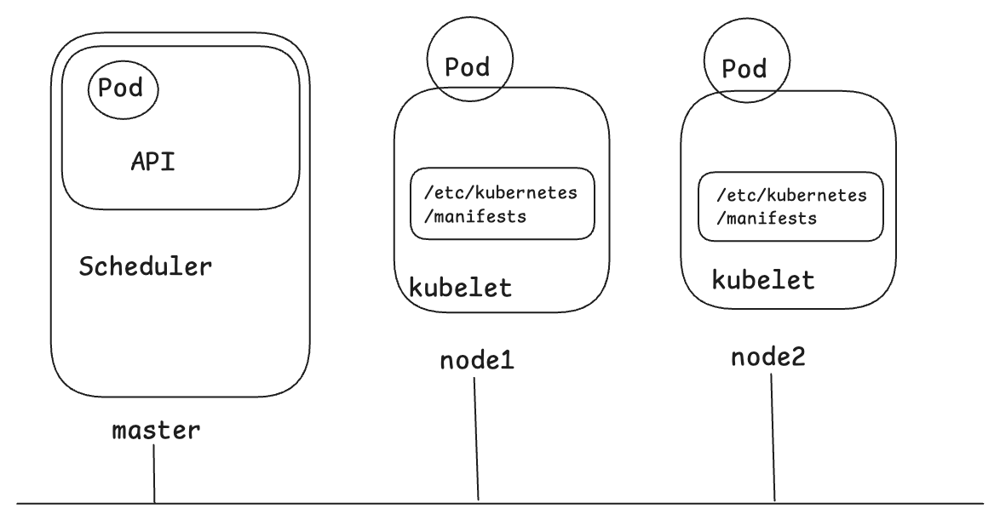

# Pod

# 공식문서

> 도큐먼트는 다 외우고 있을 필요는 없는데, 어디에 어떤 내용이 있고, 어떤 예제는 정말 자주 쓰이는데 이 예제를 어떤 문서에서 자주 가져다 써야지 하는 정도의 관점 정도는 생기는 것이 좋다. 이 외에 어떤 인자값을 정의하거나 할때 도큐먼트를 찾는 것보다 직접 쓰는게 빠르다면 직접써도 된다.<br/>
>
> 시험장에서는 한번의 실수가 엄청난 시간을 잡아먹게 되는 케이스가 생길 수 있는데, 이러면 살떨린다. 이런 경우를 대비해서 가급적이면 공식문서에서 코드를 복사해서 기계적으로 하는 연습도 어느 정도는 필요해보인다.<br/>
>
> 제일 좋은 건 시험에서 빨리 찾을 수 있도록 북마크를 미리해두면 된다는거... 이거슨 진리...!!<br/>
>
> <br/>


Pod<br/>

Pod Basic Template 

- http://kubernetes.io 방문 → `Documentation` 메뉴 클릭 → Concepts \> Workloads \> Pods \> [Pod templates](https://kubernetes.io/docs/concepts/workloads/pods/#pod-templates) 클릭
- http://kubernetes.io 방문 → `Documentation` 메뉴 클릭 → Task \> Inject Data Into Applications \> Define a Command and Arguments for a Container \> [Run  a command in a shell](https://kubernetes.io/docs/tasks/inject-data-application/define-command-argument-container/#run-a-command-in-a-shell) 클릭

<br/>


Static Pod<br/>

[Defining Environment Variables for a Container](https://kubernetes.io/docs/tasks/inject-data-application/define-environment-variable-container/)

- http://kubernetes.io 방문 → `Documentation` 메뉴 클릭 → Tasks \> Inject Data Into Applications \> [Defining Environment Variables for a Container](https://kubernetes.io/docs/tasks/inject-data-application/define-environment-variable-container/) 클릭

[Define a Command and Arguments for a Container](https://kubernetes.io/docs/tasks/inject-data-application/define-command-argument-container/)

- http://kubernetes.io 방문 → `Documentation` 메뉴 클릭 → Tasks \> Inject Data Into Applications \> [Define a Command and Arguments for a Container](https://kubernetes.io/docs/tasks/inject-data-application/define-command-argument-container/) 클릭

[Creating a Pod that runs two Containers](https://kubernetes.io/docs/tasks/access-application-cluster/communicate-containers-same-pod-shared-volume/#creating-a-pod-that-runs-two-containers)

- http://kubernetes.io 방문 → `Documentation` 메뉴 클릭 → Tasks \> Access Applications in a Cluster \> 오른쪽 네비게이션에서 [Creating a Pod that runs two Containers](https://kubernetes.io/docs/tasks/access-application-cluster/communicate-containers-same-pod-shared-volume/#creating-a-pod-that-runs-two-containers) 클릭

[Using a sidecar container with the logging agent](https://kubernetes.io/docs/concepts/cluster-administration/logging/#sidecar-container-with-logging-agent)

- http://kubernetes.io 방문 → `Documentation` 메뉴 클릭 → Concepts \> Cluster Administration \> Logging Architecture \> 오른쪽 네비게이션에서 [Using a sidecar container with the logging agent](https://kubernetes.io/docs/concepts/cluster-administration/logging/#sidecar-container-with-logging-agent) 클릭

<br/>


# Pod

개발자 또는 관리자가 kubectl 을 이용해서 어떤 pod 를 run 또는 apply 하는 명령을 내리면, 해당 이미지와 리소스 명세들은 쿠버네티스 클러스터 내의 API Server 로 전송된다. API Server 는 이 요청을 받으면 Sheduler 의 Scheduling 도움을 받아서 API가 동작시켜준다.<br/>

## Pod 란?

- 컨테이너를 담는 k8s API 의 최소 단위
- Pod 에는 여러개의 컨테이너가 포함되는 것이 가능하다.

예를 들어 nginx 이미지를 Pod 로 동작시키는 yaml 은 다음과 같다.

```yaml
apiVersion: v1
kind: Pod
metadata:
  name: web
spec:
  containers:
  - image: nginx:1.14
    name: web
    ports:
    - containerPort: 80
```

<br/>


## e.g. 파드 yaml 작성, 생성, 실행, 삭제

이렇게 만든 컨테이너는 pod 로 동작시킬 때 다음과 같은 명령어를 통해 생성과 삭제를 할수 있다.

```bash
## nginx 파드 yaml 생성
$ kubectl run web --image=nginx:1.14 --port=80 --dry-run -o yaml > nginx.yaml

## pod yaml 수정
$ vi nginx.yaml

## 클러스터에 반영
$ kubectl apply -f web.yaml

## 조회
$ kubectl get pod -n {네임스페이스}

## 파드 삭제
$ kubectl delete pod -n {네임스페이스} nginx

```

<br/>


## Pod template 작성양식, 여러가지 작성법

> 참고 
>
> - https://kubernetes.io/docs/concepts/workloads/pods/#using-pods 
>
> - https://kubernetes.io/docs/concepts/workloads/pods/#pod-templates<br/>

<br/>


### 직접 작성

Pod yaml 의 기본적인 구조는 다음과 같다.<br/>

일반적으로는 이렇게 yaml 파일을 직접 작성해서 사용하기도 한다.

```yaml
apiVersion: v1
kind: Pod
metadata:
  name: nginx
spec:
  containers:
  - name: nginx
    image: nginx:1.14.2
    ports:
    - containerPort: 80
```

<br/>


### CLI 로 기본 양식 생성 후 수정

하지만, 시험 때는 이렇게 쓰면 시간이 부족해질 가능성이 너무나 크다. 그래서 CLI 로 어느 정도 만들어진 yaml 파일을 만든 후에 필요한 부분만 남기고 지우거나, 필요한 부분만 수정해서 쓰는 방식으로 적용한다.

```bash
$ kubectl run nginx --image=nginx:1.14 --port=80 --dry-run=client -o yaml > nginx.yaml

$ vi nginx.yaml
apiVersion: v1
kind: Pod
metadata:
  name: web
spec:
  containers:
  - image: nginx:1.14
    name: web
    ports:
    - containerPort: 80
```

<br/>


### 실행,조회,삭제

실행은 다음과 같이 한다.

```bash
$ kubectl apply -f nginx.yaml
```

<br/>


조회는 다음과 같이 한다.

```bash
$ kubectl get pods web o -wide
NAME		READY		STATUS		RESTARTS		AGE ..
...
```

<br/>


삭제는 다음과 같이 한다.

```bash
$ kubectl delete -f nginx.yaml
```

<br/>


# e.g. 1

참고자료 : [Run  a command in a shell](https://kubernetes.io/docs/tasks/inject-data-application/define-command-argument-container/#run-a-command-in-a-shell)


> 작업 클러스터 : k8s

cka-exam 이라는 namespace 를 만들고 이 namespace에 다음과 같은 pod 를 생성하세요.

- pod name : pod-01
- image : busybox
- 환경 변수 : CERT = 'CKA-cert'
- command : /bin/sh
- args : -c "while true; do echo $(CERT); sleep 10; done"


```bash
## 현재 컨텍스트를 확인한다.
$ kubectl config current-context
k8s

## k8s 라는 context 로 전환
$ kubectl config use-context k8s
Switched to context "k8s"

## 예제를 위한 namespace 생성
$ kubectl create namespace cka-exam

## pod yaml 생성
$ kubectl run pod-01 --image=busybox --dry-run=client -o yaml > 3-1.yaml

## 3-1.yaml 수정
## 필요한 부분만 남기고 수정할 부분은 수정한다.
$ vi 3-1.yaml
apiVersion: v1
kind: Pod
metadata:
  name: pod-01
spec:
  containers:
  - image: busybox
    name: pod-01
    env:
    - name: CERT
      value: "CKA-cert"
    command: ["/bin/sh"]
    args: ["-c", "while true; do echo $(CERT); sleep 10; done"]

:wq


## pod 를 클러스터에 적용한다.
$ kubectl apply -f 3-1.yaml
pod/pod-01 created
```

<br/>


# e.g. 2

> 작업 클러스터 : hk8s

Pod "custom-app" 의 log 를 모니터링하고 'file not found' 메시지를 포함하는 로그라인을 추츨하세요. 추출된 결과는 /opt/REPORT/2022/custom-app-log 에 기록하세요.<br/>

<br/>


```bash
## 현재 컨텍스트 확인
$ kubectl config current-context
k8s

## hk8s 로 전환
$ kubectl config use-context hk8s
Switched to context "hk8s"

## custom-app 파드 확인
$ kubectl get pods
NAME					READY		...
custom-app
...

## 로그 확인
$ kubectl logs custom-app
...

## 기록
$ kubectl logs custom-app | grep 'file not found' > /opt/REPORT/2022/custom-app-log
...

## 출력
$ cat /opt/REPORT/2022/custom-app-log
error: file not found
error: file not found


```

<br/>


# static Pod

- Static Pod 는 일반적인 Pod 와는 다르게 API 서버 없이 특정 노드에 있는 kubelet 에 의해 직접 관리되는 Pod 를 의미한다.
- 노드 내에 /etc/kubernetes/manifests/ 디렉터리에 pod yaml 파일을 저장할 때 적용된다.
- /etc/kubernetes/manifests/ 디렉터리에 yaml 파일이 존재하고 이 것이 쿠버네티스 리소스 정의일 경우 이 것을 kubelet 은 자기 자신이 위치한 노드 내에 pod 로 기동시킨다.



<br/>


참고로 staticPod 를 읽어들이는 위치는 고정적인 것이 아니다. /var/lib/kubelet/config.yaml 에 staticPod를 읽어들일 디렉터리가 명시되어 있다.

```bash
## kubelet 설정 파일을 연다. kubelet의 설정 파일은 (/var/lib/kubernetes 아래에 있다.)
# cat /var/lib/kubelet/config.yml
...
staticPodPath: /etc/kubernetes/manifests
```

위의 `staticPodPath` 라는 항목에 기재된 경로를 다른 디렉터리 경로로 바꿔준 후 kubelet 데몬을 재실행하면 그 디렉터리 경로 내의 yaml 리소스 정의들을 읽어들여서 실행된다.<br/>

```bash
# vi /var/lib/kubelet/config.yml
...
staticPodPath: /etc/kubernetes/manifests-v1

:wq!

# kubelet 데몬 재실행
$ systemctl restart kubelet
```

<br/>


# multi container Pod

multi container Pod 라는 용어는 사실 존재하지 않는다.<br/>

다만 **하나의 파드에 여러개의 컨테이너를 담아서 실행하는 구조**를 **multi container pod** 라는 이름으로 많이 불려지고 있다.<br/>

multi container pod 를 조금 응용하는 구조로는 사이드 카 컨테이너라는 방식도 많이 알려져 있다.<br/>

파드를 생성하면 컨테이너들이 함께 생성되고, 파드를 종료하면 그 안의 컨테이너들도 모두 함께 종료/삭제 된다.<br/>

<br/>


사용사례

-  파드 내에서 nginx 컨테이너가 만든 로그를 log 추출하는 컨테이너가 추출해서 저장소에 저장을 하는 역할을 하는 파드
- html 문서를 생성한 web generator 컨테이너가 존재하고, web generator 컨테이너가 생성한 html 파일을 외부에 연결해주는 nginx 컨테이너를 함께 두고 있는 파드

<br/>


e.g.

- 참고 : [Creating a Pod that runs two Containers](https://kubernetes.io/docs/tasks/access-application-cluster/communicate-containers-same-pod-shared-volume/#creating-a-pod-that-runs-two-containers)

```yaml
apiVersion: v1
kind: Pod
metadata:
  name: two-containers
spec:

  restartPolicy: Never

  volumes:
  - name: shared-data
    emptyDir: {}

  containers:

  - name: nginx-container # (1)
    image: nginx
    volumeMounts:
    - name: shared-data
      mountPath: /usr/share/nginx/html

  - name: debian-container # (2)
    image: debian
    volumeMounts:
    - name: shared-data
      mountPath: /pod-data
    command: ["/bin/sh"]
    args: ["-c", "echo Hello from the debian container > /pod-data/index.html"]

```

(1) nginx-container

- nginx 이미지를 기반으로 동작하는 컨테이너

(2) debian-container

- debian 이미지를 기반으로 동작하는 컨테이너

<br/>


# sidecar container

파드 내에 컨테이너가 다음과 같이 구성된 경우 (2) 의 컨테이너를 Sidecar Container 라고 부른다.<br/>

(그림 추가 예정)

(1) 메인으로 사용하는 컨테이너

- e.g. nginx

(2) 메인으로 사용하는 컨테이너를 보조하는 역할의 컨테이너

- "메인 컨테이너 옆에 붙어있는 차"와 같은 개념으로 "사이드카" 라고 부른다.

- e.g. 로그스태시와 같은 잘 알려진 log aggregator 를 예로 들 수 있다.

<br/>


사이드카 컨테이너는 메인 컨테이너를 보조해서 메인컨테이너의 상태를 기록하는 등의 작업을 하는 경우가 많은데 이런 경우 보통 volume 을 함께 공유하는 방식으로 동작한다.<br/>

<br/>


# e.g. 1

> 작업 클러스터 : k8s

'cka-exam'이라는 namespace를 만들고 'cka-exam' namespace 에 아래와 같은 Pod 를 생성하세요.

- pod name : pod-01
- image : busybox
- 환경변수 : CERT = "CKA-cert"
- command : /bin/sh
- args : -c "while true; do echo $(CERT); sleep 10; done"

<br/>


```bash
## 현재 컨텍스트 확인
$ kubectl config current-context

## 컨텍스트 선택
$ kubectl config use-context k8s

## 네임스페이스 생성
$ kubectl create namespace cka-exam

## pod-01 이라는 이름의 busybox 이미지를 기반으로 하는 파드의 정의를 3-1.yaml 이라는 이름으로 생성
$ kubectl run pod-01 --image=busybox --dry-run=client -o yaml > 3-1.yaml
$ ls
3-1.yaml

## 편집한다. 필요없는 내용은 모두 삭제한 후 저장한다.
$ vi 3-1.yaml
apiVersion: v1
kind: Pod
metadata:
  name: pod-01
  namespace: cka-exam # 추가해준다
spec:
  containers:
  - image: busybox
    name: pod-01
    env: # env 내에 {name, value} 를 추가해준다. 참고자료 (1)을 참고할 것 
    - name: CERT
      value: "CKA-cert"
    # 아래의 command, args 를 추가해준다. 참고자료 (2)를 참고할 것
    command: ["/bin/sh"]
    args: ["-c", "while true; do echo $(CERT); sleep 10;done"]


## 클러스터에 적용한다.
$ kubectl apply -f 3-1.yaml
pod/pod-01 created


## Pod가 제대로 생성되었는지 확인
$ kubectl get pod -n cka-exam

```

<br/>


# e.g. 2

> 작업 클러스터 : hk8s

Pod "custom-app" 의 log 를 모니터링하고 'file not found' 메시지를 포함하는 로그라인만 추출하세요.<br/>

추출된 결과는 /opt/REPORT/2022/custom-app-log 에 기록하세요.<br/>

<br/>


```bash
## 현재 컨텍스트 확인
$ kubectl config current-context
k8s

## hk8s 로 전환
$ kubectl config use-context hk8s
Switched to context "hk8s".

## pod 상태 확인
$ kubectl get pods
NAME						READY			STATUS			RESTARTS			AGE
...
custom-app			1/1				Running
...

## pod 로그 확인
$ kubectl logs custom-app | grep 'file not found'
error: file not found
error: file not found

## 로그 내용을 파일에 저장
$ kubectl logs custom-app | grep 'file not found' > /opt/REPORT/2022/custom-app-log

## 기록된 파일 내용 확인
$ cat /opt/REPORT/2022/custom-app-log
error: file not found
error: file not found


```

<br/>


# e.g. 3 - static pod 의 동작 확인

hk8s 의 worker 1 에 static pod 를 적용해보자

```bash
## hk8s-w1 접속
$ ssh hk8s-w1

## 새로운 터미널 2번에서 hk8s-w1 에 대해 kubectl get pods 명령을 내릴 수 있도록 준비
## staticPod 를 생성 후에 새로 생성한 터미널 2번에서 pod 들의 상태를 조회할 예정이다.
$ kubectl config use-context hk8s
$ kubectl get pods


## 예전 터미널인 터미널 1번 윈도우로 돌아와서 아래의 명령어들을 수행행
## root 전환
$ sudo -i

## /var/lib/kubelet/config.yml 내에 staticPodPath 확인
# cat /var/lib/kubelet/config.yml
...
staticPodPath: /etc/kubernetes/manifests
...

## staticPodPath 에 진입해서 저장해둔 파일이 있는지 확인
# cd /etc/kubernetes/manifests
# ls

## nginx yaml 등록
## staticPodPath 에 nginx pod 파일을 생성한다.
# kubectl run webserver --image=nginx:1.14 --port=80 --dry-run=client -o yaml > webserver.yaml

## nginx yaml 확인
# cat webserver.yaml
apiVersion: v1
kind: Pod
metadata:
  creationTimestamp: null
  labels:
    run: webserver
  name: webserver
spec:
  containers:
  - image: nginx:1.14
    name: webserver
    ports:
    - containerPort: 80
    resources: {}
  dnsPolicy: ClusterFirst
  restartPolicy: Always
status: {}


## 터미널 2 로 이동한다.
## 파드가 생성되는 중인지 확인한다.
$ kubectl get pods -o wide
NAME									READY					STATUS			...
...
webserver-hk8s-w1			1/1						Running			...


## 이번에는 describe 명령어로 자세한 pod 의 스펙을 확인해본다.
$ kubectl describe pod webserver-hk8s-w1
...


## 이번에는 터미널 1 로 이동해서 방금 만든 webserver.yaml 파일을 삭제해본다.
$ ls
webserver.yaml

$ rm webserver.yaml
...

## 터미널 2 로 이동해서 어떻게 동작하는지 확인해본다.
$ kubectl get pods -o wide
NAME										READY					STATUS			...
...
webserver-hk8s-w1 파드가 삭제되어서 보이지 않게된다.


```

<br/>


# e.g. 4

기출문제<br/>

hk8s-w1 노드에 nginx-static-pod.yaml 이라는 이름의 Static Pod 를 생성하세요.

- pod name : nginx-static-pod
- image : nginx
- port: 80


<br/>


```bash
## hk8s-w1 에 접속한다.
$ ssh hk8s-w1
...

## root 사용자로 로그인
$ sudo -i
# 


## static pod 를 어디에 만들라는 이야기가 문제에 없다.
## 이런 경우에는 kubelet 의 config.yaml 파일을 열어서 staticPodPath 로 명시된 디렉터리를 확인하고
## 그 디렉터리에 만들려는 pod 에 대한 yaml 파일을 생성해두면 된다.
# cat /var/lib/kubelet/config.yaml
...
staticPodPath: /etc/kubernetes/manifests
...


## 위의 과정에서 찾아낸 staticPodPath 인 /etc/kubernetes/manifests 로 이동한다.
# cd /etc/kubernetes/manifests


## nginx 를 --dry-run 으로 생성해본다. 
## 이렇게 --dry-run 을 해보는 이유는 특정 port 가 막혀있거나 특정 리소스가 준비가 안되있거나 하는 예외상황이 있을 경우에 에러를 찾을 수 있기 때문
# kubectl run nginx-static-pod --image=nginx --port=80 --dry-run=client -o yaml


## 파일로 생성한다.
# kubectl run nginx-static-pod --image=nginx --port=80 --dry-run=client -o yaml > nginx-static-pod.yaml


## yaml 파일을 열어서 확인해본다.
# cat nginx-static-pod.yaml

...


## 터미널 2 에서 아래의 내용을 확인
$ kubectl get pods
NAME												READY			STATUS	...
...
nginx-static-pod-hk8s-w1		1/1				Running ...
...

```

<br/>


# e.g. 5

> 작업 클러스터 : k8s

4개의 컨테이너를 동작시키는 eshop-frontend Pod 를 생성하세요.

- pod image : nginx, redis, memcached, consul

<br/>


```bash
## nginx 의 yaml 부터 만들어본다.
$ kubectl run eshop-frontend --image=nginx --port=80 --dry-run=client -o yaml


## 위의 명령어가 정상으로 동작하는 것을 확인했다면 파일로 생성한다.
$ kubectl run eshop-frontend --image=nginx --port=80 --dry-run=client -o yaml > 3-2.yaml


## 3-2.yaml 파일을 열어서 수정작업을 시작한다.
$ vi 3-2.yaml
apiVersion: v1
kind: Pod
metadata:
  name: eshop-frontend
spec:
  containers:
  - image: nginx
    name: nginx-container
  - image: redis
    name: redis-container
  - image: memcached
    name: memcached-container
  - image: consul
    name: consul-container

ESC
:wq!


## 클러스터에 반영
$ kubectl apply -f 3-2.yaml
pod/eshop-frontend created


## 새롭게 생성한 eshop-frontend 를 확인한다. 시간이 조금 지나고 나면 정상적으로 동작중임을 확인할 수 있다.
$ kubectl get pod eshop-frontend
NAME							READY				STATUS			...
eshop-frontend		4/4					Running


```

<br/>


# e.g. 6 (빈출)

> 작업 클러스터 : k8s

현재 운영 중인 eshop-cart-app Pod 의 로그를 kubernetes built-in logging 아키텍처(kubectl logs) 에 통합하는 로그 스트리밍 사이드카 컨테이너를 운영하세요.

- busybox 이미지를 사용하여 price 라는 이름의 사이드카 컨테이너를 eshop-cart-app 에 추가합니다.
- 새 price 컨테이너는 다음과 같은 command 를 실행해야 합니다.
  - command : `/bin/sh, -c "tail -n+1 -f /var/log/cert-app.log"` 
- /var/log 에 마운트 된 볼륨을 사용하여 사이드카 컨테이너에서 로그파일 cart-app.log 를 사용해야 합니다.
- eshop-cart-app Pod 와 cart-app 컨테이너를 수정하지 마세요

<br/>

> 이번 예제에서는 위에서 정리한 참고자료 (4) 의 예제를 참고해서 작성한다.
>
> - [Using a sidecar container with the logging agent](https://kubernetes.io/docs/concepts/cluster-administration/logging/#sidecar-container-with-logging-agent)

```bash
## eshop-cart-app 파드가 존재하는지 확인
$ kubectl get pod

## 동작 중인 eshop-cart-app 파드의 yaml 명세 확인 
$ kubectl get pod eshop-cart-app -o yaml

## 동작 중인 eshop-cart-app 파드의 yaml 명세를 3-3.yaml 파일로 별도 저장
$ kubectl get pod eshop-cart-app -o yaml > 3-3.yaml

## 3-3.yaml 파일에서 필요한 부분만 남기고 나머지는 모두 지워서 아래와 같이 저장한다.
apiVersion: v1
kind: Pod
metadata:
  name: eshop-cart-app
spec:
  containers:
  - command:
    - /bin/sh
    - -c
    - 'i=1; while :; do echo -e "$i: Price: $((RANDOM%10000 + 1))" >> /var/log/cart-app.log; i=$((i+1)); sleep 2; done'
    image: busybox
    name: cart-app
    volumeMounts:
    - mountPath: /var/log
      name: varlog
  - name: price
    image: busybox
    args: [/bin/sh, -c 'tail -n+1 -f /var/log/cart-app.log']
    volumeMounts:
    - name: varlog
      mountPath: /var/log
  volumes:
  - emptyDir: {}
    name: varlog
   

## 3-3.yaml 파일을 적용한다.
$ kubectl apply -f 3-3.yaml
pod/eshop-cart-app created


## 확인
$ kubectl get pods
NAME								READY					STATUS			...
eshop-cart-app			2/2						Running			...
...

## 파드 내의 특정 컨테이너를 지정(-c)해서 kubectl log 수행
$ kubectl logs eshop-cart-app -c price
1: Price: ...
2: Price: ...
...


## 만약 뭔가 문제가 생기면 아래의 명령으로 삭제한다. (이미 생성된 pod 가 있거나 포트 충돌 등 시험장에서는 예기치 않은 이벤트가 발생한다.)
$ kubectl delete pod eshop-cart-app
## 또는 아래와 같이 강제 삭제한다.
$ kubectl delete pod eshop-cart-app --force
## 시험장에서는 가급적 강제 삭제한 후 진행하자.
```


