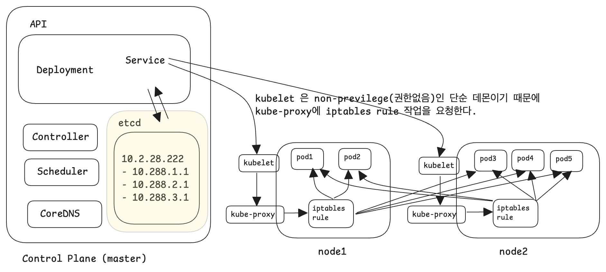
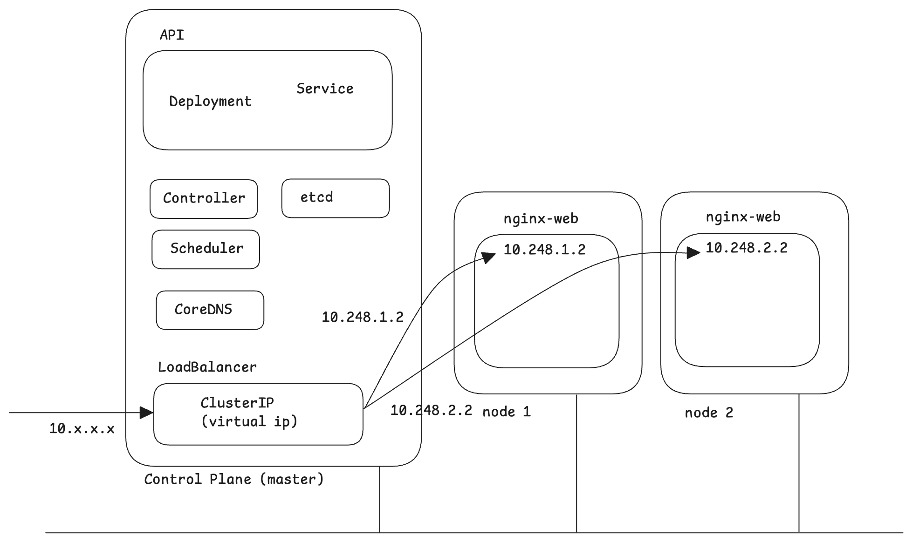
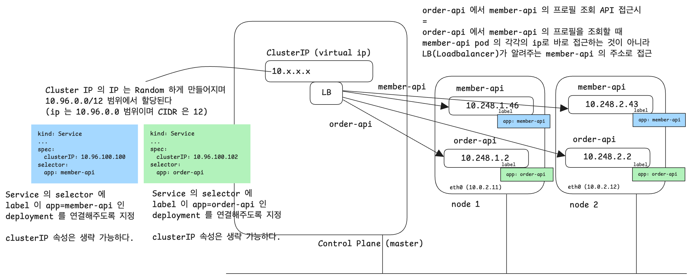

# Service - ClusterIP,NodePort,LoadBalancer

Pod 의 단일 진입 지점은 LoadBalancer 인데 Service 는 LoadBalancer 를 지원해준다.<br/>

Service 에는 다음과 같은 타입들이 있다.

- ClusterIP (default) 
  - selector 의 label 이 같은 Pod를 그룹으로 묶어  단일 진입점(Virtual IP:LB) 생성
  - **Cluster 내부에서 사용하는 IP**
  - ClusterIP 로는 외부에서 특정 노드의 포트로 접근 불가 (노드 포트만 가능)
  - 외부에서 접속을 못하는 것으로 인해 불필요하다고 생각할수도 있겠지만, 그렇지 않다. pod 와 pod 간에 통신할 때 ClusterIP 가 유용하다.
  - Service type 을 생략하면 ClusterIP 타입이 default 로 설정된다.
  - ClusterIP 의 IP 주소는 10.96.0.0 대역, CIDR 은 12 의 범위에서 할당된다. 다시 한번 정리하지만 **Cluster 내부에서 사용하는 IP** 다. 

- NodePort
  - 포트를 기준으로 외부에서 접속할 수 있는 포인트를 제공하는 서비스
  - 이름에서 알 수 있듯이 **'노드 (Node)'** 의 특정 **'포트 (Port)'**를 Service 로 제공하는 것이다.
  - 개별 노드에 외부에서 접속할 수 있는 포트가 제공된다.
  - 포트의 범위는 30000 \~ 32767 이다.

- LoadBalancer
  - 클라우드에서 제공되는 리소스다.
  - Node Port 를 사용하더라도 앞단에 Load Balancer 를 두면 Load Balancer 를 통해서 여러 노드 중 하나를 선택하도록 로드밸런싱이 가능하다.
  - 클라우드 서비스에서는 LoadBalancer 를 자동으로 프로비저닝하는 기능을 지원하고 있다.

<br/>


# 참고 : CNI (Container Network Interface)

CNI 는 ClusterIP 와는 다른 개념이다.<br/>

서로 다른 노드에 배포되어 있는 Pod 간의 네트워크 통신은 CNI (Container Network Interface)를 통해 가능해진다. CNI 를 지원하는 것들로는 칼리코, 플라넬 등이 있다.<br/>


# kubernetes 의 Service

Service 는 kubernetes API 중 일부이다. <br/>



Service 는 etcd 에 저장된 노드들의 정보를 기반으로 통신을 하며 각 노드들에 위치한 kublet 에 iptables rule 작업을 요청한다.<br/>

각 노드에 설치된 kubelet 은 kube-proxy 에 iptables rule 작업을 요청한다.<br/>

<br/>


# virtual IP, Cluster IP

virtual IP 라고 하는 개념이 있는데 virtual IP는 여러 개의 파드 들을 하나의 ip 를 통해서 접근할 수 있도록 하는 개념이다. 쿠버네티스에서는 virtual IP 를 Cluster IP라고 부른다. **"클러스터에서 사용하는 IP"** 라는 의미로 기억하면 조금 더 직관적으로 이해가 된다.<br/>



ClusterIP 의 IP 주소는 10.96.0.0 대역, CIDR 은 12 의 범위에서 할당된다. 다시 한번 정리하지만 **Cluster 내부에서 사용하는 IP** 다. <br/>

<br/>


# ClusterIP 와 LoadBalancer



설명 추가 예정


# ClusterIP, etcd

쿠버네티스에 "ClusterIP 를 만들어서 원하는 특정 여러 파드 들을 하나의 IP로 관리해주세요" 라는 요청을 보내면, etcd 에는 Cluster IP 로 대표되는 virtual IP가 생성되며, virtualIP 를 통해서 접근할 수 있는 내부 ip 들이 etcd 에 저장되게 된다.


**iptables Rule**<br/>

쿠버네티스 이론적으로는 서비스가 Cluster IP를 통해서 외부 요청들에 대해 필요한 내부 파드를 선택해서 연결시키는 것처럼 보인다. 엄청 자세하게 알고 싶은게 아니라면 딱 여기까지만 알면 된다. <br/>

그런데 실질적으로는 (내부적으로는) Cluster IP가 연결시켜주는 안 쪽의 동작에서는 실질적으로는 iptables rule 을 이용해서 Load Balancing 역할을 수행한다.<br/>


# e.g. 1) hello world

deployment

```yaml
apiVersion: apps/v1
kind: Deployment
metadata:
  name: web
spec:
  replica: 3
  selector:
    matchLabels:
      app: web-nginx # 'web-nginx' label 을 지정했다.
  template:
    metadata:
      name: nginx-pod
      labels: # label을 주목
        app: web-nginx # label 을 주목
    spec:
      containers:
      - name: nginx-container
        image: nginx:latest
```

<br/>


service

```yaml
apiVersion: v1
kind: Service
metadata:
  name: web-svc
spec:
  clusterIP: 10.96.100.100 # clusterIP 를 지정했다.
  selector: # label 을 주목
    app: web-nginx # label 을 주목
  ports:
  - protocol: TCP
    port: 80
    targetPort: 80
```

<br/>


deployment 배포

```bash
$ kubectl apply -f deployment.yml
deployment.apps/web created

$ kubectl get pods | grep -i web-nginx
...
3개의 pod 가 기동된 것을 확인 가능

$ kubectl get pods -o wide | grep -i web-nginx
web-aaaaa1	... 	10.248.1.21		...
web-bbbbb1  ...   10.248.2.50		...
web-ccccc1  ...   10.248.1.20   ...
```

<br/>


service 배포

```bash
$ kubectl apply -f services.yml
service/web-svc created

# Cluster IP 가 생성되었는지 확인해보자.
$ kubectl get svc
NAME					TYPE				CLUSTER-IP				PORT(S)
kubernetes 		ClusterIP			10.96.0.1				443/TCP
web-svc				ClusterIP			10.96.100.100		80/TCP
```

<br/>


ClusterIP 가 정상동작하는지 확인

```bash
# 위에서 확인한 web-svc 라는 이름의 ClusterIP 의 CLUSTER-IP 인 10.96.100.100 을 복사해서 curl 로 접속해보자
$ curl 10.96.100.100
<!DOCTYPE html>
<html>
...
<h1> Welcome to nginx! </h1>
...

</html>
```

<br/>


위의 결과는 ClusterIP 인 10.96.100.100 으로 Request 를 보내면 내부에 배포된 Pod 3 개중 1개를 선택해서 요청이 전달되어 위와 같은 결과가 나타나는 것이다. 참고로 ClusterIP 는 Cluster 내에서만 사용 가능한 IP다.

<br/>


# ClusterIP

## 참고) port, targetPort, nodePort

참고

- [nodeport, port, targetport 정리](https://blog.naver.com/freepsw/221910012471)
- [쿠버네티스에서 반드시 알아야할 서비스(Service) 유형](https://seongjin.me/kubernetes-service-types/)
- [쿠버네티스에서의 Port, TargetPort, NodePort](https://kimmj.github.io/kubernetes/port-targetport-nodeport-in-kubernetes/)


nodePort

- 외부에서 접속하기 위해 사용하는 포트(NodePort 단원에서 정리)

port

- Cluster 내부에서 사용하는 Service 객체의 포트
- 서비스 쪽에서 해당 파드를 향해 열려있는 포트

targetPort

- Service 객체로 전달된 요청을 Pod 로 전달할 때 사용하는 포트
- 파드의 애플리케이션에서 열려있는 포트를 의미


## 문제 1) 특정 pod 그룹에 ClusterIP 생성하기

deployment 

- name : web-nginx
- image : nginx
- port : 80
- replicas: 2
- kubectl create deployment web-nginx \-\-image=nginx \-\-port=80 \-\-replicas=2

service

- name: web-nginx
- type: ClusterIP
- port: 80
- kubectl expose deplyment web-nginx type=ClusterIP port=80

<br/>


deployment 생성

```bash
# --dry-run=client 로 실행해서 되는지 먼저 확인한다. (항상 습관들여야 함)
$ kubectl create deployment web-nginx --image=nginx --port=80 --replicas=2 --dry-run=client -o yaml

# 생성
$ kubectl create deployment web-nginx --image=nginx --port=80 --replicas=2
deployment.apps/web created

# 결과를 자세히 확인
$ kubectl get pod -o wide | grep web

# 또는
$ kubectl get pod -o wide
```

<br/>


service 생성

```bash
# --dry-run=client 로 실행해서 되는지 먼저 확인한다. (항상 습관들여야 함)
$ kubectl expose deployment web-nginx --type=ClusterIP --port=80 --target-port=80 --dry-run=client -o yaml
# --port : 클러스터 포트
# --target-port : 컨테이너 포트


# 생성
$ kubectl expose deployment web-nginx --type=ClusterIP --port=80 --target-port=80
service/web-nginx exposed

# 확인
$ kubectl get svc web
NAME				TYPE					CLUSTER-IP			PORT(S) 	...
web-nginx		ClusterIP			10.103.51.82		80/TCP


# worker 노드 접속, web-nginx 서비스에 curl 요청으로 찔러보기
$ ssh k8s-worker2
$ curl 10.103.51.82
<!DOCTYPE html>
<html>
...
<h1>Welcome to nginx!</h1>
</html>

$ exit 

# pod 조회
$ kubectl get pod | grep web-nginx
...


```


## 기출문제 1) 

> 작업 클러스터 : k8s

'devops' 네임스페이스에서 운영중인 eshop-order deployment 의 service 를 만들어주세요

- Service name : eshop-order-svc
- Type : ClusterIP
- Port : 80


### 풀이

항상 문제 보면 메모장에 복사해두는 습관을 두자<br/>

```plain
'devops' 네임스페이스에서 운영중인 eshop-order deployment 의 service 를 만들어주세요

- Service name : eshop-order-svc
- Type : ClusterIP
- Port : 80
```

<br/>


```bash
# deployment 조회
$ kubectl get deployments.apps -n devops
NAME					READY		...
eshop-order		2/2			...

# devops 네임스페이스 내의 pod 들 조회
$ kubectl get pod -n devops -o wide
NAME								READY			STATUS			...			IP
eshop-order-(중략)		1/1				Running			...			10.244.2.46
eshop-order-(중략)		1/1				Running			...			10.244.2.48

# pod 의 상태를 describe 해보기
$ kubectl describe pod --namespace devops eshop-order-(중략)
...
Namespace:		devops
...
Labels:				name=order
...
Containers:
	nginx-container:
		Image:				nginx:1.14
		...
		Port:					<none>
		Host Port:		<none>


# deployment 조회
$ kubectl get deployments.apps -n devops -o wide
NAME							READY			...		CONTAINERS			IMAGES			SELECTOR
eshop-order				2/2				...		nginx-container	nginx:1.14	name=order


# service --dry-run 생성 (dry-run 으로 생성해본다)
# service 명을 지정하지 않을 경우
$ kubectl expose deployment -n devops eshop-order --type=ClusterIP --port=80 --target-port=80 --dry-run=client -o yaml
apiVersion: v1
kind: Service
metadata:
  creationTimestamp: null
  name: eshop-order
  namespace: devops
spec:
  ports:
  - port: 80
    protocol: TCP
    targetPort: 80
  selector:
    name: order
  type: ClusterIP
status:
  loadBalancer: {}

# service --dry-run 생성 (dry-run 으로 생성해본다)
# service 명을 따로 지정할 경우
# 위와 같이 그대로 할수도 있겠지만, 가급적이면 Service 의 이름을 다르게 지정하고 싶다.
# 아래와 같이 Service name 을 따로 지정해서 --dry-run=client 로 expose 명령 확인
$ kubectl expose deployment -n devops eshop-order --type=ClusterIP --port=80 --target-port=80 --name=eshop-order-svc --dry-run=client -o yaml
apiVersion: v1
kind: Service
metadata:
  creationTimestamp: null
  name: eshop-order-svc
  namespace: devops
spec:
  ports:
  - port: 80
    protocol: TCP
    targetPort: 80
  selector:
    name: order
  type: ClusterIP
status:
  loadBalancer: {}

# --dry-run 없이 동작시킨다.
$ kubectl expose deployment -n devops eshop-order --type=ClusterIP --port=80 --target-port=80 --name=eshop-order-svc
service/eshop-order-svc exposed

# describe 로 확인
$ kubectl describe service -n devops eshop-order-svc
Name: eshop-order-svc
Namespace: devops
...

Selector: name=order
Type: ClusterIP
IP Family Policy: SingleStack
IP Families: IPv4
IP: 10.105.173.176
...

Port: <unset> 80/TCP
Endpoints: 10.244.2.47:80, 10.244.2.48:80
...


# ssh 로 worker 노드 중 하나에 접속해본다.
$ ssh k8s-worker1

# ClusterIP 로 curl 요청을 보내서 ClusterIP 가 정상적으로 세팅되었는지 확인해본다.
$ curl 10.105.173.176
```

<br/>


### 답

```bash
$ kubectl get deployment.apps -n devops
$ kubectl expose deployment eshop-order --namespace devops --type=ClusterIP --port=80 --target-port=80 --name=eshop-order-svc --dry-run=client -o yaml
$ kubectl expose deployment eshop-order --namespace devops --type=ClusterIP --port=80 --target-port=80 --name=eshop-order-svc

$ kubectl get svc -n devops eshop-order-svc

$ ssh k8s-worker1

worker1 ~]$ curl 10.xxx.xxx.xxx
worker1 ~]$ exit
```

<br/>


## 기출문제 2)

> 작업 클러스터 : k8s

- 미리 배포한 'front-end' 에 기존의 nginx 컨테이너의 포트 '80/tcp' 를 expose 하는 'http' 라는 이름을 추가합니다. 
- 컨테이너 포트 http 를 expose 하는 'front-end-svc' 라는 새 service 를 만듭니다.
- 또한 준비된 node 의 'NodePort'를 통해 개별 Pods 를 expose 되도록 Service 를 구성합니다.

<br/>


참고 : [북마크 : Service / Service - NodePort - LoadBalancer 외 type 들](https://kubernetes.io/docs/concepts/services-networking/service/#nodeport) 을 열어서 확인해본다.

문서 내에서 [Defining a Service 챕터](https://kubernetes.io/docs/concepts/services-networking/service/#defining-a-service) 를 확인해보면 다음과 같은 yaml 파일이 명시되어 있다.

```yaml
apiVersion: v1
kind: Service
metadata:
  name: my-service
spec:
  selector:
    app.kubernetes.io/name: MyApp
  ports:
    - protocol: TCP
      port: 80 # 클러스터의 port
      targetPort: 9376 # 컨테이너의 port
```

<br/>


[Defining a Service 챕터](https://kubernetes.io/docs/concepts/services-networking/service/#defining-a-service) 문서의 스크롤을 조금 더 내려보면 아래와 같은 예제가 있다.

```yaml
apiVersion: v1
kind: Pod
metadata:
  name: nginx
  labels:
    app.kubernetes.io/name: proxy
spec:
  containers:
  - name: nginx
    image: nginx:stable
    ports:
      - containerPort: 80
        name: http-web-svc

---
apiVersion: v1
kind: Service
metadata:
  name: nginx-service
spec:
  selector:
    app.kubernetes.io/name: proxy
  ports:
  - name: name-of-service-port # (1) 여기를 주목 
    protocol: TCP
    port: 80
    targetPort: http-web-svc
```

(1)

- 문제의 내용은 위 yaml 의 `(1)` 로 표시된 부분처럼 port 에 이름을 붙여서 사용하라는 이야기다.


문제의 내용을 다시 요약해보면 다음과 같다.

- 미리 배포한 'front-end' 에 기존의 nginx 컨테이너의 포트 '80/tcp' 를 expose 하는 'http' 라는 이름을 추가합니다. 
  - 'http' 라는 이름을 갖는 '80/tcp' 포트를 expose 하는 port 매핑을 추가해라
- 컨테이너 포트 http 를 expose 하는 'front-end-svc' 라는 새 service 를 만듭니다.
  - 'http' 라는 이름으로 expose 한 포트 매핑을 expose 하는 'front-end-svc' 서비스를 만들어라 
- 또한 준비된 node 의 'NodePort'를 통해 개별 Pods 를 expose 되도록 Service 를 구성합니다.
  - 

<br/>


### 풀이

```bash
# 'front-end' 라는 이름의 deployment 가 실제로 구동중인지 체크
$ kubectl get deployment.apps
NAME						READY			...
front-end				2/2
nginx						2/2
web							2/2

# 동작중인 front-end deployment 를 yaml 형식으로 확인
$ kubectl get deployments.apps front-end -o yaml
...

# 파일로 저장
$ kubectl get deployments.apps front-end -o yaml > front-end.yaml
...

# vi 로 열어서 편집
$ vi front-end.yaml
# deployment
# vi 로 열어서 확인 후 불필요한 내용을 모두 지운 후 아래와 같이 남겨둔다.
apiVersion: apps/v1
kind: Deployment
metadata:
  name: front-end
spec:
  replicas: 2
  selector:
    matchLabels:
      run: nginx # service 의 selector 에서 찾을때 사용하는 label 이다.
  template:
    metadata:
      labesl:
        run: nginx
    spec:
      containers:
      - image: nginx
        name: http
        ports:
        - containerPort: 80 # 위에서 봤던 공식문서 의 내용을 붙여넣는다.
          name: http # 위에서 봤던 공식문서의 내용을 붙여넣는다.
          					 # 문제에서 원하는 대로 'http' 라는 이름을 붙여줬다.

# 한개의 파일에 여러개의 api yaml 을 추가할 때는 아래와 같이 --- 을 표시 후 그 다음에 yaml 을 추가해주면 된다.
---
apiVersion: v1
kind: Service
metadata:
  name: front-end-svc # front-nd-svc 라는 이름을 붙여줬다.
spec:
  selector:
    run: nginx # selector 내에 run=nginx 라는 label 을 붙여줬다. 
    					 # 위에서 정의한 deployment 에 정의한 label 인 run=nginx 를 selector 로 지정한다.
    # 다른 label 은 모두 지워줬다.
  ports:
  - name: name-of-service-port
    protocol: TCP
    port: 80
    targetPort: http # 위에서 정의한 'http'라는 이름을 붙인 포트매핑을 여기에 추가해줬다.
    					  # 이렇게 포트번호를 명시하지 않고 포트의 이름을 명시하는 것 역시 가능하다.


$ kubectl get pods
...

$ kubectl delete deployments.apps front-end
deployment.apps "front-end" deleted
...

$ kubectl apply -f front-end.yaml
deployment.apps/front-end created
service/front-end-svc created


$ kubectl get pods | grep front
front ...		1/1			Running			13s
front ...		1/1			Running			13s


$ kubectl get svc front-end-svc
NAME							TYPE					CLUSTER-IP		...			PORT(S)		...
front-end-svc			ClusterIP			10.103.45.127					80/TCP
...


# 서비스의 타입을 ClusterIP 에서 NodePort 로 변경
$ kubectl edit svc front-end-svc
kind: Service
metadata:
	...
spec:
	type: NodePort # NodePort 로 변경해줬다.
	
# 변경 내용 확인
$ kubectl get svc front-end-sv
NAME						TYPE					CLUSTER-IP			...			PORT(S)				...
front-end-svc		NodePort			10.103.45.127						80:31919/TCP 	...

# 접속되는지 확인
# ClusterIP 가 아닌 노드에 대한 port 를 열은 NodePort 이므로 마스터 노드에서 NodePort 와 바로 통신이 가능하다. 아래 명령어는 이 부분을 확인하는 명령어다.
$ curl k8s-worker1:31919
<!DOCTYPE html>
<html>

...

<h1>Welcome to nginx!</h1>

...

</html>
```

<br/>


### 답

```bash
$ kubectl get deployments.apps front-end
$ kubectl get deployments.apps front-end -o yaml > front-end.yaml

...

$ vi front-end.yaml

$ kubectl apply -f front-end.yaml
$ kubectl get deployments.apps,svc

$ curl k8s-worker1:3XXXX
```


