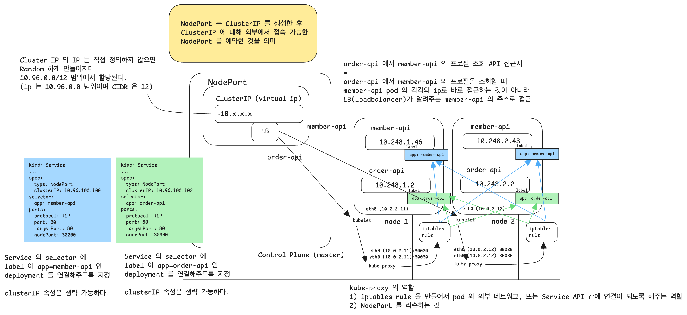

# Service - NodePort

Pod 의 단일 진입 지점은 LoadBalancer 인데 Service 는 LoadBalancer 를 지원해준다.<br/>

Service 에는 다음과 같은 타입들이 있다.

- ClusterIP (default) 
  - selector 의 label 이 같은 Pod를 그룹으로 묶어  단일 진입점(Virtual IP:LB) 생성
  - **Cluster 내부에서 사용하는 IP**
  - ClusterIP 로는 외부에서 특정 노드의 포트로 접근 불가 (노드 포트만 가능)
  - 외부에서 접속을 못하는 것으로 인해 불필요하다고 생각할수도 있겠지만, 그렇지 않다. pod 와 pod 간에 통신할 때 ClusterIP 가 유용하다.
  - Service type 을 생략하면 ClusterIP 타입이 default 로 설정된다.
  - ClusterIP 의 IP 주소는 10.96.0.0 대역, CIDR 은 12 의 범위에서 할당된다. 다시 한번 정리하지만 **Cluster 내부에서 사용하는 IP** 다. 

- NodePort
  - 포트를 기준으로 외부에서 접속할 수 있는 포인트를 제공하는 서비스
  - 이름에서 알 수 있듯이 **'노드 (Node)'** 의 특정 **'포트 (Port)'**를 Service 로 제공하는 것이다.
  - 개별 노드에 외부에서 접속할 수 있는 포트가 제공된다.
  - 포트의 범위는 30000 \~ 32767 이다.

- LoadBalancer
  - 클라우드에서 제공되는 리소스다.
  - Node Port 를 사용하더라도 앞단에 Load Balancer 를 두면 Load Balancer 를 통해서 여러 노드 중 하나를 선택하도록 로드밸런싱이 가능하다.
  - 클라우드 서비스에서는 LoadBalancer 를 자동으로 프로비저닝하는 기능을 지원하고 있다.

<br/>


# 참고) port, targetPort, nodePort

nodePort

- 외부에서 접속하기 위해 사용하는 포트(NodePort 단원에서 정리)

port

- Cluster 내부에서 사용하는 Service 객체의 포트
- 서비스 쪽에서 해당 파드를 향해 열려있는 포트

targetPort

- Service 객체로 전달된 요청을 Pod 로 전달할 때 사용하는 포트
- 파드의 애플리케이션에서 열려있는 포트를 의미

<br/>


# NodePort 란?



- 포트를 기준으로 외부에서 접속할 수 있는 포인트를 제공하는 서비스
- 이름에서 알 수 있듯이 **'노드 (Node)'** 의 특정 **'포트 (Port)'**를 Service 로 제공하는 것이다.
- 개별 노드에 외부에서 접속할 수 있는 포트가 제공된다.
- 포트의 범위는 30000 \~ 32767 이다.
- 포트번호를 지정하지 않으면 30000 \~ 32767 사이에서 랜덤으로 지정된다.

<br/>


# 기출문제 1)

> 작업 클러스터 : k8s

- 'front-end' deployment 의 nginx 컨테이너를 expose 하는 'front-end-nodesvc' 라는 새 service 를 만듭니다.
- 'front-end'로 동작 중인 Pod 에는 node 의 30200 포트로 접속되어야 합니다.
- 구성테스트 curl k8s-worker1:30200 연결시 nginx 페이지가 표시되어야 합니다.


풀이

```bash
# 'k8s' 클러스터로 전환
$ kubectl config use-context k8s
Switched to context "k8s".
...


# 'k8s' 클러스터 내 노드들 조회
$ kubectl get nodes
NAME					STATUS		ROLES				...
k8s-master		Ready			control-plane, master
k8s-worker1		Ready			<none>
k8s-worker2		Ready			<none>
...


# deployment 'front-end' 조회
$ kubectl get deployments.apps front-end
NAME					READY			UP-TO-DATE			AVAILABLE		...
front-end			2/2				2								2 				...
...


# front-end deployment 내의 pod 들 조회
$ kubectl get pods | grep -i front-end


# pod 들을 하나로 묶어서 NodePort로 정의하려면 이 pod 들이 어떤 label 로 선언되어있는지 확인해야 한다.
# 만약 label 로 pod 들을 정의해둔게 아니라면 직접 label 을 지정해서 pod 들을 묶어준다.
# 그리고 이 label 을 NodePort 정의 시에 사용한다.
$ kubectl describe pod front-end-xxxxx-xx | grep -i -e port -e labels

$ kubectl describe deployments.apps front-end | grep -i -e port -e labels
포트가 비어있다.
Labels:
  Labels: run=nginx
    Port: <none>
    Host Port: <none>
    
# dryrun 기반 생성
 $ kubect expose deployment front-end --name front-end-nodesvc --port=80 --target.port=80 --type NodePort --dry-run=client -o yaml

 
# 파일로 저장 및 수정
$ kubect expose deployment front-end --name front-end-nodesvc --port=80 --target.port=80 --type NodePort --dry-run=client -o yaml > front-end-nodesvc.yaml


생성된 코드는 아래와 같다. 그리고 아래 주석으로 된 부분을 추가해줬다.
apiVersion: v1
kind: Service
metadata:
  creationTimestamp: null
  name: front-end-nodesvc
spec:
  ports:
  - port: 80
    protocol: TCP
    targetPort: 80
    nodePort: 30200 # nodePort: 30200 을 추가
  selector:
    run: nginx
  type: NodePort
status:
  loadBalancer: {}
  
nodePort: 30200 을 추가하지 않으면 nodePort 에 랜덤한 포트가 지정된다.  

# 적용
$ kubectl apply -f front-end-nodesvc.yaml 
service/front-end-nodesvc created

...

# nodeport 추가 되었는지 확인
$ kubectl get svc
...
front-end-nodesvc ...

# 재미없지만 ClusterIP 의 동작을 먼저 직접 확인
$ ssh k8s-worker1 # k8s-worker1 로 접속

위에서 kubectl get svc 로 확인한 목록에서 ip address 를 복사해서 curl 요청시 실제로 잘 되는지 확인
(curl 검증)
$ curl 10.99.155.255
...
<h1> Welcome to Nginx </h1>
...

ClusterIP가 정상적으로 동작되는 것을 확인했다면 워커노드 ssh 세션 종료
$ exit

# 외부(kubectl 클라이언트 환경)에서 노드Port 를 통해 노드 하나로 접속 (kubectl get svc 로 얻었던 ip 로 접속)
# 노드의 ip 주소가 아닌 Service ip 주소:포트번호 로 접속이 된다는 것을 확인하는 것으로 정상적인 설치가 되었음을 확인한다
$ curl {Service ip주소}:30200
...
<h1> Welcome to Nginx </h1>
...


```

<br/>


# 만약 여러 포트를 열어야 하는 경우

만약 포트를 여러개 구성한다면 아래와 같이 작성한다. (443 포트 추가)

```yaml
apiVersion: v1
kind: Service
metadata:
  creationTimestamp: null
  name: front-end-nodesvc
spec:
  ports:
  - port: 80
    protocol: TCP
    targetPort: 80
    nodePort: 30200 # nodePort: 30200 을 추가
  - port: 443
    protocol: TCP
    targetPort: 443
    nodePort: 30300 # nodePort: 30300 을 추가
  selector:
    run: nginx
  type: NodePort
status:
  loadBalancer: {}
```

<br/>