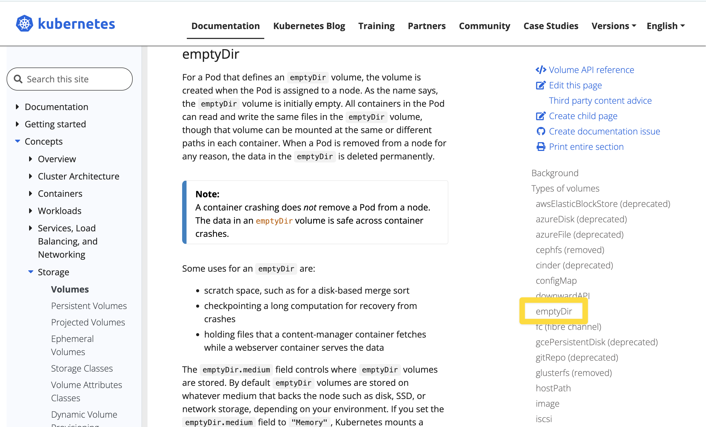
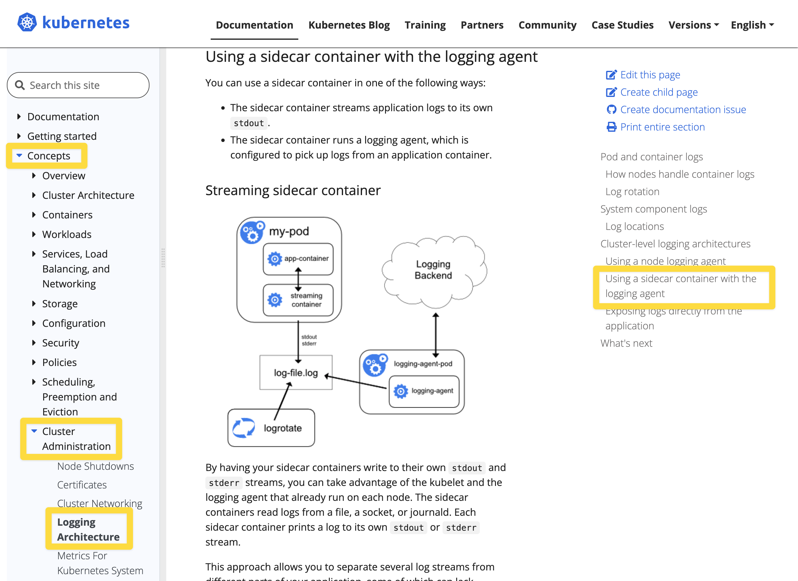

# Volume Mount - emptyDir

# 쿠버네티스의 Storage

- - volume mount
  
    - pod 내에 spec 에 지정해서 마운트를 하는 개념
    - 볼륨 마운트 시 'Read Only, (RO)' 로 명시하지 않으면 기본 설정은 'Read/Write' 이다.
    - emptyDir
      - 파드 내에서의 볼륨
      - 파드 내에 컨테이너가 여러개일 때 이 컨테이너들이 파드 내에서만 볼륨을 공유하려 할 경우 emptyDir 을 사용
      - 즉, 동일한 파드 안에서 실행되는 컨테이너 간 파일을 공유할때 간단하게 사용하기에 좋은 방식
      - 파드가 삭제되면 파드 내에 정의한 볼륨은 삭제된다. 
      - 일반적으로 멀티 컨테이너 파드 또는 사이드 카 구조로 작성된 파드 내에서 emptyDir 을 사용하게 되는 경우가 많다.
    - hostPath
      - hostPath 만 만들어보라는 문제는 없다. 다만 PV, PVC 선언시 hostPath 를 이용해서 만들어보라는 문제가 자주 출제
      - 로컬호스트에 있는 디렉터리를 파드 들이 연결해주는 볼륨
      - 호스트OS 내에서 특정 Path를 공유하는 것을 의미
      - 즉, 노드(=호스트OS가 설치된 vm 또는 머신)의 특정 물리적인 디렉터리를 볼륨으로 선언
      - 노드 내에서만 공유가 가능하다.
      - `type` 셀렉터 : DirectoryOrCreate, Directory, FileOrCreate, File
        - `type` 필드는 필수 옵션은 아니다.
        - DireactoryOrCreate : 주어진 경로에 아무것도 없을때 빈 디렉터리를 생성 (kubelet 의 소유권,권한을 0755로)
        - Directory : 주어진 경로에 디렉터리가 있어야 한다.
        - FileOrCreate : 주어진 경로에 아무것도 없으면 설정한 file 을 생성(kubelet 의 소유권,권한을 0755로)
        - File : 주어진 경로에 파일이 있어야 한다.
      - 일반적으로 로그 수집 에이전트 들이 대부분 hostPath 를 사용한다. (각각의 노드 내에 특정 파일에 로그를 쌓아두고 주기적으로 로그 저장소에 저장하는 원리)
  
    Storage Class
  
    - 여러 종류의 스토리지들의 종류들을 StorageClass 라는 이름으로 규격화해서 종류(class)를 정해둔것
  
    Volume
  
    - Kuberenetes API 로 지원해주는 개념 
    - emptyDir, hostPath 는 pod 의 spec 에 지정하지만, PV는 kubernetes 의 API 로 제공해주는 개념이다.
    - **PV : Persistent Volume**
      - iscsi, nfs, configMap, cinder, awsElasticBlockStore 등과 같은 여러가지 디스크 리소스가 있을 때 이 것을 PV 로 등록해두는 개념
      - '미리 준비가 완료된 적절한 볼륨' 과 같은 개념
      - PVC 로 볼륨 요청을 하면 kubernetes 클러스터는 PV 중 용량, 세부스펙 등이 일치하는 적절한 PV 를 선택해서 할당해준다.
      - 온프레미스 환경에서의 kubernetes 라면 관리자가 미리 디스크를 주문하고 발주해서 미리 준비해두고 PV로 등록해야 한다.
      - 퍼블릭 클라우드에서는 디스크를 미리 준비해두고 PV로 등록하지 않아도 요청을 해서 클라우드에서 할당을 받기 때문에 관리자가 디스크를 주문하고 발주해오는 등의 작업이 필요없다.
      - PV 의 Reclaim 정책은 아래와 같은 것들이 있다.
        - Retain : 할당됐던 PVC가 제거될 때 해당 Volume을 '보존(Retain)하겠다' 는 정책
        - Delete : 할당됐던 PVC가 제거될 때 PV 도 함께 제거하겠다.
        - Recycle : 할당됐던 PVC가 제거될 때 해당 Volume을 '재활용(Recycle)'하겠다는 정책. 모두 지워두고 언제든지 PVC로 요청시 새로 할당받게끔 하겠다는 정책
    - **PVC : Persistent Volume Claim** 
      - 클러스터에 PV 를 요청(Claim)하는 주문서 같은 개념
      - 요청한 PV가 승인되면 PV를 파드와 마운트 해준다.
      - [Volumes - PersistemtVolumes/Access Mode](https://kubernetes.io/docs/concepts/storage/persistent-volumes/#access-modes) 
        - ReadWriteOnce (RWO) : 한 번에 하나의 노드만 볼륨을 Read/Write 가능하도록 마운트
        - ReadOnlyMany (ROX) : 여러 개의 노드가 Read 전용으로 사용하도록 마운트
        - ReadWriteMany (RWX) : 여러 개의 노드가 Read/Write 가능하도록 마운트

<br/>


# emptyDir 형식

```yaml
apiVersion: v1
kind: Pod
metadata:
  name: cowsay-and-nginx
spec:
  containers:
  - image: smlinux/cowsay-web
    name: web-generator
    volumeMounts:
    - name: html
      mountPath: /webdata
  - image: nginx:1.14
    name: web-nginx
    volumeMounts:
    - name: html
      mountPath: /usr/share/nginx/html
      readOnly: true
    ports:
    - containerPort: 80
  volumes:
  - name: html
    emptyDir: {}
```


<br/>


# 공식문서

공식문서들을 주제 별로 북마크로도 저장해두긴 했는데, 혹시 모르니 아예 처음부터 찾아가는 방법을 익혀두자.<br/>

- [Volumes](https://kubernetes.io/docs/concepts/storage/volumes/)
- [Volumes/Volumes - emptyDir](https://kubernetes.io/docs/concepts/storage/volumes/#emptydir)
- [Cluster Administration/Logging Architecture - Using a sidecar container with the logging agent](https://kubernetes.io/docs/concepts/cluster-administration/logging/#sidecar-container-with-logging-agent)

<br/>


## volumes

- [Volumes](https://kubernetes.io/docs/concepts/storage/volumes/)

공식문서는 아래와 같이 찾아가면 된다.


주요 내용

> To use a volume, specify the volumes to provide for the Pod in `.spec.volumes` and declare where to mount those volumes into containers in `.spec.containers[*].volumeMounts`. 

볼륨을 사용하려면 `.spec.volumes` 를 정의하고 이 볼륨들을 컨테이너 안에서 어디에 마운트할 지는 `.spec.containers[*].volumeMounts` 에 정의한다.<br/>


## volumes/volumes - emptyDir

[Volumes/Volumes - emptyDir](https://kubernetes.io/docs/concepts/storage/volumes/#emptydir)<br/>



<br/>


## Cluster Administration/Logging Architecture - Sidecar 개념

[Cluster Administration/Logging Architecture - Using a sidecar container with the logging agent](https://kubernetes.io/docs/concepts/cluster-administration/logging/#sidecar-container-with-logging-agent)<br/>



<br/>


# 참고 : RWO, ROX, RWX

- ReadWriteOnce (RWO) : 한번에 하나의 노드만 볼륨을 Read/Write 가능하도록 마운트
- ReadOnlyMany (ROX) : 여러 개의 노드가 Read 전용으로 사용하도록 마운트
- ReadWriteMany (RWX) : 여러 개의 노드가 Read/Write 가능하도록 마운트

<br/>


# Volume Mounts

참고 : [Kubernetes Persistent Volume 생성하기 - PV, PVC](https://waspro.tistory.com/580)

- spec.capacity.storage : 스토리지 용량을 지정
- spec.accessModes :
  - AccessMode 는 Volume 에 대한 Read/Write 권한을 제공하는 옵션

<br/>


# e.g. 1

> 작업 클러스터 : k8s

다음 조건에 맞춰서 nginx 웹 서버 파드가 생성한 로그 파일을 받아서 stdout 으로 출력하는 busybox 를 운영하세요. 

- pod 이름 : weblog
- 컨테이너 1 : 'web' container
  - image : nginx:1:17
  - volume mount : /var/log/nginx
  - readwrite
- 컨테이너 2 : 'log' container
  - image : busybox
  - command : /bin/bash -c "tail -n+1 -f /ata/access.log"
  - volume mount : /data
  - readonly

<br/>


emptyDir 을 구성하는 경우는 보통 sidecar 또는 컨테이너를 여러개 가지는 Pod 구조일 경우가 많다.

```bash
# k8s 로 전환
$ kubectl config use-context k8s


# kubectl run 으로 nginx 이미지를 --dry-run=client 로 돌렸을 때의 yaml
$ kubectl run weblog --image=nginx:1.25 --dry-run=client -o yaml


# --dry-run 할때의 출력결과를 보고 어떻게 할지 감을 잡은 후 다음과 같이 파일로 저장
$ kubectl run weblog --image=nginx:1.25 --dry-run=client -o yaml > weblog.yaml


# 파일을 열고 수정한다.
$ vi weblog.yaml
# 다 지우고 아래의 내용만 남겼다.
# 공식문서 링크 - storage/volumes#emptyDir (직접 찾을 수 있어야 함) : https://kubernetes.io/docs/concepts/storage/volumes/#emptydir
# containers[i].volumeMounts, spec.volumes 의 내용을 위의 공식문서 링크에서 복사해서 붙여넣는다.
apiVersion: v1
kind: Pod
metadata:
  name: weblog
spec:
  containers:
  - image: nginx:1.25
    name: web
    volumeMounts:
    - mountPath: /var/log/nginx # 컨테이너 내에서 마운트할 경로
      name: log-volume # spec.volumes[i] 에 정의한 볼륨
  - image: busybox
    name: log
    args: [/bin/sh, -c, 'tail -n+1 -F /data/access.log'] # 공식문서 예제에서 복사 후 /data/access.log 파일을 가리키도록 수정해줬다.
    volumeMounts:
    - mountPath: /data
      name: log-volume
      readOnly: true
  volumes:
  - name: log-volume # spec.volumes[i] 에 정의한 볼륨
    emptyDir:
      sizeLimit: 500Mi 

# spec.emptyDir 은 아래와 같이 지정하는 경우도 있다.
spec:
  ...
  volumes:
  - ...
    emptyDir: {}


# 사이드 카 개념 (참고) : https://kubernetes.io/docs/concepts/cluster-administration/logging/#sidecar-container-with-logging-agent
busybox 컨테이너 내에 위의 문서에서 여러 예제가 있는데 이 중 log, count 컨테이너를 여러개 합쳐 놓고 있는 부분을 가져와서 args 항목을 복사해서 붙여넣어준다.(로깅을 위해)


# 클러스터에 배포한다.
$ kubectl apply -f weblog.yaml
pod/weblog created


# 확인
$ kubectl get pods
...


# 볼륨 마운트가 잘 되었는지 확인하기 위해 describe
$ kubectl describe pod weblog
...


# 로그가 잘 찍히고 있는지 확인하기 위해 kubectl logs 를 통해 확인
# -c 옵션 : 컨테이너를 지정
# weblog 파드 내의 'log' 컨테이너의 로그를 확인
$ kubectl logs weblog -c log
...
(실습환경에서는 외부에서 요청으로 인해 접속할때 생기는 엑세스 로그,에러 로그가 없기 때문에 아무 메시지도 나타나지 않는다.)


# 파드의 ip 주소 확인을 위해 kubectl get pods -o wide 명령 수행
$ kubectl get pods -o wide
...		IP 					...
			10.244.1.20 (IP 주소를 복사해둔다.)


# ssh 를 통해 k8s-worker1 로 접속
$ ssh k8s-worker1

# curl 을 통해 weblog pod 에 요청을 보내본다.
$ curl 10.244.1.20
...
<h1/> Welcome to nginx! </h1>
...


# exit
# k8s-worker1 에서 나온 후 kubectl 클라이언트 환경에서 로그를 확인하기 위해 exit
$ exit


# weblog 파드 내의 'log' 컨테이너의 로그를 확인
# 로그가 잘 나타난다.
10.244.1.2 ... GET HTTP/1.1 ...


```


