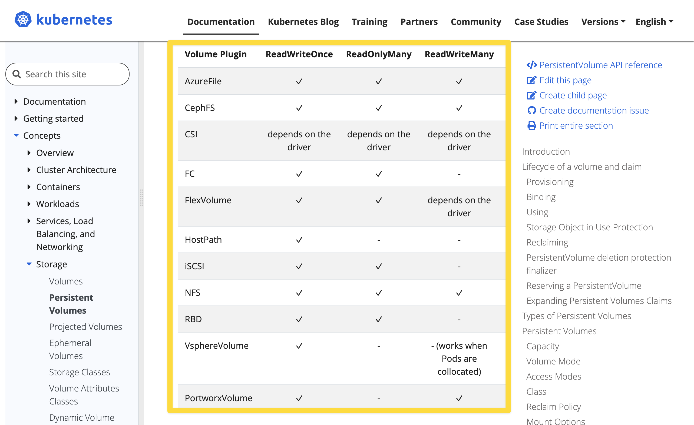

# PV(PersistentVolume),PVC(PersistentVolumeClaim)

# 쿠버네티스의 Storage

volume mount

- pod 내에 spec 에 지정해서 마운트를 하는 개념
- 볼륨 마운트 시 'Read Only, (RO)' 로 명시하지 않으면 기본 설정은 'Read/Write' 이다.
- emptyDir
  - 파드 내에서의 볼륨
  - 파드 내에 컨테이너가 여러개일 때 이 컨테이너들이 파드 내에서만 볼륨을 공유하려 할 경우 emptyDir 을 사용
  - 즉, 동일한 파드 안에서 실행되는 컨테이너 간 파일을 공유할때 간단하게 사용하기에 좋은 방식
  - 파드가 삭제되면 파드 내에 정의한 볼륨은 삭제된다. 
  - 일반적으로 멀티 컨테이너 파드 또는 사이드 카 구조로 작성된 파드 내에서 emptyDir 을 사용하게 되는 경우가 많다.
- hostPath
  - hostPath 만 만들어보라는 문제는 없다. 다만 PV, PVC 선언시 hostPath 를 이용해서 만들어보라는 문제가 자주 출제
  - 로컬호스트에 있는 디렉터리를 파드 들이 연결해주는 볼륨
  - 호스트OS 내에서 특정 Path를 공유하는 것을 의미
  - 즉, 노드(=호스트OS가 설치된 vm 또는 머신)의 특정 물리적인 디렉터리를 볼륨으로 선언
  - 노드 내에서만 공유가 가능하다.
  - `type` 셀렉터 : DirectoryOrCreate, Directory, FileOrCreate, File
    - `type` 필드는 필수 옵션은 아니다.
    - DireactoryOrCreate : 주어진 경로에 아무것도 없을때 빈 디렉터리를 생성 (kubelet 의 소유권,권한을 0755로)
    - Directory : 주어진 경로에 디렉터리가 있어야 한다.
    - FileOrCreate : 주어진 경로에 아무것도 없으면 설정한 file 을 생성(kubelet 의 소유권,권한을 0755로)
    - File : 주어진 경로에 파일이 있어야 한다.
  - 일반적으로 로그 수집 에이전트 들이 대부분 hostPath 를 사용한다. (각각의 노드 내에 특정 파일에 로그를 쌓아두고 주기적으로 로그 저장소에 저장하는 원리)

Storage Class

- 여러 종류의 스토리지들의 종류들을 StorageClass 라는 이름으로 규격화해서 종류(class)를 정해둔것

Volume

- Kuberenetes API 로 지원해주는 개념 
- emptyDir, hostPath 는 pod 의 spec 에 지정하지만, PV는 kubernetes 의 API 로 제공해주는 개념이다.
- **PV : Persistent Volume**
  - iscsi, nfs, configMap, cinder, awsElasticBlockStore 등과 같은 여러가지 디스크 리소스가 있을 때 이 것을 PV 로 등록해두는 개념
  - '미리 준비가 완료된 적절한 볼륨' 과 같은 개념
  - PVC 로 볼륨 요청을 하면 kubernetes 클러스터는 PV 중 용량, 세부스펙 등이 일치하는 적절한 PV 를 선택해서 할당해준다.
  - 온프레미스 환경에서의 kubernetes 라면 관리자가 미리 디스크를 주문하고 발주해서 미리 준비해두고 PV로 등록해야 한다.
  - 퍼블릭 클라우드에서는 디스크를 미리 준비해두고 PV로 등록하지 않아도 요청을 해서 클라우드에서 할당을 받기 때문에 관리자가 디스크를 주문하고 발주해오는 등의 작업이 필요없다.
  - PV 의 Reclaim 정책은 아래와 같은 것들이 있다.
    - Retain : 할당됐던 PVC가 제거될 때 해당 Volume을 '보존(Retain)하겠다' 는 정책
    - Delete : 할당됐던 PVC가 제거될 때 PV 도 함께 제거하겠다.
    - Recycle : 할당됐던 PVC가 제거될 때 해당 Volume을 '재활용(Recycle)'하겠다는 정책. 모두 지워두고 언제든지 PVC로 요청시 새로 할당받게끔 하겠다는 정책
- **PVC : Persistent Volume Claim** 
  - 클러스터에 PV 를 요청(Claim)하는 주문서 같은 개념
  - 요청한 PV가 승인되면 PV를 파드와 마운트 해준다.
  - [Volumes - PersistemtVolumes/Access Mode](https://kubernetes.io/docs/concepts/storage/persistent-volumes/#access-modes) 
    - ReadWriteOnce (RWO) : 한 번에 하나의 노드만 볼륨을 Read/Write 가능하도록 마운트
    - ReadOnlyMany (ROX) : 여러 개의 노드가 Read 전용으로 사용하도록 마운트
    - ReadWriteMany (RWX) : 여러 개의 노드가 Read/Write 가능하도록 마운트

<br/>


# PV 형식

```yaml
apiVersion: v1
kind: PersistentVolume
metadata:
  name: pvname
spec:
  capacity:
    storage: <storage_size>
  accessModes:
  - ReadWriteOnce
  - ReadOnlyMany
  persistentVolumeReclaimPolicy: Retain
nfs:
  server: <NFS Server>
  path: <Share Storage>
```

<br/>


# PVC 형식

```yaml
apiVersion: v1
kind: PersistentVolumeClaim
metadata:
  name: mongodb-pvc
spec:
  resources:
    requests:
      storage: 100G
  accessModes:
  - ReadWriteOnce
  storageClassName: iscsi
```

<br/>


# 공식문서

공식문서들을 주제 별로 북마크로도 저장해두긴 했는데, 혹시 모르니 아예 처음부터 찾아가는 방법을 익혀두자.<br/>

- [Volumes](https://kubernetes.io/docs/concepts/storage/volumes/)
- [Volumes - Persistent Volumes](https://kubernetes.io/docs/concepts/storage/persistent-volumes/)
  - PV 의 공식 문서는 Storage/PersistentVolumes 에서 다루고 있다.
  - [Volumes - Lifecycle of a volume and claim](https://kubernetes.io/docs/concepts/storage/persistent-volumes/)
  - [Volumes - PersistentVolumes/Reclaiming](https://kubernetes.io/docs/concepts/storage/persistent-volumes/#reclaiming)
  - [Volumes - PersistemtVolumes/Access Mode](https://kubernetes.io/docs/concepts/storage/persistent-volumes/#access-modes)
  - [Volumes - awsElasticBlockStore](https://kubernetes.io/docs/concepts/storage/volumes/#awselasticblockstore)

- [Volumes - PersistentVolumes/Persistent Volume Claim](https://kubernetes.io/docs/concepts/storage/persistent-volumes/#persistentvolumeclaims)
  - PVC 의 공식문서는 Storage/PersistentVolumes 내에서 다루고 있다.


<br/>


## volumes

- [Volumes](https://kubernetes.io/docs/concepts/storage/volumes/)

공식문서는 아래와 같이 찾아가면 된다. 지겨울 정도로 자주 들어가서 확인하다 보면 아래 내용을 안봐도 될 정도로 탁탁 찾아가게 됨 ㅋ


주요 내용

> To use a volume, specify the volumes to provide for the Pod in `.spec.volumes` and declare where to mount those volumes into containers in `.spec.containers[*].volumeMounts`. 

볼륨을 사용하려면 `.spec.volumes` 를 정의하고 이 볼륨들을 컨테이너 안에서 어디에 마운트할 지는 `.spec.containers[*].volumeMounts` 에 정의한다.<br/>


# 참고 : RWO, ROX, RWX

참고 : [Volumes - PersistemtVolumes/Access Mode](https://kubernetes.io/docs/concepts/storage/persistent-volumes/#access-modes)<br/>

- ReadWriteOnce (RWO) : 한 번에 하나의 노드만 볼륨을 Read/Write 가능하도록 마운트
- ReadOnlyMany (ROX) : 여러 개의 노드가 Read 전용으로 사용하도록 마운트
- ReadWriteMany (RWX) : 여러 개의 노드가 Read/Write 가능하도록 마운트

<br/>

k8s 에서 지원하는 볼륨의 종류에 따라 지원되는 엑세스 모드들이 있는데 이것에 대해서는 위 참고 문서의 링크에 방문해서 스크롤을 조금 내려보면 확인 가능하다. 만약 실무에서 필요할 때는 위의 링크를 꼭 참고하자.




# 참고 : persistentVolumeReclaimPolicy

참고 : [Volumes - PersistentVolumes/Reclaiming](https://kubernetes.io/docs/concepts/storage/persistent-volumes/#reclaiming)<br/>

PV 의 Reclaim 정책은 아래와 같은 것들이 있다.

- Retain : 할당됐던 PVC가 제거될 때 해당 Volume을 '보존(Retain)하겠다' 는 정책
- Delete : 할당됐던 PVC가 제거될 때 PV 도 함께 제거하겠다.
- Recycle : 할당됐던 PVC가 제거될 때 해당 Volume을 '재활용(Recycle)'하겠다는 정책. 모두 지워두고 언제든지 PVC로 요청시 새로 할당받게끔 하겠다는 정책

<br/>


# 참고 : awsElasticBlockStore (deprecated)

- 문서 링크 : [Volumes - awsElasticBlockStore](https://kubernetes.io/docs/concepts/storage/volumes/#awselasticblockstore)

awsElasticBlockStore 는 deprecated 되었고, 이 기능은 [CSI](https://kubernetes.io/docs/concepts/storage/volumes/#csi) driver 방식으로 지원되는 `ebs.csi.aws.com` 기능으로 대체되었다. `ebs.csi.aws.com` 은  [AWS EBS](https://github.com/kubernetes-sigs/aws-ebs-csi-driver) 라는 써드 파티 라이브러리를 통해 사용가능하며 Kubernetes 에서 권고하는 라이브러리다.<br/>

> In Kubernetes 1.31, all operations for the in-tree `awsElasticBlockStore` type are redirected to the `ebs.csi.aws.com` [CSI](https://kubernetes.io/docs/concepts/storage/volumes/#csi) driver.<br/>
>
> The AWSElasticBlockStore in-tree storage driver was deprecated in the Kubernetes v1.19 release and then removed entirely in the v1.27 release.<br/>
>
> The Kubernetes project suggests that you use the [AWS EBS](https://github.com/kubernetes-sigs/aws-ebs-csi-driver) third party storage driver instead.<br/>

<br/>


공식문서 말고 참고했던 참고자료

- [PVC 를 마음대로 떼었다 붙이는 AWS EBS](https://kingofbackend.tistory.com/247)

<br/>


# 참고 : Volume Mounts

참고 : [Kubernetes Persistent Volume 생성하기 - PV, PVC](https://waspro.tistory.com/580)

- spec.capacity.storage : 스토리지 용량을 지정
- spec.accessModes :
  - AccessMode 는 Volume 에 대한 Read/Write 권한을 제공하는 옵션

<br/>


# e.g. 1 - pv

> 작업 클러스터 : hk8s

- `pv001` 이라는 이름으로 size 1Gi, access mode ReadWriteMany 를 사용해 persistent volume 을 생성하세요.
- volume type 은 hostPah 이며, `/tmp/app-config` 입니다.


```bash
# hk8s 로 전환
$ kubectl config use-context hk8s

# vi 를 열어서 pv001.yaml 파일을 작성
$ vi pv001.yaml
apiVersion: v1
kind: PersistentVolume
metadata:
  name: pv001
spec:
  capacity:
    storage: 1Gi
  accessModes:
    - ReadWriteMany
  hostPath:
    path: /tmp/app-config
    
$ ls -l pv001.yaml
-rw-rw-r--.....


$ kubectl get pv
...

$ kubectl apply -f pv001.yaml
persistentvolume/pv001 created


# Status 가 Available 인데, PVC로 연결하면 Bound 라고 표시된다.
$ kubectl get pv
NAME		CAPACITY		ACCESS MODES			RECLAIM POLICY		STATUS		...
pv001		1Gi					RWX								Retain						Available ...


# describe 를 해서 PV 에 할당된 Storage 를 자세히 본다.
$ kubectl describe pv pv001
Name							pv001
...
Status						Available
...
Reclaim Policy: 	Retain
Access Modes: 		RWX
VolumeMode:				Filesystem
Capacity					1Gi
...

Source:
		Type:					HostPath (bare host directory volume)
		Path:					/tmp/app-config
		HostPathType:

...
```

위에서 작성한 yaml 은 아래의 링크에 있는 예제들을 참고했다.

- [Persistent Volumes](https://kubernetes.io/docs/concepts/storage/persistent-volumes/#persistent-volumes)
- [Volumes - hostPath](https://kubernetes.io/docs/concepts/storage/volumes/#hostpath-configuration-example)
  - hostPath 를 pv 로 선언하는 것이기에 hostPath Configuration Example 내에 있는, `spec.volumes` 의 내용들을 복사해왔다.

<br/>


# e.g. 2 - pvc

빠지지 않고 나오는 문제\~\~\~\~\~\~\~\~

> 작업 클러스터 : k8s

다음의 조건에 맞는 새로운 PVC(PersistentVolumeClaim) 을 생성하세요

- name : pv-volume
- class : app-hostpath-sc
- capacity: 10Mi

이렇게 생성한 pv-volume 이라는 이름의 PVC 를 mount 하는 Pod 를 생성하세요

- name: web-server-pod
- image: nginx
- mount path : /user/share/nginx/html

Volume 의 액세스 모드는 ReadyWriteMany 를 가지도록 구성하세요<br/>


```bash
# k8s 컨텍스트로 전환
$ kubectl config use-context k8s


# pvc.yaml 작성
# 메모장에서 작성한 것을 복사해준다. (vi 로 작성해도 된다. 메모장에서 빠르게 하고 싶다면 이 방법으로)
$ cat > pvc.yaml
apiVersion: v1
kind: PersistentVolumeClaim
metadata:
  name: pv-volume
spec:
  accessModes:
    - ReadWriteMany
  resources:
    requests:
      storage: 10Gi
  storageClassName: app-hostpath-sc


# kubectl apply 를 통해 클러스터에 배포한다.
$ kubectl apply -f pvc.yaml
persistentvolumeclaim/pv-volume created


# pvc 상태 확인
$ kubectl get pvc
NAME				STATUS			VOLUME		CAPACITY		ACCESS MODES
pv-volume		Bound				1Gi				ROX,RWX			app-hostpath-sc		...


# pv, pvc 를 함께 확인 (출력결과는 생략)
$ kubectl get pv, pvc
...

# 이번에는 두번째 항목을 푼다.
# 생성한 PVC를 사용하는 Pod 를 생성하는 문제다.
# https://kubernetes.io/docs/concepts/storage/persistent-volumes/#claims-as-volumes 
# 공식문서 Persistent Volumes 에서 스크롤을 조금만 내리면 나오는 예제


# pod.yaml 작성
# 메모장에서 작성한 것을 복사해준다. (vi 로 작성해도 된다. 메모장에서 빠르게 하고 싶다면 이 방법으로)
$ cat > pod.yaml
apiVersion: v1
kind: Pod
metadata:
  name: mypod
spec:
  containers:
    - name: web-server-pod
      image: nginx
      volumeMounts:
      - mountPath: "/usr/share/nginx/html"
        name: mypd
  volumes:
    - name: mypd
      persistentVolumeClaim:
        claimName: pv-volume


# 클러스터에 배포
$ kubectl apply -f pod.yaml
pod/web-server-pod created


# 확인 
$ kubectl get pod web-server-pod
NAME							READY			STATUS			RESTARTS			AGE
web-server-pod		1/1				Running			0							...


# 생성한 pod 의 명세를 확인
$ kubectl describe pod web-server-pod

```

<br/>


Pod 를 생성하는 첫번째 예제에서는 아래의 공식문서 링크를 참고했다.

- [Storage / Persistent Volumes - PersistentVolumeClaims](https://kubernetes.io/docs/concepts/storage/persistent-volumes/#persistentvolumeclaims)
  - Persistent Volume 문서에서 스크롤을 조금 내려보다 보면 나온다.
  - 우측 사이드바에서도 네비게이션으로 존재한다.

Pod 를 생성하는 두번째 예제에서는 아래의 공식문서 링크를 참고했다.

- [Storage / Persistent Volumes - Claims As Volumes](https://kubernetes.io/docs/concepts/storage/persistent-volumes/#claims-as-volumes)
  - Persistent Volume 문서에서 스크롤을 조금 내려보다 보면 나온다
  - 우측 사이드 바에서도 네비게이션으로 존재한다.


