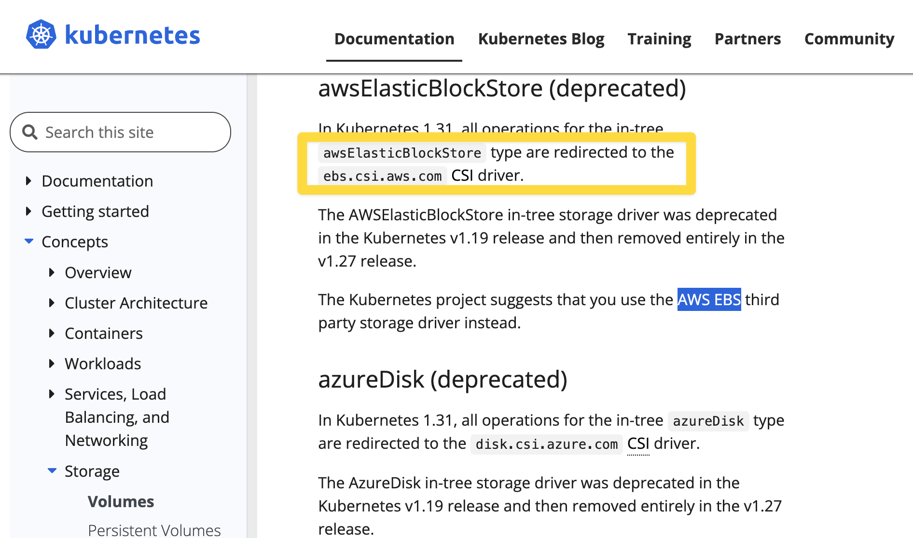
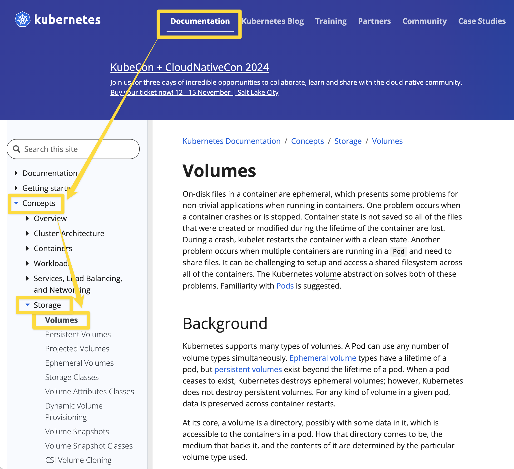

# Volume Mount - hostPath

# 쿠버네티스의 Storage

- volume mount

  - pod 내에 spec 에 지정해서 마운트를 하는 개념
  - 볼륨 마운트 시 'Read Only, (RO)' 로 명시하지 않으면 기본 설정은 'Read/Write' 이다.
  - emptyDir
    - 파드 내에서의 볼륨
    - 파드 내에 컨테이너가 여러개일 때 이 컨테이너들이 파드 내에서만 볼륨을 공유하려 할 경우 emptyDir 을 사용
    - 즉, 동일한 파드 안에서 실행되는 컨테이너 간 파일을 공유할때 간단하게 사용하기에 좋은 방식
    - 파드가 삭제되면 파드 내에 정의한 볼륨은 삭제된다. 
    - 일반적으로 멀티 컨테이너 파드 또는 사이드 카 구조로 작성된 파드 내에서 emptyDir 을 사용하게 되는 경우가 많다.
  - hostPath
    - hostPath 만 만들어보라는 문제는 없다. 다만 PV, PVC 선언시 hostPath 를 이용해서 만들어보라는 문제가 자주 출제
    - 로컬호스트에 있는 디렉터리를 파드 들이 연결해주는 볼륨
    - 호스트OS 내에서 특정 Path를 공유하는 것을 의미
    - 즉, 노드(=호스트OS가 설치된 vm 또는 머신)의 특정 물리적인 디렉터리를 볼륨으로 선언
    - 노드 내에서만 공유가 가능하다.
    - `type` 셀렉터 : DirectoryOrCreate, Directory, FileOrCreate, File
      - `type` 필드는 필수 옵션은 아니다.
      - DireactoryOrCreate : 주어진 경로에 아무것도 없을때 빈 디렉터리를 생성 (kubelet 의 소유권,권한을 0755)로
      - Directory : 주어진 경로에 디렉터리가 있어야 한다.
      - FileOrCreate : 주어진 경로에 아무것도 없으면 설정한 file 을 생성(kubelet 의 소유권,권한을 0755로)
      - File : 주어진 경로에 파일이 있어야 한다.
    - 일반적으로 로그 수집 에이전트 들이 대부분 hostPath 를 사용한다. (각각의 노드 내에 특정 파일에 로그를 쌓아두고 주기적으로 로그 저장소에 저장하는 원리)

  Storage Class

  - 여러 종류의 스토리지들의 종류들을 StorageClass 라는 이름으로 규격화해서 종류(class)를 정해둔것

  Volume

  - Kuberenetes API 로 지원해주는 개념 
  - emptyDir, hostPath 는 pod 의 spec 에 지정하지만, PV는 kubernetes 의 API 로 제공해주는 개념이다.
  - **PV : Persistent Volume**
    - iscsi, nfs, configMap, cinder, awsElasticBlockStore 등과 같은 여러가지 디스크 리소스가 있을 때 이 것을 PV 로 등록해두는 개념
    - '미리 준비가 완료된 적절한 볼륨' 과 같은 개념
    - PVC 로 볼륨 요청을 하면 kubernetes 클러스터는 PV 중 용량, 세부스펙 등이 일치하는 적절한 PV 를 선택해서 할당해준다.
    - 온프레미스 환경에서의 kubernetes 라면 관리자가 미리 디스크를 주문하고 발주해서 미리 준비해두고 PV로 등록해야 한다.
    - 퍼블릭 클라우드에서는 디스크를 미리 준비해두고 PV로 등록하지 않아도 요청을 해서 클라우드에서 할당을 받기 때문에 관리자가 디스크를 주문하고 발주해오는 등의 작업이 필요없다.
    - PV 의 Reclaim 정책은 아래와 같은 것들이 있다.
      - Retain : 할당됐던 PVC가 제거될 때 해당 Volume을 '보존(Retain)하겠다' 는 정책
      - Delete : 할당됐던 PVC가 제거될 때 PV 도 함께 제거하겠다.
      - Recycle : 할당됐던 PVC가 제거될 때 해당 Volume을 '재활용(Recycle)'하겠다는 정책. 모두 지워두고 언제든지 PVC로 요청시 새로 할당받게끔 하겠다는 정책
  - **PVC : Persistent Volume Claim** 
    - 클러스터에 PV 를 요청(Claim)하는 주문서 같은 개념
    - 요청한 PV가 승인되면 PV를 파드와 마운트 해준다.
    - [Volumes - PersistemtVolumes/Access Mode](https://kubernetes.io/docs/concepts/storage/persistent-volumes/#access-modes) 
      - ReadWriteOnce (RWO) : 한 번에 하나의 노드만 볼륨을 Read/Write 가능하도록 마운트
      - ReadOnlyMany (ROX) : 여러 개의 노드가 Read 전용으로 사용하도록 마운트
      - ReadWriteMany (RWX) : 여러 개의 노드가 Read/Write 가능하도록 마운트

<br/>


# Volume Mounts

참고 : [Kubernetes Persistent Volume 생성하기 - PV, PVC](https://waspro.tistory.com/580)

- spec.capacity.storage : 스토리지 용량을 지정
- spec.accessModes :
  - AccessMode 는 Volume 에 대한 Read/Write 권한을 제공하는 옵션

<br/>

 

# 참고 : RWO, ROX, RWX

- ReadWriteOnce (RWO) : 한번에 하나의 노드만 볼륨을 Read/Write 가능하도록 마운트
- ReadOnlyMany (ROX) : 여러 개의 노드가 Read 전용으로 사용하도록 마운트
- ReadWriteMany (RWX) : 여러 개의 노드가 Read/Write 가능하도록 마운트

<br/>


# 참고 : awsElasticBlockStore Deprecated

참고 : [Volumes - awsElasticBlockStore](https://kubernetes.io/docs/concepts/storage/volumes/#awselasticblockstore)



공식문서에서는 아래와 같이 이야기하고 있다.

> In Kubernetes 1.31, all operations for the in-tree `awsElasticBlockStore` type are redirected to the `ebs.csi.aws.com` [CSI](https://kubernetes.io/docs/concepts/storage/volumes/#csi) driver.
>
> The AWSElasticBlockStore in-tree storage driver was deprecated in the Kubernetes v1.19 release and then removed entirely in the v1.27 release.
>
> The Kubernetes project suggests that you use the [AWS EBS](https://github.com/kubernetes-sigs/aws-ebs-csi-driver) third party storage driver instead.

<br/>

요약하면 이렇다.<br/>

kubernetes 1.31 버전에서 awsElasticBlockStore 는 `ebs.csi.aws.com` 이라는 [CSI](https://kubernetes.io/docs/concepts/storage/volumes/#csi) driver 로 이관되었다. `awsElasticBlockStore` 는 이미 kubernetes 1.19 버전에서 deprecated 되었고, kubernetes 1.27 버전에서는 완전하게 삭제되었다.<br/>


# hostPath volume types

참고 : [Storage/Volumes - volumes/hostPath volume types](https://kubernetes.io/docs/concepts/storage/volumes/#hostpath-volume-types)

- 기본 값은 "" 이다.

| alue                | Behavior                                                     |
| :------------------ | :----------------------------------------------------------- |
| `‌""`                | Empty string (default) is for backward compatibility, which means that no checks will be performed before mounting the `hostPath` volume. |
| `DirectoryOrCreate` | If nothing exists at the given path, an empty directory will be created there as needed with permission set to 0755, having the same group and ownership with Kubelet. |
| `Directory`         | A directory must exist at the given path                     |
| `FileOrCreate`      | If nothing exists at the given path, an empty file will be created there as needed with permission set to 0644, having the same group and ownership with Kubelet. |
| `File`              | A file must exist at the given path                          |
| `Socket`            | A UNIX socket must exist at the given path                   |
| `CharDevice`        | *(Linux nodes only)* A character device must exist at the given path |
| `BlockDevice`       | *(Linux nodes only)* A block device must exist at the given path |

<br/>


# 공식문서

공식문서들을 주제 별로 북마크로도 저장해두긴 했는데, 혹시 모르니 아예 처음부터 찾아가는 방법을 익혀두자.<br/>

- [Volumes](https://kubernetes.io/docs/concepts/storage/volumes/)
- [Volumes - awsElasticBlockStore](https://kubernetes.io/docs/concepts/storage/volumes/#awselasticblockstore)
- [Volumes/Volumes - hostPath](https://kubernetes.io/docs/concepts/storage/volumes/#hostpath)
- [Cluster Administration/Logging Architecture - Using a sidecar container with the logging agent](https://kubernetes.io/docs/concepts/cluster-administration/logging/#sidecar-container-with-logging-agent)

<br/>


## volumes

- [Volumes](https://kubernetes.io/docs/concepts/storage/volumes/)

공식문서는 아래와 같이 찾아가면 된다.




주요 내용

> To use a volume, specify the volumes to provide for the Pod in `.spec.volumes` and declare where to mount those volumes into containers in `.spec.containers[*].volumeMounts`. 

볼륨을 사용하려면 `.spec.volumes` 를 정의하고 이 볼륨들을 컨테이너 안에서 어디에 마운트할 지는 `.spec.containers[*].volumeMounts` 에 정의한다.<br/>


## volumes/volumes - hostPath

[Volumes/Volumes - hostPath](https://kubernetes.io/docs/concepts/storage/volumes/#hostpath)<br/>


<br/>


# e.g. 1

> 작업 클러스터 : k8s

- /data/cka/fluentd.yaml 파일에 다음 조건에 맞게 볼륨 마운트를 설정하세요.
- Worker Node 의 도커 컨테이너 디렉터리를 동일 디렉터리로 Pod 에 마운트하세요.
- Worker Node 의 /var/log 디렉터리를 fluentd Pod 에 동일 이름의 디렉터리 마운트 하세요.


fluentd 의 동작

```bash
$ ssh k8s-worker1


$ cd /var/lib


# /var/lib 에는 docker 디렉터리가 있다. 
$ ls
...
docker ...


# 관리자 권한이 필요하기에 sudo -i 로 접근
$ sudo -i


# /var/lib/docker 디렉터리로 이동
# cd /var/lib/docker


# /var/lib/docker 내에는 디렉터리가 어떤 것들이 있는지 확인한다.
# ls 
... containers


# containers 디렉터리 내에는 uuid 기반으로 이름지어진 각각의 컨테이너에 대한 디렉터리들이 있다.
# ls /var/lib/docker/containers
...


# fluentd 는 이렇게 /var/lib/docker/containers 디렉터리에 존재하는 각각의 컨테이너들에 대한 정보를 수집하는 역할을 한다.
```

<br/>


풀이

```bash
# k8s 컨텍스트로 전환
$ kubectl config use-context k8s


# 노드 현황 파악
$ kubectl get nodes


# kubectl 환경에 fluentd 가 있는지 확인
$ cat /data/cka/fluentd.yaml
... 존재한다. (예제 환경) volume mount 가 되어 있지 않은 상태인 것 확인
# Volumes - hostPath 공식문서 내의 예제를 복사해온 후 붙여넣는다.
apiVersion: apps/v1
kind: DaemonSet
metadata: 
  name: fluentd
spec:
  selector:
    matchLabels:
      name: fluentd
  template:
    metadata:
      labels:
        name: fluentd
    spec:
      volumes:
      - name: dockercontainerdir
        hostPath:
          path: /var/lib/docker/containers
      - name: varlogdir
        hostPath:
          path: /var/log
      containers:
      - name: fluentd
        image: fluentd
        volumeMounts:
        - mountPath: /var/lib/docker/containers
          name: dockercontainerdir
        - mountPath: /var/log
          name: varlogdir


# worker1 로 접속
$ ssh k8s-worker1

# root 로그인
$ sudo -i

# /var/lib/docker 확인
# cd /var/lib/docker

# cd /var/lib/docker/continers 확인
# cd /var/lib/docker/continers


# 수정한 내용을 /data/cka/fluent.yaml 에 복사한 후 저장
$ vi /data/cka/fluentd.yaml

$  kueclt apply -f /data/cka/fluentd.yaml
...


$ kubectl get pod
...


$ kubect describe pod fluentd-xxx


$ kubectl get pods

```


