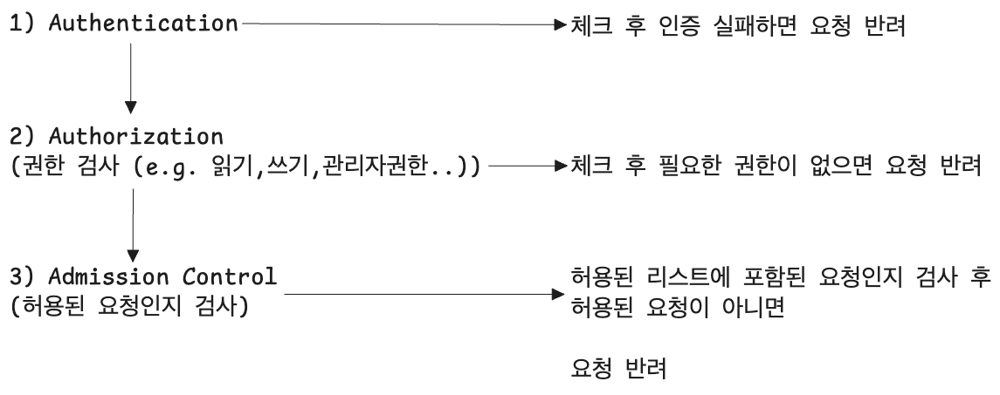

# RBAC 인증

API 의 인증

- API 서버에 접근하기 위해서는 인증 작업이 필요하다.

<br/>

쿠버네티스에서는 두가지 인증방식을 제공하고 있다.

- RBAC (Role Based Access Control) : 역할 기반의 인증
- ABAC (Attriubute Based Access Control) : 어트리뷰트 기반의 인증 방식

<br/>

CKA 시험 환경에서는 RBAC 이 출제된다.<br/>


쿠버네티스의 RBAC 인증의 절차는 다음과 같다.



(1) Authentication

- Authentication 절차에서는 이 사용자가 실제로 등록되어 있는 사용자인지를 검사한다.
- `.kube/config` : `.kube` 디렉터리 내에는 config 파일이 있는데 이 곳에 사용자 정보와 인증서 정보가 기록되어 있다. 이 `.kube/config` 파일을 열어보면 contexts 내에 context 라고 하는 인증을 위한 객체들을 보관하고 있는데, 이 context 객체에는 cluster, user 라는 필드가 있다.

(2) Authorization

- 사용자가 어떤 권한(쓰기, 읽기, 특정 리소스 조회 권한)을 가지고 있는지를 파악해서 요청이 적합한 권한을 가지는지를 검사한다.

(3) Admission Control

- Admission Control 에서는 마지막으로 허용되어 있는 리스트에 포함된 요청인지 등을 검사한다.

<br/>


Service Account<br/>

- Service Account 는 Pod 가 쿠버네티스 API 를 다룰 때 사용하는 계정이다.

```bash
$ kubectl get pods eshop-cart-app -o yaml | grep -i serviceaccount
$ kubectl get secrets default-token-a35efa
```

<br/>

실제 동작중인 pod 에 실제로 sa 계정으로 할당되는지 확인해보자.

```bash
## podtest 라는 이름으로 nginx 를 pod 로 구동한다.
$ kubectl run podtest --image=nginx

## 방금 생성한 pod 인 podtest 의 yaml 명세를 확인한다.
$ kubectl get pod podtest -o yaml 
...
spec:
  # ...
  containers:
  # ...
  
  serviceAccount: default # 여기
  # ...

```

- `default` 라는 serviceAccount 로 동작 중이다.

<br/>


위에서 확인한 `default` 라는 이름의 serviceAccount 는 어떻게 확인할까? 다음과 같이 확인 가능하다.

```bash
$ kubectl get secrets
NAME											TYPE						...
default-token-aabbcc			kubernetes.io/service-account-token
...


$ kubectl describe secrets default-token-aabbcc
...
token:  aabbccddeeff....

```

<br/>


# e.g.


