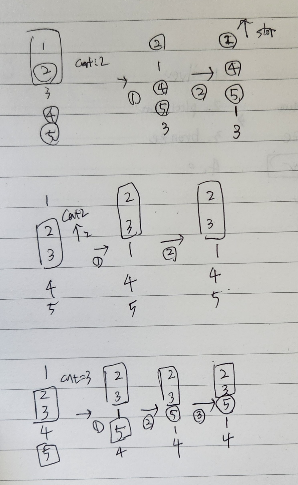
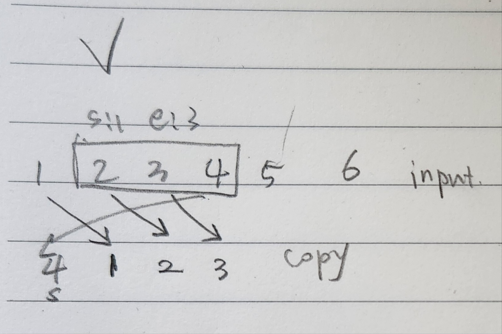
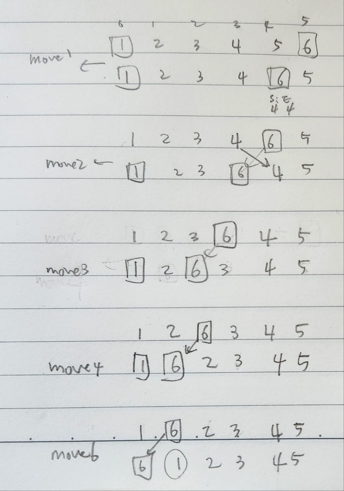
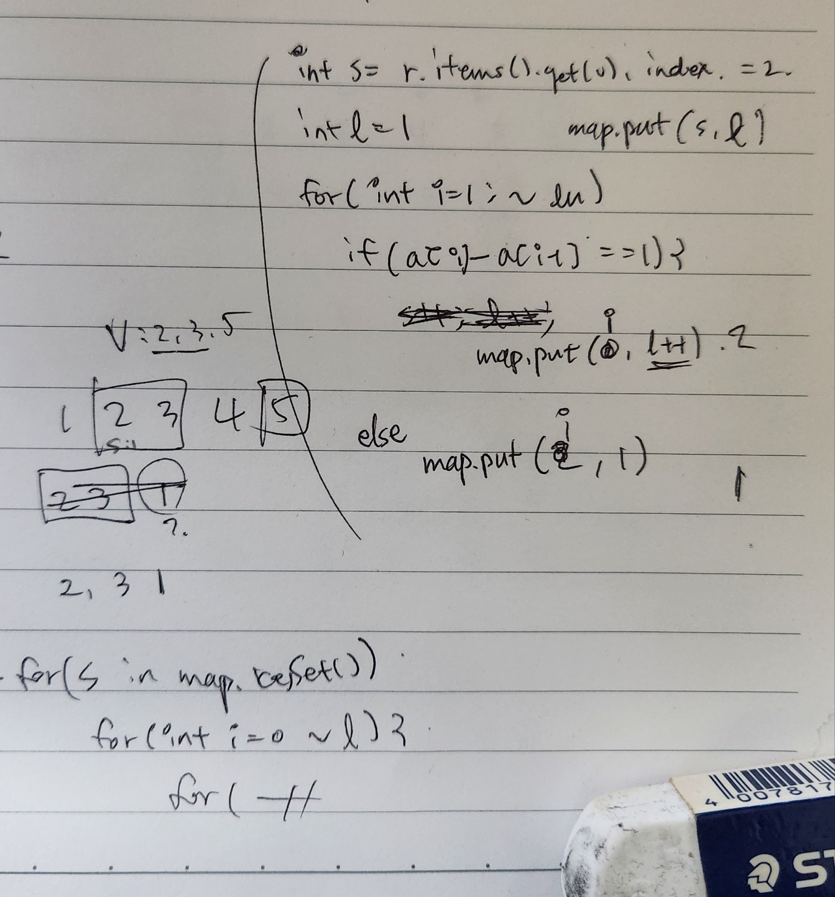
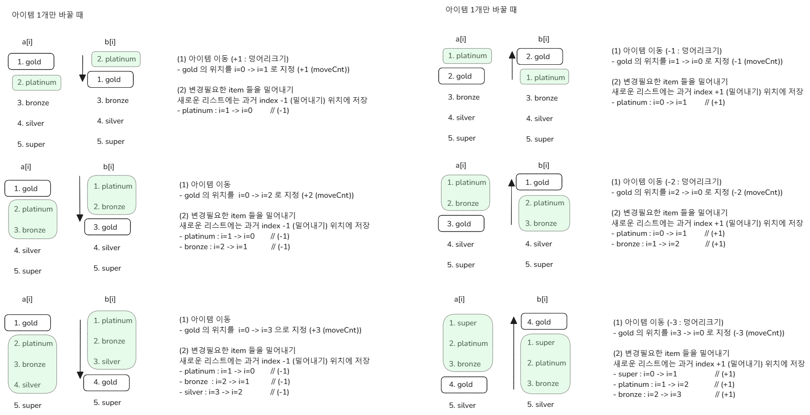
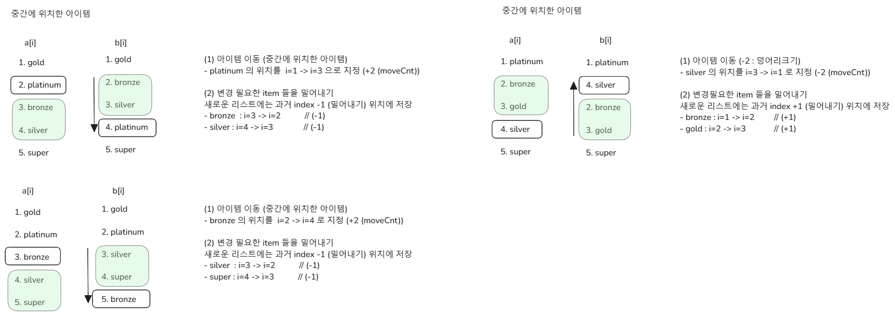
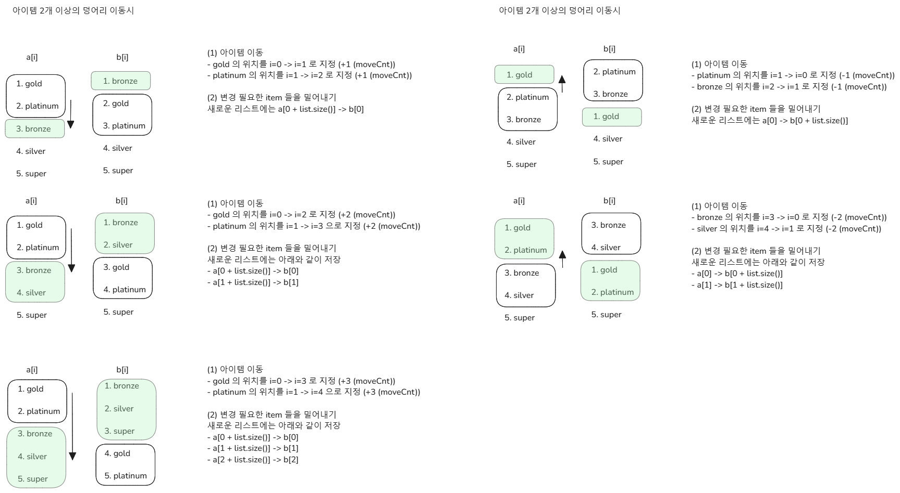
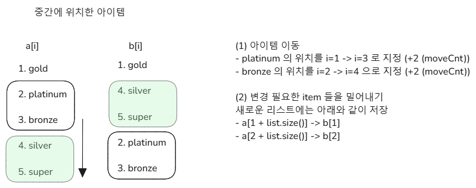
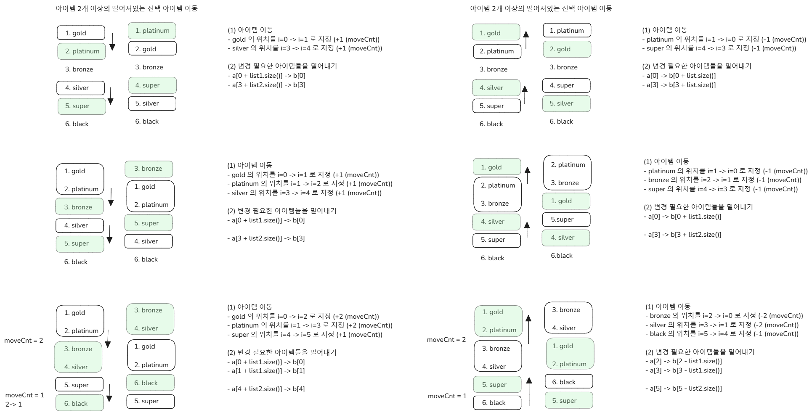

# 아이템 이동 문제

**Rate Limiter** 

매번 바꿀 때마다 백엔드에서 API 를 호출해야 하는데, 현재 개발 중인 기능이 바라보는 DB는 APP API 에서도 함께 바라보는 DB 인스턴스이기에 너무 잦은 호출은 부하를 이야기할 수 있고, 기껏해야 CMS에서의 잦은 호출이 전체 서비스의 장애나 지연으로 번질 수 있다. 그래서 Rate Limiter 까지 걸어두기로 결정했다. 

 

**다른 서비스들은?** 

(1) : 자기 자신만 수정하는 기능

예를 들면 토스증권, KB 증권의 관심종목 리스트 편집 기능을 예로 들 수 있다.

- 토스 증권 : 체크박스가 옆에 있고 모두 옮긴 이후 `확인` 버튼을 눌러서 노출순서를 서버로 전송
- KB증권 : 프론트엔드에서 수정 완료 후 `확인` 버튼 클릭시 서버로 요청 전송

 

(2) : 여러 관리자가 수정하게 될 경우의 기능

B2C 기반의 상품 관련 서비스를 개발하는 플랫폼에서 서비스 운영자 들이 특정 상위 랭크 상품 또는 프로모션 상품들의 노출순서를 수정하는 예를 들 수 있다. 

한 명의 사용자가 아닌 여러 관리자들이 수정할 수 있기 때문에, 브라우저에서 조회했을 때의 아이템들의 순서가 각각 다를 수 있다. 따라서 가급적이면 브라우저에서 노출순서를 변경한 후 전송하기보다는 가급적이면 서버로 얼만큼 이동할지를 전송해주는 것이 낫다. 

 

부하의 양이나 필요도에 따라서 (1) 과 (2) 중 적절한 선택이 필요하며, 가급적이면 Rate Limiter 로 요청의 주기를 조절하는 것 역시 중요해보인다.  

 

**문제 유형** 

테스트 케이스로 예외케이스를 꽤 많이 찾아서 버그들을 잡아가는 과정을 거치면서 기능개발을 완료했다. 중간에 기획적인 요소도 변경했다. 아이템이 n-1 위치에 도달했을때 맨 앞으로 이동시키는 순환인덱스 방식으로 알고리즘을 생각했었는데, 이 방식은 최악의 경우 Database 의 모든 아이템들을 밀어내기로 업데이트하게 될 수 있어 기능에서 배제해서 문제의 제한점을 명확히 했다. 

아이템 이동의 경우 이것을 아이템을 변경할 경우의 다른 요소들의 위치를 어떻게 할지를 구현할 때 명확하게 결정해야 하는데, 초반에 이게 꽤 헷갈렸다가 그림을 자주 그려보면서 어느 정도 더 확실해졌다. 

현재 방식보다 더 개선된 방식이 있는지 알고리즘 관점에서 계속 찾아보면서 개선책을 찾아나가기로 했다. 

 

## 최신버전

 

 

 

 

## old 버전

### ITEM 1개 이동시

#### 일반적인 케이스

 

#### 중간에 위치한 아이템 이동 케이스

 

### ITEM 2개 이상의 묶음 이동

#### 일반적인 케이스

 

#### 중간에 위치한 아이템 이동 케이스

 

#### 서로 떨어져 있는 ITEM 이동시

 

