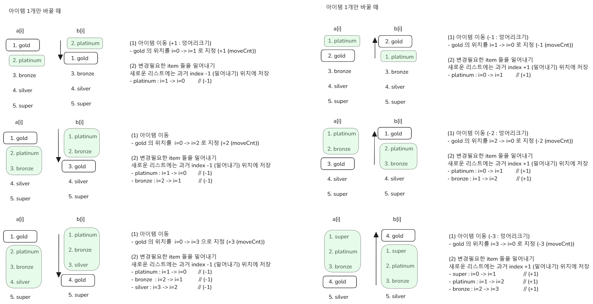

# 아이템 이동 문제

**백엔드에서 해주세요** 

보통 주식 관심종목 이동하고 이럴 때 사용하는 건데 회사에서도 쓸일이 있었고 그래서 한번 만들어봤다. 사실 나는 백엔드 쪽을 담당하고 있어서 변경된 productIdx 를 받은 다음에 밸리데이션만 체크하면 될 줄 알았다. 그런데 갑자기 프론트엔드 담당자가 갑자기 이걸 "백엔드에서 해야합니다." 라고 하는 거였다. 

뭐 좀 당황하긴 했는데, 일단 기본 구현은 만들긴 했다. 솔직히 난 우리회사는 이제 과제 테스트 말고 프로그래머스 코딩테스트로 좀 바꿨으면 좋겠다. 프론트 쪽에서 API를 너무 자주 호출할 경우를 대비해서 현업으로 개발중인 백엔드 코드에는 API Rate Limiter 도 새로 개발해서 달아둘 예정이다.  

 

**Rate Limiter** 

매번 바꿀 때마다 백엔드에서 제공하게 될 아이템 순서 변경 API를 호출하겠다는 심보인데, 현재 개발 중인 기능이 바라보는 DB는 APP API 에서도 함께 바라보는 DB 인스턴스이기에 너무 잦은 호출은 부하를 이야기할 수 있고, 기껏해야 CMS에서의 잦은 호출이 전체 서비스의 장애나 지연으로 번질 수 있다. 그래서 Rate Limiter 까지 걸어두기로 결정했다. (현재 이 기능은 CMS의 기능이다. 얼른 CMS 손떼야지 하는데 이야기를 못하고 있다.) 

 

**다른 서비스들은?** 

이 문제를 풀기에 앞서 다른 서비스들은 어떤지 보기 위해 증권사 관심종목 UI 를 살펴봤는데, KB 증권의 경우에는 프론트엔드에서 모두 수정한 후 `확인` 버튼을 눌렀을 때 서버로 요청이 전달되어 확정되는 구조였고, 토스증권의 경우에도 체크박스가 옆에 있는데 그것들을 모두 옮긴 후에 `확인` 버튼을 눌렀을 때 서버로 요청이 확정되는 구조였다. 다른 증권사도 찾아봐야 하는데 시간상 찾아보지는 못했다. 결론은 프론트에서 모두 확정지은 후 백엔드로 쏴주는게 대부분의 관례인듯 해보였다. 

 

**문제 유형** 

아무튼 대략적인 문제는 풀었고, 아직 예외가 발생하는 예외케이스들에 대한 코드는 작성하지 못했다.  

이번 문제는 동적프로그래밍이나 ,해시, 그리디 처럼 그런 알고리즘이 아니라 Arrays 에 해당하는 문제 유형이다. 이 Arrays 유형은 모든 코딩테스트 참가자들이 연습을 제일 안하는 유형이다. 대부분 유니온파인드, 그리디, 해시, 그래프, BFS, DFS 에 집착한다. 그래서 알고리즘 연습을 5년 이상 한 사람들만 거의 Arrays 를 풀어보지 않을까 싶다. 

나도 Arrays 는 거의 문제를 풀어보지를 않았다. 그래서 9월부터는 계속 Arrays 를 일주일에 두 문제씩은 풀어봐야겠다. 

문제의 흐름을 표현해보면 아래 그림들과 같다. 

 

## ITEM 1개 이동시

### 일반적인 케이스

 

### 중간에 위치한 아이템 이동 케이스

 

## ITEM 2개 이상의 묶음 이동

### 일반적인 케이스

 

### 중간에 위치한 아이템 이동 케이스

 

## 서로 떨어져 있는 ITEM 이동시

 

