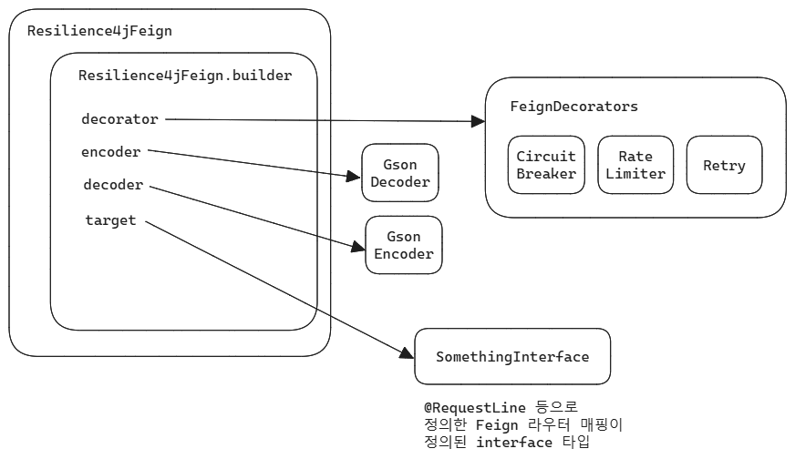
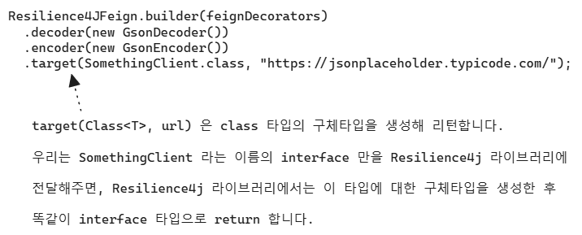

## Resilience4j 라이브러리 컨벤션

Resilience4j 의 라이브러리에서 자주 사용되는 컨벤션을 정리합니다.<br/>

Resilience4j 라이브러리는 처음 접할 때는 코드가 어려워보여서 멘붕에 빠지기 쉽습니다. 하지만 공식 문서의 예제를 천천히 읽어보고 다른 라이브러리의 예제 코드도 자세히 읽어보거나 직접 예제를 작성해보다 보면 코드 상에서 나타나는 `-Config`, `custom()`, `Registry`, `-Decorator` 와 같은 네이밍 컨벤션에 익숙해지게 됩니다.<br/>


## Resilience4j Feign



이 그림에 대한 예제를 보면서 설명해보겠습니다.

```java
// (1)
FeignDecorators feignDecorators = FeignDecorators.builder()
        .withCircuitBreaker(jsonPlaceholderCircuitBreaker)
        .withRateLimiter(jsonPlaceholderRateLimiter)
        .build();

// (2)
JsonPlaceholderClient feignClient = 
    Resilience4jFeign.builder(feignDecorators) // (2.1)
        .decoder(new GsonDecoder()) // (2.2)
        .encoder(new GsonEncoder()) // (2.2)
    	// (2.3)
        .target(JsonPlaceholderClient.class, "https://jsonplaceholder.typicode.com/");
```

(1)

- FeignDecorators 는 Resilience4j 에서 제공하는 CircuitBreaker, Bulkhead, RateLimiter, Retry 와 같은 객체들을 담는 데코레이터 역할의 객체입니다.

(2.1)

- Resilience4jFeign 의 builder 메서드에 FeignDecorators 객체를 바인딩하면서 Builder 객체를 생성합니다.

(2.2)

- decoder, encoder 에는 GsonDecoder, GsonEncoder 를 지정해줬습니다.
- GsonEncoder, GsonDecoder 과 같은 [feign-gson](https://mvnrepository.com/artifact/io.github.openfeign/feign-gson) 외에도 JsonEncoder, JsonDecoder 라는 [feign-jackson](https://mvnrepository.com/artifact/io.github.openfeign/feign-jackson) 라이브러리 역시 존재합니다.

(2.3)

- (2.1), (2.2) 에서 바인딩한 CircuitBreaker, Bulkhead, RateLimiter, Retry 등과 같은 기능들과 GsonDecoder, GsonEncoder 기능을 결합한 객체를 JsonPlaceholderClient 라는 interface 타입으로 생성해서 return 합니다.
- JsonPlaceholderClient 라는 interface를 구현하는 실제 구체적인 객체를 Resilience4j.builder 내에서 생성해서 return 합니다. 내부적으로는 리플렉션 등을 통해 구체 객체를 만들어냅니다.

(2)

- 이렇게 생성한 객체는 Bean 으로 등록해서 사용해도 되고 필요할 때마다 객체를 생성해서 사용해도 됩니다. 

<br/>


JsonPlaceholderClient interface 는 다음과 같은 모습입니다. 

```java
package io.example.feign.mvc_feign_circuit_breaker_example.external;


import feign.Param;
import feign.RequestLine;
import io.example.feign.mvc_feign_circuit_breaker_example.external.jsonplaceholder.dto.CommentDto;
import io.example.feign.mvc_feign_circuit_breaker_example.external.jsonplaceholder.dto.PostDto;
import java.util.List;

public interface JsonPlaceholderClient {
  @RequestLine("GET /posts")
  List<PostDto> getPosts();

  @RequestLine("GET /posts/{id}")
  PostDto getPostById(@Param("id") Long id);

  @RequestLine("GET /posts/{postId}/comments")
  List<CommentDto> getCommentsByPostId(@Param("postId") Long postId);

  @RequestLine("GET /comments/?postId={postId}")
  List<CommentDto> getCommentsByPostIdQuery(@Param("postId") Long postId);

  @RequestLine("POST /posts")
  PostDto createPost(PostDto post);

  @RequestLine("PUT /posts/{id}")
  PostDto updatePost(@Param("id") Long id, PostDto postDto);

  @RequestLine("PATCH /posts/{id}")
  PostDto patchPost(@Param("id") Long id, PostDto postDto);

  @RequestLine("DELETE /posts/1")
  PostDto deletePost(@Param("id") Long id);
}
```

<br/>

`GET /posts`, `GET /posts/{id}` , `POST /posts` , `PUT /posts/{id}`, `PATCH /posts/{id}`, `DELETE /posts/1` 등과 같은 REST API 사용시에 어떤 식으로 파라미터들을 구성하는지를 알수 있도록 종류별로 작성한 예제입니다.<br/>


결론적으로는 이렇게 정의된 interface 를 우리는 Resilience4jFeign 의 builder 에 넘겨주고 Resilience4j 는 이 interface 에 정의된 명세대로 구체타입을 만들어서 다시 우리가 명시한 interface 타입으로 return 해줍니다. 따라서 FeignClient 를 정의한다는 것은 API Client 의 명세를 작성하는 것이고, 내부적인 구현은 Resilience4j 가 규격화한 내부 정의에 따라 리플렉션 등을 이용해서 구체타입을 만들어서 interface 타입으로 return 하는 것을 의미합니다.<br/>



<br/>


## CircuitBreaker

CircuitBreaker 와 RateLimiter 는 코딩 컨벤션이 거의 비슷합니다.

예를 들면 아래와 같은 코드가 있습니다. 공식문서에서 제공하는 예제코드입니다.

- 참고 : https://resilience4j.readme.io/docs/circuitbreaker

```java
// Create a custom configuration for a CircuitBreaker
// (1)
CircuitBreakerConfig circuitBreakerConfig = CircuitBreakerConfig.custom()
  .failureRateThreshold(50)
  .slowCallRateThreshold(50)
  .waitDurationInOpenState(Duration.ofMillis(1000))
  .slowCallDurationThreshold(Duration.ofSeconds(2))
  .permittedNumberOfCallsInHalfOpenState(3)
  .minimumNumberOfCalls(10)
  .slidingWindowType(SlidingWindowType.TIME_BASED)
  .slidingWindowSize(5)
  .recordException(e -> INTERNAL_SERVER_ERROR
                 .equals(getResponse().getStatus()))
  .recordExceptions(IOException.class, TimeoutException.class)
  .ignoreExceptions(BusinessException.class, OtherBusinessException.class)
  .build();

// (2)
// Create a CircuitBreakerRegistry with a custom global configuration
CircuitBreakerRegistry circuitBreakerRegistry = 
  CircuitBreakerRegistry.of(circuitBreakerConfig);

// (3)
// Get or create a CircuitBreaker from the CircuitBreakerRegistry 
// with the global default configuration
CircuitBreaker circuitBreakerWithDefaultConfig = 
  circuitBreakerRegistry.circuitBreaker("name1");
```

코드가 길어서 어려워보이지만 조금만 차분하게 전체적인 코드를 보려고 한다면 다음과 같은 규칙으로 객체를 생성할 수 있다는 사실을 알 수 있습니다.

- (1) CircuitBreakerConfig config = CircuitBreakerConfig.custom()...build();
  - CurcuitBreakerConfig 클래스의 custom() 메서드를 통해 빌더 로직을 시작합니다.
  - `*-Config.custom()...build()` 로직은 CircuitBreaker 뿐만 아니라 RateLimiter 등과 같은 로직에서도자주 쓰이는 코드 구조입니다.
- (2) CircuitBreakerRegistry registry = CircuitBreakerRegistry.of(config)
  - (1) 에서 생성한 config 객체를 인자로 해서 CircuitBreakerRegistry 객체를 생성합니다. 
  - `*-Reigsitry.of(config)` 로직은 CircuitBreaker 뿐만 아니라 RateLimiter 등과 같은 로직에서도 자주 쓰이는 코드 구조입니다.

- (3) CircuitBreaker breaker = registry.circuitBreaker("이름");
  - (2) 에서 생성한 registry 객체 내의 circuitBreaker("name") 메서드를 이용해서 CircuitBreaker 객체를생성합니다. 
  - `*-Registry.circuitBreaker()` 로직은 Circuiltreaker 뿐만 아니라 RateLimiter 등과 같은 로직에서도 자주 쓰이는 코드 구조입니다.


`CONFIG = *-Config.custom()...build()`  → `registry = *-Reigsitry.of(config)` → `*Registry.ciruitBreaker` 와 같은 방식으로 이뤄져있습니다.

<br/>


## RateLimiter

정리 예정 

<br/>