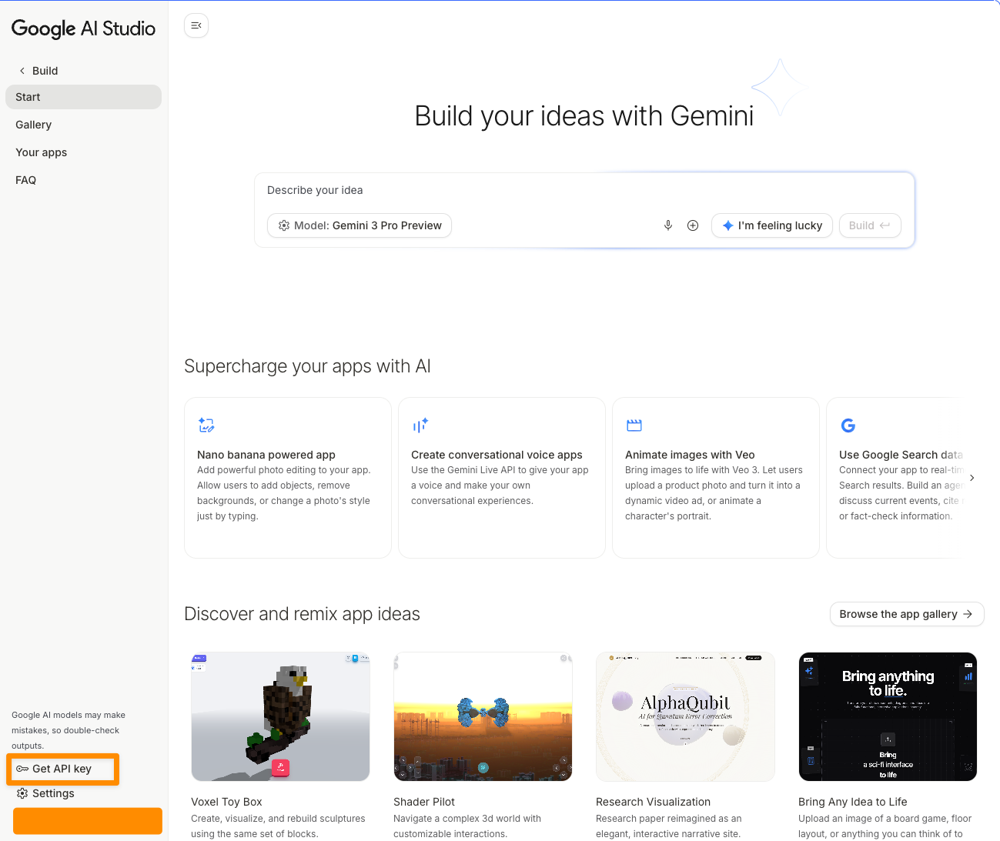
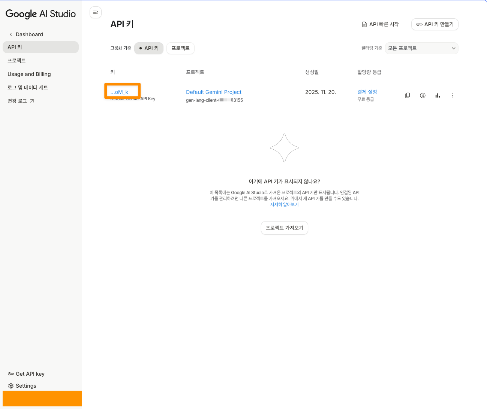
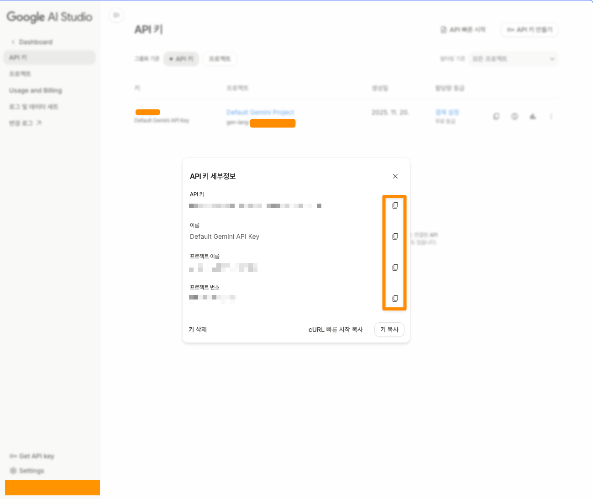
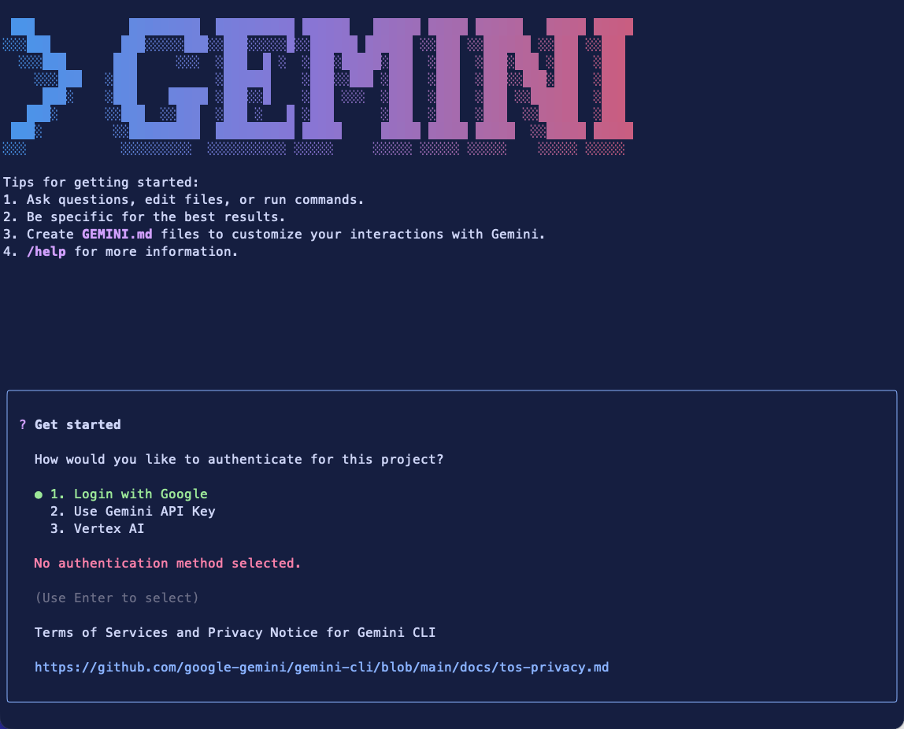

# Gemmini-CLI
- Gemini Ultimate 플랜이 Claude Max (x20)보다 싸길래 도전해봤...
- 요즘 Gemini 3.0 pro 의 성능/사용성이 미쳤다고 Youtube 영상도 추천으로 뜨던 차에 시도해봤...
- 일단 오늘은 Claude Code 와 비슷한 도구인 Gemini Code 를 사용해봤...


# API Key
프로젝트를 새로 만들어서 가져와도 되고, 그냥 무료계정의 API Key 를 가져와도 되는데, 내 경우에는 아직 본격적으로 사용한다기 보다는 어떻게 쓰는지 사용법을 익히기 위한거라 그냥 무료계정의 API Key 를 사용하기로 했다.<br/>

API Key 를 용도별로, 하고 있는 프로젝트 별로 구분하고 과금을 관리하려면 프로젝트 별로 생성하면 될 것 같다.<br/>

좌측 하단 `Get API Key` 클릭

<br/>

API Key 버튼 클릭

<br/>


주요 항목들 복사

<br/>


# Gemini CLI 설치
Gemini CLI 는 Node.js(+20) 만 설치되어 있으면 패키지를 다운받아서 실행 가능하다. <br/>

> 회사 PC 인데 Node.js 빌드를 로컬에서 할때 특정 버전 아래에서 빌드해야 하는 경우 역시 있다. 이런 경우에는 nvm 을 사용해서 특정 환경을 통해서 설치하면 될 것 같다. 나 역시 nvm 을 사용하고 있지만, 이번 문서는 nvm 설명문서는 아니기에 nvm 설명은 skip 함.

<br/>

Gemini CLI 의 공식 Github Repository 는 다음과 같다.
- https://github.com/google-gemini/gemini-cli

여기서는 필요한 환경으로 다음과 같이 Node.js(+20) 환경을 언급한다.
- Node.js version 20 or higher
- macOS, Linux, or Windows


설치는 다음과 같다. 공식 Github Repository 의 내용 중 npm 을 이용한 설치를 선택했다.
```bash
npm install -g @google/gemini-cli
```

# 실행
터미널에서 다음 명령어를 수행한다.
```bash
gemini
```
<br/>

만약 아무 화면도 안나타나면 `source ~/.bashrc` 또는 `source ~/.zshrc` 를 수행한다.<br/>
<br/>

다음은 `gemini` 명령 수행 후의 모습이다.



# 로그인 방식
처음 `gemini` 명령 수행시 로그인 상태가 아니라면 다음 화면이 나타난다.

<br/>

하지만 이미 로그인 되어 있지만 다른 방식의 로그인(API Key, Vertext AI 또는 Google 계정 로그인)방식을 선택하고 싶다면 `/auth` 를 터미널에 입력하면 된다.<br/>


각각의 방식의 API Call 제한은 다음과 같다.(2025/11/20) <br/>
출처
- https://github.com/google-gemini/gemini-cli 에서 발췌해왔다.
- 해당 섹션: https://github.com/google-gemini/gemini-cli?tab=readme-ov-file#-authentication-options 

<br/>

**Option 1: Login with Google (OAuth login using your Google Account)**<br/>
- https://github.com/google-gemini/gemini-cli?tab=readme-ov-file#option-1-login-with-google-oauth-login-using-your-google-account

> ✨ Best for: Individual developers as well as anyone who has a Gemini Code Assist License. (see quota limits and terms of service for details)

<br/>

Benefits:
- Free tier: 60 requests/min and 1,000 requests/day
- Gemini 2.5 Pro with 1M token context window
- No API key management - just sign in with your Google account
- Automatic updates to latest models

<br/>

이미 결제된 Google Assist 라이센스가 있을 경우 환경변수에 `export` 하라는 안내가 나오는데 이 부분에 대해서는 https://github.com/google-gemini/gemini-cli?tab=readme-ov-file#option-1-login-with-google-oauth-login-using-your-google-account 을 참고하자.<br/>
<br/>


**Option 2: Gemini API Key**<br/>
- https://github.com/google-gemini/gemini-cli?tab=readme-ov-file#option-1-login-with-google-oauth-login-using-your-google-account

> ✨ Best for: Developers who need specific model control or paid tier access

<br/>

Benefits:
- Free tier: 100 requests/day with Gemini 2.5 Pro
- Model selection: Choose specific Gemini models
- Usage-based billing: Upgrade for higher limits when needed

<br/>

API Key 를 사용할 경우 `~/.zshrc`, `~/.bashrc` 등에 다음의 내용을 정의해서 적용해준다.
```bash
# Get your key from https://aistudio.google.com/apikey
export GEMINI_API_KEY="YOUR_API_KEY"
gemini
```