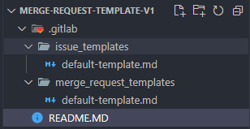

# PR,MR 컨벤션, 템플릿

## 참고자료

- [https://velog.io/@ye-ji/Git-PR-ISSUE-템플릿-등록하는-방법](https://velog.io/@ye-ji/Git-PR-ISSUE-%ED%85%9C%ED%94%8C%EB%A6%BF-%EB%93%B1%EB%A1%9D%ED%95%98%EB%8A%94-%EB%B0%A9%EB%B2%95)
- [https://velog.io/@ss-won/Git-GitLab-Issue-MR-Template-만들기](https://velog.io/@ss-won/Git-GitLab-Issue-MR-Template-%EB%A7%8C%EB%93%A4%EA%B8%B0)

- [github.blog - How to write the perfect pull request](https://github.blog/2015-01-21-how-to-write-the-perfect-pull-request/) 

- [https://velog.io/@ye-ji/Git-PR-잘-쓰는-방법](https://velog.io/@ye-ji/Git-PR-%EC%9E%98-%EC%93%B0%EB%8A%94-%EB%B0%A9%EB%B2%95) 

- [https://beststar-1.tistory.com/12](https://beststar-1.tistory.com/12) 

 

## Pull Request 컨벤션

코딩컨벤션을 잘 지켜야 합니다. 

- 코딩컨벤션 불일치로 인해 불필요한 코멘트를 남기는 것은 시간낭비가 되기 때문에 가급적 코딩컨벤션은 잘 맞춰줘야 합니다.

 

리뷰 가이드 작성

- 모든 변경사항에는 의도가 있습니다. 변경사항의 의도를 리뷰어가 알 수 있게끔 정리해줍니다.
- 줄바꿈 처럼 단순한 변경이지만 리뷰어가 확인할 필요가 없는 것이라면 “Just line change” 와 같은 코멘트를 남겨줍니다.
- 만약 사용된 라이브러리 업데이트를 한 것이 수정 내역에 있다면 그 라이브러리의 릴리즈 노트 링크, 스크린샷을 첨부하는 것도 좋은 방법입니다.

 

WIP(Work In Progress, 작업중)를 명확하게 명시하기

- 작업 중 - Work In Progress (WIP) 인지 여부를 타이틀 앞에 추가합니다.
- 만약 작업이 끝나면 WIP 를 제거합니다. 그리고 review- needed태그를 설정해줍니다.
- 리뷰를 반영하는 중에도 PR 을 하게 된다면 이 것을 반복해서 명시해야 합니다.
    - 리뷰에서 원하는 개선 사항이 여러가지일 경우 그 중 먼저 완료된 것을 PR 하는 등의 경우

 

## Pull Request 템플릿 (github)

[https://velog.io/@ye-ji/Git-PR-ISSUE-템플릿-등록하는-방법](https://velog.io/@ye-ji/Git-PR-ISSUE-%ED%85%9C%ED%94%8C%EB%A6%BF-%EB%93%B1%EB%A1%9D%ED%95%98%EB%8A%94-%EB%B0%A9%EB%B2%95) 

- 프로젝트 루트에 `pull_request_template.md` 를 추가하는 방법
- docs 디렉터리에 PR 템플릿을 표현하랴면 `docs/pull_requst_template.md` 에 추가
- `.github` 디렉터리에 PR 템플릿을 표현하려면 `.github/pull_request_template.md` 에 템플릿을 추가

 

## merge request, issue 템플릿 (gitlab)

[https://velog.io/@ss-won/Git-GitLab-Issue-MR-Template-만들기](https://velog.io/@ss-won/Git-GitLab-Issue-MR-Template-%EB%A7%8C%EB%93%A4%EA%B8%B0)

gitlab 에서도 issue 템플릿, mr 템플릿을 세부적으로 지정 가능합니다.

- issue 템플릿 : `.gitlab/issue_templates/` 아래의 md 파일
- mr 템플릿 : `.gitlab/merge_request_templates/` 아래의 md 파일

(.gitlab 디렉터리가 존재하지 않는다면 직접 생성해야 합니다.)

 

## Merge Request 템플릿 (gitlab)

 `.gitlab/issue_templates/` 아래에 md 파일을 추가해두면, gitlab 내의 Issues 메뉴에서 새로운 Issue 를 추가하기 위해 작성하는 화면에서 양식을 선택 가능합니다.

merge requests 를 클릭합니다.

Create Merge Request 또는 New Merge Request 버튼을 클릭합니다.

 

template 을 선택하고, Asignee, Reviewr 등을 직접 지정합니다. 모두 완료되면 Create merge request 버튼을 클릭합니다.

 

Create Merge Request 를 클릭하면 아래와 같은 화면이 나타나는데 최종적으로는 Approve 버튼 클릭 → Merge 버튼을 클릭하면 Merge Request 가 완료되게 됩니다.

 

 

## Issue 템플릿

Gitlab > Issues > New Issue 클릭

 

이어서 나타나는 화면에서는 Type 항목을 선택합니다. 방금 전 추가해둔 issue 템플릿의 파일명인 `issue` 가 셀렉트 메뉴로 나타나는 것을 확인 가능합니다.

 

ISSUE 를 작성합니다. 모두 작성한 이후에는 Asignee 를 선택한 후 Create Issue 버튼을 클릭합니다. 

 

별도의 브랜치에서 작업을 수행합니다.

그리고 작업이 완료되면 Ceate merge request 버튼을 클릭합니다.

 

Merge Request 템플릿을 선택합니다.

 

MergeRequest 양식을 모두 채운 이후에 Create Merge Request 버튼을 클릭합니다.

 

아래 그림을 참고해서 Approve 버튼을 클릭합니다.

 

Merge 버튼을 눌러서 Merge Request 를 완료합니다.

 

아래 그림은 Merge Request 가 완료된 모습입니다.

 

## 리뷰어의 피드백에 응답할 때

- 피드백에 대한 감사를 표현한다.
- 이해가 안될 경우 리뷰어에게 명확히 표현할 수 있도록 피드백을 이끌어낸다.
- 최대한 모든 피드백에 대해 응답
- 혼란이나 논쟁이 증가하고 있다면 쓰여진 단어가 의사소통에 좋은 것인지 검토
- 코멘트로 모두 해결하려 하기보다 화상회의 또는 오프라인 토론 후 요약글을 게시하는 것도 고려
- 문제 해결법 피드백에 대한 응답일 경우 그 해결법에 도달하기 위해 내린 결정을 설명