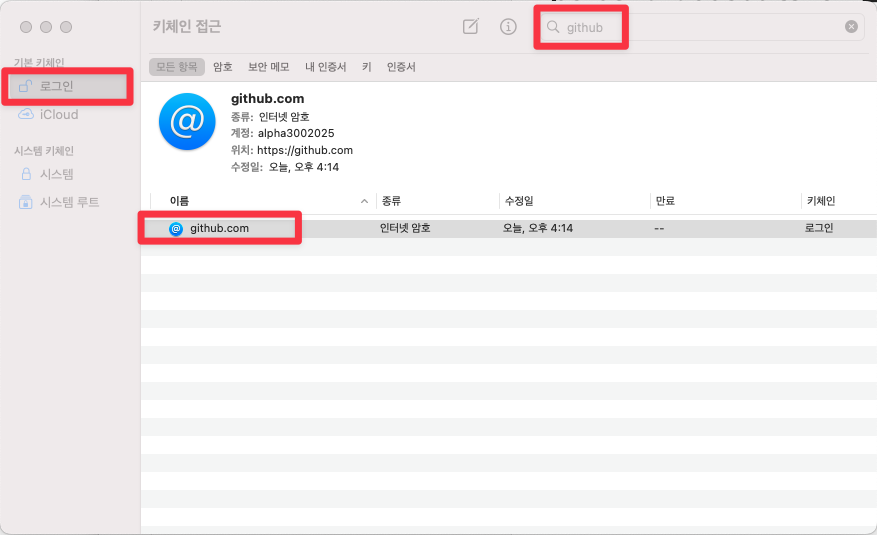
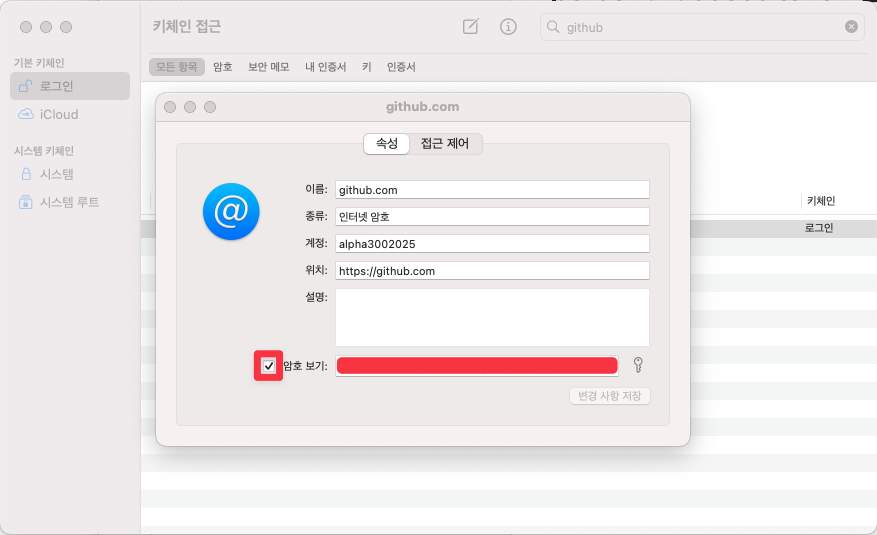

두 가지 방법이 있다.
- (1) ssh key 등록 방식
- (2) github token 을 이용한 방식


(1) 의 경우 회사 서버에 접속할때 자주 사용한다.
(2) 의 경우 github 과 같은 플랫폼에 접속시 사용한다.


# ssh key 등록
## 로컬에서 github 계정을 위한 ssh-key 생성 후 ssh-agent 에 비공개키 등록
```bash
### ~/.ssh 디렉터리로 이동
➜  ~ cd ~/.ssh

### ~/.ssh 디렉터리 내의 파일들 확인
➜ ls
alpha300uk                  id_rsa_alpha300uk.pub
alpha300uk.pub              id_rsa_chagchagchag.dev
config                      id_rsa_chagchagchag.dev.pub
id_rsa_alpha300uk

### alpha300uk@gmail.com 이라는 이름으로 ssh key 생성
➜ ssh-keygen -t rsa -C "alpha300uk@gmail.com" -f "id_rsa_alpha300uk_macmini"

### 확인
➜ ls
...
id_rsa_alpha300uk
id_rsa_alpha300uk_macmini

### 발급한 키들을 ssh-agent 에 저장해둔다.
➜ ssh-add ~/.ssh/id_rsa_alpha300uk_macmini
Enter passphrase for /Users/alpha300uk/.ssh/id_rsa_alpha300uk_macmini:
Identity added: /Users/alpha300uk/.ssh/id_rsa_alpha300uk_macmini (alpha300uk@gmail.com)
```
<br/>

## github 계정 설정페이지에서 ssh-key 의 공개키 등록
아래 명령을 실행해서 pub 키의 전문을 복사한다. 또는 vscode 등을 통해서 열어도 된다.
```bash
➜ pbcopy < ~/.ssh/id_rsa_alpha300uk_macmini.pub
```
<br/>

이제 복사한 파일의 내용을 github 에 등록해준다.
- 깃헙 계정 페이지 ➝ 프로필 클릭 ➝ Settings ➝ SSH and GPG keys ➝ SSH Keys ➝ New SSH Key 클릭

Title, Key 를 입력해준다. Title 은 주로 어떤 PC에서 몇년도에 등록했는지를 알아보기 쉽게 제목을 지어주면 좋다. Key 는 위에서 pbcopy 를 통해 복사한 텍스트를 붙여넣어주면 된다.<br/>

```bash
➜  .ssh ssh -T git@github.com-alpha300uk
...
Hi alpha3002025! You've successfully authenticated, but GitHub does not provide shell access.
```
<br/>

위와같은 에러가 뜨지만 회사 github 계정일 경우 잘 실행된다. github.com 의 깃헙 서버는 ssh 서버 접속을 허용하지 않기 때문이다.<br/>
<br/>


## SSH config 파일 설정 
```bash
cd ~/.ssh
```

config 파일을 열어서 수정을 한다.
```
vim ~/.ssh/config
...
Host github.com-alpha300uk
    HostName github.com
    User alpha3002025
    IdentityFile ~/.ssh/id_rsa_alpha300uk_macmini

### 현재 컴퓨터에 다른 계정을 하나 더 추가할 경우 위와 같은 파일과 함께 계정, IdentityFile 을 다르게 해서 적용한다.
```
<br/>

## ssh 방식으로 clone 받기
ssh 방식으로 clone 받는다.
```bash
➜  alpha300uk git clone git@github.com-alpha300uk:alpha3002025/eks-terraform-provisioning.git
Cloning into 'eks-terraform-provisioning'...
Enter passphrase for key '/Users/alpha300uk/.ssh/id_rsa_alpha300uk_macmini':
...
```
<br/>

passphrase 는 ssh 키를 만들때 등록했던 비밀번호이다.<br/>
<br/>

## 참고) git config user.name
기본적인 내용이지만 누구든지 항상 은근히 자주 실수하는 부분이다.
```
git config user.name [사용자 아이디]
git config user.email [사용자 이메일]

## 확인
git config user.name
git config user.email
```
<br/>

```bash
➜  eks-terraform-provisioning git:(main) git config user.name alpha3002025
➜  eks-terraform-provisioning git:(main) git config user.email alpha300uk@gmail.c
om
```
<br/>


## 주의할 점
새로운 리포지터리를 로컬에서 생성해서 remote 를 등록후 push 할때 remote 주소를 다음과 같이 지정해줘야 한다.
```bash
git remote add origin git@github.com-alpha300uk
```
<br/>

# (https) github token 으로 터미널 로그인 
참고
- https://velog.io/@chy0428/Github-mac-os-%ED%86%A0%ED%81%B0-%EC%9D%B8%EC%A6%9D-%EB%A1%9C%EA%B7%B8%EC%9D%B8
- https://jake5113.tistory.com/64
	- 기존 키체인을 삭제 후 로그인을 해서 새로운 키체인을 만드라고 알려준다.

github 의 로그인 방식이 id/password 방식이 아닌 token 기반으로 바뀐 것으로 인한 이슈다. ssh 를 통한 접속이 아닌 https 를 통한 접속방식이다.<br/>

## personal access token 발급
- 깃헙 계정 페이지 ➝ 프로필 클릭 ➝ Settings ➝ Developer Settings ➝ Personal access tokens ➝ Tokens (classic) ➝ Generate new token ➝ Generate new token(classic) ➝ 옵션 선택 후 Generate token 클릭
- 이렇게 생성한 token 은 별도의 `txt` 파일에 저장해둔다. 내 경우에는 옵시디언 파일에 저장해두었다.


## github 터미널 로그인
두가지 방법이 있다.
- (1) brew 에서 제공하는 gh 플러그인 사용
- (2) 이미 PC에 가지고 있는 로컬 리포지터리 내에서 git push -u origin main 을 수행해본다.

개인적으로는 (2) 의 방식이 제일 편했다.
(1) 의 경우에는 특정 org 를 읽어들일수 있는 권한이 필요하기도 하고 windlytask 라는 organization 을 허용하라고 브라우저에 나타난다. 그래서 찜찜해서 중간에 그냥 skip 했다. (1) 의 방식은 아래와 같이 진행하면 된다.

```bash
# Homebrew로 설치
brew install gh

# 로그인
gh auth login
```

이후 대화형으로 진행됩니다:
- `GitHub.com` 선택
- `HTTPS` 선택
- `Yes` (git 자격 증명에 GitHub CLI 사용)
- `Login with a web browser` 선택 (또는 토큰으로 로그인)
- 표시되는 코드 복사 후 브라우저에서 인증

<br/>

## 키체인에 저장
키체인에 Personal Access Token 을 저장해두면 다음 로그인 때 토큰을 찾아서 붙여넣어주지 않아도 바로 로그인이 가능하다. 내 경우에는 Personal Access Token 을 30일 만기로 지정해두었기 때문에 30일에 한번씩 이짓(?)을 해줄 예정이다.

<br/>

먼저 Mac OS 의 '키체인 접근' 애플리케이션을 연다,
- Cmd + Space ➝ '키체인' 검색 ➝ '키체인 접근' 실행
<br/>

왼쪽 사이드바에서 '로그인'을 선택하고, `github` 을 검색한다.

<br/>


암호부분에 personal access token 을 복사해서 붙여넣은 후 '변경 사항 저장' 버튼을 클릭한다.

<br/>


