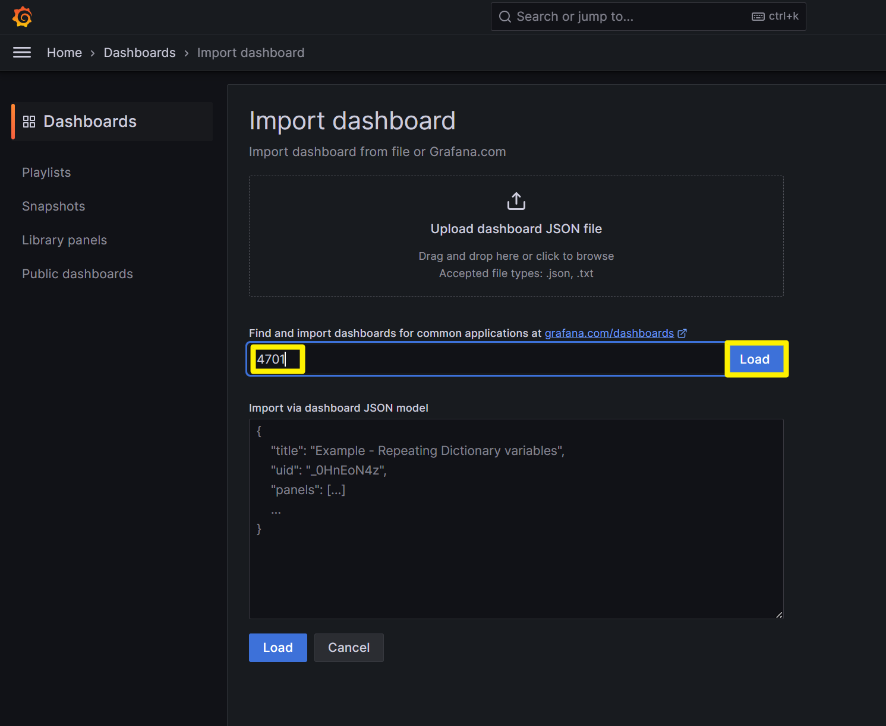
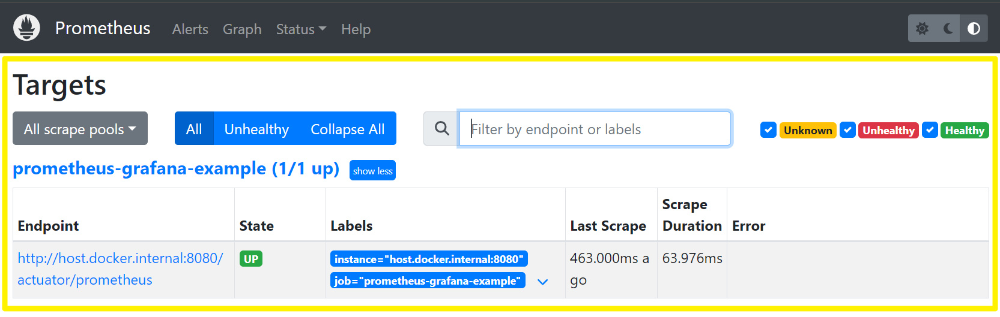

# Grafana, Prometheus

예제 프로젝트는 아래의 Github 링크에서 확인가능합니다.

- [grafana-prometheus/example/prometheus_grafana_example](https://github.com/chagchagchag/memo/tree/main/grafana-prometheus/example/prometheus_grafana_example)

<br/>


## Spring Boot 애플리케이션 설정


### build.gradle.kts

```kotlin
dependencies {
	implementation("org.springframework.boot:spring-boot-starter-actuator")
	implementation("org.springframework.boot:spring-boot-starter-web")
	runtimeOnly("io.micrometer:micrometer-registry-prometheus")
    
    // ...
    
}
```

<br/>


### prometheus.yml

`src/main/resource` 아래에 prometheus.yml 파일을 생성합니다. 그리고 아래의 내용을 입력하고 저장해주시기 바랍니다.

```yaml
server:
  tomcat:
    mbeanregistry:
      enabled: true
management:
  metrics:
    tags:
      application:
        ${spring.application.name}
  endpoints:
    web:
      exposure:
        include: prometheus
```

<br/>


### application.yml

application.yml 파일에는 위에서 작성한 `prometheus.yml` 파일을 import 하도록 지정해줍니다.

```yaml
spring:
  application:
    name: prometheus-grafana-example
  config:
    import:
      - classpath:prometheus.yml
```

<br/>


### 애플리케이션 구동 및 actuator 동작 확인

서버 애플리케이션을 구동하고 [http://localhost:8080/actuator/prometheus](http://localhost:8080/actuator/prometheus) 또는 [http://host.docker/internal:8080/actuator/prometheus](http://host.docker/internal:8080/actuator/prometheus) 에 접속해봅니다.


White Label Error 가 나타나지 않고 위와 같은 화면이 나타난다면 정상적으로 구동된 것입니다.<br/>

<br/>


## docker-compose

### `0.monitoring` 디렉터리 생성

프로젝트 루트 디렉터리 내에 `0.monitoring` 이라는 디렉터리를 생성합니다.


<br/>


### prometheus/config 디렉터리 생성 + prometheus/config/config.yml 파일 생성

`0.monitoring/prometheus/config` 디렉터리를 생성하고 config.yml 파일을 생성합니다.


<br/>


`0.monitoring/prometheus/config/config.yml` 파일의 내용을 아래와 같이 작성합니다.

```yaml
global:
  scrape_interval: 1s

scrape_configs:
  - job_name: "prometheus-grafana-example"
    metrics_path: '/actuator/prometheus'
    static_configs:
      - targets: [ 'host.docker.internal:8080' ]
```

<br/>


### docker-compose.yml

이제 docker-compose.yml 파일을 생성한 후 그 내용을 아래와 같이 작성합니다.

```yaml
version: '3.7'
services:
  prometheus:
    image: prom/prometheus
    container_name: prometheus
    volumes:
      - ./prometheus/config:/etc/prometheus # (1)
      - ./prometheus/volume:/prometheus # (2)
    ports:
      - 9090:9090
    command:
      - '--config.file=/etc/prometheus/config.yml'
    restart: always
    networks:
      - prometheus_network
  grafana:
    image: grafana/grafana
    container_name: grafana
    ports:
      - 3000:3000
    volumes:
      - ./grafana/volume:/var/lib/grafana # (3)
    restart: always
    networks:
      - prometheus_network
networks:
  prometheus_network:
    driver: bridge # (4) 
```


**prometheus**<br/>

prometheus 도커 이미지를 9090 포트에서 동작시키며, config 파일은 docker-compose.yml 이 위치한 디렉터리를 기준으로 prometheus/config/config.yml 로 지정했고, volume 데이터 역시 docker-compose.yml 이 위치한 디렉터리를 기준으로 prometheus/volume 디렉터리로 마운트 해줬습니다.<br/>

<br/>


**grafana**<br/>

grafana 도커 이미지를 3000 포트에서 동작시키며, volume 데이터는 docker-compose.yml 이 위치한 디렉터리를 기준으로 grafana/volume 디렉터리로 지정해줬습니다.<br/>

<br/>


(1) 볼륨 정의

- docker-compose.yml 이 위치한 디렉터리 내의 prometheus/config 디렉터리를 docker container 내의 /etc/prometheus 디렉터리와 바인딩해줍니다. 이렇게 하면 호스트 내의 파일시스템이 컨테이너와 매핑됩니다.

(2) 볼륨 정의

- docker-compose.yml 이 위치한 디렉터리 내의 prometheus/volume 디렉터리를 docker container 내의 /prometheus 디렉터리와 바인딩해줍니다. 이렇게 하면 호스트 내의 파일시스템이 컨테이너와 매핑됩니다.

(3) 볼륨 정의

- docker-compose.yml 이 위치한 디렉터리 내의 grafana/volume 디렉터리를 docker container 내의 /var/lib/grafana 디렉터리와 바인딩해줍니다. 이렇게 하면 호스트 내의 파일시스템이 컨테이너와 매핑됩니다.

(4) 네트워크 정의

- 네트워크를 정의합니다.

<br/>


### 컨테이너 구동

프로젝트 루트 디렉터리에서 `0.monitoring` 디렉터리로 이동 후에 docker 컨테이너를 아래와 같이 터미널에서 명령어를 실행해서 구동합니다.

```bash
docker-compose up -d
```

<br/>


### 컨테이너 종료

컨테이너를 종료시키려면 도커 데스크탑에서 종료시키거나 아래의 명령을 프로젝트 루트 디렉터리에서 `0.monitoring` 디렉터리로 이동 후에 아래의 명령어를 실행해서 종료시킵니다.

```bash
docker-compose down
```

<br/>


### 비밀번호를 잊었다거나 초기화하고 싶다면?

`0.monitoring` 디렉터리 아래와 같이 prometheus, grafana 디렉터리 내의 각각의 volume 디렉터리들을 삭제해주시면 됩니다.


<br/>


## Grafana 세팅

이번에는 Grafana 에서 Prometheus 세팅하는 방법을 알아봅니다.<br/>


### Grafana 접속

id = admin, password = admin 을 입력해서 접속합니다. 


<br/>


로그인을 하고 나면 비밀번호를 변경하라는 페이지가 나타납니다. 비밀번호를 변경해줍니다.


<br/>


새로 나타난 페이지에서는 `Dashboard > Create your first dashboard` 를 클릭해서 대시보드 설정 페이지로 이동합니다. 그리고 `Import a dashboard` 를 클릭합니다.


<br/>


새로 나타난 페이지에서 `4701` 을 입력하고 `Load` 버튼을 클릭합니다.



<br/>


### Configure new datasource 

prometheus 내의 datasource 를 항목하는 input 창에서 드랍다운 버튼을 클릭합니다.


<br/>


`Configure a new datasource` 버튼을 클릭합니다.


<br/>


나타난 datasource 선택 화면에서 `Prometheus` 를 선택합니다.


<br/>


Prometheus URL 은 [http://host.docker.internal:9090](http://host.docker.internal:9090/) 을 입력해줍니다. 브라우저에서 접속하는 페이지입니다.


<br/>

스크롤을 아래로 내려서 `Save & test` 버튼을 클릭해서 Prometheus 설정을 마무리합니다.


<br/>


### Dashboard 생성

왼쪽 상단 햄버거 버튼 클릭 \> Dashboard 버튼을 클릭합니다.


<br/>


다시 홈으로 이동 후 `Dashboard > Create your first dashboard` 를 클릭해서 대시보드 설정 페이지로 이동합니다.


<br/>


그리고 `Import a dashboard` 를 클릭합니다.


<br/>


4701 을 입력하고 `Load` 버튼을 클릭합니다.


<br/>


prometheus 를 선택하고 `import` 버튼을 클릭합니다.


<br/>


### Dashboard 화면

설정이 완료되면 아래와 같은 화면이 나타납니다.


<br/>


## Prometheus 대시보드 접속

Prometheus 대시보드는 [http://localhost:9090/(opens in a new tab)](http://localhost:9090/) 으로 접속하시면 됩니다.
그리고 상단의 `Status` 클릭 → `Targets` 클릭을 차례로 수행해주시면 됩니다.


<br/>


아래에 나타나는 api 들은 모두 `monitoring/prometheus/config/config.yml` 에 미리 지정해준 내용을 기반으로 세팅된 내용들입니다.



<br/>