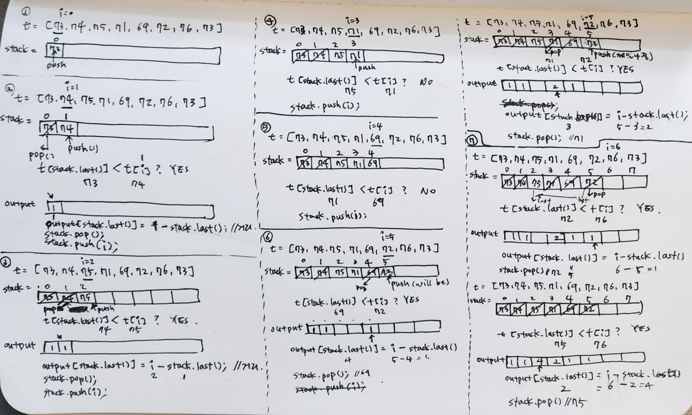
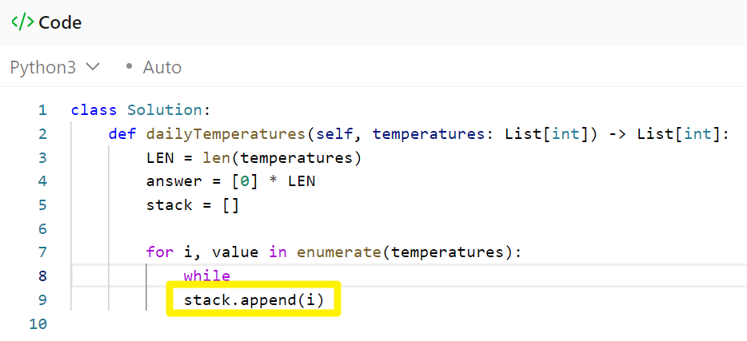
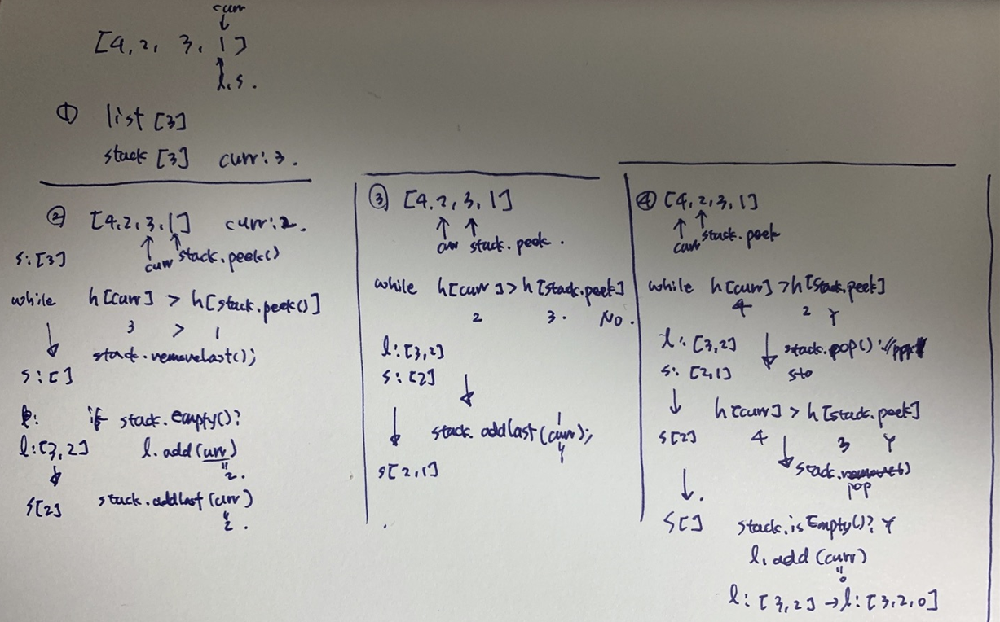

# Monotoic Stack 개념정리

Monotonic Stack 은 원소가 increasing/decreasing 으로 정렬되어 있는 배열을 의미한다.<br/>

Monotonic Stack 그 자체로 유용함은 없지만 정렬되어 있지 않은 배열을 Monotonic Stack 으로 만들어가는 과정 또는 Monotonic Stack에 새로운 요소가 들어왔을 때 다시 Monotonic Stack 으로 정렬하는 과정에서 발생하는 정보들이 유용하다<br/>


increasing 문제

- 삽입하려는 값이 stack 의 top 보다 클 때만 push. 삽입하려는 값 보다 작은 값은 모두 stack 에서 pop
- 배열에서 다음 작은 값이 무엇인지 알아낼 수 있다.

decreasing 문제

- 삽입하려는 값이 stack 의 top 보다 작을 때만 push. 삽입하려는 값보다 큰 값은 모두 stack 에서 pop
- 배열에서 다음 큰 값이 무엇인지 알 수 있다.

<br/>


대표적인 예제

- Daily Temperatures (Leetcode 739)
- Building with an Ocean View (LeetCode 1762)
- Largest Rectangle in Histogram (LeetCode 84)
- (프로그래머스) 주식가격

<br/>


## 참고자료

- https://iridescentboy.tistory.com/146
- https://velog.io/@soopsaram/Monotonic-Stack-%EB%AC%B8%EC%A0%9C

<br/>


## overview

역시 그냥 많은 문제를 풀어보고 반복해서 풀어보는게 중요하다. 백마디 설명문서를 적는 것 보다 문제 두 세 문제씩 시간 내서 풀어보는게 중요하다고 느꼈다.<br/>

<br/>


## Leetcode 739 (Daily Temperatures)

- Leetcode : [Daily temperatures](https://leetcode.com/problems/daily-temperatures/description/)
- Neetcode : [Monotonic Stack - Daily Temperatures - Leetcode 739](https://youtu.be/cTBiBSnjO3c)

<br/>


Given an array of integers `temperatures` represents the daily temperatures, return *an array* `answer` *such that* `answer[i]` *is the number of days you have to wait after the* `ith` *day to get a warmer temperature*. If there is no future day for which this is possible, keep `answer[i] == 0` instead.<br/>

 

**Example 1:**

```
Input: temperatures = [73,74,75,71,69,72,76,73]
Output: [1,1,4,2,1,1,0,0]
```

**Example 2:**

```
Input: temperatures = [30,40,50,60]
Output: [1,1,1,0]
```

**Example 3:**

```
Input: temperatures = [30,60,90]
Output: [1,1,0]
```

 <br/>


**Constraints:**

- `1 <= temperatures.length <= 105`
- `30 <= temperatures[i] <= 100`

<br/>


### 문제 설명

temperature \[i\] 가(i = 0 ... k... n-1) 있을때, temperature\[k\] 에서 몇일 뒤에 더 따뜻한 날씨가 나타나는지를 찾는 문제<br/>



처음 monotonic stack 을 보고 공부할 때 그림을 이렇게 그렸었다. 그땐 왜 미련하게 java로 코딩테스트 준비를 했는지 ㅋㅋㅋ <br/>

코딩테스트 언어를 python 으로 바꾸고 나니까 python 코드를 보면 머릿속에서 그려진다. 그래서 그림에 대한 설명은 생략<br/>


한가지 주의사항은 이렇다.



for \~ while ... 을 세우기에 앞서서 stack.append(i) 를 먼저 코드로 입력해둔 후에 머릿속으로 계속 어떤 요소들이 stack에 들어갈지를 인지하게끔 해줘야 한다. 그냥 풀어내듯이 차례대로 for loop 뒤에 while 문 코드를 바로 작성하면 이게 불가능하다.<br/>

위 코드에서는 온도 배열의 현재 검사하려는 위치인 i 가 stack에 넣어둔 후 테스트를 하려고 하는 시점이다.<br/>

<br/>


### python

```python
class Solution:
    def dailyTemperatures(self, temperatures: List[int]) -> List[int]:
        LEN = len(temperatures)
        answer = [0] * LEN
        stack = []

        for i, value in enumerate(temperatures):
            while stack and temperatures[stack[-1]] < value:
                prev_i = stack.pop()
                answer[prev_i] = i - prev_i
            stack.append(i)
        
        return answer
```

<br/>


### java

```java
import java.util.*;

class Solution {
    public int[] dailyTemperatures(int[] temperatures) {
        Stack<Integer> stack = new Stack<>();
        int [] t = temperatures;
        int [] output = new int [temperatures.length];
        for(int i=0; i<t.length; i++){
            while(!stack.isEmpty() && t[stack.peek()] < t[i]){
                output[stack.peek()] = i - stack.peek(); 
                stack.pop();
            }
            stack.push(i);
        }

        return output;
    }
}
```

<br/>


## Leetcode 1762. Buildings With an Ocean View

Leetcode : https://leetcode.com/problems/buildings-with-an-ocean-view/<br>

<br/>


There are `n` buildings in a line. You are given an integer array `heights` of size `n` that represents the heights of the buildings in the line.<br>

The ocean is to the right of the buildings. A building has an ocean  view if the building can see the ocean without obstructions. Formally, a building has an ocean view if all the buildings to its right have a **smaller** height.<br>

Return a list of indices **(0-indexed)** of buildings that have an ocean view, sorted in increasing order.<br>

<br>

**Example 1:**

```
Input: heights = [4,2,3,1]
Output: [0,2,3]
Explanation: Building 1 (0-indexed) does not have an ocean view because building 2 is taller.
```

**Example 2:**

```
Input: heights = [4,3,2,1]
Output: [0,1,2,3]
Explanation: All the buildings have an ocean view.
```

**Example 3:**

```
Input: heights = [1,3,2,4]
Output: [3]
Explanation: Only building 3 has an ocean view.
```

<br>


### 문제 설명

heights \[i\] 가(i = 0 ... k... n-1) 있을때, heights \[k\] 에서 단조 감소인 모노토닉 스택이 될 수 있는 인덱스만 찾아서 리턴하는 문제<br/>

첫 번째 문제처럼 대놓고 정직한 문제는 아니다.<br/>

약간은 꼬아서 나온 문제인데, 만약 i=0 부터 시작할 경우 시야를 막는지 아닌지 체크하기 어렵다. 그래서 i=n-1...k... 0 의 순서로 순회를 한다. 아이디어를 떠올리기가 처음에는 쉽지 않으며 monotonic stack 을 구현하는 것도 쉽지가 않다.<br/>



<br/>

이 그림 역시 파이썬을 사용한다면 그림을 그려 볼 필요가 없었다. 자바로 풀때는 아이디어가 쉽게 떠오르지 않기 때문에 위와 같이 그림을 그리게  된다.<br/>

<br/>


### python

```python
class Solution:
    def findBuildings(self, heights: List[int]) -> List[int]:
        answer = []
        stack = []
        LEN = len(heights)

        for i in reversed(range(LEN)):
            while stack and heights[stack[-1]] < heights[i]: 
                # 뒷 건물에 막혀서 시야가 안보이는 건물들의 스택이 비어있게 될 때까지 pop
                stack.pop()

            if not stack:
                answer.append(i) # 시야가 안보이는 건물들을 모두 pop 한 후 조건에 맞는 i는 answer에 추가

            stack.append(i)
        
        answer.reverse()
        return answer
        
```

<br/>


### Java

```java
public static int [] stackway1(int [] heights){
    int len = heights.length;

    // 이전에 거쳐간 건물들을 기록한다.
    // 주로 테스트를 통과하지 못한 건물들이 남는다.
    Deque<Integer> stack = new LinkedList<>();
    List<Integer> buildings = new ArrayList<>();

    // 뒤에서부터 조사를 시작한다.
    for(int curr=len-1; curr>=0; curr--){
        // 내 앞을 가로막는 건물이 없다면, 테스트를 통과. 
        // 테스트를 통과한 것들은 스택에서 제거한다.
        while(!stack.isEmpty() && heights[curr] > heights[stack.peekLast()]){
            stack.removeLast();
        }

        // stack 이 비어있지 않다는 것은 내 앞을 가로막는 건물이 있다는 것
        if(stack.isEmpty()){ // stack 이 비어있다면, 내 앞을 가로막는 건물이 없다는 것
            buildings.add(curr);
        }

        stack.addLast(curr);
    }

    int [] ans = new int [buildings.size()];
    for(int i=buildings.size()-1; i>=0; i--){
        ans[i] = buildings.get(buildings.size() - i -1);
    }

    return ans;
}
```

<br/>


## Leetcode 84. Largest Rectangle in Histogram

- Leetcode : [Largest Rectangle In Histogram](https://leetcode.com/problems/largest-rectangle-in-histogram/)
- Neetcode : [Largest Rectangle In Histogram - Leetcode 84](https://youtu.be/zx5Sw9130L0)


