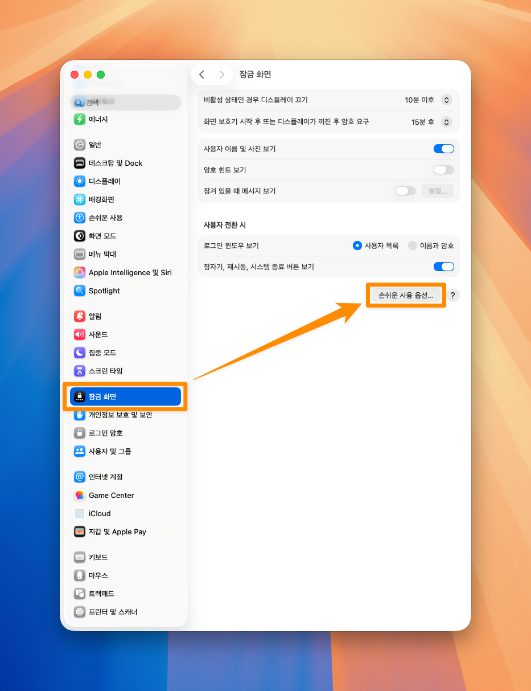
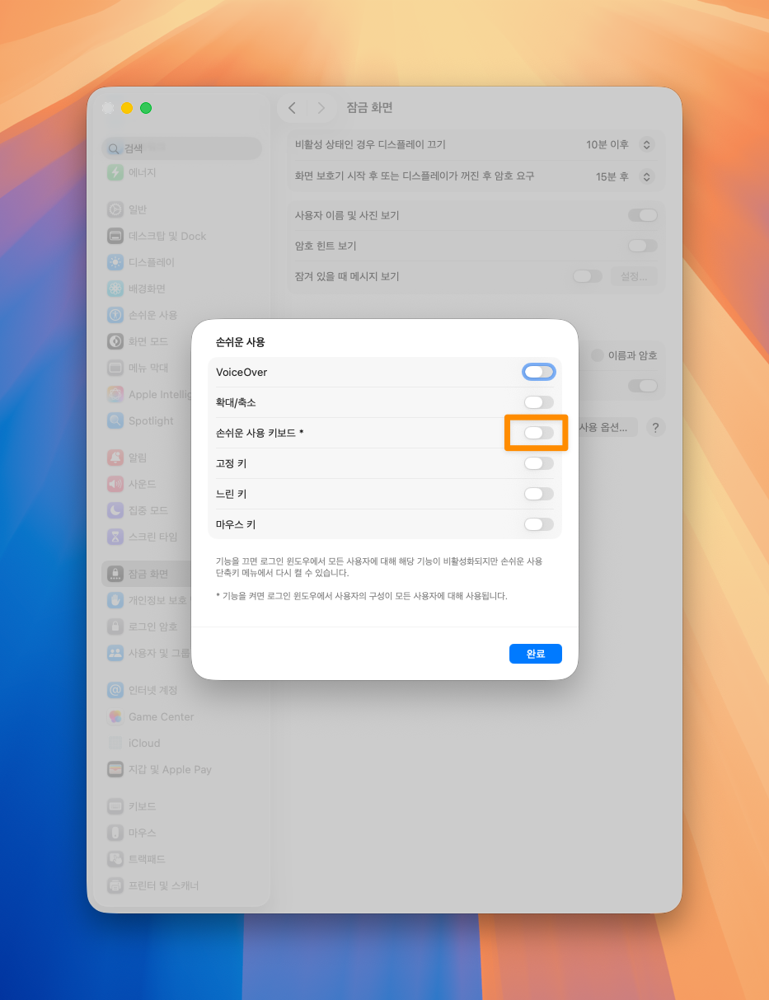

# 잠금화면에 나타나는 가상키보드 안뜨게 하기

참고자료
- https://learner-master.tistory.com/36

 

시스템 설정 ➝ 잠금화면 ➝ 손쉬운 사용 옵션 

 

`손쉬운 사용 키보드` 가 켜져있다. (나는 이 키보드 전혀 손쉽게 사용한적이 없다. 클릭도 드럽게 힘들어...)

 

`손쉬운 사용 키보드`를 꺼준다.

 

