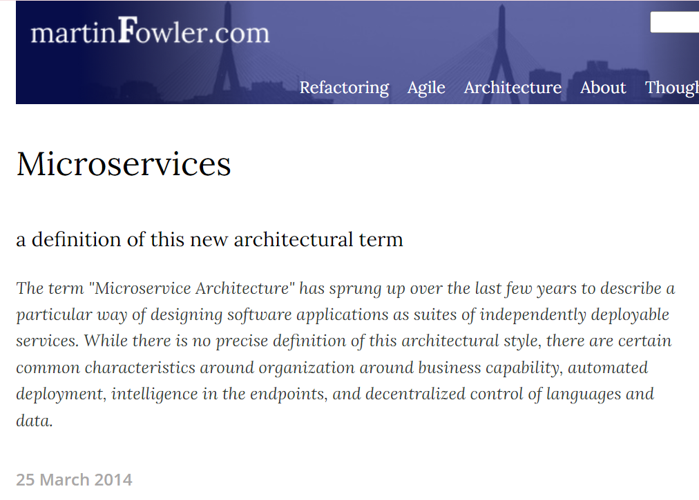

## 01. MSA 기초 지식

## 애플리케이션의 변화 양상

Local Application

- 초창기에는 로컬에서 바이너리로 동작하는 .exe, .app 등과 같은 클라이언트 프로그램들이 주를 이루었습니다.

Client - Server Model Application

- 클라이언트 - 서버 구조의 애플리케이션이 점점 많아지기 시작

Web Application

- Browser 에 웹 페이지를 보여주는 웹 애플리케이션의 태동

Modern Application

- Frontend가 하나의 큰 요소가 되었고, Backend API 는 점점 MSA 와 같은 형태로 여러 백엔드 API 를 Frontend가 호출하거나 Backend API 끼리도 서로 호출하는 구조로 변모해감

 

## 2010 년도 이전, 이후

2010년도 까지는 어느 정도는 정적인 페이지와 Flash 등을 이용한 PC 기반의 웹 애플리케이션이 많았던 것으로 기억합니다.  

하지만 2010년도 이후로 스마트폰이 나타나고 모바일 메신저도 도입되면서 이전보다 트래픽이 더 커지기도 했고, 여러 종류의 모바일 기기를 지원해야 했으며, 백엔드 애플리케이션 하나로 다양한 요구사항을 감당할 수 없는 경우가 생기게 되어서 필요에 따라 백엔드를 여러 개의 백엔드로 나눠서 조합하는 마이크로 서비스 아키텍처가 등장했습니다. 

또한 인프라 환경 역시 클라우드 중심으로 이동하면서 클라우드 네이티브 개발이 중요해지게 되었습니다. 

모바일 환경이 점점 수요가 많아지면서 웹페이지를 렌더링 하기 보다는 API 를 제공하는 백엔드 서비스로서의 역할이 점점 강조되기 시작했으며 프론트엔드는 점점 독자적인 분야로 발전하게 되었습니다. 

또한 인터넷 통신을 이용한 전자상거래 서비스가 많아지면서 백엔드 서비스가 처리해야 할 트래픽의 레벨도 늘어났으며, 이전과는 다르게 실시간 데이터를 제공해야 한느 경우도 있었으며, 인터넷 사업이 커지면서 인터넷 사업의 특성상 장애 발생했을때 손실이 커진 경우에 대한 대책 역시 필요해졌습니다.  

이렇게 사업적인 환경 뿐만 아니라 IT기기들 역시 점점 변모하면서 레거시 개발환경 보다는 새로운 형태의 서비스 개발 방식이 필요해지게 됐습니다. 

 

## 스케일 아웃

VM 단위로 서비스를 분리하는 케이스 역시 이 때부터 생겨났습니다. 웹 페이지 등에 들어가야 할 비즈니스 로직들이 세분화되고 사용자의 데이터 역시 기하급수적으로 증가하다보니 특정 기능 하나가 잡고 있는 병목구간이 전체 서비스의 발목을 잡고있거나 특정 기능 하나를 수정하기 위해서 전체 서비스 배포를 해야 하는 구조에서는 인터넷 비즈니스 사업에서 소모되는 손실이 컸기 때문입니다. 

주로 특정 서비스를 스케일 아웃을 하거나, 특정 비즈니스로직만을 jar 로 배포하거나 독자적인 vm 에 배포하는 등의 형태가 생겼습니다. 

 

## Front Server

최근에는 Gateway 라고도 알려진 개념은 예전에는 Front Server 라고 불리는 시스템으로 개발되어 왔던 적이 있습니다. 

이 당시에는 Front Server 가 Product, User, Inventory, Notification 등과 같은 각각의 서비스의 서버와 통신을 하고 조율하는 역할을 하는 프록시 같은 서버 역할을 수행하기도 했습니다. 

 

## 암달의 법칙

스케일아웃을 하더라도 서비스마다 사용하는 Database 를 별도로 분리하지 않으면 암달의 법칙에 의해 처리량에 한계가 발생하게 됩니다. 

암달의 법칙은 암달의 저주라고도 불리는데, 컴퓨터 시스템 내의 일부를 개선할 때 최대 성능 향상이 얼마나 이뤄지는 지를 계산하는데에 사용되는 법칙입니다. 

(참고 : [암달의 법칙](https://ko.wikipedia.org/wiki/%EC%95%94%EB%8B%AC%EC%9D%98_%EB%B2%95%EC%B9%99))

위 그림에서 부하가 1% 에 해당하는 리소스를 잡을 경우의 그래프는 초록색그래프이며 99% 의 리소스로 어느 정도의 성능향상이 이뤄지는 지를 보여주고 있습니다. 이 때 Processor 를 256 개까지 성능에 비약적인 발전이 이뤄지지만 어느 순간부터는 동일한 성능을 내게 됩니다. 

 

## 마이크로서비스는 무엇일까?

마틴 파울러의 개인 홈페이지 ([https://martinfowler.com/articles/microservices.html](https://martinfowler.com/articles/microservices.html) ) 내에는 Microservice 를 설명하는 글이 있는데 한번 꼭 읽어보시길 추천드립니다.

> “마이크로서비스 아키텍처"라는 용어는 지난 몇 년 동안 소프트웨어 애플리케이션을 독립적으로 배포 가능한 서비스 모음으로 설계하는 특정 방식을 설명하기 위해 등장했습니다. 이 아키텍처 스타일에 대한 정확한 정의는 없지만 비즈니스 기능, 자동화된 배포, 엔드포인트의 인텔리전스, 언어 및 데이터의 분산 제어를 중심으로 한 조직과 관련된 몇 가지 공통적인 특징이 있습니다.

 

그리고 Micro Service 의 Architecture 에 대해서는 아래와 같이 요약해주고 있습니다.

In short, the microservice architectural style is an approach to developing a single application as a suite of small services, each running in its own process and communicating with lightweight mechanisms, often an HTTP resource API. These services are built around business capabilities and independently deployable by fully automated deployment machinery. There is a bare minimum of centralized management of these services, which may be written in different programming languages and use different data storage technologies. 

 

간단히 말해, 마이크로서비스 아키텍처 스타일은 하나의 애플리케이션을 여러 개의 작은 서비스 모음으로 개발하는 접근 방식으로, **각각 자체 프로세스에서 실행되고 가벼운 메커니즘(주로 HTTP 리소스 API)과 통신**합니다. 이러한 서비스는 **비즈니스 기능을 중심으로 구축**되며 완전 자동화된 배포 기계에 의해 독립적으로 배포할 수 있습니다. 이러한 서비스는 서로 다른 프로그래밍 언어로 작성되고 서로 다른 데이터 저장 기술을 사용할 수 있으며, 최소한의 중앙 집중식 관리만 이루어집니다. 

 

주요 내용들을 추려보면 이렇습니다.

- 애플리케이션을 독립적인 서비스 단위로 구축
  - 애플리케이션을 여러 개의 작은 서비스 단위로 구분지어 개발
  - 서비스는  비즈니스 기능을 중심으로 구축됨
  - 각각의 서비스는 HTTP Resource API 와 같은 가벼운 통신방식을 통해 서로 통신
- 자동화된 배포 
  - 완전 자동화된 배포 기계에 의해 독립적으로 배포할 수 있어야 함
- 서로 다른 프로그래밍 언어로 작성 가능
- 서로 다른 데이터 저장 기술을 사용할 수 있으며 중앙집중식 관리는 가급적 최소화

 

## 모놀리딕

Monolithic applications can be successful, but increasingly people are feeling frustrations with them - especially as more applications are being deployed to the cloud . Change cycles are tied together - a change made to a small part of the application, requires the entire monolith to be rebuilt and deployed. Over time it's often hard to keep a good modular structure, making it harder to keep changes that ought to only affect one module within that module. Scaling requires scaling of the entire application rather than parts of it that require greater resource. 

 

위 그림에서 왼쪽은 모놀리딕, 오른쪽은 마이크로 서비스입니다. 

모놀리딕 애플리케이션은 전체애플리케이션이 하나의 묶음으로 되어 있습니다. 빨간색, 분홍색, 주황색, 하늘색, 초록색 블록은 애플리케이션을 구성하는 하나의 기능을 의미합니다. 모놀리딕 애플리케이션에서는 이 것들을 따로 분리하지 않고 전체 애플리케이션으로 배포합니다. 전체 기능이 하나의 애플리케이션으로 묶어서 제공되기에 모놀리딕 애플리케이션을 레플리케이션을 통해 스케일아웃하면 왼쪽 그림처럼 전체 서비스가 레플리케이팅 됩니다. 이렇게 되면 하나의 기능만 수정해도 전체 애플리케이션을 빌드하고 재배포해야 하는 불편함이 있습니다. 

서비스 초기 기능의 개발을 하는 것이라면 마이크로 서비스를 섣불리 도입했다가 관리가 힘들어지는 것 보다는 적당한 규모의 모놀리딕 방식으로 관리하는 것이 더 효율적일 수 있습니다. 

 

마이크로 서비스는 서비스 바운더리를 잘 구분 지어서 서비스 단위로 독립적인 역할을 하며 HTTP 등과 같은 Resource API로 서로가 통신하는 방식입니다. 빨간색, 분홍색, 주황색, 하늘색, 초록색 블록은 애플리케이션을 구성하는 하나의 서비스를 의미합니다. 마이크로서비스에서는 전체 애플리케이션이라는 단위보다는 각각의 마이크로 서비스 단위로 독립적인 단위를 구성하며 각각의 마이크로서비스가 레플리케이팅되어 스케일아웃 되게 됩니다.  

서비스가 발전해서 공격적으로 새로운 기능을 추가해야 하는데, 하나의 기능을 수정할 때 전체 서비스를 재기동하거나 재배포하는 상황이 고, 서비스를 사용하고 있는 사용자가 많아져서 서비스 점검을 자주 하기에 쉽지 않은 상황이라면, 잦은 수정이 발생하거나 분리가 필요한 기능들을 마이크로 서비스로 분리해서 재배포합니다. 가급적 모놀리딕 서비스에서 필요한 부분들을 하나씩 필요에 의해 서비스의 경계를 구분지어서 마이크로 서비스로 분리하는 것이 권장됩니다. 

레거시 모놀리딕을 MSA로 전환 시에는 가급적 모든 부분이 분리되어야 한다는 관점보다는 비즈니스 요건을 잘 따져서 분리되어야 하는 기능들을 서비스 단위로 구분해야 한다는 점을 잘 인지해야 합니다. 

 

## 비즈니스 역량 중심의 조직 분할 (Organize around Business Capabilities)

Organized around Business Capabilities 
When looking to split a large application into parts, often management focuses on the technology layer, leading to UI teams, server-side logic teams, and database teams. When teams are separated along these lines, even simple changes can lead to a cross-team project taking time and budgetary approval. A smart team will optimise around this and plump for the lesser of two evils - just force the logic into whichever application they have access to. Logic everywhere in other words. This is an example of Conway's Law in action. 

> Any organization that designs a system (defined broadly) will produce a design whose structure is a copy of the organization's communication structure.
>
> -- Melvin Conway, 1968
>
> (시스템을 설계하는 모든 조직(광범위하게 정의)은 조직의 커뮤니케이션 구조를 복사한 디자인을 만들게 됩니다.)

 

옛날 개발조직들은 프론트엔드 개발1팀, 프론트엔드 개발2팀, 데이터베이스팀, 백엔드 개발1팀,... 같은 이런 이름으로 나뉘어서 개발되고 있었으며, 현재에도 소규모의 비즈니스 조직들은 대부분 비즈니스의 서비스 하나를 의미하는 팀이 아닌 기술계층으로 구분지어서 팀을 구분하는 경우가 많습니다. 

이렇게 되면 위와 같이 하나의 큰 단순한 애플리케이션으로 구성되게 됩니다. 

 

The microservice approach to division is different, splitting up into services organized around **business capability**. Such services take a broad-stack implementation of software for that business area, including user-interface, persistant storage, and any external collaborations. Consequently the teams are cross-functional, including the full range of skills required for the development: user-experience, database, and project management. 

만약 애플리케이션이 비즈니스 적으로 규모가 커져서 서비스 단위로 분리해야만 하는 상황이 오면 비즈니스 요건에 맞게 각각의 서비스 경계를 구분지어서 서비스를 분할하고 조직 역시도 비즈니스에 맞춰서 분할되게 됩니다. 

 

## 프로젝트 보다는 프로덕트

Most application development efforts that we see use a project model: where the aim is to deliver some piece of software which is then considered to be completed. On completion the software is handed over to a maintenance organization and the project team that built it is disbanded. 

Microservice proponents tend to avoid this model, preferring instead the notion that a team should own a product over its full lifetime. A common inspiration for this is Amazon's notion of "you build, you run it" where a development team takes full responsibility for the software in production. This brings developers into day-to-day contact with how their software behaves in production and increases contact with their users, as they have to take on at least some of the support burden. 

The product mentality, ties in with the linkage to business capabilities. Rather than looking at the software as a set of functionality to be completed, there is an on-going relationship where the question is how can software assist its users to enhance the business capability. 

There's no reason why this same approach can't be taken with monolithic applications, but the smaller granularity of services can make it easier to create the personal relationships between service developers and their users. 

 

프로젝트 모델 

특정 소프트웨어를 만들어서 제공한다음 완료한 것으로 간주하는 모델을 이야기합니다. 개발 완료 후 소프트웨어는 유지보수 조직에 넘기며, 소프트웨어 개발 팀은 해체되는 모델입니다. 

 

프로덕트 

- 아마존의 "you build, you run it"  개념
- 한팀이 제품의 전체 라이프 사이클 동안 제품을 소유하면서 프로덕션 환경에서 소프트웨어가 어떻게 작동하는지 까지 모니터링 등을 하면서 운영하고 관리하는 것을 의미
- 제품중심의 사고 방식은 비즈니스 역량과 연결됨
- 소프트웨어를 완성해야 하는 기능의 집합으로 보지 않는다.
- 사용자의 비즈니스 역량을 강화하기 위해 어떤 도움을 줄 수 있는지 지속적인 관계에 주목

 

## Smart endpoints and dumb pipes

Microservice 커뮤니티는 Smart Endpoint 와 Dumb pipe 라는 대안적인 접근 방식을 선호합니다.

- WS-Coreography, BPEL 등과 같은 복잡한 프로토콜 지양
- 중앙 도구에 의한 오케스트레이션 지양
- 단순한 REST 프로토콜 지향

 

중앙에서 모든 절차를 관장하는 서비스,프로토콜을 가지는 것 보다는 서비스 간의 요청과 응답이 연결되는 형태를 선호합니다. 

메시지를 전달하는 프로토콜은 메시지를 라우팅하는 것 이상의 역할을 하지 않으며 단순히 메시지를 주고 받는(dumb pipe) 서비스의 엔드포인트 또는 메시지 큐가 통신을 담당하게 됩니다. 

마이크로 서비스 환경에서 주로 서비스간의 통신을 위해 권장되는 프로토콜은 HTTP, 경량 메시징(메시징)입니다.

- HTTP API
- RabbitMQ, ZeroMQ

 

### Decentralized Governance (탈 집중 거버넌스)

중앙집중형으로 대부분의 문제에 대해 표준화된 기술과 솔루션으로 접근하는 경우가 많았는데 중앙집중형은 여러 가지 다양한 종류로 발생하는 문제들에 대해 적절한 해답을 제시하지 못합니다. 예를 들면 어떤 기능에 대해 조직 내부적인 컨벤션을 두어서 무조건 비동기 통신만을 강제하는 경우가 있을 수 있는데 이런 방식의 거버넌스는 중앙 집중형 거버넌스로서, 프로덕트가 아닌 프로젝트 방식의 하향식의 거버넌스입니다. 

탈집중 거버넌스란, 서비스 별로 필요한 프레임워크, 데이터베이스, 메시지큐 등과 세부적인 기술들을 중앙에서 통제되는 것이 아닌 각각의 서비스에서 독자적으로 결정할 수 있도록 정하는 것을 의미합니다.  

 

## 인프라 자동화

지속적인 통합, 지속적인 배포를 통해 소프트웨어를 배포하고 그 과정을 자동화하는 것을 의미합니다. 위의 그림을 자세히 보면 컴파일,유닛테스트,기능테스트, acceptance test 등 여러가지 종류별 테스트 들을 파이프라인으로 해두었습니다. 이렇게 각각의 단계를 파이프라인으로 만들고 자동화 되게끔 인프라로의 배포를 자동화하게 됩니다. 

이런 자동화는 모놀리딕 애플리케이션에서도, 마이크로 서비스에서도 중요하게 사용됩니다. 자동화된 배포 파이프라인이 만들어지고 나면 더 이상 배포가 두려운 작업이 되지 않기에 더 이상 어렵게 느껴지지 않게 되어 '지루한' 작업으로 느끼게 됩니다. 

마이크로서비스는 프로덕션 레벨에서 제품의 빌드,배포 파이프라인이 복잡해지고 다양해질수 있기에 일정 수준의 자동화가 이뤄져야 합니다.  

## 장애를 대비한 설계 (Design for failure)

일반적으로 애플리케이션은 장애에 대응할 수 있도록 개발되아야 합니다. 

공급업체의 가용성 부족으로 인해 서비스 호출이 실패할 수 있으며, 클라이언트는 이에 최대한 원활하게 대응해야 합니다. 이는 모놀리식 설계에 비해 이를 처리하는 데 추가적인 복잡성이 발생한다는 단점이 있습니다. 결과적으로 마이크로서비스 팀은 서비스 장애가 사용자 경험에 어떤 영향을 미치는지 끊임없이 고민해야 합니다.  

서비스는 언제든지 장애가 발생할 수 있으므로 장애를 신속하게 감지하고 가능한 경우 자동으로 서비스를 복원할 수 있어야 합니다. 마이크로서비스 애플리케이션은 애플리케이션의 실시간 모니터링에 중점을 두고 아키텍처 요소(데이터베이스의 초당 요청 수)와 비즈니스 관련 메트릭(예: 분당 주문 수)을 모두 확인합니다. 시맨틱 모니터링은 개발팀이 후속 조치를 취하고 조사하도록 트리거하는 문제 발생에 대한 조기 경보 시스템을 제공할 수 있습니다. 

마이크로서비스 아키텍처에서는 안무와 이벤트 협업에 대한 마이크로서비스의 선호도가 돌발적인 행동으로 이어지기 때문에 이는 특히 중요합니다. 많은 전문가들이 우발적 출현의 가치를 높이 평가하지만, 사실 우발적 행동은 때때로 나쁜 영향을 미칠 수 있습니다. 모니터링은 나쁜 긴급 행동을 신속하게 발견하여 수정할 수 있도록 하는 데 필수적입니다. 

모놀리스는 마이크로서비스처럼 투명하게 구축할 수 있으며, 실제로 그렇게 해야 합니다. 차이점은 서로 다른 프로세스에서 실행 중인 서비스가 언제 연결이 끊어졌는지 반드시 알아야 한다는 것입니다. 동일한 프로세스 내의 라이브러리에서는 이러한 종류의 투명성이 유용할 가능성이 적습니다. 

마이크로서비스 팀은 가동/중단 상태와 다양한 운영 및 비즈니스 관련 메트릭을 보여주는 대시보드와 같이 각 개별 서비스에 대한 정교한 모니터링 및 로깅 설정을 기대할 수 있습니다. 회로 차단기 상태, 현재 처리량 및 지연 시간에 대한 세부 정보는 우리가 흔히 접하는 다른 예입니다. 

 

## 진화적 설계 (Evolutionary Design)

마이크로 서비스는 애플리케이션을 자주 빠르게 변경하는 것에 주안점을 두는 설계 원칙을 가집니다. 실제로 소프트웨어를 구성하는 요소들은 굉장이 자주 폐기됙 다시 만들어지는 과정을 거칠때가 많습니다. 

마이크로 서비스로 진화하는 예 

- Guardian 웹사이트
- 모놀리스로 설계 및 구축되었지만 마이크로서비스 방향으로 진화하고 있는 애플리케이션의 좋은 예
- 모놀리스는 여전히 Guardian 웹사이트의 핵심이지만, 모놀리스의 API를 사용하는 마이크로서비스를 구축하여 새로운 기능을 추가하는 방식을 선호
- 이 접근 방식은 스포츠 이벤트를 처리하기 위한 전문 페이지와 같이 본질적으로 일시적인 기능에 특히 유용
- 이러한 웹사이트의 일부는 신속한 개발 언어를 사용하여 신속하게 구성하고 이벤트가 끝나면 제거할 수 있습니다. 시장 기회를 위해 새로운 서비스를 추가했다가 몇 달 또는 몇 주 만에 폐기하는 금융 

 

컴포넌트를 서비스에 넣으면 보다 세분화된 릴리스 계획을 세울 수 있습니다. 모놀리스에서는 모든 변경 사항을 적용하려면 전체 애플리케이션을 빌드하고 배포해야 합니다. 하지만 마이크로서비스를 사용하면 수정한 서비스만 다시 배포하면 됩니다. 따라서 릴리스 프로세스가 간소화되고 속도가 빨라집니다.  

단점은 한 서비스의 변경으로 인해 **다른 서비스가 중단되는 것을 걱정해야 한다는 것**입니다. 전통적인 통합 접근 방식은 버전 관리를 사용하여 이 문제를 해결하는 것이지만, 마이크로서비스 세계에서는 **버전 관리를 최후의 수단으로만 사용하는 것을 선호**합니다.  

공급업체의 변경에 최대한 내성을 갖도록 서비스를 설계하면 많은 버전 관리를 피할 수 있습니다. 

 

