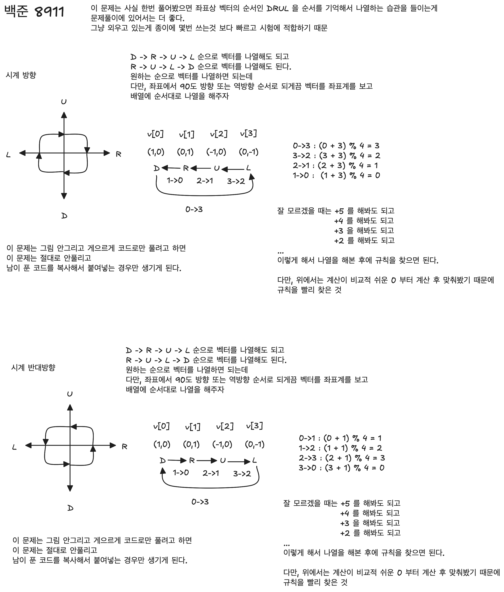
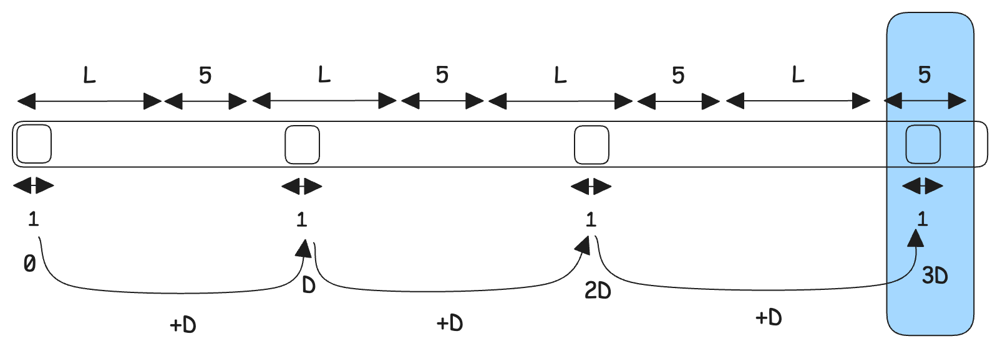
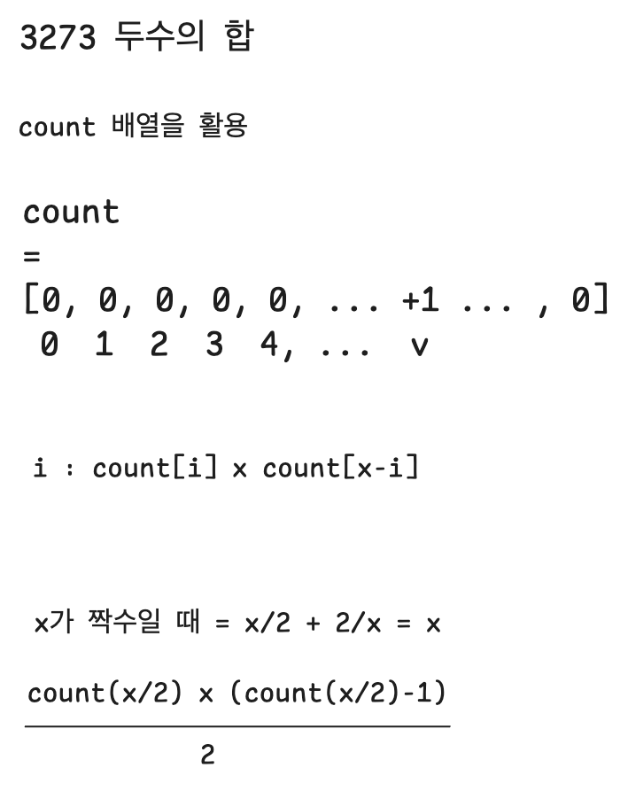

# 1. 11053 - 가장 긴 증가하는 부분 수열

## 문제 링크

- http://acmicpc.net/problem/11053

# 2. 1932 - 정수삼각형


# 3. 13549 - 숨바꼭질 3

## 문제 링크

- http://acmicpc.net/problem/13549


## 설명

bfs 다. PriorityQueue 를 사용할 때, 주의할 점은 pq.size() 로 호출하는 것이 아니라 pq.qsize() 로 호출해야 한다. 주의하자.

## 풀이

```python
from queue import PriorityQueue

n, k = map(int, input().split())

adj = [[] for _ in range(200001)]

for i in range(200001):
    if i > 0:
        adj[i].append((i-1, 1))
    if i < 200000:
        adj[i].append((i+1, 1))
    if 2 * i <= 200000:
        adj[i].append((2*i, 0))

dist = [1e9] * (200001)

pq = PriorityQueue()
pq.put((0, n))
dist[n] = 0


while pq.qsize() != 0:
    d, u = pq.get()

    if d != dist[u]:
        continue

    for v, cost in adj[u]:
        if dist[v] > dist[u] + cost:
            dist[v] = dist[u] + cost
            pq.put((dist[v], v))

print(dist[k])
```

<br/>


# 4. 8911 - 거북이

## 문제 링크

- http://acmicpc.net/problem/8911

<br/>

## 설명



<br/>


## 풀이

```python
t = int(input())

directions = [(1,0), (0,1), (-1,0), (0,-1)]

for _ in range(t):
    move_history = input()

    did = 1
    x = 0
    y = 0

    minx = 0
    miny = 0
    maxx = 0
    maxy = 0
    for move in move_history:
        if move == 'L':
            did = (did + 1) % 4
        if move == 'R':
            did = (did + 3) % 4
        if move == 'F':
            x += directions[did][0]
            y += directions[did][1]
        if move == 'B':
            x -= directions[did][0]
            y -= directions[did][1]

        minx = min(minx, x)
        miny = min(miny, y)
        maxx = max(maxx, x)
        maxy = max(maxy, y)
    
    print((maxx - minx) * (maxy - miny))
```

<br/>

# 5. 1333 - 부재 중 전화

## 문제 링크

- http://acmicpc.net/problem/1333

<br/>


## 설명

- 노래의 곡 개수 N : 1 ≤ N ≤ 20
- 노래의 최대 길이 L : 1 ≤ L ≤ 180

<br/>

check 라고 불리는 체크 용도의 배열을 선언해서 사용한다.<br/>

최대 3600 까지가 최대 구간인데, 넉넉하게 잡아서 5000 정도를 최대치로 잡아서 배열이 0 \~ 4999 의 위치에 존재할 수 있도록 5000 크기의 배열을 하나 선언한다.<br/>

<br/>



<br/>


 ## 풀이

```python
n,l,d = map(int, input().split())

check = [False] * 5000

index = 0

for _ in range(n):
    for _ in range(l):
        check[index] = True
        index += 1
    
    for _ in range(5):
        index += 1

for i in range(0, 5000, d):
    if not check[i]:
        print(i)
        break

```

<br/>


# 6. 1135 - 뉴스 전하기 (어렵다)

## 문제 링크

- http://acmicpc.net/problem/1135
- http://icpc.me/1135

## 설명

다이나믹 프로그래밍<br/>

트리모양으로 풀어내는데 다음과 같이 풀어낸다.<br/>

점화식은 다음과 같다.

- D(1) : 최종 목표로 구할 값
- D(u) = u 번 사원이 자기 부하들로부터 소식을 받는 최소 시간
  - D(u) 는 다음과 같이 구성된다. 하위 트리의 각 노드 v1 \~ vk 에 대해 계산이 다음과 같이 이뤄짐
  - 1 + D(v1) + 2 + D(v2) + ... + k + D(vk)
  - 1+, 2+, k+ 의 의미
    - 1은 자기자신이 소식을 듣는 cost 인 1 이고 D(v1) 은 하위노드까지의 합(재귀연산)
    - 2는 1번노드로 소식들었던거 + 2번노드가 소식듣는거 + D(v2) = v2 아래의 하위노드들의 합(재귀연산)
    - ...
    - k 는 1,2 ... k-1 까지 형제 노드들이 소식들은 cost + k번 노드가 소식을 들은 cost + D(vk) = vk 아래의 하위노드들의 코스트 (재귀연산)

<br/>


## 풀이

```python
n = int(input())

workers = list(map(int, input().split()))

child = [[] for _ in range(n)]

for i in range(1, n):
    child[workers[i]].append(i)

d = [0] * n

def dfs(u):
    # d[u] 값을 구하는 것이 목표

    times = []
    for v in child[u]:
        dfs(v)
        times.append(d[v])
    
    times.sort(reverse=True)

    # 번째 자녀가 n번째
    d[u] = 0
    for i in range(len(times)):
        d[u] = max(d[u], i + 1 + times[i])

dfs(0)
print(d[0])
```

<br/>


# 7. 2616 - 소형기관차 (어렵다)

다이나믹 프로그래밍


## 문제 링크

- http://acmicpc.net/problem/2616


## 설명

다이나믹 프로그래밍 문제다.

D(i)(j)

- 0 \~ i 번 객차를 소형기관차 j 개로 운반할 때 운반 가능한 최대 승객 인원
- D(n-1)(3)

<br/>

i 번째 객차를 포함시키지 않고 j 개의 소형기관차를 구성할 때

- D(i-1)(j)

i 번째 객차를 포함시키고 j 개의 소형 기관차를 구성할 때 

- sum ((i-k+1, i) + 1) + D(i-k)(j-1)

<br/>


## 풀이

```python
n = int(input())
a = list(map(int, input().split()))
k = int(input())

psum = [0] * n
psum[0] = a[0]

for i in range(1, n):
    psum[i] = psum[i-1] + a[i]

d = [[0] * 4 for _ in range(n)] # n x 4
for i in range(1, 4):
    d[0][i] = a[0]

for i in range(1, n):
    for j in range(1, 4):
        d[i][j] = d[i-1][j]

        if i <= k-1:
            d[i][j] = max(d[i][j], psum[i])
        else:
            sum = psum[i] - psum[i-k]
            d[i][j] = max(d[i][j], sum + d[i-k][j-1])

print(d[n-1][3])
```

<br/>


# 8. 3273 - 두수의 합

## 문제 링크

- http://acmicpc.net/problem/3273

<br/>

## 설명



<br/>


## 풀이

```python
n = int(input())
a = list(map(int, input().split()))
x = int(input())

count = [0] * 1000001
for i in range(n):
    count[a[i]] += 1

answer = 0
for i in range((x+1) // 2):
    if x - i >= 1000000:
        continue
    answer += count[i] * count[x-i]

if x%2 == 0:
    answer += count[x//2] * (count[x//2] -1) // 2

print(answer)
```

<br/>


# 9. 2014 - 소수의 곱

## 문제링크

- http://acmicpc.net/problem/2014

## 설명

우선순위 큐를 활용하는 문제다.

- 주어진 k 개의 소수들을 우선순위 큐에 넣는다.

<br/>


그리고 다음의 2가지 연산들을 n 번 반복한다.

- 가장 작은 수 x 를 우선순위 큐에서 빼준다.
- x * P(k) 를 수행한 결과를 우선순위 큐에 넣어준다.
  - e.g. x * P(1), x * P(2), x * P(3), ...
  - 단, x*P(k) 가 이미 PriorityQueue 에 들어간적이 있다면 넣어주지 않는다. Dictionary 에 따로 출현했던 수 들을 기록해두고 딕셔너리에 이미 존재하는 수일 경우에는 skip 하는 식으로 진행한다.

<br/>

위의 두 연산을 반복한다.<br/>

<br/>


## 풀이

```python
import heapq

k, n = map(int, input().split())
numbers = list(map(int, input().split()))


heap = []
for num in numbers:
    heapq.heappush(heap, num)

v = 0
for _ in range(n):
    v = heapq.heappop(heap)

    for num in numbers:
        if v * num >= 2 ** 31:
            break
        
        heapq.heappush(heap, v * num)
        if v % num == 0:
            break

print(v)
```

<br/>

