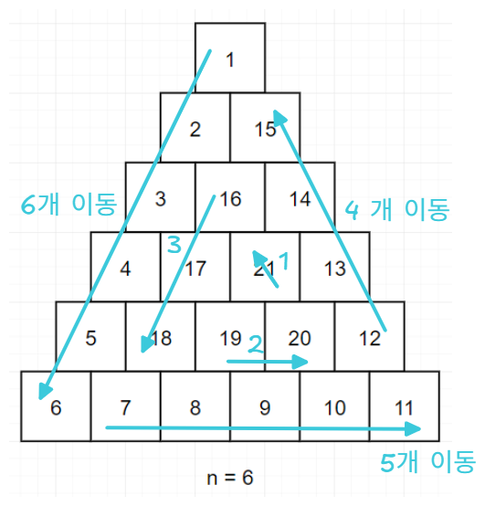

# 배열

# 교점에 별 만들기


# 행렬 테두리 회전하기

링크 : https://school.programmers.co.kr/learn/courses/30/lessons/77485

풀이방식은 2가지 풀이방법이 있다.<br/>

항상 느끼는 거지만, 일단 시작하는건 쉬운데, 시작하기 전에 어렵지 않은 방향을 미리 생각해둬서 문제풀이 방향을 결정하는건 어렵다. 문제풀이가 쉬운방향으로 결정하는게 어렵다구. 노력해야한다구.<br/>


왼쪽 → 아래 → 오른쪽 → 위 

```python
def rotate(x1, y1, x2, y2, matrix):
    first = matrix[x1][y1]
    min_value = first
    
    # 왼쪽
    for k in range(x1, x2):
        matrix[k][y1] = matrix[k+1][y1]
        min_value = min(min_value, matrix[k+1][y1])
    
    # 아래
    for k in range(y1, y2):
        matrix[x2][k] = matrix[x2][k+1]
        min_value = min(min_value, matrix[x2][k+1])
        
    # 오른쪽
    for k in range(x2, x1, -1):
        matrix[k][y2] = matrix[k-1][y2]
        min_value = min(min_value, matrix[k-1][y2])
    
    # 위
    for k in range(y2, y1 + 1, -1):
        matrix[x1][k] = matrix[x1][k-1]
        min_value = min(min_value, matrix[x1][k-1])
    
    matrix[x1][y1+1] = first
    return min_value

def solution(rows, columns, queries):
    matrix = [[(i) * columns + (k+1) for k in range(columns)] for i in range(rows)]
    result = []
    for x1, y1, x2, y2 in queries:
        result.append(rotate(x1-1, y1-1,x2-1,y2-1,matrix))
    
    return result
```

<br/>


슬라이싱을 이용해 최적화

```python
def solution(rows, columns, queries):
    answer = []
    board = [[columns * k + (i+1) for i in range(columns)] for k in range(rows)]
    for query in queries:
        a,b,c,d = query[0]-1, query[1]-1, query[2]-1, query[3]-1
        row1, row2 = board[a][b:d], board[c][b+1:d+1]
        _min = min(row1 + row2)
        
        for i in range(c, a, -1):
            board[i][d] = board[i-1][d]
            
            if board[i][d] < _min: _min = board[i][d]
        
        for i in range(a,c):
            board[i][b] = board[i+1][b]
            if board[i][b] < _min: _min = board[i][b]
        
        board[a][b+1:d+1], board[c][b:d] = row1, row2
        
        answer.append(_min)
    return answer
```

<br/>


# 삼각 달팽이

링크 : https://school.programmers.co.kr/learn/courses/30/lessons/68645


아래 그림을 그려본 후 풀었다. 



<br/>


이 문제는 다른 사람의 풀이를 보고 그대로 하면 무조건 틀린다 ㅋㅋ <br/>

살짝 귀찮더라도 이해만 하려하기보다 직접 한번은 풀어보면 '아!!!' 이렇게 된다. (내가 그랬다.)<br/>

<br/>


풀이

```python
def solution(n):
    DOWN = 0
    RIGHT = 1
    DIAGONAL = 2
    
    matrix = [[0]*n for i in range(1, n+1)]
    
    row = -1
    col = 0
    num = 1
    for i in range(0, n):
        for k in range(i, n):
            if i % 3 == DOWN:
                row += 1
            if i % 3 == RIGHT:
                col += 1
            if i % 3 == DIAGONAL:
                row -= 1
                col -= 1
                
            matrix[row][col] = num
            num+=1
    
    answer = []
    
    for i in range(0, n):
        for k in range(0, n):
            if matrix[i][k] == 0:
                break
            answer.append(matrix[i][k])
            
    return answer 
```

<br/>


# 거리두기 확인하기

링크 : https://school.programmers.co.kr/learn/courses/30/lessons/81302<br/>


풀이

```python
def solution(places):
    # 1) 배열기반 풀이
    people_position = make_people_position(places)
    print(f"people_position = {people_position}")
    
    answer = []
    for i, place in enumerate(places):
        d = check_answer(place, people_position[i])
        answer.append(d)

    return answer


# 거리두기가 지켜지지 않은 영역을 찾아내면 0 (false) 을 바로 return
# 끝까지 순회 후 거리두기가 지켜지지 않은 영역을 못찾으면 1 (true) 을 return
def check_answer(arr, people_position):
    for row1, col1 in people_position:
        for row2, col2 in people_position:
            dist = distance(row1, col1, row2, col2)
            # 같은 좌표(dist==0), 거리가 2 이상인 경우(dist>2)
            if dist == 0 or dist > 2:
                continue
            
            # 두 사람 사이의 거리가 1 인 경우 (파티션이 없다는 의미)
            if dist == 1:
                return 0
            
            # 열은 같지만 두 사람 사이에 파티션이 없는 경우
            elif col1 == col2 and arr[int((row1 + row2)/2)][col1] != 'X':
                return 0
            
            # 행은 같지만 두 사람 사이에 파티션이 없는 경우
            elif row1 == row2 and arr[row1][int((col1 + col2)/2)] != 'X':
                return 0
            
            # 대각선 체크 (행/열이 다른 경우를 체크)
            # 두 사람 사이에 파티션이 없으면 x
            elif row1 != row2 and col1 != col2:
                if arr[row2][col1] != 'X' or arr[row1][col2] != 'X':
                    return 0
    return 1


def distance(x1, y1, x2, y2):
    return abs(x1 - x2) + abs(y1 - y2)
    
def make_people_position(places):
    people_position = []

    for place in places:
        position = []

        for row in range(5):
            for col in range(5):
                if place[row][col] == 'P':
                    position.append((row, col))

        people_position.append(position)
    return people_position
```

<br/>


# 행렬 곱셈

Link : https://school.programmers.co.kr/learn/courses/30/lessons/12949


합을 저장할 리스트를 아래와 같이 선언했다가 `왜 답이 안나오지?` 하고 1시간 정도 원인을 찾았었다.

- `l = [[0]*COL]*ROW`

이후 아래와 같이 선언해서 했더니 잘 동작했다.

- `l = [[0]*len(arr2[0]) for _ in range(len(arr1))]`


<br/>


```python
def solution(arr1, arr2):
    ROW = len(arr1)
    COL = len(arr2[0])
    
    # l = [[0]*COL]*ROW
    l = [[0]*len(arr2[0]) for _ in range(len(arr1))]
    
    for r in range(ROW):
        for c in range(COL):
            for cc in range(len(arr1[0])):
                l[r][c] += arr1[r][cc] * arr2[cc][c]
            
    return l
```


