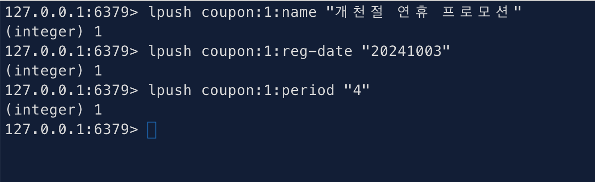
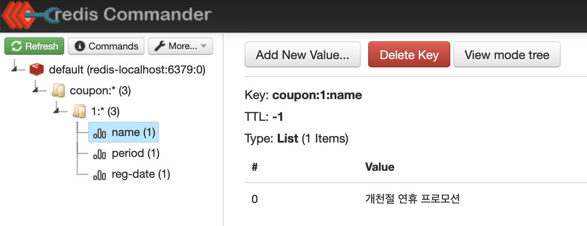
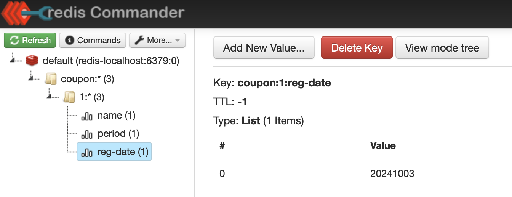

# Redis 컨벤션 - namespace

정해져있는 것은 아니지만, 통용되는 일반적인 컨벤션은 `{namespace}:{key}` 형식이다. 일반적인 redis 어드민, redis GUI 클라이언트 애플리케이션에서도 대부분 이렇게 읽어들인다.

e.g.

- set `{namespace1:key1} 2222`
- get `{namespace1:key1}`<br/>
  2222

<br/>


실제 저장되는 형태는 아래와 같은 형태로 저장된다.

```plain
namespace1
	ㄴ key1:2222
```

<br/>


네임스페이스를 여러개 두는 경우 역시 가능하다.

e.g.

- set `{namespace1:id1:field1} 1111` 
- get `{namespace1:id1:field1}`<br/>
  1111

<br/>


실제 저장되는 형태는 아래와 같은 형태로 저장된다.

```plain
namespace1
	ㄴ id1
		ㄴfield1:1111
```

<br/>


예를 들어 아래와 같이 redis-cli 에서 연산을 실행 한 경우를 살펴보자.<br/>

(코드를 텍스트로 넣을까 하다가 ... 나중에 볼때 이게 어디서 실행한건지 분간이 안될 것 같아서 캡처로 대체했다.)



<br/>

코드는 아래와 같다.

```bash
127.0.0.1:6379> lpush coupon:1:name "개천절 연휴 프로모션"
(integer) 1
127.0.0.1:6379> lpush coupon:1:reg-date "20241003"
(integer) 1
127.0.0.1:6379> lpush coupon:1:period "4"
(integer) 1
```

<br/>


이렇게 저장한 값을 redis commander 에서 확인해보자.<br/>

`coupon:1` 의 "name" 이라는 key 에 대한 value 는 List 인데 살펴보면 "개천절 연휴 프로모션" 이 잘 들어가 있음을 확인 가능하다.



<br/>

`coupon:1` 의 "reg-date" 라는 key 에 대한 value 는 List 인데 살펴보면 "20241003" 이 잘 들어가 있음을 확인 가능하다.



<br/>

`coupon:1` 의 "period" 라는 key 에 대한 value 는 List 인데 살펴보면 "4" 가 잘 들어가 있음을 확인 가능하다.


<br/>


