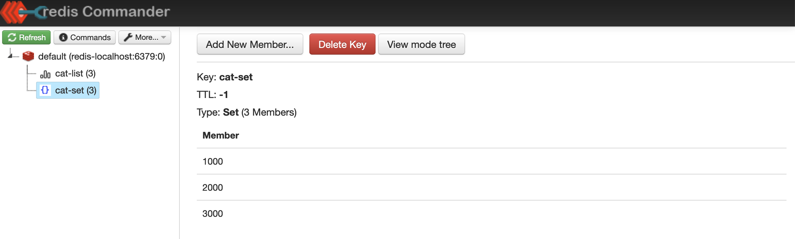
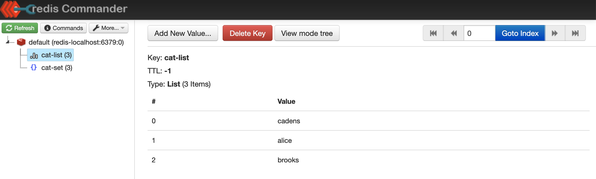

# LuaScript 를 Redis 에서 사용하기

재미없긴 하지만, Java 기반으로 예제를 작성합니다.<br/>

가끔 Redis 를 바라보는 애플리케이션 서버가 여러개 일때 동기화 이슈가 있는 데이터일 경우 lua 스크립트를 사용하는 경우가 있습니다. Redis 가 Redis 내에서 실행하는 lua 스크립트는 원자성과 격리성을 보장합니다.<br/>

<br/>


# 예제 시나리오

다음의 request 들을 요청으로 보내본다.

- http://localhost:8080/cat/1?name=a
- http://localhost:8080/cat/2?name=b
- http://localhost:8080/cat/2?name=c
- http://localhost:8080/cat/2?name=d
- http://localhost:8080/cat/2?name=e

<br/>


redis commander 에 아래의 값들이 바인딩되는지 확인한다.<br/>

- cat:{id1}:{name1}
- cat:{id2}:{name2}
- cat:{id3}:{name3}
- cat:{id4}:{name4}
- cat:{id5}:{name5}

<br/>


# 참고자료

- https://www.vinsguru.com/redis-lua-script-with-spring-boot/
- https://www.baeldung.com/spring-classpath-file-access
- https://junuuu.tistory.com/890

<br/>


# lua script 란?

레디스 내의 인터프리터는 Lua 스크립트를 읽을수 있으며 실행 가능합니다. Lua 스크립트를 사용하면, 레디스 머신 내에서 레디스 실행엔진이 Lua 스크립트를 인터프리터로 해석해서 스크립트를 실행합니다.

클라이언트인 각각의 개별 서비스에서 레디스의 List,Set 의 데이터를 복사한 후 열어서 접근할 때 레디스 입장에서는 동일한 값이 복제되었을 때에 대해 데이터가 모호해질 수 있습니다.

이런 경우에는 Redis 내에 구성한 List, Set 등과 같은 자료구조에 접근하는 주체가 Redis 머신이 되도록 바꿔주면, 데이터의 불일치 현상을 방지할 수 있습니다.

Redis 에 Script 를 통해 접근하면 Redis 서버 내에서의 Atomic 연산을 보장해줍니다. 따라서 Rate Limiter, Coupon 발급기 같은 작업 대기열 기반 트래픽 처리를 할 때 유용합니다.

Lua 라는 언어는 브라질에서 1993년도애 개발된 프로그래밍 언어인데, C/C++ 프로그램 내부에 포함시키기 쉬우면서 깔끔하고 쉬운 문법의 스크립트 언어입니다. Redis 는 C/C++ 기반으로 작성된 데이터 플랫폼입니다. 그리고 Lua 스크립트를 실행할 수 있도록 Lua 스크립트와 관련된 기능을 지원하고 있습니다.

Lua 언어의 설치는 [https://www.lua.org/download.html(opens in a new tab)](https://www.lua.org/download.html) 에서 다운로드 받아서 설치 가능합니다.

<br/>


# RedisScript Bean 등록

```java
package io.chagchagchag.example.redis_lua_example.config;

import org.springframework.context.annotation.Bean;
import org.springframework.context.annotation.Configuration;
import org.springframework.core.io.ClassPathResource;
import org.springframework.data.redis.core.script.RedisScript;

@Configuration
public class RedisScriptsConfig {
    @Bean
    public RedisScript<String> catLuaScript() {
        ClassPathResource classPathResource = new ClassPathResource("redis/lua_script.lua"); // (1)
        return RedisScript.of(classPathResource, String.class); // (2)
    }
}
```

(1)

- `src/main/resources/redis/lua_script.lua` 파일을 ClassPathResource 를 이용해서 읽어들입니다.

(2)

- 최대한 입출력을 간단하게 하기 위해 String 값으로 인자값들을 전달하도록 지정했습니다. 실제 형변환은 lua script 내에서 받아서 원하는 타입으로 변경하도록 하기로 했기 때문입니다.

<br/>


# LuaScript 작성 

이번 예제에서 사용할 lua script 의 내용은 다음과 같습니다.

```lua
local cat_id = tonumber(ARGV[1]) -- (1)
local cat_name = ARGV[2]
local cat_limit = tonumber(ARGV[3])

local key_set = KEYS[1]
local key_list = KEYS[2]

-- (2)
if redis.call('SISMEMBER', KEYS[1], ARGV[1]) == 1 then
    return 'DUPLICATED_ENQUEUE_REQUEST'
end

-- (3)
if cat_limit > redis.call('SCARD', KEYS[1]) then
    redis.call('SADD', key_set, cat_id)
    local value = cat_name
    redis.call('RPUSH', key_list, value)
    return 'SUCCESS'
end

return 'CAT_TRY_AGAIN'
```

(1) 

- tonumber 는 lua 에서 string 타입을 숫자타입으로 바꿀 때 사용하는 lua 의 내장 함수입니다.

주요 파라미터들을 정리해보면 다음과 같습니다.

(2)

- SET 자료구조에 넣어둔 고양이의 id 를 체크하기 위한 용도의 코드 블록입니다.

- `KEYS[1]` 에 해당하는 set 에 `ARGV[1]` 가 포함되는지를 검사합니다.

(3)

- SET 의 사이즈가 `cat_limit` 에 도달했는지를 검사하고 고양이의 id 를 Set 에 ADD 하고, 리스트에 고양이의 이름을 add 하기 위한 용도의 코드 블록입니다.
- 고양이의 id 는 `ARGV[1]` , 고양이의 이름은 `ARGV[2]` 로 넘겨주도록 자바 코드를 작성했으며 이에 대해서는 다음 섹션에서 확인 가능합니다.

`KEYS[1]`, `KEYS[2]` 

- `KEYS[1]` 은 자바코드 내에서 고양이의 id 를 저장하는 SET 에 대한 key 로 전달해주는 값입니다.
- `KEYS[2]` 은 자바코드 내에서 고양이의 이름 를 저장하는 LIST 에 대한 key 로 전달해주는 값입니다.

<br/>


# CatRedisService

```java
@Slf4j
@Service
@RequiredArgsConstructor
public class CatRedisService {
    private final RedisTemplate<String, String> redisTemplate;
    private final RedisScript<String> catLuaScript;

    private final ObjectMapper objectMapper = new ObjectMapper(); // ObjectMapper 로 어려운걸 할 게 없기에 간단하게 설정함
    private final String CACHE_SET_KEY = "cat-set";
    private final String CACHE_LIST_KEY = "cat-list";
    private final Long MAX_QUANTITY = 10L;

    public CatResultCode addCatOne(Long catId, String catName){
        try {
            String response = redisTemplate.execute(
                    catLuaScript, // (1)
                    List.of(CACHE_SET_KEY, CACHE_LIST_KEY), // (2)
                    catId == null ? "-1" : String.valueOf(catId), // (3)
                    catName == null ? "NO_NAME" : catName, // (4)
                    String.valueOf(MAX_QUANTITY),
                    objectMapper.writeValueAsString("some_payload")
            );

            CatResultCode result = CatResultCode.valueOf(response); // (0)
            log.info("result >>> {}", result);

            return result;
        } catch (JsonProcessingException e) {
            return CatResultCode.FAIL;
        }
    }

}
```

(0)

- CatResultCode 는 enum 입니다. 이 문서의 하단에 설명해두었습니다.

(1) 

- Bean 으로 등록했던 catLuaScript 을 주입받았으며, 이 것을 redisTemplate.execut(redisScript, args) 에 사용했습니다.
- redisTemplate.execute(...) 메서드의 첫번째 인자는 RedisScript 타입을 받을수 있습니다.

(2)

- 인자값으로 `CACHE_SET_KEY`, `CACHE_LIST_KEY` 를 지정해줬습니다.
- redisTemplate.execute(...) 메서드의 두번째 인자는 key 의 리스트를 받습니다.

(3)

- redisTemplate.execute(...) 의 세번째 인자부터는 `Object... args`  로서 가변인자를 받습니다.

<br/>


# CatApi

```java
// ... 
@RequiredArgsConstructor
@RestController
public class CatApi {
  	// (1) 
    private final CatRedisService catRedisService;

    @PostMapping("/cat")
    public ResponseEntity<CatResultCode> addCat(
            @RequestBody AddCatRequest request
    ) {
      	// (2)
        return ResponseEntity
                .status(HttpStatus.CREATED)
                .body(catRedisService.addCatOne(request.getId(), request.getName()));
    }
}
```

(1)

- 위에서 작성한 CatRedisService 를 의존성 주입받습니다.

(2)

- 위에서 작성한 메서드를 호출하기 위해 catRedisService.addCatOne(request.getId(), request.getName()) 를 호출합니다.

<br/>


# CatResultCode

위에서 이야기한 enum 타입은 다음과 같이 정의했습니다.

```java
// ...
@Getter
@AllArgsConstructor
public enum CatResultCode {
    DUPLICATED_ENQUEUE_REQUEST,
    SUCCESS,
    CAT_TRY_AGAIN,
    FAIL
}
```

<br/>


# 테스트

아래의 http 요청들을 차례로 한번씩 수행해봅니다. 각각의 고양이에 대해 첫번째 요청을 보낼때에는 `SUCCESS` 라는 응답이 오면 정상이고 각각의 요청들을 두번째 요청할 때 `DUPLICATED_ENQUEUE_REQUEST` 이라는 응답이 발생한다면 정상적으로 작성한 것입니다.

```plain
### (1) 고양이 alice 추가
POST http://localhost:8080/cat
Content-Type: application/json

{
  "id": 1000,
  "name": "alice"
}

###  (2) 고양이 brooks 추가
POST http://localhost:8080/cat
Content-Type: application/json

{
  "id": 2000,
  "name": "brooks"
}

### (3) 고양이 cadens 추가
POST http://localhost:8080/cat
Content-Type: application/json

{
  "id": 3000,
  "name": "cadens"
}
```

<br/>


# Redis 데이터 확인

모든 요청을 수행하고난 결과는 다음과 같습니다.<br/>

redis-cli 를 이용하면 좋겠지만, 시각적으로 조금 더 잘 보여야 할 것 같아서 redis-commander 에서 확인한 모습을 살펴보면 다음과 같습니다.<br/>

set 자료구조입니다.



<br/>


list 자료구조입니다. list 에는 고양이 들의 이름을 담았습니다. 




