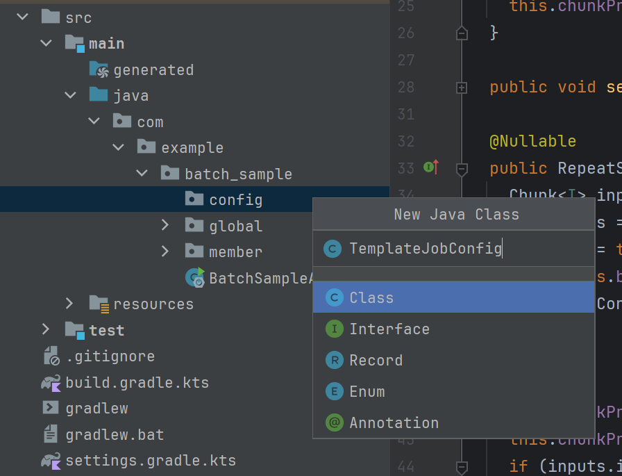
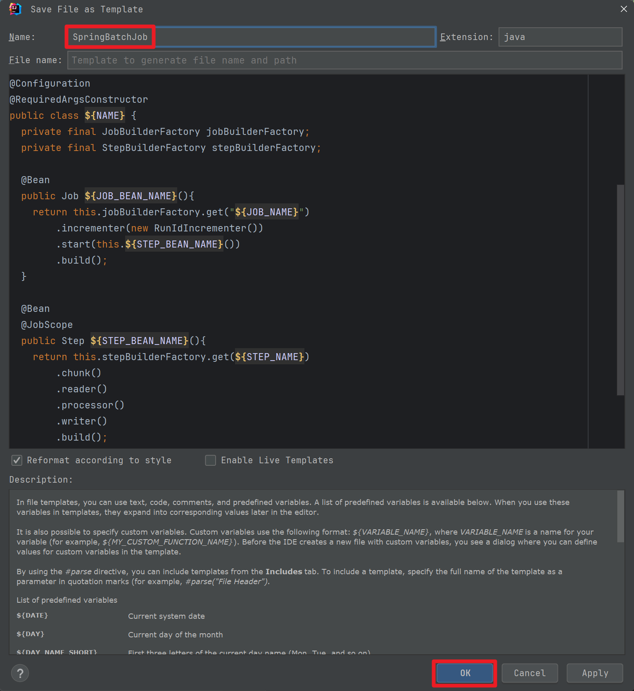
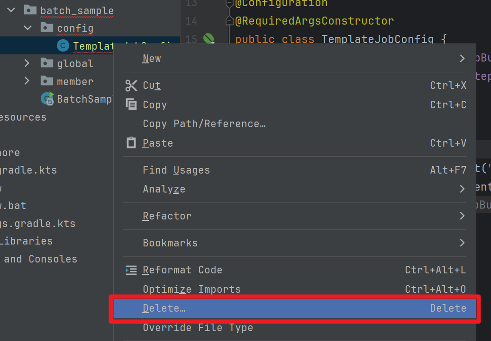
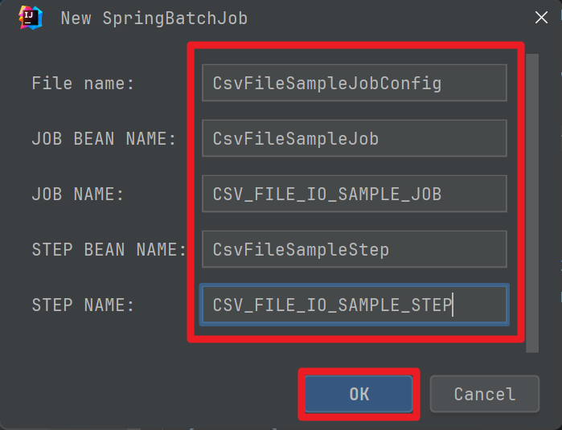
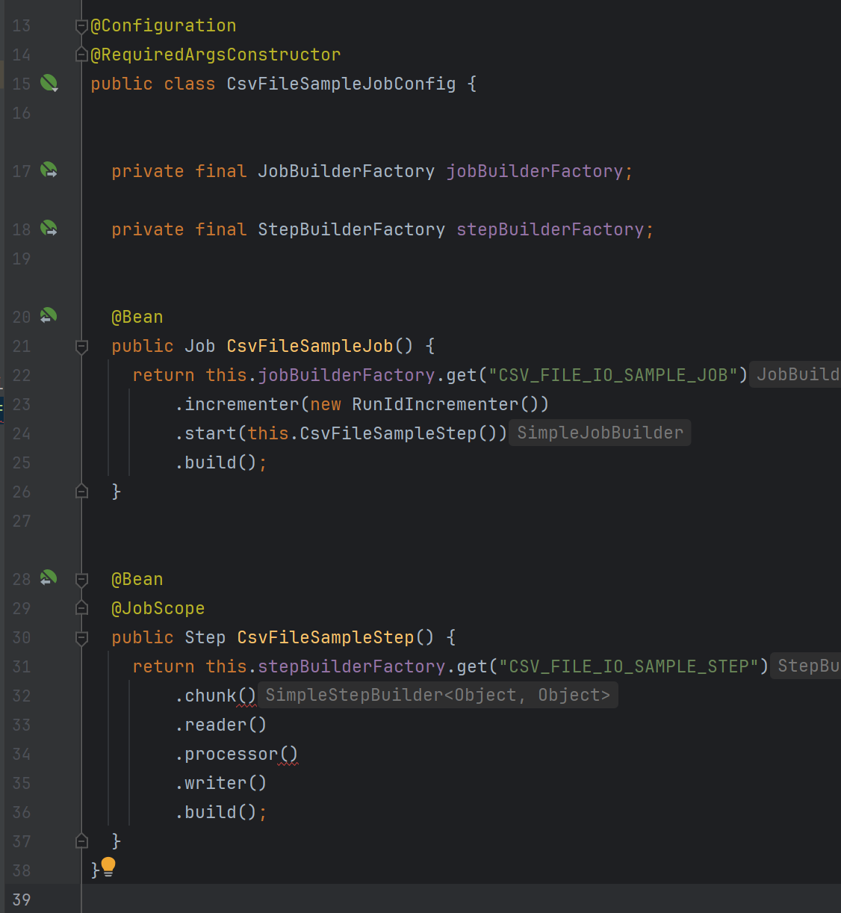

## JobConfig Live Template 만들기


원하는 패키지에 원하는 이름으로 JobConfig를 생성합니다. 


<br/>


그리고 아래와 같이 코드를 작성합니다.

- 필요한 코드들을 비워두었기에 지금 상태는 컴파일 에러가 나는 것이 정상입니다.

```java
import lombok.RequiredArgsConstructor;
import org.springframework.batch.core.Job;
import org.springframework.batch.core.Step;
import org.springframework.batch.core.configuration.annotation.JobBuilderFactory;
import org.springframework.batch.core.configuration.annotation.JobScope;
import org.springframework.batch.core.configuration.annotation.StepBuilderFactory;
import org.springframework.batch.core.launch.support.RunIdIncrementer;
import org.springframework.context.annotation.Bean;
import org.springframework.context.annotation.Configuration;

@Configuration
@RequiredArgsConstructor
public class TemplateJobConfig {
  private final JobBuilderFactory jobBuilderFactory;
  private final StepBuilderFactory stepBuilderFactory;

  @Bean
  public Job job(){
    return this.jobBuilderFactory.get("")
        .incrementer(new RunIdIncrementer())
        .start(this.step())
        .build();
  }

  @Bean
  @JobScope
  public Step step(){
    return this.stepBuilderFactory.get("")
        .chunk()
        .reader()
        .processor()
        .writer()
        .build();
  }
}
```

<br/>


File → Save File as Template ... 을 선택합니다.

- 만약 위 메뉴가 안보인다면 Tools → Save File as Template ... 을 선택하시면 됩니다.


<br/>


이후 Live Template 을 편집하는 팝업윈도우가 나타나는데 내용을 아래와 같이 정의해줍니다. (위의 코드에서 Bean 이름, Job 이름 등 변수로 지정해줄 내용을 따로 변수로 지정해줬습니다.)

```java
package ${PACKAGE_NAME};

import lombok.RequiredArgsConstructor;
import org.springframework.batch.core.Job;
import org.springframework.batch.core.Step;
import org.springframework.batch.core.configuration.annotation.JobBuilderFactory;
import org.springframework.batch.core.configuration.annotation.JobScope;
import org.springframework.batch.core.configuration.annotation.StepBuilderFactory;
import org.springframework.batch.core.launch.support.RunIdIncrementer;
import org.springframework.context.annotation.Bean;
import org.springframework.context.annotation.Configuration;

@Configuration
@RequiredArgsConstructor
public class ${NAME} {
  private final JobBuilderFactory jobBuilderFactory;
  private final StepBuilderFactory stepBuilderFactory;

  @Bean
  public Job ${JOB_BEAN_NAME}(){
    return this.jobBuilderFactory.get("${JOB_NAME}")
        .incrementer(new RunIdIncrementer())
        .start(this.${STEP_BEAN_NAME}())
        .build();
  }

  @Bean
  @JobScope
  public Step ${STEP_BEAN_NAME}(){
    return this.stepBuilderFactory.get("${STEP_NAME}")
        .chunk()
        .reader()
        .processor()
        .writer()
        .build();
  }
}
```

<br/>


작성을 다 하고 나면 아래와 같이 Template 의 Name 을 지정해준 후 `OK` 버튼을 눌러서 저장합니다.


<br/>


만들었던 TemplateJobConfig Class 는 삭제해줍니다.


<br/>


새로운 Job 을 만듭니다.
File → New → `SpringBatchJob` 을 입력합니다.<br/>
또는 
`Ctrl + N` → `SpringBatchJob` 을 입력합니다.<br/>

- `SpringBatchJob` 은 방금 생성한 Spring Batch Job Live Template 입니다.


<br/>


아래와 같이 원하는 이름을 입력해주고 OK 버튼을 누릅니다.


Job 의 Bean Name 과 Job Name을 다르게 할 필요는 없으며 보통은 같은 이름으로 설정해주는 것이 보통이지만, 이번 문서에서는 모두 다르게 지정했습니다.<br/>


작성을 완료하고 나면 아래와 같이 기본적인 내용이 채워진 Job Config 파일을 확인할 수 있습니다.



