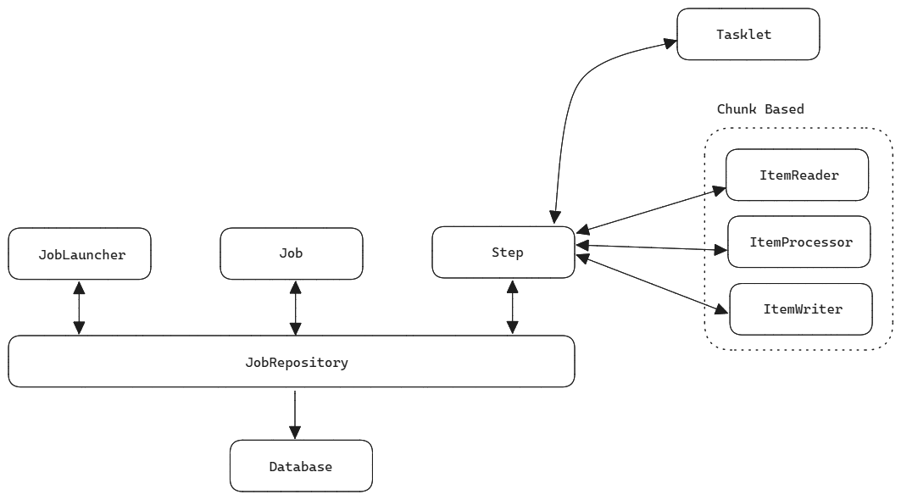
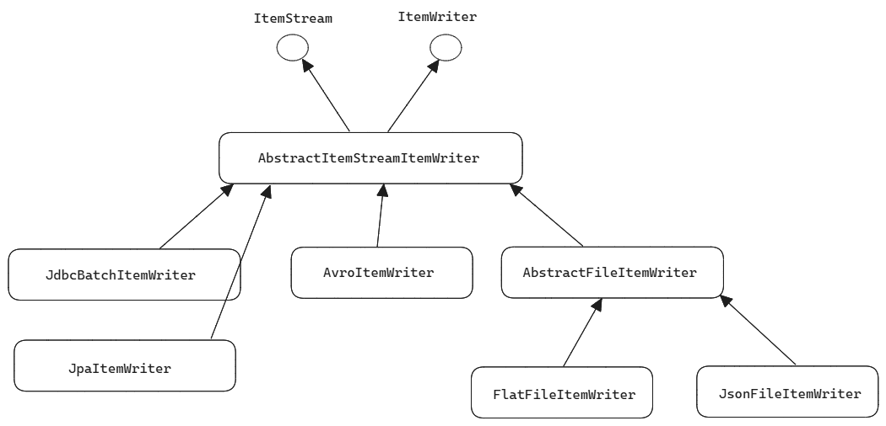
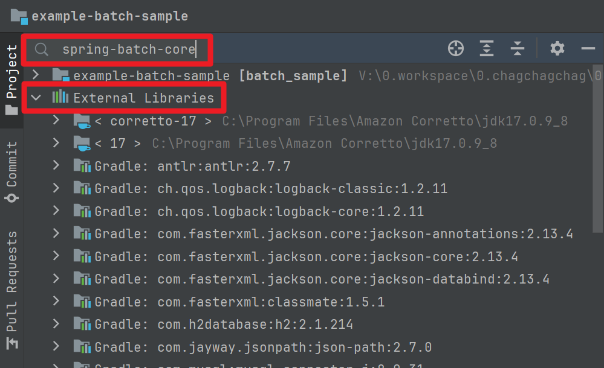
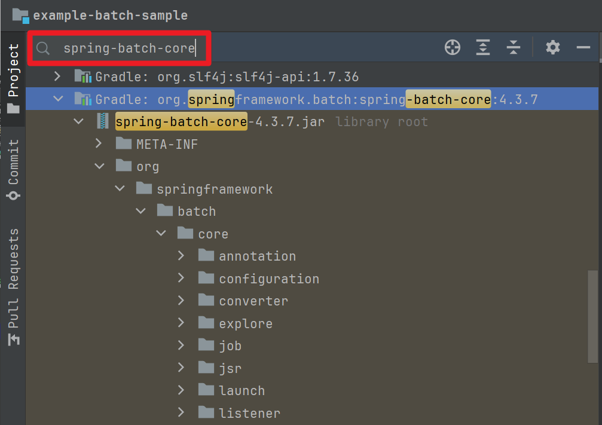
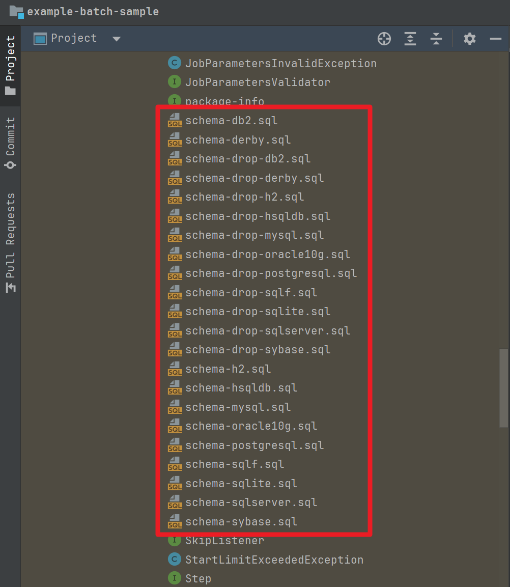
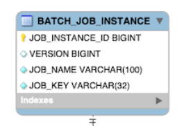

# 0. spring batch architecture

# 참고자료

- https://docs.spring.io/spring-batch/docs/4.3.5/reference/html/job.html

- [Spring Batch란? 이해하고 사용하기](https://khj93.tistory.com/entry/Spring-Batch%EB%9E%80-%EC%9D%B4%ED%95%B4%ED%95%98%EA%B3%A0-%EC%82%AC%EC%9A%A9%ED%95%98%EA%B8%B0)


# 기본 구조

공식 페이지에서 설명하는 구조는 아래와 같습니다. 

참고 : https://docs.spring.io/spring-batch/docs/4.3.5/reference/html/job.html


<br/>


이중 Tasklet 이 누락되어 있는데, tasklet 을 추가한 그림은 다음과 같습니다.



<br/>


# JobLauncher

- Bean 을 생성만 했을 뿐인데 Batch가 실행될수 있는데 아래의 설정을 추가해줘야 합니다.
  - application.yml 에 아래의 설정을 추가하면, 원하지 않는 Job 들이 실행되는 것을 막을 수 있습니다.
  - `spring.batch.job.enabled: ${spring.batch.job.names:NONE}` 
  - `spring.batch.job.names: ${job.name.NONE}`

- Spring Batch 는 Job 타임에 Bean 이 생성되면 JobLauncher 객체에 의해서 Job 을 수행합니다.
- JobLauncher 는 Job 을 실행하고, Job 은 Step 을 수행합니다.

<br/>


# JobRepository

- DB or Memory 에 스프링 배치가 실행될 수 있도록 배치의 메타데이터를 관리하는 역할을 수행합니다.

<br/>


# Job

- **배치의 실행단위** 입니다. (중요!!)

- Job 은 JobLauncher 에 의해 실행됩니다.
- Job 은 여러 개의 Step 을 실행하며, Flow 를 관리할 수 있습니다.
  - e.g. Step A → on 조건 B → Step B
  - 이렇게 여러개의 Step 을 Flow 로 실행하는 것을 Job Flow 라고 부릅니다.

<br/>


# JobParameters

배치 실행시 필요한 파라미터를 주입할 때 JobParameters 객체를 사용합니다.<br/>

**파라미터 접근**<br/>

파라미터 접근 시에는 아래의 두 방식으로 접근 가능합니다

- JobParameters 를 이용한 파라미터 접근
  - e.g. `String parameter = jobParameters.getString(key, defaultValue)`
- Spring EL (Expression Language) 로 접근
  - e.g. `@Value("#{jobParameters[key]}")`

<br/>


**파라미터 주입**<br/>

파라미터를 주입하는 방식은 아래와 같습니다.

- Intellij 에서 실행 또는 jar 파일 실행시 Program Argument 를 `-{파라미터명}` 으로 전달하는 방식
- Controller 및 기타 엔드포인트에서 직접 인자를 전달하는 방식

<br/>


e.g. 주입된 Job 파라미터를 Spring EL 을 이용해서 읽어들이는 예제입니다.

```java
@Bean
@JobScope
public Step chunkBaseStep(@Value("#{jobParameters[orderId]}") String orderId){
    String orderId = StringUtils.isNotEmpty(orderId) 
        ? Long.parseLong(orderId)
        : -1L;
    
    return stepBuilderFactory.get("somethingStep")
        .<String,String>chunk(CHUNK_SIZE)
        .reader(itemReader(orderId))
        .processor(itemProcessor())
        .writer(itemWriter())
        .build();
}
```

<br/>


# Chunk, Tasklet

예를 들어 100만건의 데이터를 처리해야 하는 작업이 있다고 하겠습니다.<br/>

만약 100만건의 데이터에 대해 원하는 작업을 할 때 컴퓨터 자원에 문제가 없다면? 

- Tasklet 처리를 해도 무방합니다.

<br/>


만약 100만건의 데이터에 대해 원하는 작업을 할 때 컴퓨터 자원에 문제가 있다면? 

- Chunk 기반의 처리를 하는 것이 권장됩니다.
- 1만건 Size 의 Chunk 를 만들어서 이 Chunk 를 페이징 기반의 처리를 하는 방식으로 전환한다면, 메모리가 부족해져서 프로그램이 멈추는 현상 등을 방지할 수 있습니다. 
- 뒤에서 정리하겠지만, 가급적이면 페이징 사이즈는 Chunk Size 와 동일하게 하는 것이 권장됩니다.

<br/>


> Tasklet 도 나눠서 처리하는 것을 수동으로 작성할 수 있지만 <br/>
>
> 대용량 데이터를 처리시에는 Chunk 기반 처리방식이 더 활용성이 높고 ItemReader, ItemProcessor, ItemWriter 등을 통해서 딱딱 떨어지게끔 처리하면서 중간에 어디까지 실행했는지에 대한 Context 를 저장하거나 이력을 보관할 수 있기에 가급적이면 Chunk 기반의 처리를 하도록 작성하는 것을 추천되는 편입니다.

<br/>


정리해보면 이렇습니다.

## Tasklet vs Chunk Based Processing

Tasklet 기반 처리

- 배치 처리 과정의 구조가 단순할 경우에 사용합니다.
- 대용량 데이터 처리 시에 데이터를 여러 덩어리로 나눠서 처리하기에는 복잡한 구조입니다.
- 대용량 데이터 처리를 할 경우 시스템의 자원이 부족하게 될 수 있다는 단점이 있습니다.


Chunk 기반 처리

- ItemReader, ItemProcessor, ItemWriter 를 이용해서 데이터르 처리합니다.
- 대용량 데이터 처리 시에 데이터를 Chunk 단위로 나누고 이 Chunk 를 Paging 기반으로 여러 단계로 나누어 처리합니다.
- 데용량 데이터 처리 시에 시스템의 자원이 부족해지는 현상 없이 안정적으로 처리할 수 있다는 장점이 있습니다. 
- e.g. 10만개의 데이터를 10000 size 의 chunk 단위로 처리하는 경우


# ItemReader, ItemProcessor, ItemWriter

**ItemReader**

- 배치 처리를 해야 하는 대상 객체를 읽어들이는 역할
- e.g. `FlatFileItemReader`, `JdbcPagingItemReader`, `JpaPagingItemReader`
- AbstractItemStreamItemReader 는 ItemStream, ItemReader interface 를 implements 하고 있습니다.

**ItemProcessor**

- ItemReader 로부터 읽어들인 데이터를 ItemWriter 로 보내기 전에 Processing 또는 Filtering 작업을 수행하는 역할
- null 을 리턴하면 그 데이터는 필터링 되어 ItemWriter 로는 전달되지 않습니다.
- ItemProcessor 는 Optional 이며, 생략가능합니다. 
- 즉, Step 구성시 ItemReader, ItemWriter 로만 구성하는 것도 가능합니다.

**ItemWriter**

- ItemProcessor 로부터 전달된 객체를 이용해서 데이터를 저장하거나, 메시지큐에 데이터를 전송하는 등과 같은 Write 하는 역할을 담당합니다.

<br/>


## ItemReader

### AbstractStreamItemReader 

AbstractStreamItemReader 는 ItemStream interface, ItemReader interface 를 implements 하고 있는 abstract 클래스입니다. 주로 잘 짜여진 Spring 등과 같은 프레임워크에서는 abstract 클래스로 기본틀 역할을 하는 클래스를 제공하는데, AbstractItemStreamItemReader 클래스 역시 필요한 기본적인 구현이 갖춰져 있는 **기본 틀** 역할을 합니다.<br/>

> 참고 : [docs.spring.io/.../AbstractItemStreamItemReader](https://docs.spring.io/spring-batch/docs/current/api/org/springframework/batch/item/support/AbstractItemStreamItemReader.html)


<br/>


### 대표적인 구현체 클래스들

**AbstractItemStreamItemReader 를 extends 하는 대표적인 구현체 클래스들**<br/>

- [JdbcCursorItemReader](https://docs.spring.io/spring-batch/docs/current/api/org/springframework/batch/item/database/JdbcCursorItemReader.html), [JpaCursorItemReader](https://docs.spring.io/spring-batch/docs/current/api/org/springframework/batch/item/database/JpaCursorItemReader.html)
- [KafkaItemReader](https://docs.spring.io/spring-batch/docs/current/api/org/springframework/batch/item/kafka/KafkaItemReader.html)
- [AbstractItemCoutingItemStreamItemReader](https://docs.spring.io/spring-batch/docs/current/api/org/springframework/batch/item/support/AbstractItemCountingItemStreamItemReader.html)
  - 대표적으로 FlatFileItemReader 가 [AbstractItemCoutingItemStreamItemReader](https://docs.spring.io/spring-batch/docs/current/api/org/springframework/batch/item/support/AbstractItemCountingItemStreamItemReader.html) 을 extends 하고 있습니다.

<br/>


### JpaCursorItemReader, JdbcCursorItemReader

Jdbc 또는 Jpa 를 사용하는 구현체로는 세부적으로는 JpaCursorItemReader, JdbcCursorItemReader 와 같은 하위 구현체들이 존재하며, 이 구현체들은 spring-batch 에서 Jpa, Jdbc 를 통한 Data read 연산을 효율적으로 할 수 있도록 하는 연산을 제공합니다.<br/>

<br/>


## ItemWriter

AbstractStreamItemWriter 는 ItemStream interface, ItemWriter interface 를 implements 하고 있는 abstract 클래스입니다. 주로 잘 짜여진 Spring 등과 같은 프레임워크에서는 abstract 클래스로 기본틀 역할을 하는 클래스를 제공하는데, AbstractItemStreamItemWriter 클래스 역시 필요한 기본적인 구현이 갖춰져 있는 **기본 틀** 역할을 합니다.<br/>



<br/>


JdbcBatchItemWriter, JpaItemWriter 는 Batch 를 이용해서 데이터를 읽고 쓸 때 사용하는 ItemWriter 들입니다. AvroItemWriter 는 주키퍼를 통한 데이터 교환작업에 대해 Avro를 통해 주키퍼 스키마레지스트리에 맞게 데이터 타입을 맞추는 것을 Spring Batch 에서도 가능하도록 만들어진 라이브러리입니다.<br/>

FlatFileItemWriter 는 csv 파일의 쓰기작업을 할때 사용하며, JsonFileITemWriter 는 Json파일의 쓰기 작업을 할때 사용합니다.<br/>


### AbstractFileItemWriter 

주로 파일입출력 작업을 할 수 있도록 제공되는 클래스입니다.

- FlatFileItemWriter 를 이용하면 csv 파일의 읽고 쓰기가 가능해집니다.

- JsonFileITemWriter 를 이용하면 Json파일의 쓰기 작업이 가능해집니다.


### AvroItemWriter

- 주키퍼를 이용한 데이터 교환작업을 할 때 타입을 다른 타입으로 변환할 때 Avro 라는 것을 사용합니다.
- 주로 카프카 시스템에서 생산자와 소비자 사이의 데이터 타입을 맞춰야 하는 일이 많아지고, 타입 역시 세부적으로 복잡해질 경우 Avro 를 표준으로 사용하게 됩니다.

<br/>


### JdbcBatchItemWriter

JdbcBatchItemWriter 는 jdbc 를 이용해서 DB에 데이터를 write 하는 Writer 입니다.<br/>

JdbcBatchItemWriter를 사용하면 Bulk Insert/Update/Delete 가 가능합니다.<br/>

단건처리가 아니가 특정 사이즈 만큼을 한번에 처리할 수 있기 때문에 대용량 데이터 처리에 장점이 있습니다.<br/>


### JpaItemWriter

JpaItemWriter 는 JPA의 Entity 단위의 데이터 연산을 합니다.

- EntityManager.persist()
- EntityManager.merge()

등과 같은 연산을 통해서 위의 메서드가 실행될때마다 매번 단건 insert 를 수행합니다.

<br/>


## CursorItemReader, PagingItemReader

### Cursor vs Paging

Cursor 기반 조회

- Cursor 기반 처리는 커넥션을 열어두고, Cursor 를 통해서 데이터를 한 포인트씩 옮기면서 처리하는 것을 의미합니다.
- 장점
  - Cursor 기반 처리는 커넥션을 자주 열지 않고, 한번 열어둔 커넥션 내에서 모든 데이터를 가져오기에 Connection 빈도가 낮아서 성능이 좋습니다.
  - 반면 Connection 을 오랫동안 유지해야 한다는 점은 Database 입장에서는 부담이 될 수 있으며, 하나의 Connection 에서 처리를 수행하기에 Thread Safe 하지 않습니다.
- 단점
  - 모든 결과를 메모리에 할당하기 때문에 시스템 자원을 많이 소모한다는 단점이 있습니다.

<br/>

Paging 기반 조회

- Paging 이란 mysql 의 limit, offset 과 같은 쿼리를 통해 데이터를  m 건 단위(`limit`)로 끊어올때   n 페이지(`offset`) 위치에서 `limit` 만큼 데이터를 읽어오는 방식을 의미합니다.
- Database 에 자주 Connection 요청을 해야 해서 IO 로 인한 지연현상이 발생한다는 단점이 있지만, Connection 유지 시간이 짧아서 Database에 부하를 덜 주게 됩니다.
- Connection 을 필요할 때마다 하기에 Thread Safe 합니다.
- 결과를 페이징 단위로 가져오기에, Cursor 기반에 비해 더 적은 메모리를 사용한다는 장점이 있습니다.

<br/>


### (JDBC) JdbcCursorItemReader vs JdbcPagingItemReader

|                       | JdbcCursorItemReader                 | JdbcPagingItemReader                                         |
| --------------------- | ------------------------------------ | ------------------------------------------------------------ |
| datasource            | JDBC Datasource                      | JDBC Datasource                                              |
| beanMapper, rowMapper |                                      |                                                              |
| SQL                   | 조회 쿼리 직접 작성                  | No (미지원)                                                  |
| DSL                   | No (미지원)                          | selectClause, fromClause, whereClause, queryProvider 를 사용한 쿼리 작성 |
| fetchSize             | cursor 를 이용해 fetch 할  fetchSize | JdbcTemplate.fetchSize                                       |
| pageSize              | No (미지원)                          | paging 시 지정하는 page 크기 (offset/limit)                  |

<br/>


### (JPA) JpaCursorItemReader vs Jdbc PagingItemReader

|                      | JpaCursorItemReader                                          | JpaPagingItemReader                                          |
| -------------------- | ------------------------------------------------------------ | ------------------------------------------------------------ |
| entityManagerFactory | JPA 코드 실행에 필요한 EntityManager 객체 생성을 위한 EntityManagerFactory | JPA 코드 실행에 필요한 EntityManager 객체 생성을 위한 EntityManagerFactory |
| queryString          | SQL 조회 쿼리 직접 작성                                      | No (미지원)                                                  |
| DSL                  | No (미지원)                                                  | selectClause, fromeClause, whereClause                       |
| pageSize             | No (미지원)                                                  | paging 에 사용될 page 크기 (offset/limit)                    |

<br/>


# Sprng Batch Tables

## Table 명세

Spring Batch 는 배치 실행 기록과, 배치 실행 결과를 저장하는 테이블들을 가지고 있습니다. 이 테이블들을 Meta 테이블이라고 흔히 이야기합니다.<br/>

참고 : https://docs.spring.io/spring-batch/reference/_images/meta-data-erd.png


<br/>


<br/>


BATCH\_JOB\_INSTANCE

- 위의 ERD 에서 BATCH\_JOB\_INSTANCE 테이블을 자세히 보면 `JOB_NAME`, `JOB_KEY` 이 보입니다.
- 배치 실행 시에는 `JOB_NAME`, `JOB_KEY` 를 기준으로 하나의 row 가 생성되는데, 이 `JOB_NAME`, `JOB_KEY` 는 중복을 허용하지 않습니다. 
- 즉, JobInstance 의 생성기준, BATCH\_JOB\_INSTANCE 테이블의 로우(ROW) 생성기준은 `JOB_NAME`, `JOB_KEY`이며 `JOB_NAME`, `JOB_KEY`은 중복되면 안됩니다.
- `JOB_KEY` 값은 BATCH\_JOB\_EXECUTION\_PARAMS 테이블 내에 저장되는 Parameter 를 나열해서 암호화해서 저장합니다.


BATCH\_JOB\_EXECUTION\_PARAMS

- Job 을 실행할 때 사용된(주입된) Parameter를 저장하는 테이블입니다.


BATCH\_JOB\_EXECUTION

- Job 의 시작시각, Job의 종료시각, Job 의 상태 를 기록하기 위한 테이블입니다.
- Job 이 실행되는 시점에 BATCH\_JOB\_EXECUTION 테이블에 데이터가 추가됩니다.


BATCH\_JOB\_EXECUTION\_CONTEXT

- Job 이 실행되는 동안 공유되어야 하는 데이터를 직렬화 해서 저장합니다.


BATCH\_STEP\_EXECUTION

- Step 이 실행되는 동안 필요한 데이터와 실행 결과를 저장합니다.


BATCH\_STEP\_EXECUTION\_CONTEXT

- Step 이 실행되는 동안 공유되어야 하는 데이터를 직렬화해서 저장합니다.
- 이 테이블에서는 하나의 Step 이 실행되는 동안 데이터를 공유합니다.
- 이 테이블에서는 Step 간에 테이블의 데이터를 공유하지 않으며, Step 간에 데이터를 공유하는 것은 BATCH\_JOB\_EXECUTION\_CONTEXT 에서 데이터를 공유할 수 있습니다.

<br/>


## Schema 스크립트 경로

테이블 ddl 이 있는 곳의 경로는 `spring-batch-core/org.springframework/batch/core*` 입니다.<br/>

intellij 에서는 아래와 같이 찾으실 수 있습니다.<br/>

Project View \> External Libraries 에서 `spring-batch-core` 를 검색합니다.



<br/>


검색결과로 `spring-batch-core-a.b.c.jar` 파일이 검색되었음을 확인 가능합니다.



<br/>


스크롤을 내려보면 아래 그림처럼 `schema-{db 타입}.sql` 파일들이 나타나는 것을 볼 수 있습니다.



위와 같이 Spring Batch 팀에서는 Spring Batch 라이브러리에 필요한 스키마들을 class path 내에서 찾을 수 있도록 제공해주고 있습니다.<br/>


## batch table 초기화 옵션

batch 테이블 초기화 옵션은 application.yml 파일에 아래와 같이 설정할 수 있습니다.

```yaml
spring:
  batch:
    initialize-schema: never
```

이 속성에는 아래와 같은 값들을 지정 가능합니다.

- `spring.batch.initialize-schema=never` 
  - 배치 잡 기동시 스키마 초기화 스크립트를 실행하지 않는 방식입니다. 
  - 주로 Production 레벨에서 사용하는 옵션입니다.
- `spring.batch.initialize-schema=always`
  - 배치 잡 기동시 스키마 초기화 스크립트를 항상 수행하도록 지정하는 방식입니다.
  - 주로 개발환경에서 사용하는 옵션입니다.
- `spring.batch.initialize-schema=embedded` 
  - 배치 잡 기동시 스키마 초기화 스크립트를 h2 와 같은 embedded (내장) Database 를 사용할 때에만 사용할 수 있도록 지정하는 방식입니다.
  - 주로 개발환경에서 사용하는 옵션입니다.

<br/>


## 객체 매핑

참고 : https://terasoluna-batch.github.io/guideline/5.0.0.RELEASE/en/Ch02_SpringBatchArchitecture.html#Ch02_SpringBatchArch_Detail_ProcessFlow


- JobInstance 객체 : BATCH\_JOB\_INSTANCE 테이블에 매핑
- JobExecution 객체 : BATCH\_JOB\_EXECUTION 테이블에 매핑
- JobParameters 객체 : BATCH\_JOB\_EXECUTION\_PARAMS 테이블에 매핑
- ExecutionContext 객체 : BATCH\_JOB\_EXECUTION\_CONTEXT 테이블에 매핑

<br/>


# JobInstance, JobParameters, JobExecution



**JobInstance**<br/>

JobInstance 는 BATCH\_JOB\_INSTANCE 테이블과 매핑되는 테이블입니다. JOB\_INSTANCE 테이블의 주요 컬럼으로는 JOB\_NAME, JOB\_KEY 가 있습니다. 그리고 `JOB_NAME`, `JOB_KEY` 를 기준으로 하나의 row 가 생성되는데, 이 `JOB_NAME`, `JOB_KEY` 는 중복을 허용하지 않습니다. <br/>

즉, JobInstance 의 생성기준, BATCH\_JOB\_INSTANCE 테이블의 로우(ROW) 생성기준은 `JOB_NAME`, `JOB_KEY`이며 `JOB_NAME`, `JOB_KEY`은 중복되면 안됩니다.<br/>

<br/>


**JobParameter, JobExecution**<br/>

JobInstance 를 새로 생성할지에 대한 기준은 JobParameter 의 중복 여부로 결정합니다.<br/>

- 같은 Parameter 로 Job을 다시 실행하면 이미 생성된 JobInstance 를 실행합니다.<br/>

- 다른 Parameter 로 Job을 다시 실행하면 새로운 JobInstance 를 실행합니다.<br/>

<br/>


JobExecution 은 JobInstance 재실행 여부와 상관 없이 항상 새롭게 생성됩니다.<br/>


e.g.

- Job 실행시 12월 1일 이라는 date parameter 를 처음 받아서 실행했다면?
  - job\_instance\_id = k 에 해당하는 신규 JobInstance 실행
- Job 실행시 12월 2일 이라는 date parameter 를 처음 받아서 실행했다면?
  - job\_instance\_id = m 에 해당하는 신규 JobInstance 실행
- Job 실행시 12월 2일 이라는 date parameter 를  한번 더 받아서 실행했다면?
  - job\_instance\_id = m 에 해당하는 JobInstance 를 재실행

<br/>


# RunIdIncmenter

Job 을 항상 새로운 JobInstance로 실행되게끔 해야 할 경우가 있습니다. <br/>

이런 경우 RunIdIncrementer 를 사용합니다. <br/>

RunIdIncrementer 를 사용하면 `run.id` 라는  `job_key` 에 대해 항상 다른 `job_name` 값이 지정되어서 항상 새로운 JobInstance 로 실행됩니다.<br/>

<br/>


# StepExecution, ExecutionContext


StepExecution : BATCH\_STEP\_EXECUTION 테이블에 매핑되는 객체

ExecutionContext : BATCH\_STEP\_EXECUTION\_CONTEXT 테이블에 매핑되는 객체

- JOB, STEP 에 모두 매핑될 수 있는 객체입니다.
- 참고\) BATCH\_JOB\_EXECUTION\_CONTEXT 테이블은 ExecutionContext 객체와 매핑됩니다.

<br/>


# ExecutionContext

하나의 Job 은 항상 같은 파라미터로 새롭게 실행하는 것은 불가능합니다.<br/>

ExecutionContext 는 Job, Step 의 Context 를 관리하는 객체입니다.<br/>

- ExecutionContext 를 통해서 데이터를 공유할 수 있습니다.

<br/>


JobExecutionContext

- Job 내에서만 데이터를 공유할 수 있습니다
- JobExecutionContext 는 Step 끼리 데이터를 공유할 수 있습니다.

StepExecutionContext

- Step 내에서만 데이터를 공유할 수 있습니다.
- Step 내에서만 공유하다는 의미이며, 다른 Step 과는 공유가 불가능합니다.

<br/>


