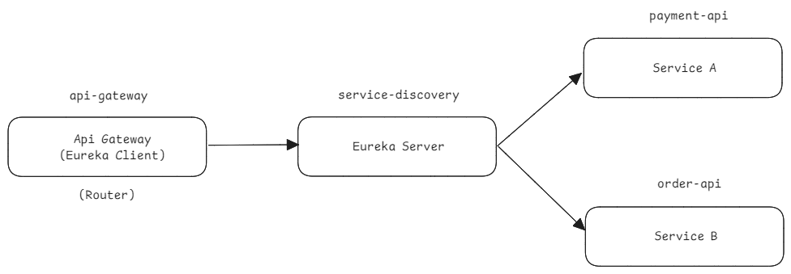

# Eureka Server 와 Gateway

지금 회사에서 레거시 전환을 천천히 한단계씩 해나가고 있는데, Euereka Server 를 지금 당장 할것 같지는 않다. 운영 인력이 적고 그만한 시간을 쓸 수 없기 때문에 Eureka Server 까지 운영하기에는 쉽지 않을 수 있다.  

그런데 막상 공부는 해두었기에 나중을 위해 정리를 시작했다. 

나중에 웹소켓이나 이런 것들도 인증이 된 이후에 Eureka Server 또는 discovery-server 로 붙는 방식으로 통신하는 걸로 시중에 나온 어떤 책에서 설명하는 것을 본적도 있었다. 이 책도 읽었던 걸 나중에 시간 내서 좀 정리해야 하는데... 

쿠버네티스에서는 쿠버네티스 레벨에서 discovery-server 라는 것을 제공해주고 있다고 한다. 이건 인프라레벨이니까 회사마다 discovery-server 를 사용할지 Eureka Server 를 다중인스턴스 기반으로 띄울지를 각각 회사 서비스 차원에서 의사 결정하면 될 것 같다. 

어려워 보이지만 사실 별거 없다. 과정이 복잡할 뿐... 사실 내가 봐도 복잡해보이긴 해... 근데 막상 코드 작업 시작하면 별거 없다구.. 

 

 

## 요약

전체적인 과정을 요약해보면 이렇다. 사실 시간이 없어서 요약본을 적고있다. 그렇다 ㅋㅋ... 

**Eureka Server (service-discovery) 작업** 

- eureka server 를 dependency 로 추가한 Spring Boot 프로젝트를 다운로드 한다.
  - implementation("org.springframework.cloud:spring-cloud-starter-netflix-eureka-server")
- application.yml 수정
  - server.port 를 8000 으로 수정 
  - spring.application.name 을 service-discovery 로 정의
  - eureka.instance.hostname: localhost 정의
  - eureka.client.registerWithEureka: false
  - eureka.client.fetchRegistry: false
  - eureka.client.serviceUrl.defaultZone: `http://${eureka.instance.hostname}:${server.port}/eurka/` 정의
  - eureka.client.region: default 정의
- Main Application 에 @EnableEurekaServer 붙인다.

 

**Eureka Client 작업 (api-gateway, book-api, payment-api)**

- api-gateway, book-api, payment-api 를 euerka-client 로 해서 EurekaServer 에 붙인다.
  - 의존성 추가
    - `implementation("org.springframework.cloud:spring-cloud-starter-netflix-eureka-client")`
    - cloudVersion dependency 는 리포지터리 참고
  - application.yml (book-api, payment-api, api-gateway 에 모두 적용)
    - eureka.client.service-url.defaultZone: http:/localhost:8080/eureka/
    - eureka.client.registerWithEureka: true
    - eureka.client.fetchRegistry: true
  - api-gateway, book-api, payment-api 모두 메인 애플리케이션 위에 `@EnableDiscoveryClient` 를 추가
- eureka-server 구동, api-gateway, book-api, payment-api 모두 구동한다.
- http://loalhost:8000 으로 브라우저에 접속
  - api-gateway, book-api, payment-api 가 모두 대시보드에 잘 나타는 것을 확인한다.

 

**다시 Eureka Server (service-discovery) 작업** 

- service-discovery 에 아래 설정 추가
  - eureka.server.renewal-percent-threshold: 0
  - 분당 예상 heartbeat 을 계산하는 데에 사용되는 값이다.
  - 이 값이 특정 임계값에 도달하지 못하면 대시보드에서 빨간 글자로 워닝이 나타난다.
- Renew Threshold → 분당 Heartbeat 수 (기본값 30초) x Instance 수 + Spring 에서 구성하는 최소 인스턴스 수 x renewal-percent-threshold 값
  - 계산의 결과값은 반올림된 값으로 반영된다.
  - e.g. 2 x 1 + 1 x 0.85  - 3
  - 이 계산 산식에 의해서 연산한 결과값이 정상이 아니면 유레카 서버 대시보드에서 빨간 글자로 워닝이 나타난다.
- Renew (last min) → 분당 heartbeat 수 (기본값 30초) x Instance 수

 

gateway 내의 Router 수정

- `lb://{서비스명}` 으로 변경
  - spring.cloud.gateway.routes\[i\] 각각의 서비스 들에 대해 uri 항목에 대한 값을 `lb://{서비스명}` 으로 변경해준다.
  - `서비스명` 은 `spring.application.name` 에 지정해준 이름이며, eureka-server 에 등록된 서비스명을 의미한다.
  - 하나의 서비스를 여러 인스턴스에 배포해두었을 때 모든 인스턴스를 나열한다면 인프라 변경사항에 대해 매번 코드를 변경해서 배포되어야 한다는 단점이 있다. 
  - 이때 Eureka Server 에 여러 종류의 서비스들을 등록해둔 후 `lb://{서비스명}` 으로 개별 서비스에 대해 Eureka Server 를 통해 FQDN 을 얻어와서 조회할 수 있도록 하면 조금은 인프라 레벨의 변경사항에 유연하게 대응할 수 있게 된다.
  -  즉 `lb://{서비스명}`  으로 지정하는 이유는 여러 인스턴스들의 개별 IP 또는 FQDN 을 하드코딩하지 않고 eureka server 가 이것을 모두 전담하게끔 하기 위해서이다.
  - 예를 들면 payment-api 가 AWS에 배포된 인스턴스 1기, GCP에 배포된 인스턴스 1기, Naver Cloud에 배포된 인스턴스 1기가 있다고 하면 이 경우 이 3기의 인스턴스가 Eureka Client 로 동작하게끔 하면 Eureka Server 에 3기의 instance 가 등록된다. 
  - 그리고 이 3기에 대해 어떤 instance 를 탈지는 개별지정하지 않고 `lb://{서비스명}` 으로 정의하면, 개별 API 접근을 위해 Eureka Server 에서 ip 주소를 조회해 온 후 해당 개별 인스턴스에 API 요청을 하게 된다.
  - 말이 꼬였당... 

 

아래에서부터 예제 작성 과정 설명!! 시간이 없어서 잠시 목차만 만들어둠

## service-discovery

## API Gateway

## order-api

## payment-api

