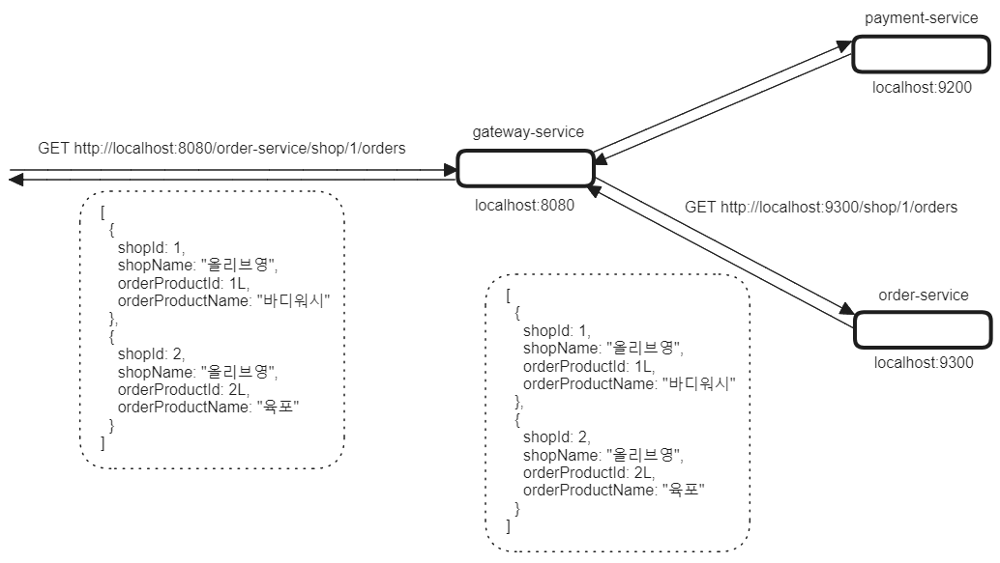

## Spring Cloud Gateway Overview

아직 문서 작업 중 이에요!! 빠르게 정리하겠습니다!!!!!!!!!!!!!!!!!!!!!!!<br/>


## 참고

- [Spring Cloud Gateway Docs](https://cloud.spring.io/spring-cloud-gateway/reference/html/)

- https://cheese10yun.github.io/spring-cloud-gateway/

<br/>


## 예제 github

- [Eureka 없이 구성한 Gateway + MSA](https://github.com/chagchagchag/memo/tree/main/spring-gateway/example/gateway-non-eureka-msa-services)
- [Eureka + Gateway + MSA](https://github.com/chagchagchag/memo/tree/main/spring-gateway/example/gateway-eureka-msa-services)
- [Eureka + Gateway + Websocket WAS (Servlet 버전)](https://github.com/chagchagchag/memo/tree/main/spring-gateway/example/gateway-eureka-websocket)

<br/>


## Route, Predicate, Filters

Route

- 특정 URI 에 대해서 어떤 조건(Predicate)일 때 어떤 Filter 를 적용할 지에 대한 URL을 매핑하는 규칙의 단위입니다. 이 규칙의 단위를 하나의 Route 객체로 표현합니다. 
- 주로 application.yml 내의 `spring.cloud.routes[i]` 에 하나씩 정의합니다.
- 각각의 Route 는 고유한 id 를 이용해서 각각의 Route 들을 구분할 수 있습니다. `spring.cloud.routes[i].id={라우트ID}` 로 정의합니다.
- Route 는 uri, predicate, filter 로 구분합니다.

<br/>


Predicate

- 어떤 요청에 대해 헤더, URI 패턴 등에 대해 조건값이 맞는지를 판단하는 조건식 역할을 하는 객체입니다.
- 주로 application.ym 내의 `spring.cloud.routes[i].predicate` 에 정의합니다.
- application.yml 에서의 자세한 사용 예는 글의 후반부 예제들을 확인해주시기 바랍니다.

<br/>


Filter

- HTTP  Request, Response 에 대한 Filter 역할을 수행합니다. Servlet 의 Filter 라기 보다는 조금 더 앞단에서의 동작하는 Gateway 서버가 인식할수 있는 Filter 의 개념으로 볼 수 있습니다.
- Route 내에 filter 를 두어서 특정 Route 에 대해 특정 Filter 가 동작되도록 지정할 수 있습니다.
- RewritePath 등을 지정할 때 Filter 를 사용합니다.
- 주로 application.yml 내의 `spring.cloud.routes[i].filters` 에 정의합니다.

<br/>


## 예제 구성

이번 문서에서는 예제를 두 종류로 구성합니다.

- (1) : Discovery Server (Eureka Server) 없이 Gateway 와 MSA 를 연결한 버전
  - api-gateway
  - order-api
  - payment-api
- (2) : Discovery Server (Eureka Server) 와 함께 Gateway, MSA 를 연결한 버전
  - service-discovery
  - api-gateway
  - order-api
  - payment-api

<br/>


## (1) Discovery Server 없이 Gateway,MSA 연결



<br/>


### api-gateway

#### build.gradle.kts

```kotlin
plugins {
	java
	id("org.springframework.boot") version "3.3.2"
	id("io.spring.dependency-management") version "1.1.6"
}

group = "io.chagchagchag.example"
version = "0.0.1-SNAPSHOT"

java {
	toolchain {
		languageVersion = JavaLanguageVersion.of(17)
	}
}

configurations {
	compileOnly {
		extendsFrom(configurations.annotationProcessor.get())
	}
}

repositories {
	mavenCentral()
}

extra["springCloudVersion"] = "2023.0.3"

dependencies {
	implementation("org.springframework.boot:spring-boot-starter-data-redis-reactive")
	implementation("org.springframework.boot:spring-boot-starter-webflux")
	implementation("org.springframework.cloud:spring-cloud-starter-gateway")
	compileOnly("org.projectlombok:lombok")
	annotationProcessor("org.projectlombok:lombok")
	testImplementation("org.springframework.boot:spring-boot-starter-test")
	testImplementation("io.projectreactor:reactor-test")
	testRuntimeOnly("org.junit.platform:junit-platform-launcher")
}

dependencyManagement {
	imports {
		mavenBom("org.springframework.cloud:spring-cloud-dependencies:${property("springCloudVersion")}")
	}
}

tasks.withType<Test> {
	useJUnitPlatform()
}
```

<br/>


#### application.yml

```yaml
spring:
  application:
    name: api-gateway

  cloud:
    gateway:
      routes:
        - id: order-service
          uri: http://localhost:8081
          order: 1
          predicates:
            - Path=/order-service/**
          filters:
            - RewritePath=/order-service/(?<path>.*),/$\{path}
        - id: payment-service
          uri: http://localhost:8082
          order: 1
          predicates:
            - Path=/payment-service/**
          filters:
            - RewritePath=/payment-service/(?<path>.*),/$\{path}

eureka:
  client:
    fetch-registry: true
    register-with-eureka: true

server:
  port: 8080
```

<br/>


#### GatewayApplication.java

```java
package io.chagchagchag.example.gateway;

import org.springframework.boot.SpringApplication;
import org.springframework.boot.autoconfigure.SpringBootApplication;


@SpringBootApplication
public class GatewayApplication {

	public static void main(String[] args) {
		SpringApplication.run(GatewayApplication.class, args);
	}

}
```

<br/>


### order-service

#### build.gradle.kts

```kotlin
plugins {
	java
	id("org.springframework.boot") version "3.3.2"
	id("io.spring.dependency-management") version "1.1.6"
}

group = "io.chagchagchag.example"
version = "0.0.1-SNAPSHOT"

java {
	toolchain {
		languageVersion = JavaLanguageVersion.of(17)
	}
}

configurations {
	compileOnly {
		extendsFrom(configurations.annotationProcessor.get())
	}
}

repositories {
	mavenCentral()
}

extra["springCloudVersion"] = "2023.0.3"

dependencies {
	implementation("org.springframework.boot:spring-boot-starter-web")
	compileOnly("org.projectlombok:lombok")
	annotationProcessor("org.projectlombok:lombok")
	testImplementation("org.springframework.boot:spring-boot-starter-test")
	testRuntimeOnly("org.junit.platform:junit-platform-launcher")
}

dependencyManagement {
	imports {
		mavenBom("org.springframework.cloud:spring-cloud-dependencies:${property("springCloudVersion")}")
	}
}

tasks.withType<Test> {
	useJUnitPlatform()
}
```

<br/>


#### application.yml

```yaml
spring:
  application:
    name: order-service

eureka:
  client:
    register-with-eureka: true
    fetch-registry: true

server:
  port: 8081
```

<br/>


#### OrderApplication.java

```java
package io.chagchagchag.example.order;

import org.springframework.boot.SpringApplication;
import org.springframework.boot.autoconfigure.SpringBootApplication;

@SpringBootApplication
public class OrderApplication {

	public static void main(String[] args) {
		SpringApplication.run(OrderApplication.class, args);
	}

}
```

<br/>


#### OrderApi.java

```java
package io.chagchagchag.example.order.domain;

import org.springframework.http.HttpStatus;
import org.springframework.http.ResponseEntity;
import org.springframework.web.bind.annotation.GetMapping;
import org.springframework.web.bind.annotation.RestController;

@RestController
public class OrderApi {
  @GetMapping("/hello")
  public ResponseEntity<String> hello(){
    return ResponseEntity.status(HttpStatus.OK).body("hello");
  }
}
```

<br/>


### payment-service

#### build.gradle.kts

```kotlin
plugins {
	java
	id("org.springframework.boot") version "3.3.2"
	id("io.spring.dependency-management") version "1.1.6"
}

group = "io.chagchagchag.example"
version = "0.0.1-SNAPSHOT"

java {
	toolchain {
		languageVersion = JavaLanguageVersion.of(17)
	}
}

configurations {
	compileOnly {
		extendsFrom(configurations.annotationProcessor.get())
	}
}

repositories {
	mavenCentral()
}

extra["springCloudVersion"] = "2023.0.3"

dependencies {
	implementation("org.springframework.boot:spring-boot-starter-web")
	compileOnly("org.projectlombok:lombok")
	annotationProcessor("org.projectlombok:lombok")
	testImplementation("org.springframework.boot:spring-boot-starter-test")
	testRuntimeOnly("org.junit.platform:junit-platform-launcher")
}

dependencyManagement {
	imports {
		mavenBom("org.springframework.cloud:spring-cloud-dependencies:${property("springCloudVersion")}")
	}
}

tasks.withType<Test> {
	useJUnitPlatform()
}
```

<br/>


#### application.yml

```yaml
spring:
  application:
    name: payment-service

eureka:
  client:
    register-with-eureka: true
    fetch-registry: true

server:
  port: 8082
```

<br/>


#### PaymentApplication.java

```java
package io.chagchagchag.example.payment;

import org.springframework.boot.SpringApplication;
import org.springframework.boot.autoconfigure.SpringBootApplication;

@SpringBootApplication
public class PaymentApplication {

	public static void main(String[] args) {
		SpringApplication.run(PaymentApplication.class, args);
	}

}
```

<br/>


#### PaymentApi.java

 ```java
 package io.chagchagchag.example.payment.domain;
 
 import org.springframework.http.HttpStatus;
 import org.springframework.http.ResponseEntity;
 import org.springframework.web.bind.annotation.GetMapping;
 import org.springframework.web.bind.annotation.RestController;
 
 @RestController
 public class PaymentApi {
   @GetMapping("/hello")
   public ResponseEntity<String> hello(){
     return ResponseEntity.status(HttpStatus.OK.value()).body("hello");
   }
 }
 ```

<br/>


## (2) Discovery Server 와 함께 Gateway, MSA 연결

### service-discovery

#### build.gradle.kts

```kotlin
plugins {
	java
	id("org.springframework.boot") version "3.3.2"
	id("io.spring.dependency-management") version "1.1.6"
}

group = "io.chagchagchag.example"
version = "0.0.1-SNAPSHOT"

java {
	toolchain {
		languageVersion = JavaLanguageVersion.of(17)
	}
}

repositories {
	mavenCentral()
}

extra["springCloudVersion"] = "2023.0.3"

dependencies {
	implementation("org.springframework.cloud:spring-cloud-starter-netflix-eureka-server")
	testImplementation("org.springframework.boot:spring-boot-starter-test")
	testRuntimeOnly("org.junit.platform:junit-platform-launcher")
}

dependencyManagement {
	imports {
		mavenBom("org.springframework.cloud:spring-cloud-dependencies:${property("springCloudVersion")}")
	}
}

tasks.withType<Test> {
	useJUnitPlatform()
}

```

<br/>


#### application.yml

```yaml
spring:
  application:
    name: service-discovery

server:
  port: 8761

eureka:
  client:
    register-with-eureka: false
    fetch-registry: false
    region: default
```

<br/>


#### ServiceDiscoveryApplication.java

```java
package io.chagchagchag.example.service_discovery;

import org.springframework.boot.SpringApplication;
import org.springframework.boot.autoconfigure.SpringBootApplication;
import org.springframework.cloud.netflix.eureka.server.EnableEurekaServer;

@EnableEurekaServer
@SpringBootApplication
public class ServiceDiscoveryApplication {

	public static void main(String[] args) {
		SpringApplication.run(ServiceDiscoveryApplication.class, args);
	}

}
```

<br/>


### api-gateway

#### build.gradle.kts

```kotlin
plugins {
	java
	id("org.springframework.boot") version "3.3.2"
	id("io.spring.dependency-management") version "1.1.6"
}

group = "io.chagchagchag.example"
version = "0.0.1-SNAPSHOT"

java {
	toolchain {
		languageVersion = JavaLanguageVersion.of(17)
	}
}

configurations {
	compileOnly {
		extendsFrom(configurations.annotationProcessor.get())
	}
}

repositories {
	mavenCentral()
}

extra["springCloudVersion"] = "2023.0.3"

dependencies {
	implementation("org.springframework.boot:spring-boot-starter-data-redis-reactive")
	implementation("org.springframework.boot:spring-boot-starter-webflux")
	implementation("org.springframework.cloud:spring-cloud-starter-gateway")
	implementation("org.springframework.cloud:spring-cloud-starter-netflix-eureka-client")
	compileOnly("org.projectlombok:lombok")
	annotationProcessor("org.projectlombok:lombok")
	testImplementation("org.springframework.boot:spring-boot-starter-test")
	testImplementation("io.projectreactor:reactor-test")
	testRuntimeOnly("org.junit.platform:junit-platform-launcher")
}

dependencyManagement {
	imports {
		mavenBom("org.springframework.cloud:spring-cloud-dependencies:${property("springCloudVersion")}")
	}
}

tasks.withType<Test> {
	useJUnitPlatform()
}
```

<br/>


#### application.yml

```yaml
spring:
  application:
    name: api-gateway

  cloud:
    gateway:
      routes:
        - id: order-service
          uri: lb://order-service
          order: 1
          predicates:
            - Path=/order-service/**
          filters:
            - RewritePath=/order-service/(?<path>.*),/$\{path}
        - id: payment-service
          uri: lb://payment-service
          order: 1
          predicates:
            - Path=/payment-service/**
          filters:
            - RewritePath=/payment-service/(?<path>.*),/$\{path}

eureka:
  client:
    fetch-registry: true
    register-with-eureka: true

server:
  port: 8080
```

<br/>


#### GatewayApplication

```java
package io.chagchagchag.example.gateway;

import org.springframework.boot.SpringApplication;
import org.springframework.boot.autoconfigure.SpringBootApplication;
import org.springframework.cloud.client.discovery.EnableDiscoveryClient;

@EnableDiscoveryClient
@SpringBootApplication
public class GatewayApplication {

	public static void main(String[] args) {
		SpringApplication.run(GatewayApplication.class, args);
	}

}
```

<br/>


### order-service

#### build.gradle.kts

```kotlin
plugins {
	java
	id("org.springframework.boot") version "3.3.2"
	id("io.spring.dependency-management") version "1.1.6"
}

group = "io.chagchagchag.example"
version = "0.0.1-SNAPSHOT"

java {
	toolchain {
		languageVersion = JavaLanguageVersion.of(17)
	}
}

configurations {
	compileOnly {
		extendsFrom(configurations.annotationProcessor.get())
	}
}

repositories {
	mavenCentral()
}

extra["springCloudVersion"] = "2023.0.3"

dependencies {
	implementation("org.springframework.boot:spring-boot-starter-web")
	implementation("org.springframework.cloud:spring-cloud-starter-netflix-eureka-client")
	compileOnly("org.projectlombok:lombok")
	annotationProcessor("org.projectlombok:lombok")
	testImplementation("org.springframework.boot:spring-boot-starter-test")
	testRuntimeOnly("org.junit.platform:junit-platform-launcher")
}

dependencyManagement {
	imports {
		mavenBom("org.springframework.cloud:spring-cloud-dependencies:${property("springCloudVersion")}")
	}
}

tasks.withType<Test> {
	useJUnitPlatform()
}
```

<br/>


#### application.yml

```yaml
spring:
  application:
    name: order-service

eureka:
  client:
    register-with-eureka: true
    fetch-registry: true

server:
  port: 0
```

<br/>


#### OrderApplication.java

```java
package io.chagchagchag.example.order;

import org.springframework.boot.SpringApplication;
import org.springframework.boot.autoconfigure.SpringBootApplication;
import org.springframework.cloud.client.discovery.EnableDiscoveryClient;

@EnableDiscoveryClient
@SpringBootApplication
public class OrderApplication {

	public static void main(String[] args) {
		SpringApplication.run(OrderApplication.class, args);
	}

}
```

<br/>


#### OrderApi.java

```java
package io.chagchagchag.example.order.domain;

import org.springframework.http.HttpStatus;
import org.springframework.http.ResponseEntity;
import org.springframework.web.bind.annotation.GetMapping;
import org.springframework.web.bind.annotation.RestController;

@RestController
public class OrderApi {
  @GetMapping("/hello")
  public ResponseEntity<String> hello(){
    return ResponseEntity.status(HttpStatus.OK).body("hello");
  }
}
```

<br/>


### payment-service

#### build.gradle.kts

```kotlin
plugins {
	java
	id("org.springframework.boot") version "3.3.2"
	id("io.spring.dependency-management") version "1.1.6"
}

group = "io.chagchagchag.example"
version = "0.0.1-SNAPSHOT"

java {
	toolchain {
		languageVersion = JavaLanguageVersion.of(17)
	}
}

configurations {
	compileOnly {
		extendsFrom(configurations.annotationProcessor.get())
	}
}

repositories {
	mavenCentral()
}

extra["springCloudVersion"] = "2023.0.3"

dependencies {
	implementation("org.springframework.boot:spring-boot-starter-web")
	implementation("org.springframework.cloud:spring-cloud-starter-netflix-eureka-client")
	compileOnly("org.projectlombok:lombok")
	annotationProcessor("org.projectlombok:lombok")
	testImplementation("org.springframework.boot:spring-boot-starter-test")
	testRuntimeOnly("org.junit.platform:junit-platform-launcher")
}

dependencyManagement {
	imports {
		mavenBom("org.springframework.cloud:spring-cloud-dependencies:${property("springCloudVersion")}")
	}
}

tasks.withType<Test> {
	useJUnitPlatform()
}
```

<br/>


#### application.yml

```yaml
spring:
  application:
    name: payment-service

eureka:
  client:
    register-with-eureka: true
    fetch-registry: true

server:
  port: 0
```

<br/>


#### PaymentApplication.java

```java
package io.chagchagchag.example.payment;

import org.springframework.boot.SpringApplication;
import org.springframework.boot.autoconfigure.SpringBootApplication;
import org.springframework.cloud.client.discovery.EnableDiscoveryClient;

@EnableDiscoveryClient
@SpringBootApplication
public class PaymentApplication {

	public static void main(String[] args) {
		SpringApplication.run(PaymentApplication.class, args);
	}

}
```

<br/>


#### PaymentApi.java

```java
package io.chagchagchag.example.payment.domain;

import org.springframework.http.HttpStatus;
import org.springframework.http.ResponseEntity;
import org.springframework.web.bind.annotation.GetMapping;
import org.springframework.web.bind.annotation.RestController;

@RestController
public class PaymentApi {
  @GetMapping("/hello")
  public ResponseEntity<String> hello(){
    return ResponseEntity.status(HttpStatus.OK.value()).body("hello");
  }
}
```

<br/>


## Predicate


## Filter


## HTTP Timeout


## zipkin


## Feign


## elasticsearch + zipkin + kibana


