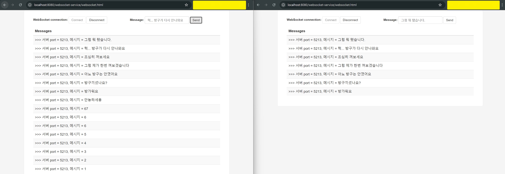
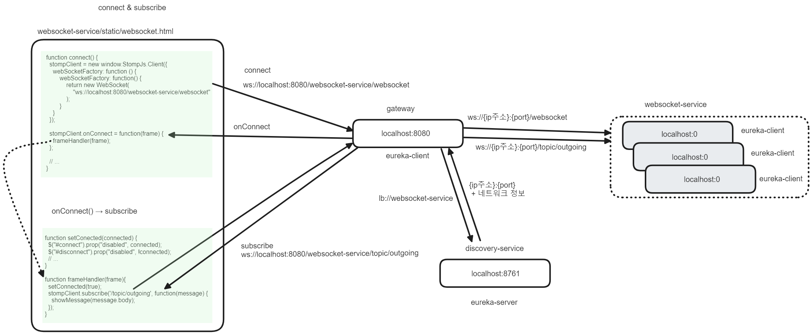

## Gateway, Eureka, Websoket


## 참고자료

- https://www.springcloud.io/post/2022-03/load-balanced-websockets-with-spring-cloud-gateway/#gsc.tab=0
- https://github.com/jmlw/demo-projects/tree/master
- https://blog.joshmlwood.com/websockets-with-spring-boot/

<br/>


## 실행

intellij

- discovery-service 실행
- gateway-service 실행
- websocket-service 실행
- 브라우저에서 http://localhost:8080/websocket-service/websocket.html 접속
- connect 버튼 클릭 (ws://localhost:8080/websocket-service/websocket)
- 브라우저 하나 더 열어서 http://localhost:8080/websocket-service/websocket.html 접속
- connect 버튼 클릭 (ws://localhost:8080/websocket-service/websocket)
- 메시지 Send 

<br/>


docker-compose

- 준비중 (gradle jib, dockerhub)
- cd 00.infrastructure && docker-compose up -d
- 브라우저에서 http://localhost:8080/websocket-service/websocket.html 접속
- connect 버튼 클릭 (ws://localhost:8080/websocket-service/websocket)
- 브라우저 하나 더 열어서 http://localhost:8080/websocket-service/websocket.html 접속
- connect 버튼 클릭 (ws://localhost:8080/websocket-service/websocket)
- 메시지 Send 

<br/>


## Screenshot



<br/>


## 통신 흐름




<br/>

최초 접속은 websocket-service 내의 websocket.html 을 통해 접속합니다.<br/>

- http://localhost:8080/websocket-service/websocket.html

<br/>


websocket.html 내의 connect 버튼을 누르면 

- ws://localhost:8080/websocket-service/websocket 

으로 websocket 접속 요청을 하게 되며, 접속요청이 성공적이라면 커넥션이 맺어지게 됩니다.<br/>


이제 http://localhost:8080/websocket-service/websocket.html 내에서 `Send` 버튼을 클릭하면 메시지를 전송합니다.<br/>

<br/>


http://localhost:8080/websocket-service 

- gateway 가 Router 로 매핑하고 있는 주소이며 외부에서 내부로 접속할때 Gateway에 요청하는 주소입니다.<br/>

- Gateway 뒷단에서 개별 WAS 인스턴스를 ip 주소를 직접 입력해서 개별 접속할 경우에는 [http://localhost:{포트주소}/websocket.html]() 로 접속하면 됩니다.
- (websocket-service 의 server.port를 바꿔주시면 됩니다.)<br/>

<br/>


## 코드

### discovery-service

#### build.gradle.kts

```kotlin
plugins {
	java
	id("org.springframework.boot") version "3.3.2"
	id("io.spring.dependency-management") version "1.1.6"
}

group = "io.chagchagchag.example"
version = "0.0.1-SNAPSHOT"

java {
	toolchain {
		languageVersion = JavaLanguageVersion.of(17)
	}
}

configurations {
	compileOnly {
		extendsFrom(configurations.annotationProcessor.get())
	}
}

repositories {
	mavenCentral()
}

extra["springCloudVersion"] = "2023.0.3"

dependencies {
	implementation("org.springframework.boot:spring-boot-starter-web")
	implementation("org.springframework.cloud:spring-cloud-starter-netflix-eureka-server")
	compileOnly("org.projectlombok:lombok")
	annotationProcessor("org.projectlombok:lombok")
	testImplementation("org.springframework.boot:spring-boot-starter-test")
	testRuntimeOnly("org.junit.platform:junit-platform-launcher")
}

dependencyManagement {
	imports {
		mavenBom("org.springframework.cloud:spring-cloud-dependencies:${property("springCloudVersion")}")
	}
}

tasks.withType<Test> {
	useJUnitPlatform()
}
```

<br/>


#### DiscoveryServiceApplication

```java
package io.chagchagchag.example.discovery;

import org.springframework.boot.SpringApplication;
import org.springframework.boot.autoconfigure.SpringBootApplication;
import org.springframework.cloud.netflix.eureka.server.EnableEurekaServer;

@EnableEurekaServer
@SpringBootApplication
public class DiscoveryServerApplication {

	public static void main(String[] args) {
		SpringApplication.run(DiscoveryServerApplication.class, args);
	}

}
```

<br/>


#### application.yml

```yaml
spring:
  application:
    name: gateway-websocket-eureka
server:
  port: 8761

eureka:
  client:
    register-with-eureka: false
    fetch-registry: false
    region: default
```

<br/>


### gateway-service

#### build.gradle.kts

```kotlin
plugins {
	java
	id("org.springframework.boot") version "3.3.2"
	id("io.spring.dependency-management") version "1.1.6"
}

group = "io.chagchagchag.example"
version = "0.0.1-SNAPSHOT"

java {
	toolchain {
		languageVersion = JavaLanguageVersion.of(17)
	}
}

configurations {
	compileOnly {
		extendsFrom(configurations.annotationProcessor.get())
	}
}

repositories {
	mavenCentral()
}

extra["springCloudVersion"] = "2023.0.3"

dependencies {
	implementation("org.springframework.boot:spring-boot-starter-webflux")
	implementation("org.springframework.cloud:spring-cloud-starter-gateway")
	implementation("org.springframework.cloud:spring-cloud-starter-netflix-eureka-client")
	compileOnly("org.projectlombok:lombok")
	annotationProcessor("org.projectlombok:lombok")
	testImplementation("org.springframework.boot:spring-boot-starter-test")
	testImplementation("io.projectreactor:reactor-test")
	testRuntimeOnly("org.junit.platform:junit-platform-launcher")
}

dependencyManagement {
	imports {
		mavenBom("org.springframework.cloud:spring-cloud-dependencies:${property("springCloudVersion")}")
	}
}

tasks.withType<Test> {
	useJUnitPlatform()
}
```

<br/>


#### GatewayServiceApplication

```java
package io.chagchagchag.example.gateway;

import org.springframework.boot.SpringApplication;
import org.springframework.boot.autoconfigure.SpringBootApplication;
import org.springframework.cloud.client.discovery.EnableDiscoveryClient;

@EnableDiscoveryClient
@SpringBootApplication
public class GatewayServiceApplication {

	public static void main(String[] args) {
		SpringApplication.run(GatewayServiceApplication.class, args);
	}

}
```

<br/>


#### application.yml

```yaml
spring:
  application:
    name: gateway-service
  cloud:
    gateway:
      routes:
        - id: websocket
          uri: lb://websocket-service
          order: 1
          predicates:
            - Path=/websocket-service/**
          filters:
            - RewritePath=/websocket-service/(?<segment>.*),/$\{segment}
server:
  port: 8080
eureka:
  client:
    fetch-registry: true
    register-with-eureka: true
    service-url:
      defaultZone: ${EUREKA_SERVER:http://localhost:8761/eureka}
  instance:
    instance-id: ${spring.application.name}:${spring.application.instance_id:${server.port}}
```

<br/>


### websocket-service

#### build.gradle.kts

```kotlin
plugins {
	java
	id("org.springframework.boot") version "3.3.2"
	id("io.spring.dependency-management") version "1.1.6"
}

group = "io.chagchagchag.example"
version = "0.0.1-SNAPSHOT"

java {
	toolchain {
		languageVersion = JavaLanguageVersion.of(17)
	}
}

configurations {
	compileOnly {
		extendsFrom(configurations.annotationProcessor.get())
	}
}

repositories {
	mavenCentral()
}

extra["springCloudVersion"] = "2023.0.3"

dependencies {
	implementation("org.springframework.boot:spring-boot-starter-web")
	implementation("org.springframework.boot:spring-boot-starter-websocket")
	implementation("org.springframework.boot:spring-boot-starter-reactor-netty")
	implementation("org.springframework.cloud:spring-cloud-starter-netflix-eureka-client")
	compileOnly("org.projectlombok:lombok")
	annotationProcessor("org.projectlombok:lombok")
	testImplementation("org.springframework.boot:spring-boot-starter-test")
	testRuntimeOnly("org.junit.platform:junit-platform-launcher")
}

dependencyManagement {
	imports {
		mavenBom("org.springframework.cloud:spring-cloud-dependencies:${property("springCloudVersion")}")
	}
}

tasks.withType<Test> {
	useJUnitPlatform()
}
```

<br/>


#### application.yml

```yaml
spring:
  application:
    name: websocket-service

eureka:
  client:
    service-url:
      defaultZone: ${EUREKA_SERVER:http://localhost:8761/eureka}
    register-with-eureka: true
    fetch-registry: true
#    registry-fetch-interval-seconds: 3
#    disable-delta: true
  instance:
    instance-id: ${spring.application.name}:${spring.application.instance_id:${server.port}}

server:
  port: 0

broker:
  relay:
    host: ${BROKER_HOST:localhost}
```

<br/>


#### WebSocketServiceApplication

```java
package io.chagchagchag.example.websocket;

import org.springframework.boot.SpringApplication;
import org.springframework.boot.autoconfigure.SpringBootApplication;
import org.springframework.boot.context.properties.ConfigurationPropertiesScan;
import org.springframework.cloud.client.discovery.EnableDiscoveryClient;

@ConfigurationPropertiesScan
@EnableDiscoveryClient
@SpringBootApplication
public class WebSocketServiceApplication {

	public static void main(String[] args) {
		SpringApplication.run(WebSocketServiceApplication.class, args);
	}

}
```

<br/>


#### WebSocketConfig

```java
package io.chagchagchag.example.websocket.config;

import org.springframework.beans.factory.annotation.Value;
import org.springframework.context.annotation.Configuration;
import org.springframework.messaging.simp.config.MessageBrokerRegistry;
import org.springframework.web.socket.config.annotation.EnableWebSocketMessageBroker;
import org.springframework.web.socket.config.annotation.StompEndpointRegistry;
import org.springframework.web.socket.config.annotation.WebSocketMessageBrokerConfigurer;

@Configuration
@EnableWebSocketMessageBroker
public class WebSocketConfig implements WebSocketMessageBrokerConfigurer {

  @Value("${broker.relay.host}")
  private String brokerRelayHost;

  @Override
  public void registerStompEndpoints(StompEndpointRegistry registry) {
    registry.addEndpoint("/websocket")
        .setAllowedOrigins("*");
    registry.addEndpoint("/sockjs")
        .setAllowedOrigins("*")
        .withSockJS();
  }

  @Override
  public void configureMessageBroker(MessageBrokerRegistry registry) {
    registry.setApplicationDestinationPrefixes("/app");
  }
}

```

<br/>


#### Message

```java
package io.chagchagchag.example.websocket.domain;

public record Message(
    String message
) {

}
```

<br/>


#### WebSocketController

```java
package io.chagchagchag.example.websocket.domain;

import io.chagchagchag.example.websocket.config.properties.ServerProperties;
import java.util.Random;
import lombok.RequiredArgsConstructor;
import lombok.extern.slf4j.Slf4j;
import org.springframework.beans.factory.annotation.Value;
import org.springframework.boot.web.servlet.context.ServletWebServerApplicationContext;
import org.springframework.http.HttpStatus;
import org.springframework.http.ResponseEntity;
import org.springframework.messaging.handler.annotation.MessageMapping;
import org.springframework.messaging.handler.annotation.SendTo;
import org.springframework.messaging.simp.SimpMessagingTemplate;
import org.springframework.scheduling.annotation.Scheduled;
import org.springframework.web.bind.annotation.GetMapping;
import org.springframework.web.bind.annotation.RestController;

@Slf4j
@RequiredArgsConstructor
@RestController
public class WebSocketController {
  private final ServerProperties serverProperties;
  private final SimpMessagingTemplate simpMessagingTemplate;
  private final ServletWebServerApplicationContext serverApplicationContext;

  private final Random RANDOM = new Random();

  @GetMapping("hello")
  public ResponseEntity<String> hello(){
    return ResponseEntity.status(HttpStatus.OK.value()).body("hello");
  }

  @MessageMapping("/incoming")
  @SendTo("/topic/outgoing")
  public String incoming(Message message){
    int port = serverApplicationContext.getWebServer().getPort();
    log.info(String.format("메세지 수신 : %s", message));
    return String.format("서버 port = %s, 메시지 = %s", port, message.message());
  }

  @Scheduled(fixedRate = 15000L)
  public void timed(){
    try{
      Thread.sleep(RANDOM.nextInt(10) * 1000);
      log.info("스케쥴링된 메시지 전송");
      simpMessagingTemplate.convertAndSend(
          "/topic/outgoing",
          String.format("서버 port = %s, 메시지 전송완료", serverProperties.getPort())
      );
    }
    catch (Exception e){
      log.error(String.format("exception message = %s", e.getMessage()));
    }
  }

}
```

<br/>


#### src/main/resources/static/websocket.html

```html
<html>
<head>
  <meta charset="UTF-8">
  <title>Websocket </title>
  <link href="https://cdnjs.cloudflare.com/ajax/libs/twitter-bootstrap/3.3.7/css/bootstrap.css" rel="stylesheet"/>
  <style>
    body {
      background-color: #f5f5f5;
    }

    #main-content {
      max-width: 940px;
      padding: 2em 3em;
      margin: 0 auto 20px;
      background-color: #fff;
      border: 1px solid #e5e5e5;
      -webkit-border-radius: 5px;
      -moz-border-radius: 5px;
      border-radius: 5px;
    }
  </style>
  <script src="https://cdnjs.cloudflare.com/ajax/libs/jquery/3.3.1/jquery.js"></script>
  <script src="https://cdn.jsdelivr.net/npm/@stomp/stompjs@5.0.0/bundles/stomp.umd.js"></script>
  <script src="https://cdn.jsdelivr.net/npm/sockjs-client@1/dist/sockjs.min.js"></script>
  <script>
    var stompClient = null;

    function connect() {
      stompClient = new window.StompJs.Client({
        webSocketFactory: function () {
          return new WebSocket("ws://localhost:8080/websocket-service/websocket");
        }
      });
      stompClient.onConnect = function (frame) {
        frameHandler(frame)
      };
      stompClient.onWebsocketClose = function () {
        onSocketClose();
      };

      stompClient.activate();
    }

    function setConnected(connected) {
      $("#connect").prop("disabled", connected);
      $("#disconnect").prop("disabled", !connected);
      if (connected) {
        $("#responses").show();
      } else {
        $("#responses").hide();
      }
      $("#messages").html("");
    }

    function frameHandler(frame) {
      setConnected(true);
      console.log('Connected: ' + frame);
      stompClient.subscribe('/topic/outgoing', function (message) {
        showMessage(message.body);
      });
    }

    function onSocketClose() {
      if (stompClient !== null) {
        stompClient.deactivate();
      }
      setConnected(false);
      console.log("Socket was closed. Setting connected to false!")
    }

    function disconnect() {
      onSocketClose();
    }

    function sendMessage() {
      stompClient.publish({
        destination: "/app/incoming",
        body: JSON.stringify({'message': $("#message").val()})
      });
    }

    function showMessage(message) {
      $("#responses").prepend("<tr><td>" + '>>> ' + message + "</td></tr>");
    }

    $(function () {
      $("form").on('submit', function (e) {
        e.preventDefault();
      });
      $("#connect").click(function () {
        connect();
      });
      $("#disconnect").click(function () {
        disconnect();
      });
      $("#send").click(function () {
        sendMessage();
      });
      $("document").ready(function () {
        disconnect();
      });
    });
  </script>
</head>
<body>
<noscript><h2 style="color: #ff0000">Seems your browser doesn't support Javascript! Websocket relies on Javascript being
  enabled. Please enable
  Javascript and reload this page!</h2></noscript>
<div class="container" id="main-content">
  <div class="row">
    <div class="col-md-6">
      <form class="form-inline">
        <div class="form-group">
          <label for="connect">WebSocket connection:</label>
          <button class="btn btn-default" id="connect" type="submit">Connect</button>
          <button class="btn btn-default" disabled="disabled" id="disconnect" type="submit">Disconnect
          </button>
        </div>
      </form>
    </div>
    <div class="col-md-6">
      <form class="form-inline">
        <div class="form-group">
          <label for="message">Message:</label>
          <input class="form-control" id="message" placeholder="Your message here..." type="text">
        </div>
        <button class="btn btn-default" id="send" type="submit">Send</button>
      </form>
    </div>
  </div>
  <div class="row">
    <div class="col-md-12">
      <table class="table table-striped" id="responses">
        <thead>
        <tr>
          <th>Messages</th>
        </tr>
        </thead>
        <tbody id="messages">
        </tbody>
      </table>
    </div>
  </div>
</div>
</body>

</html>
```

