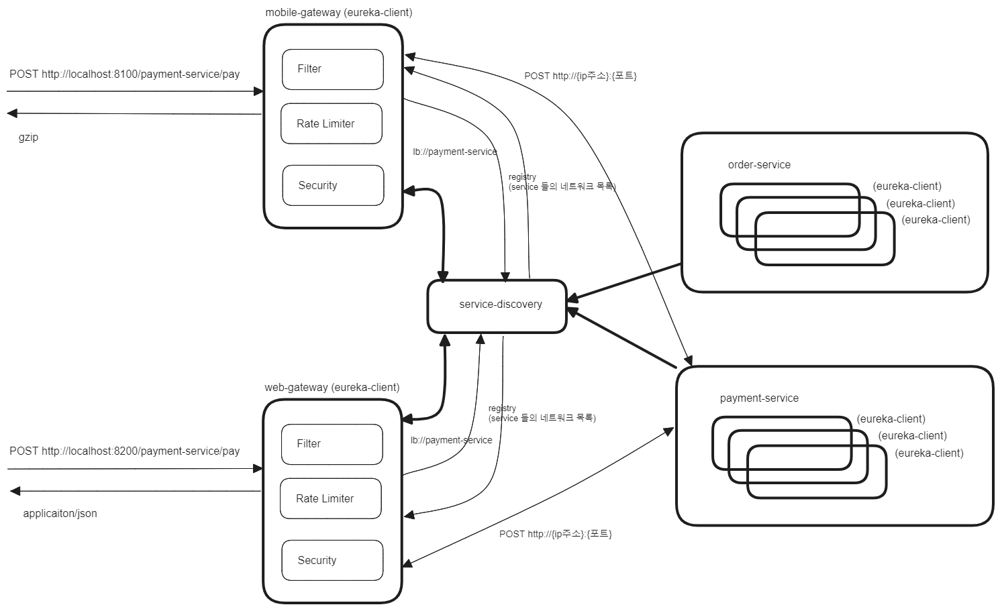
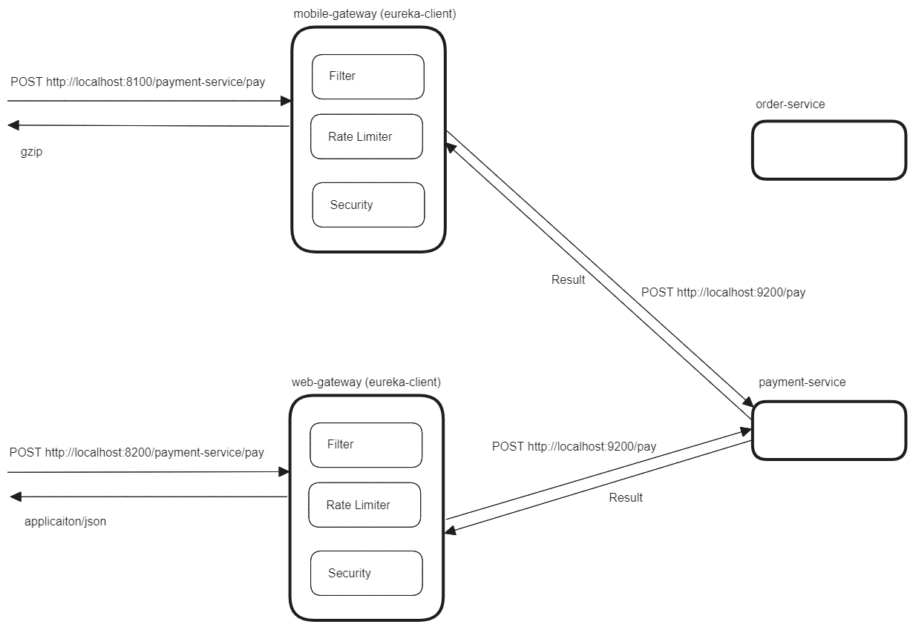

## Gateway 를 이용한 BFF 패턴

아직 정리 중이에요!!! 

 

## BFF 란?

BFF 는 Backend For Frontend 라는 용어의 약자입니다. Web, Mobile 은 각각 Response 의 형태가 조금 다를 수 있습니다. Mobile 의 경우 Response 를 zip 으로 압축해서 내보내기도 하지만, Web 의 경우에는 Response 를 그대로 내보낼 경우가 많을 수 있습니다. 

이때 Web 과 Mobile 이 같은 Gateway 를 바라볼 경우 web 에 내려줄 Response 가 다르기 때문에 REST API 로 web, mobile을 구분하게 됩니다. 만약 BFF 패턴을 적용하게 되면 REST API 의 형태를 바꾸지 않으면서 web, mobile 에 따라 최적화된 Filter 를 적용해서 필요한 미디어 타입등을 최적화해서 지원할 수 있습니다. 

Frontend 의 종류별로 필요한 Gateway 서버를 제공하는 방식이기에 Gateway 서버가 여러개 존재해야 합니다. REST API 의 형식을 바꾸지 않아도 된다는 장점은 있지만, Web, Mobile 이 바라보는 API 서버 주소 또는 FQDN 이 달라진다는 점도 존재합니다. 

 

## Diagram

### Eureka Server, Eureka Client 와 함께 구성시

 

### Eureka Server, Eureka Client 없이 구성할 때

 

