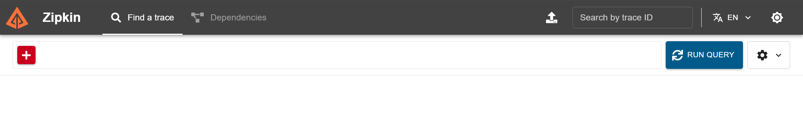
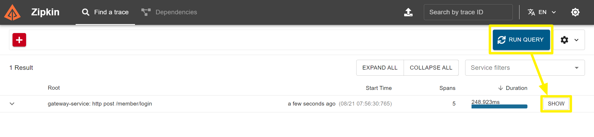
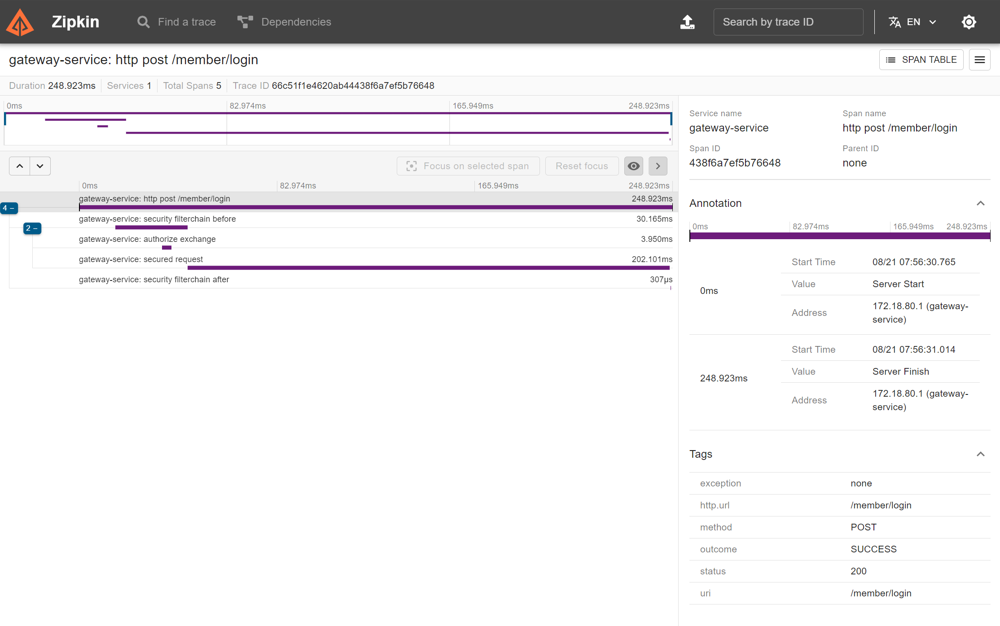

## gateway 에 zipkin을 이용해 분산로깅

gateway가 아니더라도 일반적인 WAS에도 적용이 가능하지만, Gateway 에도 적용하기에 제목을 Gateway 분산로깅이라고 문서의 제목을 지었습니다. <br/>


## 예제 github


## 예제 시나리오


## zipkin 구동 

zipkin 서버를 구동해야 하는데, 로컬 개발환경에 docker-compose 를 이용해서 간소하게 zipkin 서버를 구동합니다.

```yaml
version: '3'
networks:
  front-tier:
  back-tier:
    driver: bridge

services:
  redis:
    image: redis:latest
    ports:
      - "6379:6379"
    volumes:
      - redis-data:/data
    command: redis-server --appendonly yes
  zipkin:
    image: ghcr.io/openzipkin/zipkin-slim:${TAG:-latest}
    container_name: zipkin
    # Environment settings are defined here https://github.com/openzipkin/zipkin/blob/master/zipkin-server/README.md#environment-variables
    environment:
      - STORAGE_TYPE=mem
      # Uncomment to enable self-tracing
      # - SELF_TRACING_ENABLED=true
      # Uncomment to increase heap size
      # - JAVA_OPTS=-Xms128m -Xmx128m -XX:+ExitOnOutOfMemoryError
    ports:
      # Port used for the Zipkin UI and HTTP Api
      - 9411:9411

volumes:
  redis-data:
  prometheus_data: { }
  grafana_data: { }
```

<br/>

위의 zipkin 인스턴스를 구동 후에 브라우저에서 http://localhost:9411 로 접속해보시면 아래와 같은 화면이 나타납니다.



<br/>


## WAS 내에 zipkin 연동

### build.gradle.kts

```kotlin
dependencies {   
    // ...
    // zipkin
    // spring 3.x 부터 deprecated
    //	implementation("org.springframework.cloud:spring-cloud-starter-sleuth")  // (1)
    
    // (2)
    implementation("io.micrometer:micrometer-tracing-bridge-brave")
    implementation("io.zipkin.reporter2:zipkin-reporter-brave")
    // (3)
    implementation("org.springframework.boot:spring-boot-starter-actuator")
    
    // ...
}
```

(1) : org.springframework.cloud:spring-cloud-starter-sleuth 

- Deprecated 되었습니다.

- spring 3.x 부터는 sleuth 를 이용해서 zipkin 을 연동할 수 없게 되었습니다.

(2)

- zipkin 에서 제공하는 zipkin reporter 와 io.micrometer 에서 제공하는 micrometer-tracing-bridge-brave 를 사용하면 zipkin 연동이 가능합니다.

(3)

- spring boot starter actuator 역시 의존성을 추가해야 메트릭이 수집될수 있기에 의존성을 추가해두었습니다.

<br/>


### application.yml

아래 내용을 추가해주시기 바랍니다.

```yaml
# ...

management:
  tracing:
    sampling:
      probability: 1.0
    propagation:
      consume: b3
      produce: b3_multi
  zipkin:
    tracing:
      endpoint: "http://localhost:9411/api/v2/spans"
```

zipkin.tracing.endpoint

- `http://localhost:9411/api/v2/spans` 를 지정해줬습니다.
- localhost:9411 은 docker 로 로컬개발환경에 구동시킨 zipkin 인스턴스입니다.

<br/>


## 실행결과

github 링크로 제시한 예제에서 아래 http 파일을 실행시켜주세요<br/>

gateway.http

```http
###
POST http://localhost:8080/member/login
Content-Type: application/json

{
  "email": "aaa@gmail.com",
  "password": "aaaaa"
}

> 
```

<br/>


위의 요청을 수행했을 때 tracing 이 된 모습을 살펴보면 아래와 같습니다. 

- RUN QUERY 버튼 클릭 → SHOW 버튼 클릭을 합니다.



<br/>


이후 나타난 화면을 보면, Gateway 내에서 어떻게 호출이 이뤄지는지가 tracing 이 되어 있는 모습을 볼 수 있습니다.



<br/>

