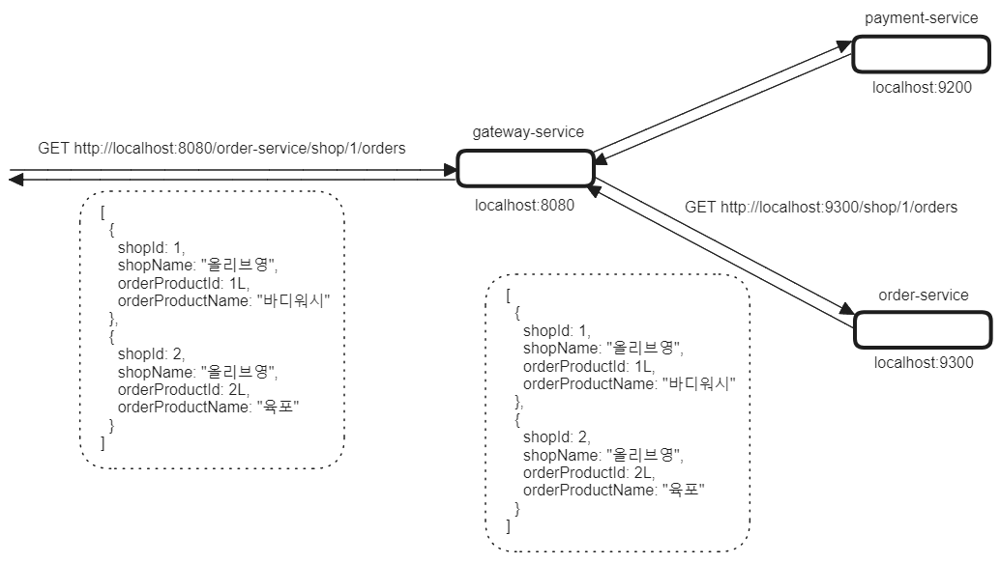

## Spring Cloud Gateway Overview

아직 문서 작업 중 이에요!! 빠르게 정리하겠습니다!!!!!!!!!!!!!!!!!!!!!!!<br/>


## 참고

Reference Docs

- [docs.spring.io - Spring Cloud Gateway Docs](https://docs.spring.io/spring-cloud-gateway/reference/)

- [cloud.spring.io - Spring Cloud Gateway Docs](https://cloud.spring.io/spring-cloud-gateway/reference/html/)
- 이 문서는 [cloud.spring.io - Spring Cloud Gateway Docs](https://cloud.spring.io/spring-cloud-gateway/reference/html/) 의 문서를 기반으로 예제들을 작성했습니다.

Predicate

- [5.1. The After Route Predicate Factory](https://cloud.spring.io/spring-cloud-gateway/reference/html/#gateway-request-predicates-factories)

- [5.2. The Before Route Predicate Factory](https://cloud.spring.io/spring-cloud-gateway/reference/html/#the-before-route-predicate-factory)

- [5.3. The Between Route Predicate Factory](https://cloud.spring.io/spring-cloud-gateway/reference/html/#the-between-route-predicate-factory)

- [5.4. The Cookie Route Predicate Factory](https://cloud.spring.io/spring-cloud-gateway/reference/html/#the-cookie-route-predicate-factory)

- [5.5. The Header Route Predicate Factory](https://cloud.spring.io/spring-cloud-gateway/reference/html/#the-header-route-predicate-factory)

- [5.6. The Host Route Predicate Factory](https://cloud.spring.io/spring-cloud-gateway/reference/html/#the-host-route-predicate-factory)

- [5.7. The Method Route Predicate Factory](https://cloud.spring.io/spring-cloud-gateway/reference/html/#the-method-route-predicate-factory)

- [5.8. The Path Route Predicate Factory](https://cloud.spring.io/spring-cloud-gateway/reference/html/#the-path-route-predicate-factory)

- [5.9. The Query Route Predicate Factory](https://cloud.spring.io/spring-cloud-gateway/reference/html/#the-query-route-predicate-factory)

- [5.10. The RemoteAddr Route Predicate Factory](https://cloud.spring.io/spring-cloud-gateway/reference/html/#the-remoteaddr-route-predicate-factory)

- [5.11. The Weight Route Predicate Factory](https://cloud.spring.io/spring-cloud-gateway/reference/html/#the-weight-route-predicate-factory)

[GlobalFilters](https://cloud.spring.io/spring-cloud-gateway/reference/html/#global-filters)

- [7.1. Combined Global Filter and GatewayFilter Ordering](https://cloud.spring.io/spring-cloud-gateway/reference/html/#gateway-combined-global-filter-and-gatewayfilter-ordering)
- [7.2. Forward Routing Filter](https://cloud.spring.io/spring-cloud-gateway/reference/html/#forward-routing-filter)
- [7.3. The LoadBalancerClient Filter](https://cloud.spring.io/spring-cloud-gateway/reference/html/#the-loadbalancerclient-filter)
- [7.4. The ReactiveLoadBalancerClientFilter](https://cloud.spring.io/spring-cloud-gateway/reference/html/#reactive-loadbalancer-client-filter)
- [7.5. The Netty Routing Filter](https://cloud.spring.io/spring-cloud-gateway/reference/html/#the-netty-routing-filter)
- [7.6. The Netty Write Response Filter](https://cloud.spring.io/spring-cloud-gateway/reference/html/#the-netty-write-response-filter)
- [7.7. The RouteToRequestUrl Filter](https://cloud.spring.io/spring-cloud-gateway/reference/html/#the-routetorequesturl-filter)
- [7.8. The Websocket Routing Filter](https://cloud.spring.io/spring-cloud-gateway/reference/html/#the-websocket-routing-filter)
- [7.9. The Gateway Metrics Filter](https://cloud.spring.io/spring-cloud-gateway/reference/html/#the-gateway-metrics-filter)
- [7.10. Marking An Exchange As Routed](https://cloud.spring.io/spring-cloud-gateway/reference/html/#marking-an-exchange-as-routed)


- https://cheese10yun.github.io/spring-cloud-gateway/

[HttpHeadersFilters](https://cloud.spring.io/spring-cloud-gateway/reference/html/#httpheadersfilters)

- [8.1. Forwarded Headers Filter](https://cloud.spring.io/spring-cloud-gateway/reference/html/#forwarded-headers-filter)
- [8.2. RemoveHopByHop Headers Filter](https://cloud.spring.io/spring-cloud-gateway/reference/html/#removehopbyhop-headers-filter)
- [8.3. XForwarded Headers Filter](https://cloud.spring.io/spring-cloud-gateway/reference/html/#xforwarded-headers-filter)

[TLS and SSL](https://cloud.spring.io/spring-cloud-gateway/reference/html/#tls-and-ssl)

- [9.1. TLS Handshake](https://cloud.spring.io/spring-cloud-gateway/reference/html/#tls-handshake)

RouteDefinitionLocator 란 ?

- [10\. Configuration](https://cloud.spring.io/spring-cloud-gateway/reference/html/#configuration)

Route 에 부가적인 메타데이터 프로퍼티 사용

- [11\. Route Metadata Configuration](https://cloud.spring.io/spring-cloud-gateway/reference/html/#route-metadata-configuration)

Http Timeout 설정

- [12\. Http timeouts configuration](https://cloud.spring.io/spring-cloud-gateway/reference/html/#http-timeouts-configuration)

  - [12.1. Global timeouts](https://cloud.spring.io/spring-cloud-gateway/reference/html/#global-timeouts)

  - [12.2. Per-route timeouts](https://cloud.spring.io/spring-cloud-gateway/reference/html/#per-route-timeouts)

  - [12.3. Fluent Java Routes API](https://cloud.spring.io/spring-cloud-gateway/reference/html/#fluent-java-routes-api)

  - [12.4. The DiscoveryClient Route Definition Locator](https://cloud.spring.io/spring-cloud-gateway/reference/html/#the-discoveryclient-route-definition-locator)


<br/>

Reactor Netty Access Log

- [13\. Reactor Netty Access Log](https://cloud.spring.io/spring-cloud-gateway/reference/html/#reactor-netty-access-logs)

CORS

- [14\. CORS Configuration](https://cloud.spring.io/spring-cloud-gateway/reference/html/#cors-configuration)

Actuator API<br/>

- [15\. Actuator API](https://cloud.spring.io/spring-cloud-gateway/reference/html/#actuator-api)

  - [15.1. Verbose Actuator Format](https://cloud.spring.io/spring-cloud-gateway/reference/html/#verbose-actuator-format)

  - [15.2. Retrieving Route Filters](https://cloud.spring.io/spring-cloud-gateway/reference/html/#retrieving-route-filters)

  - [15.3. Refreshing the Route Cache](https://cloud.spring.io/spring-cloud-gateway/reference/html/#refreshing-the-route-cache)

  - [15.4. Retrieving the Routes Defined in the Gateway](https://cloud.spring.io/spring-cloud-gateway/reference/html/#retrieving-the-routes-defined-in-the-gateway)

  - [15.5. Retrieving Information about a Particular Route](https://cloud.spring.io/spring-cloud-gateway/reference/html/#gateway-retrieving-information-about-a-particular-route)

  - [15.6. Creating and Deleting a Particular Route](https://cloud.spring.io/spring-cloud-gateway/reference/html/#creating-and-deleting-a-particular-route)

  - [15.7. Recap: The List of All endpoints](https://cloud.spring.io/spring-cloud-gateway/reference/html/#recap-the-list-of-all-endpoints)

<br/>


## 예제 github

예제로 사용한 Gateway 는 모두 Reactive Gateway 를 사용했습니다.

- [Eureka 없이 구성한 Gateway + MSA](https://github.com/chagchagchag/memo/tree/main/spring-gateway/example/gateway-non-eureka-msa-services)
- [Eureka + Gateway + MSA](https://github.com/chagchagchag/memo/tree/main/spring-gateway/example/gateway-eureka-msa-services)
- [Eureka + Gateway + Websocket WAS (Servlet 버전)](https://github.com/chagchagchag/memo/tree/main/spring-gateway/example/gateway-eureka-websocket)

<br/>


예제 구성과 소스코드에 대한 설명은 이 문서의 제일 마지막에 정리해두었습니다.<br/>

<br/>


## Route, Predicate, Filters

### Route

- 특정 URI 에 대해서 어떤 조건(Predicate)일 때 어떤 Filter 를 적용할 지에 대한 URL을 매핑하는 규칙의 단위입니다. 이 규칙의 단위를 하나의 Route 객체로 표현합니다. 
- 주로 application.yml 내의 `spring.cloud.routes[i]` 에 하나씩 정의합니다.
- 각각의 Route 는 고유한 id 를 이용해서 각각의 Route 들을 구분할 수 있습니다. `spring.cloud.routes[i].id={라우트ID}` 로 정의합니다.
- Route 는 uri, predicate, filter 로 구분합니다.

<br/>


### Predicate

- 어떤 요청에 대해 헤더, URI 패턴 등에 대해 조건값이 맞는지를 판단하는 조건식 역할을 하는 객체입니다.
- Path, Host, Method 에 어떤 값이 왔을때 Gateway Filter 를 타게 할지를 결정하도록 하는 조건문같은 역할을 수행합니다.
- 주로 application.ym 내의 `spring.cloud.routes[i].predicate` 에 정의합니다. 
- Path의 `**`, `*` 표현식
  - e.g. `Path=/order-service/**` :  `{uri}/order-service/{경로}` 에서  `/order-service`하위의 모든 Path 에 대해 Filter 를 적용하겠다는 의미입니다.
  - e.g. `Path=/order-service/*` :  `{uri}/order-service/{경로}` 에서  `/order-service`하위의 첫번째 Path 에 대해 Filter 를 적용하겠다는 의미입니다.

- Host, Query Parameter, Path Variable, Method 와 같은 REST API 의 주요 요청 형식에 대해 조건문을 만들어서 적용하는 것이 가능합니다.

<br/>


참고

- [5.1. The After Route Predicate Factory](https://cloud.spring.io/spring-cloud-gateway/reference/html/#gateway-request-predicates-factories)

- [5.2. The Before Route Predicate Factory](https://cloud.spring.io/spring-cloud-gateway/reference/html/#the-before-route-predicate-factory)

- [5.3. The Between Route Predicate Factory](https://cloud.spring.io/spring-cloud-gateway/reference/html/#the-between-route-predicate-factory)

- [5.4. The Cookie Route Predicate Factory](https://cloud.spring.io/spring-cloud-gateway/reference/html/#the-cookie-route-predicate-factory)

- [5.5. The Header Route Predicate Factory](https://cloud.spring.io/spring-cloud-gateway/reference/html/#the-header-route-predicate-factory)

- [5.6. The Host Route Predicate Factory](https://cloud.spring.io/spring-cloud-gateway/reference/html/#the-host-route-predicate-factory)

- [5.7. The Method Route Predicate Factory](https://cloud.spring.io/spring-cloud-gateway/reference/html/#the-method-route-predicate-factory)

- [5.8. The Path Route Predicate Factory](https://cloud.spring.io/spring-cloud-gateway/reference/html/#the-path-route-predicate-factory)

- [5.9. The Query Route Predicate Factory](https://cloud.spring.io/spring-cloud-gateway/reference/html/#the-query-route-predicate-factory)

- [5.10. The RemoteAddr Route Predicate Factory](https://cloud.spring.io/spring-cloud-gateway/reference/html/#the-remoteaddr-route-predicate-factory)

- [5.11. The Weight Route Predicate Factory](https://cloud.spring.io/spring-cloud-gateway/reference/html/#the-weight-route-predicate-factory)

<br/>


#### After, Before, Between Predicate Factory

After, Before, Between Predicate는 요청이 특정 시점 이전,이후,사이에 발생했는지를 검사하는 Predicate 역할을 수행합니다.

- After : 특정 시점 이 후에 발생한 요청인지를 검사해서 특정 시점 이후의 요청일 경우 true
- Before : 특정 시점 이 전에 발생한 요청인지를 검사해서 특정 시점 이전의 요청일 경우 true
- Between 특정 시점 사이에 발생한 요청인지를 검사해서 특정시점 사이의 요청일 경우 true

<br/>

이벤트 등에 이런 시간 관련된 Filter 를 사용하면 유용합니다. <br/>

예제를 한번씩 꼭 수행해보셨으면 합니다. 한번씩 실행해보고 경험을 실제로 하고나면 나중에 더 기억이 잘 나기 때문입니다.<br/>

<br/>


##### After

```yaml
spring:
  # ... 
  cloud:
    gateway:
      routes:
      - id: order-service
        uri: http://localhost:8081
        predicates:
          - Path=/order/**
          - After=2024-08-23T22:28:28.228+09:00[Asia/Seoul]

  # ...
```

<br/>

만약 현재 시각이 위에서 적은 `After=2024-08-23T22:28:28.228+09:00[Asia/Seoul]` 에 명시한 시간의 이전이라면 아래와 같은 에러가 출력됩니다.

```plain
HTTP/1.1 404 Not Found
Content-Type: application/json
Content-Length: 133

{
  "timestamp": "2024-08-23T11:56:15.644+00:00",
  "path": "/order-service/hello",
  "status": 404,
  "error": "Not Found",
  "requestId": "c03b66a3-1"
}
```

<br/>


##### Before

```yaml
spring:
  # ... 
  cloud:
    gateway:
      routes:
      - id: order-service
        uri: http://localhost:8081
        predicates:
          - Path=/order/**
          - Before=2024-08-23T22:28:28.228+09:00[Asia/Seoul]

  # ...
```

<br/>

만약 현재 시각이 위에서 적은 `Before=2024-08-23T22:28:28.228+09:00[Asia/Seoul]` 이 되기 전이라면 아래와 같이 정상적인 결과를 내게 됩니다.

```plain
HTTP/1.1 200 OK
Content-Type: text/plain;charset=UTF-8
Content-Length: 5
Date: Fri, 23 Aug 2024 11:58:35 GMT

hello

Response code: 200 (OK); Time: 377ms (377 ms); Content length: 5 bytes (5 B)
```

<br/>


##### Between

```yaml
spring:
  # ... 
  cloud:
    gateway:
      routes:
      - id: order-service
        uri: http://localhost:8081
        predicates:
          - Path=/order/**
          - Between=2024-08-22T22:28:28.228+09:00[Asia/Seoul], 2024-08-23T22:28:28.228+09:00[Asia/Seoul]

  # ...
```

만약 현재 시각이 위에서 적은 `2024-08-22T22:28:28.228+09:00[Asia/Seoul], 2024-08-23T22:28:28.228+09:00[Asia/Seoul]` 사이의 기간이라면 아래와 같이 정상적인 결과를 내게 됩니다.

<br/>

```plain
HTTP/1.1 200 OK
Content-Type: text/plain;charset=UTF-8
Content-Length: 5
Date: Fri, 23 Aug 2024 11:59:58 GMT

hello

Response code: 200 (OK); Time: 373ms (373 ms); Content length: 5 bytes (5 B)
```

<br/>


#### Cookie, Header Predicate Factory

##### Cookie

application.yml 에 아래와 같이 정의하는 경우를 확인해봅니다.

```yaml
spring:
  # ... 
  cloud:
    gateway:
      routes:
      - id: order-service
        uri: http://localhost:8081
        predicates:
          - Path=/order/**
          - Cookie=victoria, 222
  # ...
```

victoria 라는 name 에 대해 222 라는 value가 Cookie 로 요청으로 전달되면 통과되는 Predicate 입니다.

**value 에는 정규표현식을 사용하는 것 역시 가능합니다.**

<br/>

위 요청은 아래와 같이 요청을 보내면 200 OK 응답을 받게 됩니다.

```http
GET http://localhost:8080/order-service/hello
Cookie: victoria=222

```

<br/>


##### Header

application.yml 에 아래와 같이 정의하는 경우를 확인해봅니다.

```yaml
spring:
  # ... 
  cloud:
    gateway:
      routes:
      - id: order-service
        uri: http://localhost:8081
        predicates:
          - Path=/order/**
          - Header=X-Request-id, \d+
  # ...
```

`X-Request-id` 라는 헤더에 대해 숫자 여러개를 의미하는 정규표현식 `\d+` 에 해당하는 숫자열이 value 가 헤더로 전달되면 200 OK 를 응답으로 받게 됩니다.

```plain
### order-service
GET http://localhost:8080/order-service/hello
X-Request-id: 32
```

<br/>


#### Host, Method, Path, Query Predicate Factory

##### Host

Host 는 Ant 스타일의 패턴 매칭을 사용합니다.

application.yml 을 아래와 같이 적용된 경우를 살펴봅니다.

```yaml
spring:
  # ... 
  cloud:
    gateway:
      routes:
      - id: order-service
        uri: http://localhost:8081
        predicates:
          - Path=/order-service/**
          - Host=**.reddit.com, **.instagram.com
  # ...
```

`Host` 라는 Name 에 대해 Value 로 `mail.reddit.com, api.instagram.com` 을 지정해서 요청을 보내면 200 OK 응답을 받게 됩니다.

```http
### order-service
GET http://localhost:8080/order-service/hello
Host: mail.reddit.com, api.instagram.com
```

<br/>


##### Method

application.yml 을 아래와 같이 적용된 경우를 살펴봅니다.

위에서 살펴본 Host 헤더와 함께 사용했습니다.

```yaml
spring:
  # ... 
  cloud:
    gateway:
      routes:
      - id: order-service
        uri: http://localhost:8081
        predicates:
          - Path=/order/**
          - Host=**.reddit.com, **.instagram.com
          - Method=GET,POST
  # ...
```

Method 라는 Name 에 대해 `GET, POST` 를 Value 로 받게끔 했는데, 이렇게 지정하면 GET, POST 메서드 요청만을 허용하게 됩니다. 만약 `DELETE` 를 허용하지 않고 `GET, POST` 만을 허용해야만 하는 MSA  등에 유용하게 적용할 수 있습니다.<br/>

아래의 http 요청은 200 OK 를 응답합니다.

```http
### order-service
GET http://localhost:8080/order-service/hello
Host: mail.reddit.com, api.instagram.com
```

<br/>


##### Path

- 공식문서 내용 설명
- !(not) 연산자 적용 가능 여부
- 끝에 `/` 이 안 붙는 경우만을 Predicate 할 경우 (false 값을 부여)

<br/>

**공식문서 내용 설명**<br/>

제 경우에는 이 Path 관련 기능은 언제 사용하면 좋을지 아직 찾지는 못했습니다. 공식 문서에서 제공하는 application.yml 예제는 다음과 같습니다.

```yaml
spring:
  cloud:
    gateway:
      routes:
      - id: path_route
        uri: https://example.org
        predicates:
        - Path=/red/{segment},/blue/{segment}
```

만약 이렇게 route 를 정의하면 request 경로가 아래와 같을 경우에 특정 Path 에 대한 요청을 Predicate 할 수 있습니다.

- `/red/1` 
- `/red/blue` 
-  `/blue/green`

위에서 사용한 `segment` 라는 값은 원하는대로 `path` 라는 값을 써도 되고 `id` 라는 변수를 써도 되고, 회사 내에서 원하는 규칙에 대한 정의에 맞게 이름을 정의해주시면 됩니다.<br/>

Predicate 에서 사용한 변수 segment 는 ServerWebExchange.getAttributes() 라는 메서드로 접근가능하며 예제는 아래와 같습니다. 자세한 내용은 [The Path Route Predicate Factory](https://cloud.spring.io/spring-cloud-gateway/reference/html/#the-path-route-predicate-factory) 를 참고해주시기 바랍니다.<br/>

```java
Map<String, String> uriVariables = ServerWebExchangeUtils.getPathPredicateVariables(exchange);

String segment = uriVariables.get("segment");
```

<br/>


**!(not) 연산자 적용 가능 여부**<br/>

제 경우에는 아래 예제를 통해 !(not)연산자가 적용이 되는지를 테스트해봤는데, 아무런 효과는 없었습니다.

```yaml
spring:
  # ... 
  cloud:
    gateway:
      routes:
      - id: order-service
        uri: http://localhost:8081
        predicates:
          - Path=!/order-service/order/admin/{path}
        filters:
          - RewritePath=/order-service/(?<path>.*),/$\{path}
  # ...
```

<br/>


**끝에 `/` 이 없는 것을 기준으로 Predicate 하려고 할 경우**

- 참고 : [What's the use of matchOptionalTrailingSeparator in Spring Cloud Gateway Predicate](https://stackoverflow.com/questions/62493309/whats-the-use-of-matchoptionaltrailingseparator-in-spring-cloud-gateway-predica)


만약 아래와 같이 정의하면 `/foo/{segment}`, `/foo/{segment}/` 가 모두 허용됩니다.

```yaml
spring:
  cloud:
    gateway:
      routes:
      - id: host_route
        uri: https://example.org
        predicates:
        - Path=/foo/{segment}
```

<br/>


만약 아래와 같이 정의하면 `/foo/segment` 하나만 허용됩니다.

```yaml
spring:
  cloud:
    gateway:
      routes:
      - id: host_route
        uri: https://example.org
        predicates:
        - Path=/foo/{segment},false
```

<br/>


##### Query

참고 : [5.9 The Query Route Predicate Factory](https://cloud.spring.io/spring-cloud-gateway/reference/html/#the-query-route-predicate-factory)

application.yml 의 내용은 다음과 같습니다.

```yaml
spring:
  cloud:
    gateway:
      routes:
      - id: host_route
        uri: https://example.org
        predicates:
          - Query=itemName
        filters:
          - RewritePath=/order-service/(?<path>.*),/$\{path}
```

<br/>

이 내용을 직접 실행해보는 http 파일의 내용은 다음과 같습니다. `?itemName=Galaxy` 에 대해서 200 OK 의 응답을 냅니다.

```http
GET http://localhost:8080/order-service/hello?itemName=Galaxy

HTTP/1.1 200 OK
Content-Type: text/plain;charset=UTF-8
Content-Length: 5
Date: Sat, 24 Aug 2024 11:25:46 GMT

hello
```

<br/>

이번에는 query param 의 특정 value 에 대해서만 200 OK 를 내도록 application.yml 을 작성해봅니다.

```yaml
spring:
  cloud:
    gateway:
      routes:
      - id: host_route
        uri: https://example.org
        predicates:
          - Query=country, Korea
        filters:
          - RewritePath=/order-service/(?<path>.*),/$\{path}
```

<br/>

이 내용을 직접 실행해보는 http 파일의 내용은 다음과 같습니다. `?country=Korea` 에 대해서만 200 OK 의 응답을 냅니다.

```http
GET http://localhost:8080/order-service/hello?country=Korea

HTTP/1.1 200 OK
Content-Type: text/plain;charset=UTF-8
Content-Length: 5
Date: Sat, 24 Aug 2024 11:31:32 GMT

hello
```

<br/>

만약 `?country=Africa` 라는 파라미터 조합처럼 `?country=Korea` 가 아닌 파라미터로 요청을 보내면 다음과 같이 404 응답을 냅니다.

```http
GET http://localhost:8080/order-service/hello?country=Africa

HTTP/1.1 404 Not Found
Content-Type: application/json
Content-Length: 133

{
  "timestamp": "2024-08-24T11:31:52.046+00:00",
  "path": "/order-service/hello",
  "status": 404,
  "error": "Not Found",
  "requestId": "f407ee15-3"
}
```

<br/>

#### RemoteAddr, Weight Predicate Factory

application.yml 내의 설정을 아래와 같이 했습니다.

```yaml
spring:
  cloud:
    gateway:
      routes:
      - id: host_route
        uri: https://example.org
        predicates:
          - Query=country, Korea
        filters:
          - RewritePath=/order-service/(?<path>.*),/$\{path}
          - AddRequestHeader=X-Request-statistics, order-service
# ...
```


### Filter

- HTTP  Request, Response 에 대한 Filter 역할을 수행합니다. Servlet 의 Filter 라기 보다는 조금 더 앞단에서의 동작하는 Gateway 서버가 인식할수 있는 Filter 의 개념으로 볼 수 있습니다.
- Route 내에 filter 를 두어서 특정 Route 에 대해 특정 Filter 가 동작되도록 지정할 수 있습니다.
- RewritePath 등을 지정할 때 Filter 를 사용합니다.
- 주로 application.yml 내의 `spring.cloud.routes[i].filters` 에 정의합니다.

<br/>

Filter 는 여러가지 종류가 있습니다. 약 40개 종류의 필터가 있으며 이 중에서 이번 문서에서는 여러 종류의 Filter 들 중에서 AddRequestHeader, AddRequestParameter, AddResponseHeader, SecureHeaders, Retry, RewritePath, RewriteLocationResponseHeader, RewriteResponseHeader , SetRequestHeader, SetStatus, RequestSize 를 골라서 예제를 정리합니다.

- RateLimiter 는 별도의 문서에서 정리할 예정입니다.

- CircuitBreaker, Retry, FallbackHeaders 는 별도의 문서에서 정리 예정입니다.

- [6.1. The AddRequestHeader GatewayFilter Factory](https://cloud.spring.io/spring-cloud-gateway/reference/html/#the-addrequestheader-gatewayfilter-factory)
- [6.2. The AddRequestParameter GatewayFilter Factory](https://cloud.spring.io/spring-cloud-gateway/reference/html/#the-addrequestparameter-gatewayfilter-factory)
- [6.3. The AddResponseHeader GatewayFilter Factory](https://cloud.spring.io/spring-cloud-gateway/reference/html/#the-addresponseheader-gatewayfilter-factory)

- [6.4. The DedupeResponseHeader GatewayFilter Factory](https://cloud.spring.io/spring-cloud-gateway/reference/html/#the-deduperesponseheader-gatewayfilter-factory)
- [6.5. Spring Cloud CircuitBreaker GatewayFilter Factory](https://cloud.spring.io/spring-cloud-gateway/reference/html/#spring-cloud-circuitbreaker-filter-factory)
- [6.6. The FallbackHeaders GatewayFilter Factory](https://cloud.spring.io/spring-cloud-gateway/reference/html/#fallback-headers)
- [6.7. The MapRequestHeader GatewayFilter Factory](https://cloud.spring.io/spring-cloud-gateway/reference/html/#the-maprequestheader-gatewayfilter-factory)
- [6.8. The PrefixPath GatewayFilter Factory](https://cloud.spring.io/spring-cloud-gateway/reference/html/#the-prefixpath-gatewayfilter-factory)
- [6.9. The PreserveHostHeader GatewayFilter Factory](https://cloud.spring.io/spring-cloud-gateway/reference/html/#the-preservehostheader-gatewayfilter-factory)
- [6.10. The RequestRateLimiter GatewayFilter Factory](https://cloud.spring.io/spring-cloud-gateway/reference/html/#the-requestratelimiter-gatewayfilter-factory)
- [6.11. The RedirectTo GatewayFilter Factory](https://cloud.spring.io/spring-cloud-gateway/reference/html/#the-redirectto-gatewayfilter-factory)
- [6.12. The RemoveRequestHeader GatewayFilter Factory](https://cloud.spring.io/spring-cloud-gateway/reference/html/#the-removerequestheader-gatewayfilter-factory)
- [6.13. RemoveResponseHeader GatewayFilter Factory](https://cloud.spring.io/spring-cloud-gateway/reference/html/#removeresponseheader-gatewayfilter-factory)
- [6.14. The RemoveRequestParameter GatewayFilter Factory](https://cloud.spring.io/spring-cloud-gateway/reference/html/#the-removerequestparameter-gatewayfilter-factory)
- [6.15. The RewritePath GatewayFilter Factory](https://cloud.spring.io/spring-cloud-gateway/reference/html/#the-rewritepath-gatewayfilter-factory)
- [6.16. RewriteLocationResponseHeader GatewayFilter Factory](https://cloud.spring.io/spring-cloud-gateway/reference/html/#rewritelocationresponseheader-gatewayfilter-factory)
- [6.17. The RewriteResponseHeader GatewayFilter Factory](https://cloud.spring.io/spring-cloud-gateway/reference/html/#the-rewriteresponseheader-gatewayfilter-factory)
- [6.18. The SaveSession GatewayFilter Factory](https://cloud.spring.io/spring-cloud-gateway/reference/html/#the-savesession-gatewayfilter-factory)
- [6.19. The SecureHeaders GatewayFilter Factory](https://cloud.spring.io/spring-cloud-gateway/reference/html/#the-secureheaders-gatewayfilter-factory)
- [6.20. The SetPath GatewayFilter Factory](https://cloud.spring.io/spring-cloud-gateway/reference/html/#the-setpath-gatewayfilter-factory)
- [6.21. The SetRequestHeader GatewayFilter Factory](https://cloud.spring.io/spring-cloud-gateway/reference/html/#the-setrequestheader-gatewayfilter-factory)
- [6.22. The SetResponseHeader GatewayFilter Factory](https://cloud.spring.io/spring-cloud-gateway/reference/html/#the-setresponseheader-gatewayfilter-factory)
- [6.23. The SetStatus GatewayFilter Factory](https://cloud.spring.io/spring-cloud-gateway/reference/html/#the-setstatus-gatewayfilter-factory)
- [6.24. The StripPrefix GatewayFilter Factory](https://cloud.spring.io/spring-cloud-gateway/reference/html/#the-stripprefix-gatewayfilter-factory)
- [6.25. The Retry GatewayFilter Factory](https://cloud.spring.io/spring-cloud-gateway/reference/html/#the-retry-gatewayfilter-factory)
- [6.26. The RequestSize GatewayFilter Factory](https://cloud.spring.io/spring-cloud-gateway/reference/html/#the-requestsize-gatewayfilter-factory)
- [6.27. The SetRequestHost GatewayFilter Factory](https://cloud.spring.io/spring-cloud-gateway/reference/html/#the-setrequesthost-gatewayfilter-factory)
- [6.28. Modify a Request Body GatewayFilter Factory](https://cloud.spring.io/spring-cloud-gateway/reference/html/#modify-a-request-body-gatewayfilter-factory)
- [6.29. Modify a Response Body GatewayFilter Factory](https://cloud.spring.io/spring-cloud-gateway/reference/html/#modify-a-response-body-gatewayfilter-factory)
- [6.30. Default Filters](https://cloud.spring.io/spring-cloud-gateway/reference/html/#default-filters)

<br/>


그리고 마지막으로 RequestBody, Response Body Gateway Filter 를 수정하는 방법에 대해서 정리합니다.

- [6.28. Modify a Request Body GatewayFilter Factory](https://cloud.spring.io/spring-cloud-gateway/reference/html/#modify-a-request-body-gatewayfilter-factory)
- [6.29. Modify a Response Body GatewayFilter Factory](https://cloud.spring.io/spring-cloud-gateway/reference/html/#modify-a-response-body-gatewayfilter-factory)

이 외에 자세한 내용은 반드시 https://cloud.spring.io/spring-cloud-gateway/reference/html/#gatewayfilter-factories 에 접속하셔서 필요한 기능들이 없는지 꼼꼼하게 챙겨보셔야 합니다.<br/>

<br/>


#### AddRequestHeader

아래와 같은 API 가 있다고 해보겠습니다.

```java
public class OrderApi{
    
  // ...
  
  @GetMapping("/order/statistics/{orderPath}")
  public ResponseEntity<String> statistics(
      @PathVariable("orderPath") String orderPath,
      HttpServletRequest request
  ) {
    String header = request.getHeader("X-Request-statistics");
    logger.info("header = {}", header);
    return ResponseEntity.status(HttpStatus.OK).body(orderPath);
  }
  
  // ... 
}
```

<br/>


그리고 Gateway 애플리케이션 내에 선언한 application.yml 에서는 아래와 같이 Filter 를 정의하고 있습니다.

```yaml
spring:
  cloud:
    gateway:
      routes:
      - id: order-service-header-filter-example
        uri: http://localhost:8081
        order: 1
        predicates:
		  - Path=/order-service/order/statistics/**
        filters:
          - RewritePath=/order-service/(?<path>.*),/$\{path}
          - AddRequestHeader=X-Request-statistics, order-service
# ...
```

<br/>


http 파일에서 아래와 같이 요청을 보내도록 작성 후 요청을 보내봅니다.

```http
### order-service/order/statistics
GET http://localhost:8080/order-service/order/statistics/card
```

<br/>


이렇게 하면 http 파일에서도 브라우저에서도 헤더가 추가됐는지 확인은 불가능합니다. 클라이언트에서는 헤더를 추가한 적이 없기 때문입니다. 하지만, order-service 의 서버 로그를 보면 서버측에서 request 헤더가 추가되었음을 확인 가능합니다. 이 Header 는 클라이언트가 아니라 Gateway 가 order-service 의 앞 단에서 추가한 Header 입니다.<br/>

서버 로그는 아래와 같이 나타납니다. (위의 컨트롤러 코드를 자세히 보시면 log 를 찍고 있습니다.)

```java
2024-08-24T22:33:50.710+09:00  INFO 1162004 --- [order-service] [nio-8081-exec-9] i.c.example.order.domain.OrderApi        : header = order-service
```

<br/>


**URI Variable 을 적용하기**<br/>

URI Variable 을 적용해서 특정 URI 의 뒤에 명시한 변수에 해당하는 값으로 치환해서 값을 대입해주는 것 역시 가능합니다. 이번예제에서는 위의 예제에서의 OrderApi.java 는 그대로 두고 Gateway 의 application.yml 을 아래와 같이 작성합니다.

```yaml
spring:
  cloud:
    gateway:
      routes:
      - id: order-service-header-filter-example
        uri: http://localhost:8081
        order: 1
        predicates:
		  - Path=/order-service/order/statistics/{orderPath}
        filters:
          - RewritePath=/order-service/(?<path>.*),/$\{path}
          - AddRequestHeader=X-Request-statistics, Statistics-{orderPath}
# ...
```

<br/>


서버 로그에서는 `Statistcs-{orderPath}` 에 서 `orderPath` 에 해당하는 값으로 치환되어서 로그가 찍힌 것을 확인 가능합니다.

```plain
2024-08-24T22:35:08.487+09:00  INFO 1162004 --- [order-service] [nio-8081-exec-1] i.c.example.order.domain.OrderApi        : header = Statistics-card
```

<br/>


#### AddRequestParameter

이번에는 Header 가 아닌 Parameter 에 대해 RequestParameter 를 추가하는 예제입니다. 이전 예제에서도 설명했듯 클라이언트에서 추가하는 것이 아니라 게이트웨이 레벨에서 파라미터를 추가하는 Filter 입니다.<br/>

다음은 AddRequestParameter 를 사용하는 예제입니다.<br/>


OrderApi.java

```java
@RestController
public class OrderApi {  
  private final static Logger logger = LoggerFactory.getLogger(OrderApi.class);
  
  // ...
  
  @GetMapping("/order/statistics/{orderPath}")
  public ResponseEntity<String> statistics(
      @PathVariable("orderPath") String orderPath,
      @RequestParam("region") String region
  ) {
    logger.info("region = {}", region);
    return ResponseEntity.status(HttpStatus.OK).body(orderPath);
  }
    
  // ...

}
```

<br/>


application.yml 은 아래와 같이 변경해줬습니다.

```yaml
spring:
  cloud:
    gateway:
      routes:
      - id: order-service-header-filter-example
        uri: http://localhost:8081
        order: 1
        predicates:
		  - Path=/order-service/order/statistics/{orderPath}
        filters:
          - RewritePath=/order-service/(?<path>.*),/$\{path}
          - AddRequestParameter=region, seoul # (1)
# ...
```

(1) 

- `AddRequestParameter=region, seoul` : region 이라는 Request Parameter 를 Gateway 레벨에서 추가해줬습니다.

<br/>

아래의 http 파일을 수행해보면 200 OK 응답을 합니다.

```http
### order-service/order/statistics
GET http://localhost:8080/order-service/order/statistics/card
```

<br/>

WAS 로그를 확인해보면 클라이언트 레벨에서 Request Param 을 내려주지 않았는데도 Gateway 레벨에서 알아서 잘 AddRequestParameter 를 통해 RequestParameter 를 추가해줬음을 확인 가능합니다.

```plain
2024-08-25T01:22:45.893+09:00  INFO 1460724 --- [order-service] [nio-8081-exec-1] i.c.example.order.domain.OrderApi        : region = seoul
```

<br/>


#### AddResponseHeader ####

이 글을 쓰는 저도 아직은 AddResponseHeader 를 언제 써야할지 확신이 잘 안서긴 합니다. 다만 Sanitize 라고 불리는 개념처럼 요청이나 응답의 Header에 잘못된 값이 있을 경우 (일부 누락된 헤더값 등) 보정을 하는 용도로는 유용할 수 있다고 생각하고 있습니다.<br/>

아래 API를 OrderApi 에 추가해주시기 바랍니다.

```java
@RestController
public class OrderApi {
    
    // ...
    
    @GetMapping("/order/download/xls")
    public ResponseEntity<String> downloadXls(
        HttpServletResponse response
    ){
        logger.info("header['Content-Type'] = {}", response.getHeader("Content-Type"));
        return ResponseEntity.status(HttpStatus.OK).body("xls header test");
    }
    
    // ...
    
}
```

<br/>


GatewayService 내의 yaml 파일은 아래와 같이 작성해주시기 바랍니다.

```yaml
spring:
  cloud:
    gateway:
      routes:
        - id: order-filter-example
          uri: http://localhost:8081
          order: 1
          predicates:
            - Path=/order-service/order/download/xls
          filters:
            - RewritePath=/order-service/(?<path>.*),/$\{path}
            - AddResponseHeader=Content-Type, application/vnd.openxmlformats-officedocument.wordprocessingml.document
# ...
```

<br/>

http 파일을 아래와 같이 작성한 후 실행해봅니다.

```http
### order-service/order/download/xls
GET http://localhost:8080/order-service/order/download/xls

```

<br/>


출력결과로 Content-Type 이 Resposne Header 로 아래와 같이 찍힌 것을 확인 가능합니다.

```plain
HTTP/1.1 200 OK
Content-Type: text/plain;charset=UTF-8
Content-Length: 15
Date: Sun, 25 Aug 2024 14:06:18 GMT
Content-Type: application/vnd.openxmlformats-officedocument.wordprocessingml.document

xls header test

Response code: 200 (OK); Time: 16ms (16 ms); Content length: 15 bytes (15 B)

```

<br/>

Gateway 에 의해 추가된 헤더인 `Content-Type: application/vnd.openxmlformats-officedocument.wordprocessingml.document` 을 확인하실 수 있습니다.<br/>

<br/>


#### SecureHeaders 

#### RewritePath

RewritePath 는 지금까지 예제에서 자주 사용해온 개념입니다.<br/>

GatewayService 내의 application.yml 이 아래와 같이 정의되어 있다고 해보겠습니다.

```yaml
spring:
  cloud:
    gateway:
      routes:
        - id: rewrite-path
          uri: http://localhost:8081
          order: 1
          predicates:
            - Path=/order-service/**
          filters:
            - RewritePath=/order-service/(?<path>.*),/$\{path}
# ...
```

<br/>

http 파일에서는 아래의 요청을 보내봅니다.

```http
### order-service
GET http://localhost:8080/order-service/hello
```

<br/>

이렇게 하면 200 OK 의 응답을 얻게 됩니다. 만약 RewritePath 를 사용하지 않는다면 Gateway 인 http://localhost:8080/ 으로 http://localhost:8080/order-service/hello 라는 요청이 왔을 때 Gateway는 http://localhost:8081/order-service/hello 로 요청을 라우팅합니다(요청을 보내줍니다). 이 경우 OrderApi.java 내에 @GetMapping 은 `@GetMapping("/order-service/hello")`으로 작성해야 요청이 매핑될수 있게 됩니다. 이렇게 작성할 경우 Gateway 가 매핑해주는 개별 MSA 내의 RequestMapping 에 Gateway 내의 설정을 따라서 정의해줘야 하기에 Gateway의 설정에 종속되어 자주 바뀌어야 한다는 단점이 있습니다. 즉 최악의 경우 Gateway 설정에 따라 모든 개별 MSA 가 재배포되야 하는 케이스가 생길 수 있다는 단점이 있습니다.<br/>

만약 RewritePath 를 `/order-service/(?<path>.*),/$\{path}` 으로 정의하면 Gateway 인 http://localhost:8080/ 으로 http://localhost:8080/order-service/hello 라는 요청이 왔을 때 Gateway 는 http://localhost:8081/hello 로 요청을 라우팅합니다(요청을 보내줍니다). 이 경우 OrderApi.java 내에 @GetMapping 은 `@GetMapping("/hello")` 로 작성해야 요청이 매핑될 수 있게 됩니다. 이 경우 OrderApi.java 내에 @GetMapping 은 `@GetMapping("/hello")` 으로 작성하면 되기에 Gateway 가 매핑해주는 개별 MSA 내의 RequestMapping을 Gateway 내의 설정을 따라서 작성할 필요가 없습니다. 즉, Gateway 설정이 변경되어도 개별 MSA가 재배포되어야 하는 케이스는 생기지 않습니다.<br/>

<br/>


#### RewriteLocationResponseHeader 

#### RewriteResponseHeader 

#### SetRequestHeader 

#### SetStatus 

#### RequestSize


## GlobalFilters

[GlobalFilters](https://cloud.spring.io/spring-cloud-gateway/reference/html/#global-filters)

- [7.1. Combined Global Filter and GatewayFilter Ordering](https://cloud.spring.io/spring-cloud-gateway/reference/html/#gateway-combined-global-filter-and-gatewayfilter-ordering)
- [7.2. Forward Routing Filter](https://cloud.spring.io/spring-cloud-gateway/reference/html/#forward-routing-filter)
- [7.3. The LoadBalancerClient Filter](https://cloud.spring.io/spring-cloud-gateway/reference/html/#the-loadbalancerclient-filter)
- [7.4. The ReactiveLoadBalancerClientFilter](https://cloud.spring.io/spring-cloud-gateway/reference/html/#reactive-loadbalancer-client-filter)
- [7.5. The Netty Routing Filter](https://cloud.spring.io/spring-cloud-gateway/reference/html/#the-netty-routing-filter)
- [7.6. The Netty Write Response Filter](https://cloud.spring.io/spring-cloud-gateway/reference/html/#the-netty-write-response-filter)
- [7.7. The RouteToRequestUrl Filter](https://cloud.spring.io/spring-cloud-gateway/reference/html/#the-routetorequesturl-filter)
- [7.8. The Websocket Routing Filter](https://cloud.spring.io/spring-cloud-gateway/reference/html/#the-websocket-routing-filter)
- [7.9. The Gateway Metrics Filter](https://cloud.spring.io/spring-cloud-gateway/reference/html/#the-gateway-metrics-filter)
- [7.10. Marking An Exchange As Routed](https://cloud.spring.io/spring-cloud-gateway/reference/html/#marking-an-exchange-as-routed)

<br/>


## HttpHeadersFilters

[HttpHeadersFilters](https://cloud.spring.io/spring-cloud-gateway/reference/html/#httpheadersfilters)

- [8.1. Forwarded Headers Filter](https://cloud.spring.io/spring-cloud-gateway/reference/html/#forwarded-headers-filter)
- [8.2. RemoveHopByHop Headers Filter](https://cloud.spring.io/spring-cloud-gateway/reference/html/#removehopbyhop-headers-filter)
- [8.3. XForwarded Headers Filter](https://cloud.spring.io/spring-cloud-gateway/reference/html/#xforwarded-headers-filter)

<br/>


## TLS and SSL

[TLS and SSL](https://cloud.spring.io/spring-cloud-gateway/reference/html/#tls-and-ssl)

- [9.1. TLS Handshake](https://cloud.spring.io/spring-cloud-gateway/reference/html/#tls-handshake)

<br/>


## RouteDefinitionLocator 란 ?

[10\. Configuration](https://cloud.spring.io/spring-cloud-gateway/reference/html/#configuration)

<br/>


## Route 에 부가적인 메타데이터 프로퍼티 사용

[11\. Route Metadata Configuration](https://cloud.spring.io/spring-cloud-gateway/reference/html/#route-metadata-configuration)

<br/>


## Http Timeout 설정

[12\. Http timeouts configuration](https://cloud.spring.io/spring-cloud-gateway/reference/html/#http-timeouts-configuration)

- [12.1. Global timeouts](https://cloud.spring.io/spring-cloud-gateway/reference/html/#global-timeouts)
- [12.2. Per-route timeouts](https://cloud.spring.io/spring-cloud-gateway/reference/html/#per-route-timeouts)
- [12.3. Fluent Java Routes API](https://cloud.spring.io/spring-cloud-gateway/reference/html/#fluent-java-routes-api)
- [12.4. The DiscoveryClient Route Definition Locator](https://cloud.spring.io/spring-cloud-gateway/reference/html/#the-discoveryclient-route-definition-locator)

<br/>


## Reactor Netty Access Log

[13\. Reactor Netty Access Log](https://cloud.spring.io/spring-cloud-gateway/reference/html/#reactor-netty-access-logs)

<br/>


## CORS

[14\. CORS Configuration](https://cloud.spring.io/spring-cloud-gateway/reference/html/#cors-configuration)

<br/>


## Actuator API

[15\. Actuator API](https://cloud.spring.io/spring-cloud-gateway/reference/html/#actuator-api)

- [15.1. Verbose Actuator Format](https://cloud.spring.io/spring-cloud-gateway/reference/html/#verbose-actuator-format)
- [15.2. Retrieving Route Filters](https://cloud.spring.io/spring-cloud-gateway/reference/html/#retrieving-route-filters)
- [15.3. Refreshing the Route Cache](https://cloud.spring.io/spring-cloud-gateway/reference/html/#refreshing-the-route-cache)
- [15.4. Retrieving the Routes Defined in the Gateway](https://cloud.spring.io/spring-cloud-gateway/reference/html/#retrieving-the-routes-defined-in-the-gateway)
- [15.5. Retrieving Information about a Particular Route](https://cloud.spring.io/spring-cloud-gateway/reference/html/#gateway-retrieving-information-about-a-particular-route)
- [15.6. Creating and Deleting a Particular Route](https://cloud.spring.io/spring-cloud-gateway/reference/html/#creating-and-deleting-a-particular-route)
- [15.7. Recap: The List of All endpoints](https://cloud.spring.io/spring-cloud-gateway/reference/html/#recap-the-list-of-all-endpoints)

<br/>


## 예제 구성

이번 문서에서는 예제를 두 종류로 구성합니다.

- (1) : Discovery Server (Eureka Server) 없이 Gateway 와 MSA 를 연결한 버전
  - api-gateway
  - order-api
  - payment-api
- (2) : Discovery Server (Eureka Server) 와 함께 Gateway, MSA 를 연결한 버전
  - service-discovery
  - api-gateway
  - order-api
  - payment-api

<br/>


## (1) Discovery Server 없이 Gateway,MSA 연결



<br/>


### api-gateway

#### build.gradle.kts

```kotlin
plugins {
	java
	id("org.springframework.boot") version "3.3.2"
	id("io.spring.dependency-management") version "1.1.6"
}

group = "io.chagchagchag.example"
version = "0.0.1-SNAPSHOT"

java {
	toolchain {
		languageVersion = JavaLanguageVersion.of(17)
	}
}

configurations {
	compileOnly {
		extendsFrom(configurations.annotationProcessor.get())
	}
}

repositories {
	mavenCentral()
}

extra["springCloudVersion"] = "2023.0.3"

dependencies {
	implementation("org.springframework.boot:spring-boot-starter-data-redis-reactive")
	implementation("org.springframework.boot:spring-boot-starter-webflux")
	implementation("org.springframework.cloud:spring-cloud-starter-gateway")
	compileOnly("org.projectlombok:lombok")
	annotationProcessor("org.projectlombok:lombok")
	testImplementation("org.springframework.boot:spring-boot-starter-test")
	testImplementation("io.projectreactor:reactor-test")
	testRuntimeOnly("org.junit.platform:junit-platform-launcher")
}

dependencyManagement {
	imports {
		mavenBom("org.springframework.cloud:spring-cloud-dependencies:${property("springCloudVersion")}")
	}
}

tasks.withType<Test> {
	useJUnitPlatform()
}
```

<br/>


#### application.yml

```yaml
spring:
  application:
    name: api-gateway

  cloud:
    gateway:
      routes:
        - id: order-service
          uri: http://localhost:8081
          order: 1
          predicates:
            - Path=/order-service/**
          filters:
            - RewritePath=/order-service/(?<path>.*),/$\{path}
        - id: payment-service
          uri: http://localhost:8082
          order: 1
          predicates:
            - Path=/payment-service/**
          filters:
            - RewritePath=/payment-service/(?<path>.*),/$\{path}

eureka:
  client:
    fetch-registry: true
    register-with-eureka: true

server:
  port: 8080
```

<br/>


#### GatewayApplication.java

```java
package io.chagchagchag.example.gateway;

import org.springframework.boot.SpringApplication;
import org.springframework.boot.autoconfigure.SpringBootApplication;


@SpringBootApplication
public class GatewayApplication {

	public static void main(String[] args) {
		SpringApplication.run(GatewayApplication.class, args);
	}

}
```

<br/>


### order-service

#### build.gradle.kts

```kotlin
plugins {
	java
	id("org.springframework.boot") version "3.3.2"
	id("io.spring.dependency-management") version "1.1.6"
}

group = "io.chagchagchag.example"
version = "0.0.1-SNAPSHOT"

java {
	toolchain {
		languageVersion = JavaLanguageVersion.of(17)
	}
}

configurations {
	compileOnly {
		extendsFrom(configurations.annotationProcessor.get())
	}
}

repositories {
	mavenCentral()
}

extra["springCloudVersion"] = "2023.0.3"

dependencies {
	implementation("org.springframework.boot:spring-boot-starter-web")
	compileOnly("org.projectlombok:lombok")
	annotationProcessor("org.projectlombok:lombok")
	testImplementation("org.springframework.boot:spring-boot-starter-test")
	testRuntimeOnly("org.junit.platform:junit-platform-launcher")
}

dependencyManagement {
	imports {
		mavenBom("org.springframework.cloud:spring-cloud-dependencies:${property("springCloudVersion")}")
	}
}

tasks.withType<Test> {
	useJUnitPlatform()
}
```

<br/>


#### application.yml

```yaml
spring:
  application:
    name: order-service

eureka:
  client:
    register-with-eureka: true
    fetch-registry: true

server:
  port: 8081
```

<br/>


#### OrderApplication.java

```java
package io.chagchagchag.example.order;

import org.springframework.boot.SpringApplication;
import org.springframework.boot.autoconfigure.SpringBootApplication;

@SpringBootApplication
public class OrderApplication {

	public static void main(String[] args) {
		SpringApplication.run(OrderApplication.class, args);
	}

}
```

<br/>


#### OrderApi.java

```java
package io.chagchagchag.example.order.domain;

import org.springframework.http.HttpStatus;
import org.springframework.http.ResponseEntity;
import org.springframework.web.bind.annotation.GetMapping;
import org.springframework.web.bind.annotation.RestController;

@RestController
public class OrderApi {
  @GetMapping("/hello")
  public ResponseEntity<String> hello(){
    return ResponseEntity.status(HttpStatus.OK).body("hello");
  }
}
```

<br/>


### payment-service

#### build.gradle.kts

```kotlin
plugins {
	java
	id("org.springframework.boot") version "3.3.2"
	id("io.spring.dependency-management") version "1.1.6"
}

group = "io.chagchagchag.example"
version = "0.0.1-SNAPSHOT"

java {
	toolchain {
		languageVersion = JavaLanguageVersion.of(17)
	}
}

configurations {
	compileOnly {
		extendsFrom(configurations.annotationProcessor.get())
	}
}

repositories {
	mavenCentral()
}

extra["springCloudVersion"] = "2023.0.3"

dependencies {
	implementation("org.springframework.boot:spring-boot-starter-web")
	compileOnly("org.projectlombok:lombok")
	annotationProcessor("org.projectlombok:lombok")
	testImplementation("org.springframework.boot:spring-boot-starter-test")
	testRuntimeOnly("org.junit.platform:junit-platform-launcher")
}

dependencyManagement {
	imports {
		mavenBom("org.springframework.cloud:spring-cloud-dependencies:${property("springCloudVersion")}")
	}
}

tasks.withType<Test> {
	useJUnitPlatform()
}
```

<br/>


#### application.yml

```yaml
spring:
  application:
    name: payment-service

eureka:
  client:
    register-with-eureka: true
    fetch-registry: true

server:
  port: 8082
```

<br/>


#### PaymentApplication.java

```java
package io.chagchagchag.example.payment;

import org.springframework.boot.SpringApplication;
import org.springframework.boot.autoconfigure.SpringBootApplication;

@SpringBootApplication
public class PaymentApplication {

	public static void main(String[] args) {
		SpringApplication.run(PaymentApplication.class, args);
	}

}
```

<br/>


#### PaymentApi.java

 ```java
 package io.chagchagchag.example.payment.domain;
 
 import org.springframework.http.HttpStatus;
 import org.springframework.http.ResponseEntity;
 import org.springframework.web.bind.annotation.GetMapping;
 import org.springframework.web.bind.annotation.RestController;
 
 @RestController
 public class PaymentApi {
   @GetMapping("/hello")
   public ResponseEntity<String> hello(){
     return ResponseEntity.status(HttpStatus.OK.value()).body("hello");
   }
 }
 ```

<br/>


## (2) Discovery Server 와 함께 Gateway, MSA 연결

### service-discovery

#### build.gradle.kts

```kotlin
plugins {
	java
	id("org.springframework.boot") version "3.3.2"
	id("io.spring.dependency-management") version "1.1.6"
}

group = "io.chagchagchag.example"
version = "0.0.1-SNAPSHOT"

java {
	toolchain {
		languageVersion = JavaLanguageVersion.of(17)
	}
}

repositories {
	mavenCentral()
}

extra["springCloudVersion"] = "2023.0.3"

dependencies {
	implementation("org.springframework.cloud:spring-cloud-starter-netflix-eureka-server")
	testImplementation("org.springframework.boot:spring-boot-starter-test")
	testRuntimeOnly("org.junit.platform:junit-platform-launcher")
}

dependencyManagement {
	imports {
		mavenBom("org.springframework.cloud:spring-cloud-dependencies:${property("springCloudVersion")}")
	}
}

tasks.withType<Test> {
	useJUnitPlatform()
}

```

<br/>


#### application.yml

```yaml
spring:
  application:
    name: service-discovery

server:
  port: 8761

eureka:
  client:
    register-with-eureka: false
    fetch-registry: false
    region: default
```

<br/>


#### ServiceDiscoveryApplication.java

```java
package io.chagchagchag.example.service_discovery;

import org.springframework.boot.SpringApplication;
import org.springframework.boot.autoconfigure.SpringBootApplication;
import org.springframework.cloud.netflix.eureka.server.EnableEurekaServer;

@EnableEurekaServer
@SpringBootApplication
public class ServiceDiscoveryApplication {

	public static void main(String[] args) {
		SpringApplication.run(ServiceDiscoveryApplication.class, args);
	}

}
```

<br/>


### api-gateway

#### build.gradle.kts

```kotlin
plugins {
	java
	id("org.springframework.boot") version "3.3.2"
	id("io.spring.dependency-management") version "1.1.6"
}

group = "io.chagchagchag.example"
version = "0.0.1-SNAPSHOT"

java {
	toolchain {
		languageVersion = JavaLanguageVersion.of(17)
	}
}

configurations {
	compileOnly {
		extendsFrom(configurations.annotationProcessor.get())
	}
}

repositories {
	mavenCentral()
}

extra["springCloudVersion"] = "2023.0.3"

dependencies {
	implementation("org.springframework.boot:spring-boot-starter-data-redis-reactive")
	implementation("org.springframework.boot:spring-boot-starter-webflux")
	implementation("org.springframework.cloud:spring-cloud-starter-gateway")
	implementation("org.springframework.cloud:spring-cloud-starter-netflix-eureka-client")
	compileOnly("org.projectlombok:lombok")
	annotationProcessor("org.projectlombok:lombok")
	testImplementation("org.springframework.boot:spring-boot-starter-test")
	testImplementation("io.projectreactor:reactor-test")
	testRuntimeOnly("org.junit.platform:junit-platform-launcher")
}

dependencyManagement {
	imports {
		mavenBom("org.springframework.cloud:spring-cloud-dependencies:${property("springCloudVersion")}")
	}
}

tasks.withType<Test> {
	useJUnitPlatform()
}
```

<br/>


#### application.yml

```yaml
spring:
  application:
    name: api-gateway

  cloud:
    gateway:
      routes:
        - id: order-service
          uri: lb://order-service
          order: 1
          predicates:
            - Path=/order-service/**
          filters:
            - RewritePath=/order-service/(?<path>.*),/$\{path}
        - id: payment-service
          uri: lb://payment-service
          order: 1
          predicates:
            - Path=/payment-service/**
          filters:
            - RewritePath=/payment-service/(?<path>.*),/$\{path}

eureka:
  client:
    fetch-registry: true
    register-with-eureka: true

server:
  port: 8080
```

<br/>


#### GatewayApplication

```java
package io.chagchagchag.example.gateway;

import org.springframework.boot.SpringApplication;
import org.springframework.boot.autoconfigure.SpringBootApplication;
import org.springframework.cloud.client.discovery.EnableDiscoveryClient;

@EnableDiscoveryClient
@SpringBootApplication
public class GatewayApplication {

	public static void main(String[] args) {
		SpringApplication.run(GatewayApplication.class, args);
	}

}
```

<br/>


### order-service

#### build.gradle.kts

```kotlin
plugins {
	java
	id("org.springframework.boot") version "3.3.2"
	id("io.spring.dependency-management") version "1.1.6"
}

group = "io.chagchagchag.example"
version = "0.0.1-SNAPSHOT"

java {
	toolchain {
		languageVersion = JavaLanguageVersion.of(17)
	}
}

configurations {
	compileOnly {
		extendsFrom(configurations.annotationProcessor.get())
	}
}

repositories {
	mavenCentral()
}

extra["springCloudVersion"] = "2023.0.3"

dependencies {
	implementation("org.springframework.boot:spring-boot-starter-web")
	implementation("org.springframework.cloud:spring-cloud-starter-netflix-eureka-client")
	compileOnly("org.projectlombok:lombok")
	annotationProcessor("org.projectlombok:lombok")
	testImplementation("org.springframework.boot:spring-boot-starter-test")
	testRuntimeOnly("org.junit.platform:junit-platform-launcher")
}

dependencyManagement {
	imports {
		mavenBom("org.springframework.cloud:spring-cloud-dependencies:${property("springCloudVersion")}")
	}
}

tasks.withType<Test> {
	useJUnitPlatform()
}
```

<br/>


#### application.yml

```yaml
spring:
  application:
    name: order-service

eureka:
  client:
    register-with-eureka: true
    fetch-registry: true

server:
  port: 0
```

<br/>


#### OrderApplication.java

```java
package io.chagchagchag.example.order;

import org.springframework.boot.SpringApplication;
import org.springframework.boot.autoconfigure.SpringBootApplication;
import org.springframework.cloud.client.discovery.EnableDiscoveryClient;

@EnableDiscoveryClient
@SpringBootApplication
public class OrderApplication {

	public static void main(String[] args) {
		SpringApplication.run(OrderApplication.class, args);
	}

}
```

<br/>


#### OrderApi.java

```java
package io.chagchagchag.example.order.domain;

import org.springframework.http.HttpStatus;
import org.springframework.http.ResponseEntity;
import org.springframework.web.bind.annotation.GetMapping;
import org.springframework.web.bind.annotation.RestController;

@RestController
public class OrderApi {
  @GetMapping("/hello")
  public ResponseEntity<String> hello(){
    return ResponseEntity.status(HttpStatus.OK).body("hello");
  }
}
```

<br/>


### payment-service

#### build.gradle.kts

```kotlin
plugins {
	java
	id("org.springframework.boot") version "3.3.2"
	id("io.spring.dependency-management") version "1.1.6"
}

group = "io.chagchagchag.example"
version = "0.0.1-SNAPSHOT"

java {
	toolchain {
		languageVersion = JavaLanguageVersion.of(17)
	}
}

configurations {
	compileOnly {
		extendsFrom(configurations.annotationProcessor.get())
	}
}

repositories {
	mavenCentral()
}

extra["springCloudVersion"] = "2023.0.3"

dependencies {
	implementation("org.springframework.boot:spring-boot-starter-web")
	implementation("org.springframework.cloud:spring-cloud-starter-netflix-eureka-client")
	compileOnly("org.projectlombok:lombok")
	annotationProcessor("org.projectlombok:lombok")
	testImplementation("org.springframework.boot:spring-boot-starter-test")
	testRuntimeOnly("org.junit.platform:junit-platform-launcher")
}

dependencyManagement {
	imports {
		mavenBom("org.springframework.cloud:spring-cloud-dependencies:${property("springCloudVersion")}")
	}
}

tasks.withType<Test> {
	useJUnitPlatform()
}
```

<br/>


#### application.yml

```yaml
spring:
  application:
    name: payment-service

eureka:
  client:
    register-with-eureka: true
    fetch-registry: true

server:
  port: 0
```

<br/>


#### PaymentApplication.java

```java
package io.chagchagchag.example.payment;

import org.springframework.boot.SpringApplication;
import org.springframework.boot.autoconfigure.SpringBootApplication;
import org.springframework.cloud.client.discovery.EnableDiscoveryClient;

@EnableDiscoveryClient
@SpringBootApplication
public class PaymentApplication {

	public static void main(String[] args) {
		SpringApplication.run(PaymentApplication.class, args);
	}

}
```

<br/>


#### PaymentApi.java

```java
package io.chagchagchag.example.payment.domain;

import org.springframework.http.HttpStatus;
import org.springframework.http.ResponseEntity;
import org.springframework.web.bind.annotation.GetMapping;
import org.springframework.web.bind.annotation.RestController;

@RestController
public class PaymentApi {
  @GetMapping("/hello")
  public ResponseEntity<String> hello(){
    return ResponseEntity.status(HttpStatus.OK.value()).body("hello");
  }
}
```

<br/>


## HTTP Timeout


## zipkin


## Feign


## elasticsearch + zipkin + kibana


