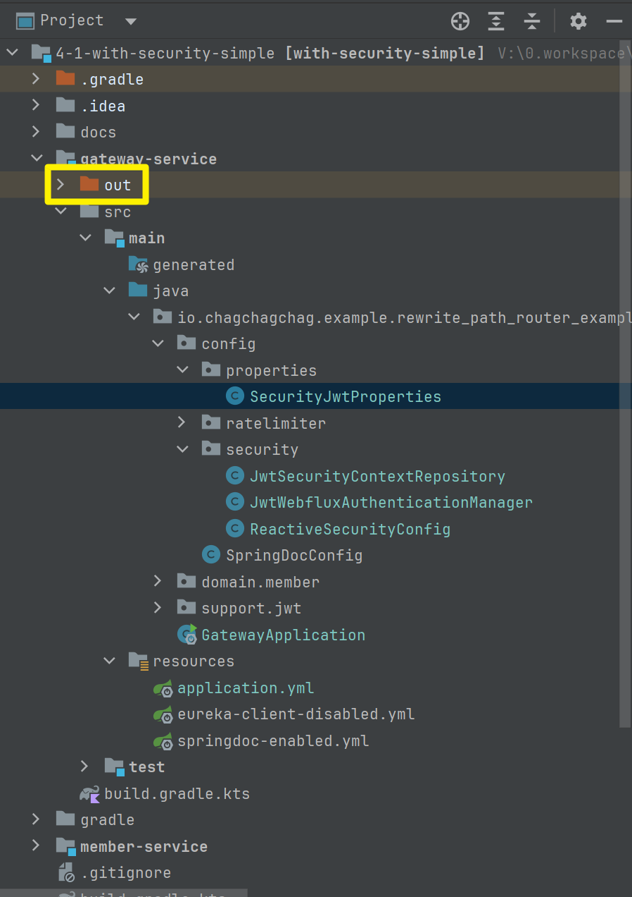

# ConfigurationProperties 사용시 Setter 없이 사용하려 할 경우

예를 들어 아래와 같은 코드가 있다고 할때 Setter 가 없으면 Setter가 존재하지 않는다는 에러가 납니다.

```java
package io.chagchagchag.example.rewrite_path_router_example.gateway.config.properties;

import lombok.Getter;
import org.springframework.boot.context.properties.ConfigurationProperties;
import org.springframework.boot.context.properties.bind.ConstructorBinding;

@Getter
@ConfigurationProperties(prefix = "security.jwt")
public class SecurityJwtProperties {
  private String key;
}
```

<br/>


이때 @Setter 를 붙이는 것도 하나의 해결책이 될 수 있습니다.<br/>

하지만 @Setter 를 쓰는 것은 왠지 불안합니다.<br/>

@Setter 대신 @ConstructorBinding 을 사용한다면 불변성을 유지하면서 Configuration 필드 주입이 가능해집니다.

```java
@Getter
@ConfigurationProperties(prefix = "security.jwt")
public class SecurityJwtProperties {
  private String key;
  @ConstructorBinding
  public SecurityJwtProperties(String key){
    this.key = key;
  }
}

```

<br/>


## 참고

@ConfigurationProperties 는 프로젝트 내의 Configuration 파일 또는 Spring Boot 루트 위치의 애플리케이션에 @ConfigurationPropertiesScan 애노테이션을 붙여야 사용가능합니다.

```java
package io.chagchagchag.example.rewrite_path_router_example.gateway;

import org.springframework.boot.SpringApplication;
import org.springframework.boot.autoconfigure.SpringBootApplication;
import org.springframework.boot.context.properties.ConfigurationPropertiesScan;

@ConfigurationPropertiesScan
@SpringBootApplication
public class GatewayApplication {

	public static void main(String[] args) {
		SpringApplication.run(GatewayApplication.class, args);
	}

}
```

<br/>


## Spring Boot 3.2 이후의 버전에서 에러가 날 경우

참고

- [현재 SpringBoot 3.2.1 부터 @ConfigurationProperties 를 사용한 설정값 바인딩에 이슈가 있는것 같습니다.](https://www.inflearn.com/community/questions/1138421/%ED%98%84%EC%9E%AC-springboot-3-2-1-%EB%B6%80%ED%84%B0-configurationproperties-%EB%A5%BC-%EC%82%AC%EC%9A%A9%ED%95%9C-%EC%84%A4%EC%A0%95%EA%B0%92-%EB%B0%94%EC%9D%B8%EB%94%A9%EC%97%90-%EC%9D%B4%EC%8A%88%EA%B0%80-%EC%9E%88%EB%8A%94%EA%B2%83-%EA%B0%99%EC%8A%B5%EB%8B%88%EB%8B%A4)
- https://docs.google.com/document/d/1j0jcJ9EoXMGzwAA2H0b9TOvRtpwlxI5Dtn3sRtuXQas/edit
- 예제버전의 boot 에 3.3 버전의 spring starter 를 사용했었는데 구글링을 하다가 [스프링부트 핵심 원리,활용](https://www.inflearn.com/course/%EC%8A%A4%ED%94%84%EB%A7%81%EB%B6%80%ED%8A%B8-%ED%95%B5%EC%8B%AC%EC%9B%90%EB%A6%AC-%ED%99%9C%EC%9A%A9) 을 찾게 되었고, 이런 강의가 있었다니 .... 하는 생각을 ... 할머니 집에 가면 손주들 배터질때까지 먹이는 할머니처럼 끝도 없이 개발 강의들을 먹여주시는 김영한님... ㅠㅠ 

<br/>


위의 설정을 모두 해줘도 Spring Boot 3.2.x 이후부터는 에러가 날 수 있습니다. 이 경우는 Intellij 에서 아래와 같이 설정해줍니다.

- 설정(`Ctrl + ,` 또는 `Cmd + ,` ) → Build, Execution, Deployment → Compiler → Java Compiler → Additional command line parameters 내에 `-parameters` 옵션을 추가해줍니다.


<br/>


위의 내용을 반영했더라도 이전 빌드 결과물이 남아있으면 실행이 안되기에 out 디렉터리도 삭제해줍니다.



<br/>


