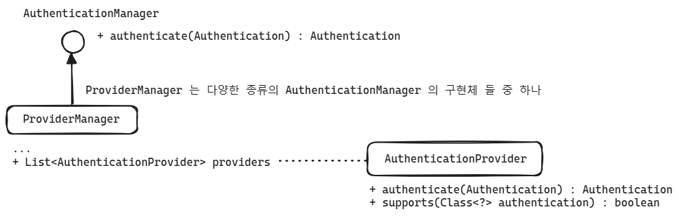

# AuthenticationManager, AuthenticationProvider, Authentication, Principal


## 전체 흐름

AuthenticationManager, AuthenticationProvider, ProviderManager, Authentication, Principal 객체들의 상호 작용은 다음과 같습니다.


<br/>

AuthenticationManager 에서는 여러 종류의 AuthenticationProvider 들을 List 로 가지고 있습니다. 그리고 이 AuthenticationProvider 들을 모아둔 List 를 순회하면서 이 중 지원되는(supports()) 되는 AuthenticationProvider 를 만나면 이 AuthenticationProvider 가 authenticate() 메서드를 호출합니다.<br/>

```java
@Component
@RequiredArgsConstructor
public class CustomAuthenticationProvider implements AuthenticationProvider {
    private final UserDetailsService userDetailsService;
    private final PasswordEncoder passwordEncoder;
    
    @Override
    public Authentication authenticate(Authentication authentication)
        throws AuthenticationException {
        String username = authentication.getName();
        String password = authentication.getCredentials().toString(); // password
        UserDetails user = userDetailsService.loadUserByUsername(username);
        
        if(passwordEncoder.matches(password, user.getPassword())){
            return new UsernamePasswordAuthenticationToken(
                username, password, user.getAuthorities()
            );
        }
        
        throw new BadCredentialsException("credential exception");
    }
    
    @Override
    public boolean supports(Class <?> authentication){
        return authentication.equals(UsernamePasswordAuthenticationToken.class);
    }
}
```

직접 사용자가 정의한 AuthenticationProvider 가 없다면, Spring Security 는 SecurityFilterChain 에 등록한 UserDetailsService 의 loadUserByUsername 을 통해 사용자 정보를 UserDetails 객체로 가져옵니다. 그리고 이 UserDetails 를 기반으로 Request로 전달받은 Password 와 UserDetailsService 에서 가져온 Password 를 비교하며, 이때 암호화된 문자열은 PasswordEncoder 를 통해서 복호화를 해서 비교합니다. <br/>

이때 Password가 올바르다면 Authentication 라는 추상타입으로 인증 객체를 return 합니다. Authentication 추상타입에 대한 구체타입으로는 대표적으로 UsernamePasswordAuthenticationToken 이 있습니다.<br/>

만약 위의 코드 처럼 AuthenticationProvider 를 직접 정의했다면, 직접 UserDetailsService 의 구현체를 의존성 주입한 후 비즈니스 로직에 맞게 작성된 loadUserByUsername(username) 을 호출해서 UserDetails 객체를 얻어내도록 작성하며. 이 UserDetails의 Password 와 Request 의 Password 를 PasswordEncoder 를 통해 복호화해서 비교합니다. 이후 이 요청이 올바른 요청이라면 UsernamePasswordAuthenticationToken 같은 구체 타입으로 Authentication 객체를 리턴합니다.<br/>

<br/>


```java
@RequiredArgsConstructor
@Configuration
public class SecurityConfig{
    private final CustomAuthenticationProvider customAuthenticationProvider; // 직접 생성한 AuthenticationProvider 
    @Bean
    public SecurityFilterChain securityFilterChain(HttpSecurity http) throws Exception {
        http.authenticationProvider(customAuthenticationProvider);
        return http.build();
    }
}
```

그리고 직접 정의한 AuthenticationProvider 는 HttpSecurity 라고 하는 SecurityFilterChain 객체를 만드는 빌더 객체의 `authenticationProvider(AuthenticationProvider)` 에 등록해서 사용가능합니다.<br/>

<br/>


## Authentication, Principal 객체

Authentication

- '인증' 이라는 의미이며, '인증 요청 **이벤트**'를 표현하는 객체로 사용됩니다.
- 애플리케이션에 접근을 요청한 사용자 엔티티의 세부적인 정보들을 담고 있습니다.

<br/>

Principal

- 애플리케이션에 접근을 요청하는 사용자를 의미하며, Principal 이라는 단어의 의미는 **'주체'**입니다.

<br/>


<br/>


### Authentication interface

Authentication 은 interface 이며, Principal interface 를 extends 하고 있습니다.<br/>

Authentication interface 에는 6개의 추상메서드가 존재합니다.

- getAuthorities() : Collection\<? extends GrantedAuthority\>
  - Authority(권한)의 집합입니다. 주로 Database 에는 `,` 로 구분된 여러 권한(e.g. `ROLE_ADMIN,ROLE_CREATE`) 으로 저장해두고, 인증 시 해당되는 사용자의 id/pw 를 모두 체크한 후 에는 `ROLE_ADMIN`, `ROLE_CREATE` 등을 Authority 객체들로 생성해서 List, Set 등과 같은 Collection 에 담아서 리턴하게 됩니다.
  - 이때 생성된 Collection 들은 Authentication 객체내의 authorities 필드에 담아서 인증로직을 이동하며 Authentication 객체내의 getAuthorities() 메서드를 통해 접근 가능합니다.
- getCredentials() : Object
  - 비밀번호, 지문 등을 return 하는 객체입니다.
- getDetails() : Object
  - 사용자 요청에 대한 추가 세부정보를 의미합니다.
- getPrincipal() : Object
  - Principal() 을 얻기위해 사용되는 getter 입니다. principal 은 '주체' 라는 의미이며, id 정보를 name 이라는 필드에 담고 있습니다.
- isAuthenticated() : boolean
  - 인증되었는지 아닌지 여부를 확인할 수 있는 메서드입니다.
- setAuthenticated(isAutenticated: boolean) : void
  - 인증이 완료되었을 때 setAuthenticated(true) 를 호출합니다.

<br/>


### Principal interface

Principal interface 에는 많은 추상메서드가 있지만, 그 중 가장 중요한 메서드만 정리해보면 다음과 같습니다.

- getName() : String
  - 인증하려는 사용자의 아이디(=Name)를 조회하는 getter 역할의 메서드입니다.

<br/>


## AuthenticationManager, AuthenticationProvider

AuthenticationManager 에서는 여러 종류의 AuthenticationProvider 들을 List 로 가지고 있습니다. 그리고 이 AuthenticationProvider 들을 모아둔 List 를 순회하면서 이 중 지원되는(supports()) 되는 AuthenticationProvider 를 만나면 이 AuthenticationProvider 가 authenticate() 메서드를 호출합니다.<br/>




<br/>


### AuthenticationManager

- AuthenticationManager 는 interface 입니다. 
- AuthenticationManager interface 는  `authenticate(Authentication)` 메서드 하나만 갖고 있습니다.
- AuthenticationManager 를 implements 하는 대표적인 구체타입은 `ProviderManager` 입니다.
- List\<AuthenticationProvider\> providers 와 같이 여러 종류의 Provider 들을 가지고 있습니다.
- AuthenticationManager 의 authenticate() 메서드에서는 인증으로 전달된 Authentication 객체가 지원되는 (supports) Provider 를 providers 리스트에서 찾고, 그 Provider 를 통해 authenticate(Authentication) 메서드를 호출하고 인증의 결과를 Authentication 객체로 return 합니다.
- 자세한 내용은 이 문서의 후반부에서 자세히 정리합니다.

<br/>


### AuthenticationProvider

- AuthenticationProvider 는 interface 이며 스프링 시큐리티에서 기본으로 제공해주는 Provider 들은 다양합니다.
- AuthenticationProvider interface 두가지 추상 메서드를 제공합니다.
  - authenticate() : Authentication
  - supports(Class): boolean
- AuthenticationProvider interface 는 사용자가 직접 구현할 수도 있고 기본으로 지정된 AuthenticationProvider 를 사용할 수 도 있습니다. 직접 구현해서 등록하지 않으면 DaoAuthenticationProvider 가 기본으로 선택됩니다.

AuthenticationProvider interface 를 implements 하고 있는 구현체들은 다음과 같이 다양합니다.


<br/>


### 커스텀 AuthenticationProvider 구현 + Bean 으로 등록하려면?

- AuthenticationProvider interface 를 implements 하는 구체타입의 AuthenticationProvider 를 정의 후`@Component` 로 스프링 컨텍스트에 등록합니다.
- supports 에는 어떤 인증을 지원할지를 정의합니다. 이 supports(Class) 메서드는 AutenticationManager 에서 지원되는 Provider 를 찾을때 사용됩니다. 주로 구체 클래스의 `Class` 타입을 넘겨주어서 원하는 Class 타입인지를 체크하게 됩니다.
- SecurityFilterChain 내에 커스텀 AuthenticationProvider 빈을 등록해야 하는데, 이 때 HttpSecurity 라고 하는 시큐리티 빌더 클래스를 통해 AuthenticationProvider 빈을 등록할 수 있습니다.
  - e.g. httpSecurity.authenticationProvider(customAuthenticationProvider)

<br/>


### 커스텀 AuthenticationProvider 정의

UserDetailsService 를 통해서 사용자를 조회 후 UserDetailsService 를 통해 조회한 사용자의 정보에서 비밀번호가 일치하는 지를 PasswordEncoder 를 통해 체크하는 예제입니다. 지문 체크, 2차비밀번호, LDAP 등과 같은 다양한 인증방식을 지원할때 Custom 한 AuthenticationProvider 를 정의해서 사용하게 됩니다. 

```java
@Component
@RequiredArgsConstructor
public class CustomAuthenticationProvider implements AuthenticationProvider {
    private final UserDetailsService userDetailsService;
    private final PasswordEncoder passwordEncoder;
    
    @Override
    public Authentication authenticate(Authentication authentication)
        throws AuthenticationException {
        String username = authentication.getName();
        String password = authentication.getCredentials().toString(); // password
        UserDetails user = userDetailsService.loadUserByUsername(username);
        
        if(passwordEncoder.matches(password, user.getPassword())){
            return new UsernamePasswordAuthenticationToken(
                username, password, user.getAuthorities()
            );
        }
        
        throw new BadCredentialsException("credential exception");
    }
    
    @Override
    public boolean supports(Class <?> authentication){
        return authentication.equals(UsernamePasswordAuthenticationToken.class);
    }
}
```

<br/>


### 커스텀 AuthenticationProvider 를 SecurityFilterChain 에 등록

직접 구현한 AuthenticationProvider 는 아래와 같이 HttpSecurity 객체내에 바인딩한 후 HttpSecurity 객체를 통해 SecurityFilterChain 객체로 생성해서 등록할 수 있습니다.

```java
@RequiredArgsConstructor
@Configuration
public class SecurityConfig{
    private final CustomAuthenticationProvider customAuthenticationProvider; // 직접 생성한 AuthenticationProvider 
    @Bean
    public SecurityFilterChain securityFilterChain(HttpSecurity http) throws Exception {
        http.authenticationProvider(customAuthenticationProvider);
        return http.build();
    }
}
```

<br/>


## 스프링 시큐리티 코드 살펴보기

앞에서 정리했던 내용을 요약해보면 AuthenticationManager 와 AuthenticationProvider 의 관계는 이렇습니다.

- AuthenticationManager 에서는 여러 종류의 AuthenticationProvider 들을 List 로 가지고 있으며, 이 List 를 순회하면서 이 중 지원되는(supports()) 되는 AuthenticationProvider 를 만나면 이 AuthenticationProvider 가 authenticate() 메서드를 호출한다
- AuthenticationProvider 가 주로 하는 일은 UserDetailsService 내의 loadUserByUsername(): Authentication 메서드를 호출하

<br/>


AuthenticationProvider interface 는 다음과 같이 두 가지의 메서드를 지원합니다.

- authenticate(Authentication) : Authentication
- supports (Class \<?\> authentication) : boolean


<br/>


AuthenticationProvider 의 구체타입은 종류가 많습니다. 이 중 가장 대표적인 AuthenticationProvider 는 AbstractUserDetailsAuthenticationPRivicer, DaoAuthenticationProvider 가 있습니다.


<br/>


AuthenticationManager interface 의 구체타입으로는 대표적으로 ProviderManager 가 있습니다.


<br/>


AuthenticationManager 의 구체타입인 ProviderManager 내에는 아래 코드처럼 `List<AuthenticationProvider> providers` 와 같이 여러 종류의 AuthenticationProvider 들을 List 로 가지고 있는 것을 확인 가능합니다.


<br/>


이 Provider 들을 차례로 interator 를 이용해 순회하면서 supports() 메서드를 통해 지원되는지를 체크합니다. 그리고 supports() 의 결과값이 true 일 경우 해당 Provider 는 지원이 되는(사용자가 등록한) Provider 들 중 하나라고 판단해서 해당 Provider 의 authenticate() 메서드를 호출합니다. 요즘 상용 서비스들은 어떤 인증을 할때 B2C 등의 서비스에서는 지문인증, 홍채인식, 안면 인식을 지원하는데, 이렇게 지원되는 인증 방식을 AuthenticationProvider 를 통해 제공하게 됩니다.


<br/>


provider.authenticate() 를 통해서 얻어온 `Authentication result` 값이 올바르지 않다면 부모 Provider 객체의 authenticate를 호출하도록 정의되어 있습니다.


