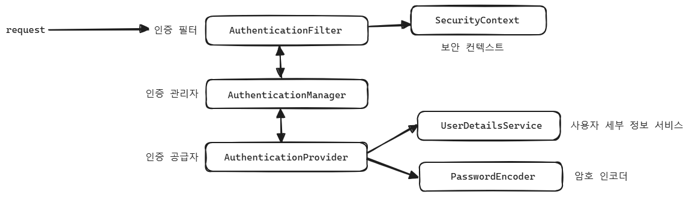
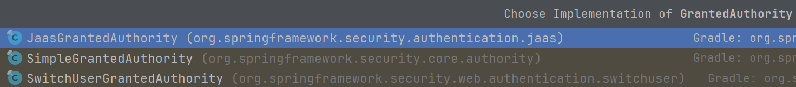
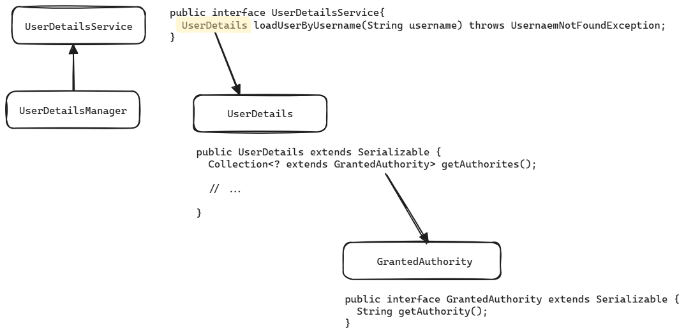

# 사용자 관리 - UserDetails, UserDetailsService, UserDetailsManager

이번 문서에서 알아볼 내용들은 다음과 같습니다.

- 인증 요청 발생시 AuthenticationProvider, AuthenticationManager 와 UserDetailsService 의 상호작용 
- UserDetailsService, UserDetailsManager interface 의 역할
- UserDetailsManager, UserDetailsService, UserDetails, GrantedAuthority 의 객체관계

<br/>


## 인증요청 발생 시 AuthenticationProvider, AuthenticationManager, UserDetailsService



<br/>

SecurityContext

- SecurityContext 는 사용자의 인증 관련 정보 등을 저장하고 있는 Context 입니다.
- 흔히 Java 등에서 사용하는 naming convention 에서는 프로그램이 돌아가고 있는 도중에 어떤 정보를 꺼내와야 할 경우가 있는데 이렇게 프로그램이 돌아고 있는 도중에 참조하는 자료를 보통 `Context` 라고 부르며, 이런 자료들을 담아두는 클래스들은 보통 `-Context` 와 같은 규칙으로 이름이 지어집니다.

AuthenticationFilter

- 제일 앞단인 서블릿 계층에서 Filter 로 동작합니다.
- 요청이 왔을 때 이것을 가로채서 인증관리자에게 위임합니다.
- SecurityContext 라고 하는 곳에서 사용자 인증 정보 등을 꺼내서 인증되어 있는지 여부를 체크합니다.

AuthenticationManager

- AuthenticationFilter 는 인증정보에 접근할 때 AuthenticationManager 를 통해서 접근합니다.

AuthenticationProvider

- AuthenticationProvider 는 AuthenticationManager 를 제공하며, AuthenticationProvider 를 통해서 UserDetailsService, PasswordEncoder 에 접근 가능합니다.

<br/>


영어로만 기억하기에 딱딱한 측면이 있습니다. 만약 한글로 표현해서 기억하면 조금 더 기억이 오래 지속될 것 같습니다.

- 인증 필터(AuthenticationFilter)는 Filter 역할을 하며, 요청(Request)을 가로채서 인증관리자(AuthenticationManager)에게 위임합니다.
- 인증 관리자(AuthenticationManager)
  - 인증 로직을 구현하기 위해 인증 공급자(AuthenticationProvider)를 활용합니다.
  - 사용자 이름, 암호를 검증하기 위해 사용자 세부 정보 서비스(UserDetailsService)와 암호인코더(PasswordEncoder)를 이용합니다.
- UserDetailsService(사용자 정보 서비스)와 PasswordEncoder(암호 인코더)는 사용자 관리 부분에 해당합니다.

<br/>


## UserDetailsService, UserDetailsManager

UserDetailsService, UserDetailsManager 는 interface 타입이며, SOLID 원칙 중 ISP 원칙에 따라 interface 로 기능이 적절하게 분리되어 있는 객체입니다.  

UserDetailsService

- Read
- 사용자이름(username)으로 사용자를 검색

UserDetailsManager

- Create, Update, Delete
- 사용자 추가, 수정, 삭제 작업을 수행

UserDetailsService, UserDetailsManager 를 이용해서 read, write 기능을 인터페이스로 분리해두었기에 활용성과 유연성이 높습니다.<br/>

- 사용자를 인증하는 기능만 필요하다면 ? 
  - UserDetailsService 인터페이스만 implements 하시면 됩니다.
- 사용자를 추가,수정,삭제 하는 기능이 필요하다면 ?
  - UserDetailsManager 인터페이스를 implements 하시면 됩니다.

<br/>


### UserDetailsService

```java
package org.springframework.security.core.userdetails;

public interface UserDetailsService {
  UserDetails loadUserByUsername(String username) throws UsernameNotFoundException;
}
```

username 을 파라미터로 받아서 UserDetails 객체를 반환하는 역할을 합니다.

<br/>


### UserDetailsManager

```java
package org.springframework.security.provisioning;

import org.springframework.security.core.userdetails.UserDetails;
import org.springframework.security.core.userdetails.UserDetailsService;

public interface UserDetailsManager extends UserDetailsService {
  void createUser(UserDetails user);

  void updateUser(UserDetails user);

  void deleteUser(String username);

  void changePassword(String oldPassword, String newPassword);

  boolean userExists(String username);
}

```

UserDetailsManager 는 UserDetailsService 를 extends(상속)하고 있기 때문에 UserDetailsManager 가 가진 Create, Update,Delete 기능 외에도 UserDetailsService 에서 제공하는 Read 기능 까지도 제공되기 때문에 UserDetailsManager 를 implements 하면 UserDetailsService 내의 메서드인 loadUserByUsername(String username) 까지도 구현해야 합니다.<br/>


UserDetailsProvider 를 implements 하면 실제로 아래와 같이 UserDetailsService 의 loadUserByUsername(username) 까지도 implements 해줘야 합니다.

```kotlin
package net.spring.cloud.prototype.userservice.application.temp

import org.springframework.security.core.userdetails.UserDetails
import org.springframework.security.provisioning.UserDetailsManager

class CustomUserDetailsProvider : UserDetailsManager {
  override fun loadUserByUsername(username: String?): UserDetails {
    TODO("Not yet implemented")
  }

  override fun createUser(user: UserDetails?) {
    TODO("Not yet implemented")
  }

  override fun updateUser(user: UserDetails?) {
    TODO("Not yet implemented")
  }

  override fun deleteUser(username: String?) {
    TODO("Not yet implemented")
  }

  override fun changePassword(oldPassword: String?, newPassword: String?) {
    TODO("Not yet implemented")
  }

  override fun userExists(username: String?): Boolean {
    TODO("Not yet implemented")
  }
}
```

<br/>


## GrantedAuthority

GrantedAuthority 는 여러가지 권한의 집합입니다. GrantedAuthority 는 권한이 하나도 없거나 여러 권한을 가질 수 있습니다. GrantedAuthority 는 interface 타입이며 내부 정의는 아래와 같습니다.

```java
package org.springframework.security.core;

import java.io.Serializable;

public interface GrantedAuthority extends Serializable {
  String getAuthority();
}
```

<br/>

GrantedAuthority를 implements 하고 있는 객체는 다음과 같에 세 종류가 있으며 이 중 SimpleGrantedAuthority 가 많이 사용되는 편입니다.



<br/>


SimpleGrantedAuthority 를 사용해서 권한을 생성하는 예제 구문은 다음과 같습니다.

```java
SimpleGrantedAuthority adminAuthority = new SimpleGrantedAuthority("ROLE_" + "ADMIN");

Collection<GrantedAuthority> authorities = new ArrayList<>();
authorities.add(adminAuthority);
```

<br/>


인증로직 작성시 UserDetails 를 구현해서 리턴해주어야 하는 경우가 많은데 UserDetails 를 구현하기 위해서는 GrantedAuthority 의 구현체 객체를 통해 authorites() 들을 생성해줘야 하기에 GrantedAuthority에 대해 알아두는 것이 좋습니다.<br/>

<br/>


### SimpleGrantedAuthority

SimpleGrantedAuthority 의 구현은 다음과 같습니다.

```java
package org.springframework.security.core.authority;

import org.springframework.security.core.GrantedAuthority;
import org.springframework.util.Assert;

public final class SimpleGrantedAuthority implements GrantedAuthority {
  private static final long serialVersionUID = 610L;
  private final String role;

  public SimpleGrantedAuthority(String role) {
    Assert.hasText(role, "A granted authority textual representation is required");
    this.role = role;
  }

  public String getAuthority() {
    return this.role;
  }

  public boolean equals(Object obj) {
    if (this == obj) {
      return true;
    } else if (obj instanceof SimpleGrantedAuthority) {
      SimpleGrantedAuthority sga = (SimpleGrantedAuthority)obj;
      return this.role.equals(sga.getAuthority());
    } else {
      return false;
    }
  }

  public int hashCode() {
    return this.role.hashCode();
  }

  public String toString() {
    return this.role;
  }
}
```

<br/>


## Authority vs Role

Authority 는 유연함을 목적으로 하며, Role 은 단순함을 목적으로 합니다.

참고자료

- https://stackoverflow.com/questions/19525380/difference-between-role-and-grantedauthority-in-spring-security
- [velog - 스프링 시큐리티 authorities 와 role](https://velog.io/@lsvk9921/%EC%8A%A4%ED%94%84%EB%A7%81-%EC%8B%9C%ED%81%90%EB%A6%AC%ED%8B%B0-authorities-%EC%99%80-role)
- https://jake-seo-dev.tistory.com/669


위의 자료들 [스택오버플로우](https://stackoverflow.com/questions/19525380/difference-between-role-and-grantedauthority-in-spring-security) 의 내용을 번역 후 필요한 부분들만 골라서 요약해보면 이렇습니다.

Authority

- 우리는 GrantedAuthority 를 부여할 수 있으며 이 GrantedAuthority 들을 SecurityContext 에 넣는 것으로 사용자들에게 다양한 GrantedAuthority 들을 부여할 수 있습니다.

Role

- Role 은 그냥 'Permissions' 이며 네이밍 컨벤션에 따라 접두사 `ROLE_` 로 시작하는 GrantedAuthority 를 의미합니다. 이 것 말고 더 큰 의미는 없습니다.
- Role 은 Permission(권한), Right(권리)에 해당하는 GrantedAuthority 일 뿐입니다. (A role is just a GrantedAuthority - a "permission" - a "right")

Spring Security 4 이전(3.x) 에서는 Role(역할에 대한 특별한 처리가 일관되게 지켜지지 않았으며, 권한(Authority), 역할(Role)이 동일하게 취급되는 경우가 많았습니다.<br/>

e.g. 

- SpringExpressionRoot 의 hasAuthority() 메서드 구현
- SpringExpressionRoot 의 hasAuthority() 에서 볼 수 있듯 단순히 hasRole() 을 호출하는 것에서 이런 내용들을 볼 수 있습니다.

<br/>


Spring Security 4.x 부터는 Role (역할) 을 처리하는 코드(e.g. hasRole 표현식 등)는 항상 ROLE\_ 접두사를 추가합니다. 따라서 hasAuthority("ROLE\_ADMIN") 은 ROLE\_ 접두사가 자동으로 추가되며 hasRole("ADMIN") 과 동일한 의미를 갖습니다.<br/>

<br/>


이 내용을 기반으로 결론을 내려보면 이렇습니다.<br/>

Authority

- `권한` 이라는 용어로 불립니다.
- 쓰기 권한, 읽기 권한, 삭제 권한 등과 같은 세분화된 접근 권한을 의미하며 Role 을 입력으로 받아서 생성됩니다.
- Authority 는 특정 문자열 접두어로 시작하지는 않으며 객체 그 자체입니다.
- Role 만 있을 경우에 더 다양한 제어가 필요한 경우에 Authority 가 필요합니다.

Role

- Role 은 그냥 'Permissions' 이며 네이밍 컨벤션에 따라 접두사 `ROLE_` 로 시작하는 GrantedAuthority 를 의미합니다. 이 것 말고 더 큰 의미는 없습니다.
- 역할을 표현하기 위한 일종의 문자열이라고 생각할 수 있습니다.
- 접두사 `ROLE_` 이 붙은 문자열로 표현하며 일반 문자열로 표현하는 것도 가능합니다.
- e.g.
  - `ROLE_ADMIN`, `ROLE_DEVLEOPER` , `ROLE_READ_ONLY` 


hasAuthority("ROLE\_ADMIN") 의 의미는 hasRole("ADMIN") 과 동일한 의미를 갖습니다. Spring Security 4.x 부터는 hasRole(String) 내에 "ADMIN" 과 같은 문자만 전달하면 앞에 일괄적으로 접두사로 `ROLE_` 을 붙입니다.<br/>

즉, hasAuthority("ROLE\_ADMIN") 은 hasRole("ADMIN") 과 같은 표현식입니다.<br/>

- hasAuthority("ROLE\_ADMIN") == hasRole("ADMIN")

<br/>


## 객체간의 상호작용



<br/>


## UserDetails

UserDetails 는 한국어로 표현하면 '사용자 상세 정보'라고 표현할 수 있습니다.<br/>

스프링 시큐리티에서는 UserDetails 인터페이스를 통해 사용자를 표현하며 애플리케이션 레벨에서 개발자가 직접 UserDetails 인터페이스를 구현해야 합니다.<br/>

```java
package org.springframework.security.core.userdetails;

import java.io.Serializable;
import java.util.Collection;

import org.springframework.security.core.Authentication;
import org.springframework.security.core.GrantedAuthority;

// ...

public interface UserDetails extends Serializable {

	Collection<? extends GrantedAuthority> getAuthorities();

	String getPassword();

	String getUsername();

	default boolean isAccountNonExpired() {
		return true;
	}

	default boolean isAccountNonLocked() {
		return true;
	}

	default boolean isCredentialsNonExpired() {
		return true;
	}

	default boolean isEnabled() {
		return true;
	}

}
```

getAuthorities() 

- GrantedAuthority 로 표현한 애플리케이션 사용자의 권한들의 컬렉션입니다.
- GrantedAuthority 는 애플리케이션 사용자가 수행할 수 있는 작업을 표현할 수 있는 객체입니다.

getUsername(), getPassword()

- getUsername() : 사용자의 Id 를 반환합니다.
- getPassword() : 사용자의 Password 를 반환합니다.

<br/>

다음 메서드 들은 return true(기본값) 로 정의해서 사용자를 비활성화 할 수 있습니다. 별도의 제한이 없다면 true 를 반환하도록 지정하며, default 메서드로 true 를 반환하도록 기본 정의가 되어 있기에 재정의를 하지 않을 경우 사용하지 않는 것으로 간주합니다.

- isAccountNonExpired() : boolean
- isAccountNonLocked() : boolean
- isCredentialsNonExpired() : boolean
- isEnabled() : boolean

메서드의 네이밍 컨벤션이 `...non` 으로 지정되어 있어서 의미상으로 혼동이 많이 되는 메서드이기에 주의가 필요합니다. 

<br/>


### UserDetails, User, Member, MemberEntity

**User 클래스**<br/>

UserDetails 객체를 생성하기 위해 스프링 시큐리티에서 제공되는 User 라고 하는 클래스는 빌더 형식으로 제공됩니다. 이 빌더를 사용하기 위해서는 username, password 는 꼭 필요합니다. 이 방식보다는 UserDetails 를 implements 하는 Member 클래스를 별도로 정의해서 사용하는 방식이 자주 쓰입니다.<br/>

<br/>

**Member, MemberEntity**<br/>

User, UserDetails 라고 하는 클래스가 스프링 시큐리티에서 이미 제공되고 있기에 실무에서는 가급적 Member, MemberEntity 라는 이름의 별도의 객체를 선언해서 사용하는 편입니다.<br/>

<br/>

**MemberEntity, Member, UserDetails**<br/>

일반적으로 UserDetails 를 implements 하도록 정의하는 Member 클래스는 표현 계층으로만 사용하는 것이 좋습니다. 영속성 계층에서 사용자를 표현하는 것은 `MemberEntity` 라는 별도의 엔티티를 만들어서 가급적 스프링시큐리티와의 의존성이 없는 독립적인 데이터베이스 엔티티로 선언하는 것이 권장됩니다. 

- Member implements UserDetails : 표현 계층에서 스프링시큐리티를 연동
- MemberEntity : 영속성 계층에서 스프링 시큐리티에 의존하지 않고 독립적인 객체로 사용

<br/>


### UserDetails 만들어보기

to be continue. ..

스프링 시큐리티 라이브러리에서 제공하는 빌더를 활용<br/>

물론 빌더만 활용하면 필드가 빠지거나 누락되는 부분이 생기기에 빌더 패턴 역시 팩토리 메서드로 따로 구현해둘것


### DummyUser 에 대한 테스트 작성


## GrantedAuthority, Role 테스트 코드


## UserDetailsService 자세히 알아보기

## UserDetailsManager 자세히 알아보기


