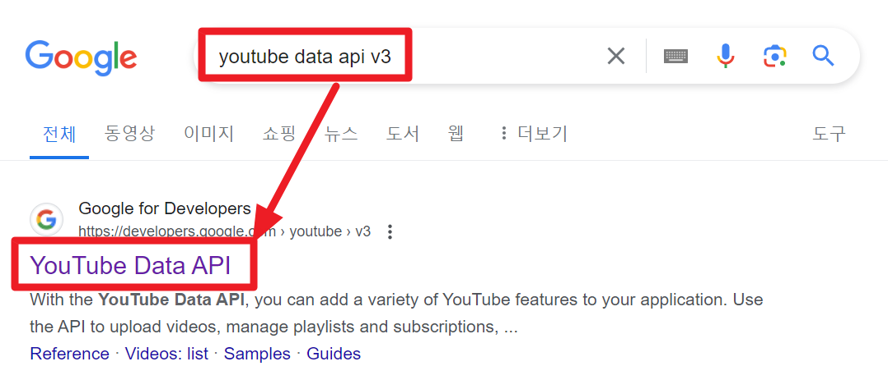
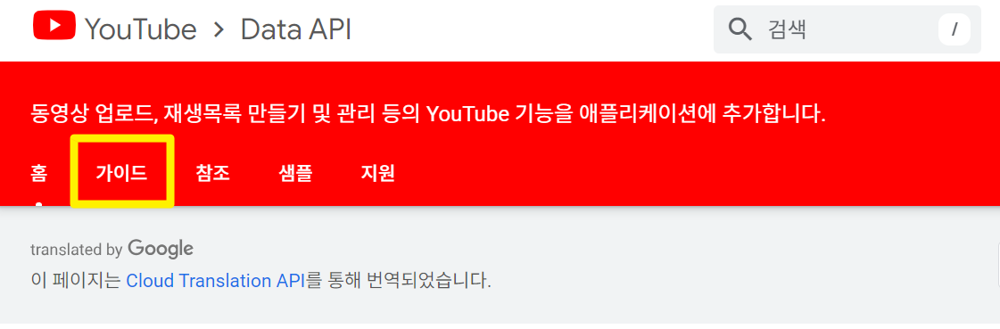
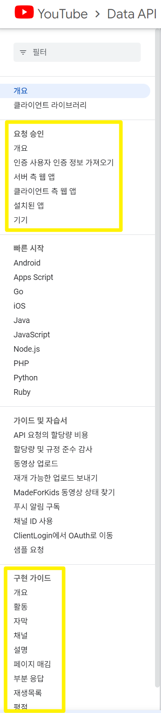
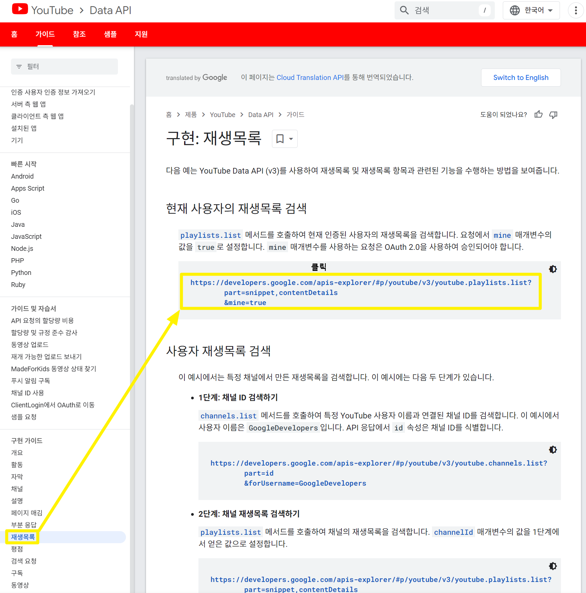
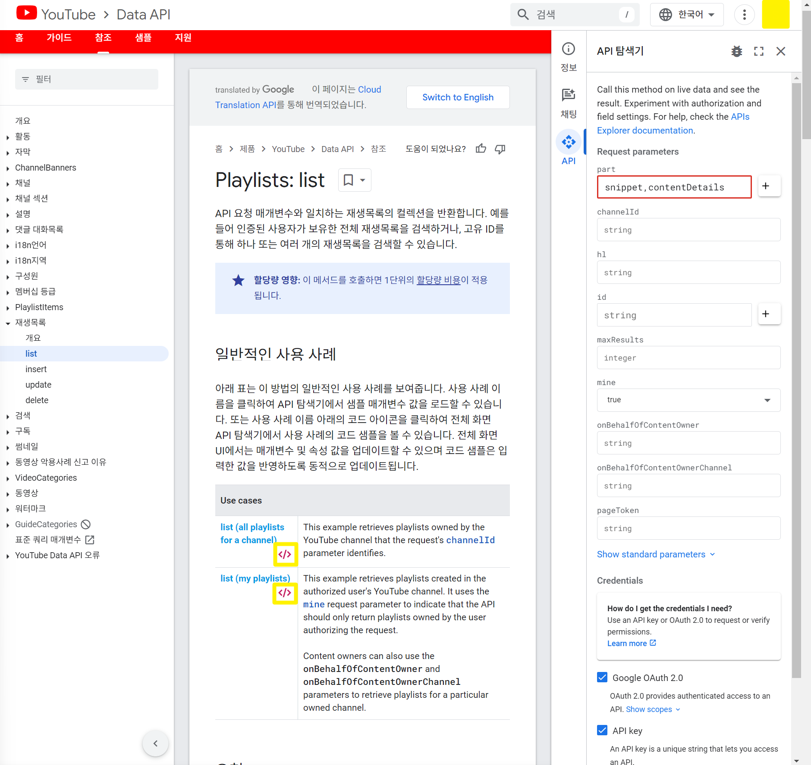
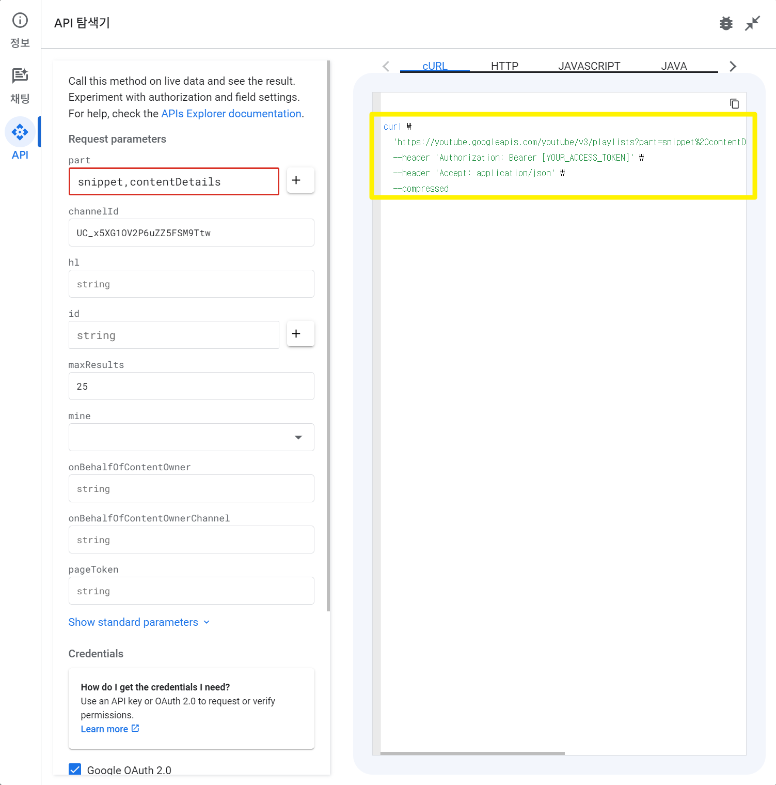
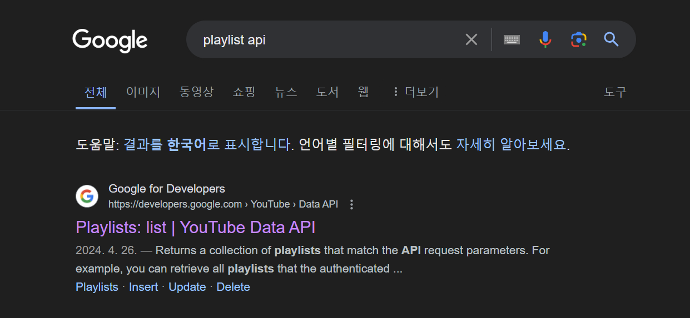
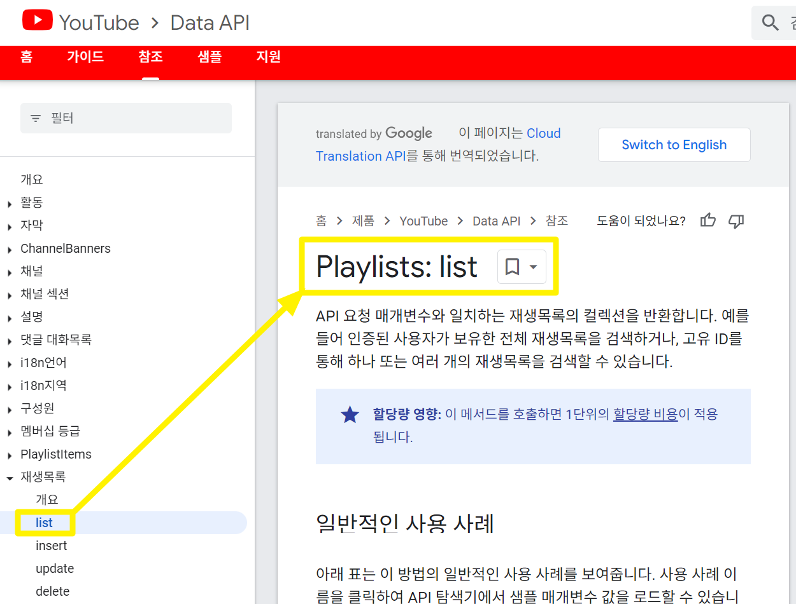

# Youtube Data API v3 - intro

## 참고

- [http://developers.google.com/youtube/v3/docs?hl=ko](https://developers.google.com/youtube/v3/docs?hl=ko)

 

## 1\. Youtube Data API v3 

구글에서 youtube data api v3 를 검색합니다.

 

[Youtube Data API](https://developers.google.com/youtube/v3?hl=ko) 의 공식 페이지가 나타납니다.

- https://developers.google.com/youtube/v3?hl=ko

 

[Youtube Data API](https://developers.google.com/youtube/v3?hl=ko) 의 공식 페이지에서 **가이드** 메뉴를 클릭합니다.

 

사이드바를 보면 **요청승인, 구현가이드**와 같은 항목들이 존재합니다.

 

## 2\. 구현 가이드 살펴보기

구현 가이드 에서는 여러 항목들이 있는데, 이 중 **재생목록**을 예제로 살펴보겠습니다.

- 좌측 사이드바에서 재생목록을 선택합니다.
- **'현재 사용자의 재생목록 검색'** 항목에 대한 https://developers.google.com... 을 클릭합니다.

 

[Playlist:list](https://developers.google.com/youtube/v3/docs/playlists/list?apix=true&apix_params=%7B%22part%22%3A%22snippet%2CcontentDetails%22%2C%22mine%22%3A%22true%22%7D&hl=ko) 라고 하는 공식 문서 페이지로 이동된 화면입니다. 

나타나는 화면에서는 코드 블록 버튼을 클릭합니다. 

 

팝업으로 나타난 페이지에서는 **cURL** , **HTTP** , **JAVASCRIPT** , **JAVA** 를 선택할 수 있습니다. 경험상 JAVA 예제의 경우 실제로 사용해보면, 내장 데이터 타입도 API 호출시 데이터 타입 에러도 많이 발생하고, 인증 관련 기능들도 잘 동작하지 않습니다. 

따라서 **Java/Kotlin** 을 사용하는 개발자라면 가급적이면 cURL 또는 HTTP 로 요청 형식을 맞춰본 이후에 이것을 FeignClient 또는 WebClient 등으로 바꿔주시는 것을 추천드립니다. 

FeignClient 를 사용하면 CircuitBreaker 를 연동하기에도 좋기 때문에 가급적이면 FeignClient 를 이용한 API 호출을 추천드립니다. 

## 3\. 필요한 API 에 바로 접근하기

구글에서 **playlist api** 를 검색합니다. 

2\. 구현 가이드 살펴보기에서 나타났던 Playlist:list API 명세를 직접 바로 확인할 수 있습니다. 

 

나타나는 화면에서는 코드 블록 버튼을 클릭합니다. 

 

팝업으로 나타난 페이지에서는 **cURL** , **HTTP** , **JAVASCRIPT** , **JAVA** 를 선택할 수 있습니다. 경험상 JAVA 예제의 경우 실제로 사용해보면, 내장 데이터 타입도 API 호출시 데이터 타입 에러도 많이 발생하고, 인증 관련 기능들도 잘 동작하지 않습니다. 

따라서 **Java/Kotlin** 을 사용하는 개발자라면 가급적이면 cURL 또는 HTTP 로 요청 형식을 맞춰본 이후에 이것을 FeignClient 또는 WebClient 등으로 바꿔주시는 것을 추천드립니다. 

FeignClient 를 사용하면 CircuitBreaker 를 연동하기에도 좋기 때문에 가급적이면 FeignClient 를 이용한 API 호출을 추천드립니다. 

 

