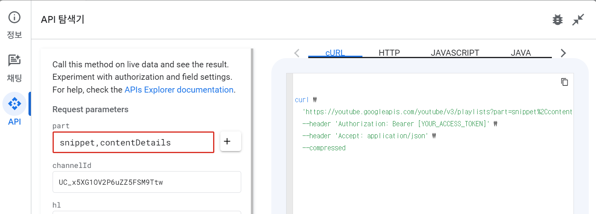

## Access Token 관련 이슈

공식문서에서는 위와 같이 Access Token 을 사용하도록 유도하는 경우가 있습니다. 

Access Token 의 경우 필요한 API 도 있고, 필요 없는 API 도 있습니다.  

예를 들어 특정 채널의 Playlists 를 추려내려 할 경우에 일반적인 공개 Playlists 를 조회할 경우에는 별도의 Access Token 을 통한 인증이 필요없습니다. 이 경우 API KEY 만 있으면 가능합니다. 

이렇게 공개 리소스에 접근하는 API 의 경우 Access Token 과 함께 조회할 경우 에러가 발생합니다.

 

반면 Playlists:list 의 mine=true 조회처럼 인증이 필요한 요청을 수행할 경우 조회를 하는 Client 는 인증을 받은 후 Access Token 을 발급받아서 헤더에 `Authorization : Bearer {Access Token}` 을 담아서 요청해야 합니다. 

예를 들면 아래의 Youtube 를 보면 Access Token 없이 API Key 만 지정해서 요청하는 모습을 확인 가능합니다.

- [Youtube Data API Tutorial - Search for Videos](https://youtu.be/QY8dhl1EQfI?si=N7nmo89xqjvqqbws)