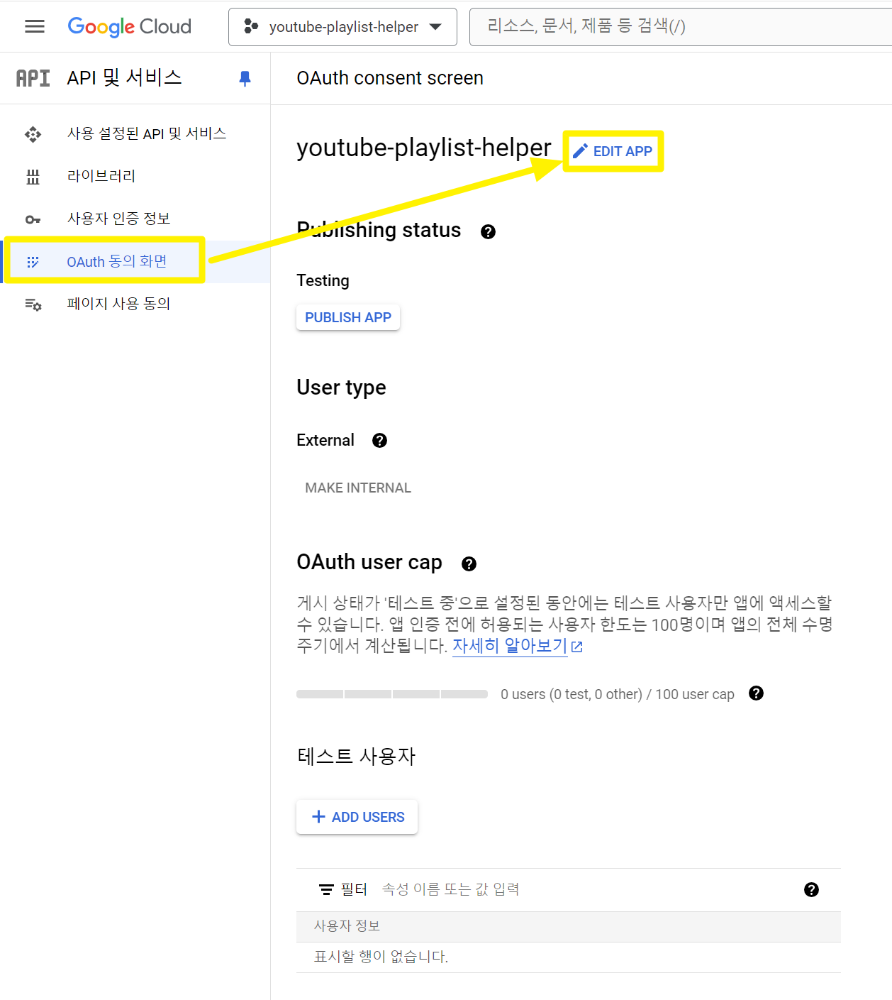

## Google OAuth2.0 Scope 추가

제 경우에는 curl 로 동작확인하는 동안 아래의 에러 문구 하나로만 구글링으로 피상적인 원인을 찾는게 너무 말도 안되는 시간낭비였습니다..<br/>

```bash
{
  "error": {
    "code": 403,
    "message": "Request had insufficient authentication scopes.",
    "errors": [
      {
        "message": "Insufficient Permission",
        "domain": "global",
        "reason": "insufficientPermissions"
      }
    ],
    "status": "PERMISSION_DENIED",
    "details": [
      {
        "@type": "type.googleapis.com/google.rpc.ErrorInfo",
        "reason": "ACCESS_TOKEN_SCOPE_INSUFFICIENT",
        "domain": "googleapis.com",
        "metadata": {
          "service": "youtube.googleapis.com",
          "method": "youtube.api.v3.V3DataPlaylistService.List"
        }
      }
    ]
  }
}
```

<br/>

## OAuth2.0 Scope for Youtube Playlist

이것 저것 생각하던 차에 내가 google cloud console 에서 무슨 권한을 추가를 안한거 아니야? 하는 생각을 했었다. 근데 또 보니까 기본제공되는 권한들은 싹다 추가했었습니다. 이렇게해서 테스트 했을 때에도 역시 위에서 처럼 `insufficientPermissions` , `ACCESS_TOKEN_SCOPE_INSUFFICIENT` 라는 에러를 접했습니다.<br/>

이 다음부터는 뭘해야 할지 전혀 몰라서 시간을 허비하다가 Youtube 개발자 센터 내에 curl 을 직접 수행해보는 화면이 있는데, 그 화면 내에 OAuth2.0 에 필요한 scope 들을 친절히 체크박스와 함께 메뉴로 제공되고 있다는 걸 알게되었습니다.<br/>

지금부터 구글 Developers 가이드 문서 화면에서 어떤 버튼들을 클릭해서 scope 에 관련된 메뉴로 이동하는 방법을 `Playlists: list` API 를 예로 들어 정리해보겠습니다.

https://developers.google.com/youtube/v3/docs/playlists/list?hl=ko 으로 접속합니다.


나타난 페이지에서는 코드블록 버튼을 클릭합니다.<br/>

<br/>


나타난 화면에서는 OAuth 2.0 prvides authenticated access to an API. [show scopes]() 라는 문구가 나타나는데 [show scopes]() 링크를 클릭해서 yotube 에 필요한 oauth 2.0 scope 들을 확인합니다. 위의 요소들은 여러 곳에서 확인할 수 있기 때문에 모두 메모해놓는 것이 좋습니다.

- https://www.googleapis.com/auth/youtube

- https://www.googleapis.com/auth/youtube.force-ssl

- https://www.googleapis.com/auth/youtube.readonly

- https://www.googleapis.com/auth/youtubepartner

<br/>


## 개발자 콘솔에서 scope 추가

이렇게 복사한 scope 들을 개발자 콘솔에서 추가하는 방법을 알아봅니다.



개발자 콘솔 → OAuth 동의화면 → EDIT APP 버튼을 클릭합니다.<br/>

<br/>


범위 추가 또는 삭제 버튼을 클릭합니다.<br/>

<br/>


API 탐색기 내의 OAuth2.0 Scope 항목에 나타났던 항목들을 받아적은 후 '테이블에 추가' 버튼을 클릭합니다. 이때 쉼표로 구분하거나 개행문자로 각각의 scope 를 구분해주시면 됩니다.

- https://www.googleapis.com/auth/youtube

- https://www.googleapis.com/auth/youtube.force-ssl

- https://www.googleapis.com/auth/youtube.readonly

- https://www.googleapis.com/auth/youtubepartner

<br/>


`youtube` 를 필터 항목에 입력후 엔터를 입력해서 검색하면 관련된 권한 scope 들이 나타나는데 모두 선택해주고 '업데이트' 버튼을 클릭해줍니다.<br/>

<br/>


권한을 확인하는 페이지가 나타나는데 '저장 후 계속' 버튼을 클릭해서 다음 단계로 넘어갑니다.<br/>

<br/>


Test Users 항목에 대한 내용입니다. '저장 후 계속'을 클릭해서 다음 단계로 진행합니다.<br/>

<br/>


'BACK TO DASHBOARD' 를 클릭해서 OAuth 동의 화면 설정을 마무리 합니다.


